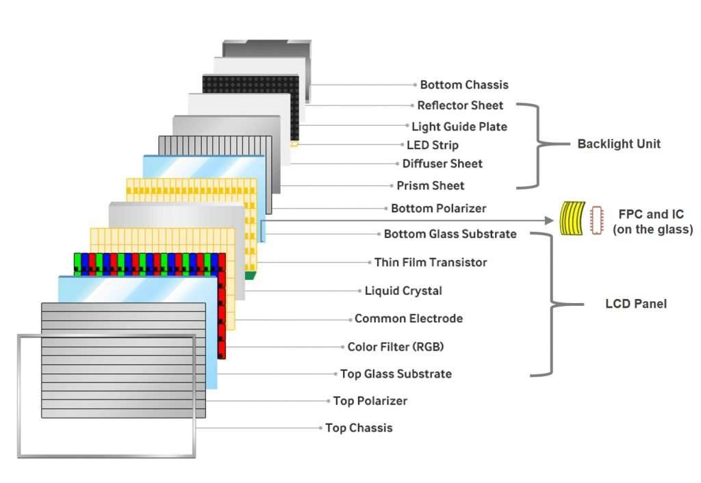
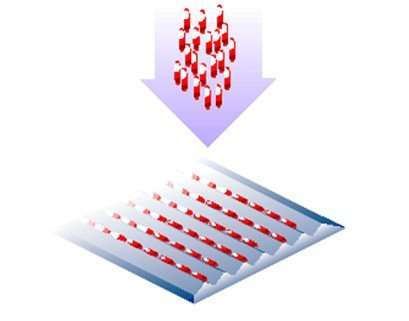
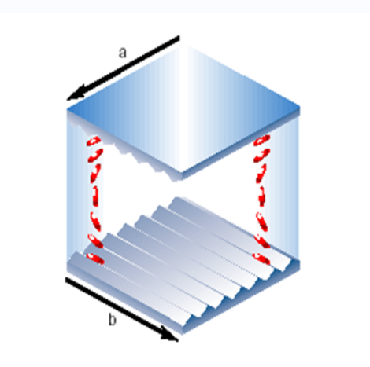
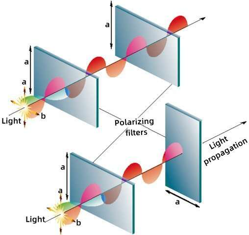
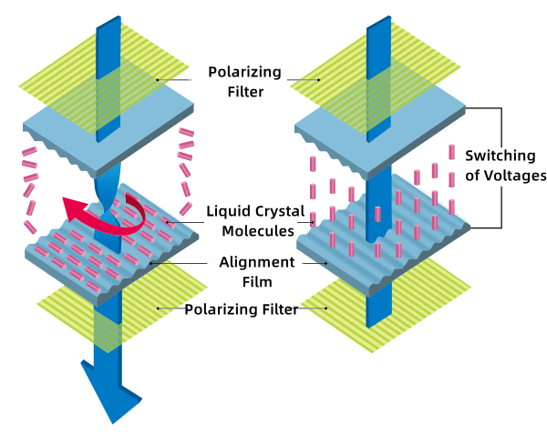
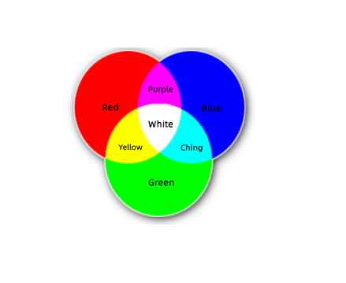

# TFT LCD Module Components and Construction

!!! abstract "Quick answer"
    A TFT LCD module (LCM) is made up of five parts: the backlight unit, the polarizer, the driver IC, the FPC, and the LCD panel. Understanding what each part does and how they work together is the prerequisite for judging brightness, contrast, interface, and mechanical feasibility. This article first breaks down the construction of the module, then follows the path from polarized light through liquid-crystal dimming to color-filter coloring to explain how an image is generated.

## Key Takeaways

- A TFT LCD module is mainly made up of five parts: the backlight unit, the polarizer, the driver IC, the FPC, and the LCD panel; the LCD panel itself is liquid crystal held between a TFT array substrate and a color-filter substrate.
- Liquid crystal does not emit light; it only adjusts transmittance according to voltage. Brightness comes from the backlight unit, and color comes from the color filter.
- The transmission axes of the upper and lower polarizers are orthogonal, and the twist of the liquid-crystal molecules rotates the polarization direction by 90°, which decides whether light can pass.
- During selection, check optical (brightness, uniformity, color gamut), electrical (driver IC, interface), mechanical (thickness, FPC routing), and environmental requirements separately.

## 1. What Five Parts Make Up a TFT LCD Module

A TFT LCD module (LCM, LCD module) does not mean only that piece of glass screen; it is the whole assembly that packages all the materials and circuits a display needs. It is mainly made up of five parts:

<figure markdown="span" class="displaywiki-figure">
  [{ width="760" loading="lazy" }](tft-lcd-module-the-structure-of-tft-lcd-module.jpeg){ .displaywiki-image-link title="Open full-size image" }
  <figcaption>Structure of a TFT LCD module: the lower half is the backlight unit (bottom chassis, reflector sheet, light guide plate, LED strip, diffuser sheet, prism sheet) and the upper half is the LCD panel (upper and lower polarizers, glass substrates, TFT array, liquid crystal, common electrode, color filter, and top chassis), with the FPC and driver IC brought out at the side.</figcaption>
</figure>

| Part | English / Abbreviation | Main function |
|---|---|---|
| LCD panel | LCD Panel / Cell | Dims and colors each pixel according to voltage; the core unit that forms the image |
| Backlight unit | Backlight Unit (BLU) | Provides brightness and spreads it evenly across the display area; liquid crystal emits no light itself |
| Polarizer | Polarizer (POL) | Converts natural light into linearly polarized light and selects the polarization state after the liquid crystal |
| Driver IC | Driver IC | Generates scan and data signals and controls the switching and writing voltage of every TFT |
| FPC and mechanical parts | FPC / Mechanical | Connects the panel to the mainboard for electrical interconnection and holds the stack with the frame |

## 2. Roles of Each Part

### 2.1 Backlight Unit (BLU)

The backlight unit is the thickest part of the module, built from multiple layers of optical sheets and a light source: the LED strip emits light, the light guide plate spreads that point source into a surface source, the diffuser sheet evens it out further, the prism sheet collects the light toward the normal viewing direction, and the reflector sheet recycles light that leaks toward the back.

Its role is to provide sufficient and even brightness. Because liquid-crystal molecules emit no light themselves, the brightness of the picture is decided entirely by the backlight. The light source is usually an LED, so it is also called an LED backlight. The quality of the backlight directly affects brightness, the uniformity of the outgoing light, and color performance.

### 2.2 Polarizer (POL)

A polarizer converts natural light, which carries no polarization, into linearly polarized light, and is the precondition for the liquid-crystal light-modulation mechanism. One sheet is laminated under the liquid-crystal cell (next to the backlight) and one above it (next to the viewer), with their transmission axes orthogonal to each other.

Without a polarizer, the picture produced by the liquid-crystal cell would lose its contrast and no usable image could be formed.

### 2.3 Driver IC

A driver IC is a set of circuits integrated on a chip. It adjusts the phase, amplitude, frequency, and other parameters of the voltage signal applied to the transparent electrodes, thereby establishing the driving electric field and finally showing the corresponding information on the screen.

By function it divides into two kinds: the scan driver IC (gate driver) selects rows one by one, and the data driver IC (source driver) writes the gray-level voltage into the row that has been selected.

### 2.4 FPC and Mechanical Parts

FPC is short for flexible printed circuit. One end connects to the electrodes of the LCD panel and the other brings out an interface that matches the mainboard, providing electrical connection and signal transmission. The mechanical parts hold the backlight, panel, FPC, and frame into a single assembly that can be mounted directly.

### 2.5 LCD Panel (Cell)

The LCD panel is a package of liquid crystal held between two glass substrates: the upper substrate carries the color filter (CF) and the lower one carries the thin-film transistor array (TFT array). It is the core unit that determines color performance.

On the TFT substrate side, the voltage of each pixel can be controlled precisely; on the CF substrate side, one pixel is divided into three subpixels: red (R), green (G), and blue (B). The liquid crystal acts as a light valve, adjusting the proportion of the RGB light that passes through the CF to mix the target color. To generate a complete image, all the layers above have to work together like an orchestra.

## 3. Liquid Crystal and the Alignment Layer: the Physical Basis of the Light Valve

Liquid crystal has both the flow of a liquid and the anisotropy of a crystal. The commonly used TN liquid-crystal molecules are rod-shaped, and neighboring molecules line up roughly parallel along their long axis.

<figure markdown="span" class="displaywiki-figure">
  [{ width="760" loading="lazy" }](tft-lcd-module-the-liquid-crystal-molecules.jpeg){ .displaywiki-image-link title="Open full-size image" }
  <figcaption>Liquid-crystal molecules: on the left, the arrangement of the rod-shaped molecules; on the right, a typical molecular structure whose two ends are terminal groups (such as C≡N and C4H9) and whose middle is a rigid core built from benzene rings. This mix of rigid and flexible parts lets the molecule both flow and keep its orientation.</figcaption>
</figure>

The inner side of each glass substrate in the cell carries an alignment layer whose surface has a consistent set of micro-grooves. When the liquid-crystal molecules touch the grooves they line up parallel to the groove direction.

<figure markdown="span" class="displaywiki-figure">
  [{ width="760" loading="lazy" }](tft-lcd-module-molecules-on-the-lower-surface-along-the-b-direction.jpeg){ .displaywiki-image-link title="Open full-size image" }
  <figcaption>Liquid-crystal molecules line up parallel to the grooves on the alignment layer, forming a defined orientation on the lower surface (the b direction in the figure).</figcaption>
</figure>

When the groove directions of the upper and lower alignment layers are perpendicular to each other, the liquid crystal in between twists gradually and forms a 90° helical arrangement. This structure is the basis of the twisted nematic (TN) mode.

<figure markdown="span" class="displaywiki-figure">
  [{ width="760" loading="lazy" }](tft-lcd-module-effects-of-light-and-liquid-crystal-molecules.png){ .displaywiki-image-link title="Open full-size image" }
  <figcaption>The groove directions of the upper and lower alignment layers are perpendicular to each other (the a and b directions), and the liquid-crystal molecules twist continuously by 90° between them to form a helical arrangement.</figcaption>
</figure>

## 4. How the Polarizer Filters Polarized Light

Light can be resolved into polarization components in different directions. Natural light contains vibrations in all directions; after passing through one polarizer only the component parallel to the transmission axis remains, and it becomes linearly polarized light.

<figure markdown="span" class="displaywiki-figure">
  [{ width="760" loading="lazy" }](tft-lcd-module-optical-effect-in-the-combination-of-polarizers-grooved-surfaces-and-l.jpeg){ .displaywiki-image-link title="Open full-size image" }
  <figcaption>Filtering by a polarizer: a polarizer lets through only the polarization component parallel to its transmission axis (the a direction) and absorbs the perpendicular component, so a single polarizer behaves like a sieve for light.</figcaption>
</figure>

Two key conclusions follow from this. When the light continues through the next polarizer along the same direction (a), it passes; when it meets a polarizer whose transmission axis points the other way (b), it is blocked completely. The job of the liquid crystal is exactly to rotate the polarization direction so as to decide which of the two cases the light falls into.

## 5. How a Pixel Is Lit

Combine the polarizer with the liquid-crystal cell and you get an electrically controlled light valve. Here is an overview that compares the two states, with and without voltage.

<figure markdown="span" class="displaywiki-figure">
  [{ width="760" loading="lazy" }](tft-lcd-module-working-of-polarizer.png){ .displaywiki-image-link title="Open full-size image" }
  <figcaption>How voltage switching affects the light path: on the left, with no voltage applied, the liquid-crystal molecules twist between the alignment films and the polarized light is rotated and passes; on the right, once voltage is applied the molecules stand up along the field, stop rotating the polarization, and the light is blocked by the upper polarizer.</figcaption>
</figure>

**With no voltage applied, light can pass.** The liquid-crystal molecules keep a 90° twisted arrangement, the linearly polarized light from the lower polarizer rotates 90° layer by layer along the molecular helix, and it can leave through the upper polarizer, whose transmission axis is orthogonal.

<figure markdown="span" class="displaywiki-figure">
  [{ width="760" loading="lazy" }](tft-lcd-module-1-if-power-voltage-is-not-applied-the-light-can-pass-through.jpeg){ .displaywiki-image-link title="Open full-size image" }
  <figcaption>No voltage applied: held by the grooves of the alignment layer, the liquid-crystal molecules keep a 90° twist, the polarized light is rotated layer by layer along the molecular helix, and it finally passes the upper polarizer, so the pixel is bright.</figcaption>
</figure>

**With voltage applied, light is blocked completely.** The liquid-crystal molecules stand up along the field, leave the helical arrangement, and stop rotating the polarization, so light cannot pass the upper polarizer and the pixel turns dark. The applied voltage sets how far the molecules stand up, and therefore the transmittance - which is exactly where gray levels come from.

<figure markdown="span" class="displaywiki-figure">
  [{ width="760" loading="lazy" }](tft-lcd-module-creating-images-through-tft-lcd.jpeg){ .displaywiki-image-link title="Open full-size image" }
  <figcaption>Voltage applied: under the field the liquid-crystal molecules stand up along the field direction, no longer rotate the polarization, and the light is blocked by the upper polarizer, so the pixel turns dark. The voltage-source symbol and the vertically aligned molecules show this state.</figcaption>
</figure>

## 6. From Voltage to a Color Image

On the TFT substrate, the scan driver IC sends scan signals row by row and completes row selection, while the data driver IC writes the imaging control signal into the corresponding TFT at the instant that row is selected, turning its subpixels on or off. A subpixel with voltage applied cannot transmit light, and one with no voltage applied lets light through the color filter.

<figure markdown="span" class="displaywiki-figure">
  [{ width="760" loading="lazy" }](tft-lcd-module-now-we-have-finished-our-journey-on-how-an-lcd-works-and-how-the-displ.png){ .displaywiki-image-link title="Open full-size image" }
  <figcaption>Correspondence between the color filter (CF) array and the TFT array: the scan driver IC selects rows one by one and the data driver IC writes voltages along the columns, so each TFT controls the light and dark of the subpixel it sits in.</figcaption>
</figure>

After passing the color filter, light splits into red, green, and blue. By controlling how much light each subpixel transmits, the three colors add in different proportions and can mix almost any color.

<figure markdown="span" class="displaywiki-figure">
  [{ width="760" loading="lazy" }](tft-lcd-module-now-we-have-finished-our-journey-on-how-an-lcd-works-and-how-the-displ-2.png){ .displaywiki-image-link title="Open full-size image" }
  <figcaption>Adding the RGB primaries: red, green, and blue mix in pairs to give yellow, magenta, and cyan, and all three in equal amounts give white; a continuous change in the brightness ratio of the subpixels is enough to mix every color.</figcaption>
</figure>

At this point the complete path is closed: light starts from the backlight, is polarized by the polarizer, dimmed by the liquid crystal, colored by the color filter, and leaves through the upper polarizer - and this process happens simultaneously in countless pixels across a whole screen, forming the picture we see.

<figure markdown="span" class="displaywiki-figure">
  [{ width="760" loading="lazy" }](tft-lcd-module-how-does-lcd-work-to-create-a-color-image.gif){ .displaywiki-image-link title="Open full-size image" }
  <figcaption>Reviewing the whole path: the backlight unit provides the light source, the lower polarizer polarizes it, the liquid-crystal layer dims it pixel by pixel according to voltage, the color filter gives it color, and the upper polarizer finally outputs the image.</figcaption>
</figure>

## 7. Selection Checklist

- **Optical**: confirm that brightness (cd/m²), brightness uniformity, contrast, and color gamut cover the lighting conditions of the target environment.
- **Electrical**: clarify the driver IC and interface type (RGB, MIPI DSI, LVDS, SPI, and so on), the supply voltage, and the power budget.
- **Mechanical**: check the module outline dimensions, overall thickness, the difference between the viewing area and the outline, the FPC routing direction, and the connector specification.
- **Environmental**: confirm the operating temperature range, storage temperature, vibration resistance, and anti-glare requirements; outdoor applications also need the lighting method evaluated.
- **Volume production**: confirm supply stability, batch consistency, certification requirements, and minimum order quantity.

## 8. Frequently Asked Questions

??? question "Q1: What is the difference between the cell and the LCM of a TFT LCD module?"
    The cell is the liquid-crystal cell itself, a package of liquid crystal held between two glass substrates, and it only dims and colors the light. An LCM (LCD module) is the complete module built on top of the cell with a backlight unit, polarizers, driver IC, FPC, and mechanical parts, and it can be connected straight to a mainboard. When people talk about a module in purchasing, they usually mean the LCM.

??? question "Q2: Why must a polarizer be laminated on both the top and the bottom, with their directions orthogonal?"
    The light-modulation mechanism of liquid crystal depends on polarization. The lower polarizer first turns natural light into linearly polarized light, the liquid-crystal molecules then rotate its polarization direction according to the applied voltage, and the upper polarizer decides whether to let it through or block it based on the rotated direction. When the two transmission axes are orthogonal, the difference between the unlit transmitting state and the lit blocking state is largest, which is what makes a high contrast ratio possible.

??? question "Q3: What does module brightness depend on?"
    Brightness is decided mainly by the backlight unit: the number of LEDs in the strip and their drive current, the efficiency of the light guide plate and optical films, and the overall light utilization. The same LCD panel with a different backlight can differ in brightness by several times. During selection, confirm that power consumption and heat dissipation are acceptable at the target brightness.

??? question "Q4: What do the scan and data channels of the driver IC do?"
    The scan driver IC (gate driver) issues the select signal row by row and decides which row is being written; the data driver IC (source driver) writes the gray-level voltage each subpixel needs into the corresponding TFT at the instant that row is selected. Together they carry out imaging by scanning row by row and writing pixel by pixel.

??? question "Q5: What role does the FPC play in a module?"
    The FPC is a flexible printed circuit. One end connects to the electrode routing of the LCD panel and the other brings out an interface that matches the mainboard, carrying power and signals. Its routing direction, length, and connector choice directly affect how the module is assembled and how the mechanical design of the whole device is laid out.

??? question "Q6: Why does an LCD need an alignment layer?"
    The micro-grooves on the surface of the alignment layer give the liquid-crystal molecules a defined directional constraint, so that with no electric field the molecules keep a consistent arrangement (such as a 90° twist). Without an alignment layer the liquid crystal would arrange itself at random, no stable transmitting or blocking state could form, and no stable, controllable gray level could be obtained.

## Related reading

- [LCD Basics: How Liquid Crystal Displays Work](lcd-basics.md)
- [TFT LCD Basics: Structure, Operation, and Benefits](tft-lcd-basics.md)
- [How to Read Display Specifications](display-specifications.md)

!!! info "Can't find what you need?"
    If you need more products, resources or support, please contact our team:

    [**:material-archive-arrow-down: Knowledge Base**](../../knowledge/tags.md){ .md-button .md-button--primary }
    [**:material-magnify: Products & Solutions**](https://viewedisplay.com/){ .md-button }
    [**:material-email: Contact Support**](mailto:support@viewedisplay.com){ .md-button }
