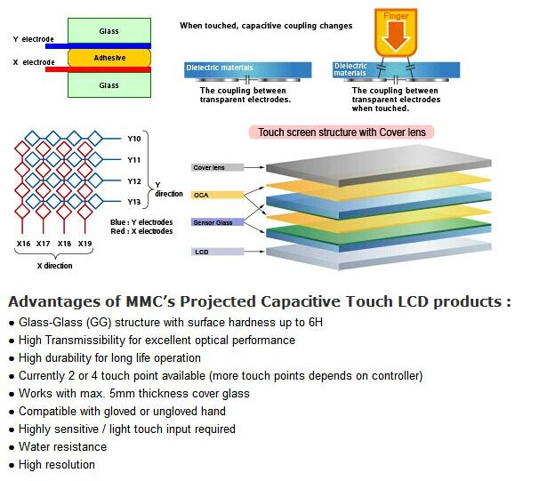
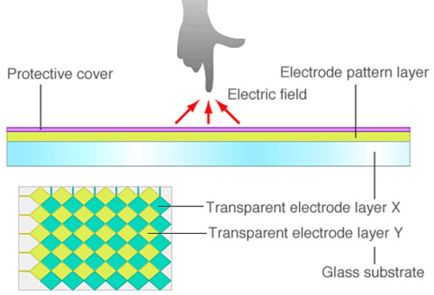
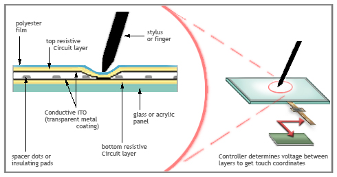

# Capacitive vs Resistive Touchscreens

!!! abstract "Quick answer"
    Capacitive touch supports light finger input and multi-touch with strong optical performance, while resistive touch responds to pressure from fingers, gloves, or passive styluses. Environment and input method should drive the choice.

## Key Takeaways

- Choose capacitive touch for modern gesture interfaces and clear optics when controller tuning and grounding can be managed.
- Choose resistive touch when pressure input, passive stylus use, thick gloves, or simple low-cost control is more important.
- Validate touch technology with the final cover, enclosure, grounding, liquid exposure, noise sources, and user interface.

There are many types of touch panel technologies available in the market, the popular types are resistive touch panel (RTP), surface capacitive touch panel, projected capacitive touch panel (PCAP or CTP), surface acoustic wave (SAW) touch panel, Infrared (IR) touch panel.  The reason each type of touchscreen responds so differently is the underlying technology. In this article, we are going to discuss the two most widely used types, and compare resistive vs capacitive touch screen

## Capacitive Touchscreen

<figure markdown="span" class="displaywiki-figure">
  [{ width="760" loading="lazy" }](touch-panel-types-capacitive-touch-panel.jpeg){ .displaywiki-image-link title="Open full-size image" }
  <figcaption>Capacitive Touch Panel Structure</figcaption>
</figure>

Projected Capacitive Touch Panel (PCAP) was actually invented 10 years earlier than the first resistive touchscreen.  But it was no popular until Apple first used it in iPhone in 2007. After that, PCAP dominates the touch market, such as mobile phones, IT, automotive, home appliances, industrial, IoT, military, aviation, ATMs, kiosks, Android cell phones etc.

<figure markdown="span" class="displaywiki-figure">
  [{ width="760" loading="lazy" }](touch-panel-types-capacitive-touch-panel-2.jpeg){ .displaywiki-image-link title="Open full-size image" }
</figure>

Projected capacitive touchscreen contains X and Y electrodes with insulation layer between them.  The transparent electrodes are normally made into diamond pattern with ITO and with metal bridge.

<figure markdown="span" class="displaywiki-figure">
  [{ width="760" loading="lazy" }](touch-panel-types-p-cap-x-and-y-electrode-structure.png){ .displaywiki-image-link title="Open full-size image" }
  <figcaption>P-CAP X and Y electrode structure</figcaption>
</figure>

Fig. 1. P-CAP X and Y electrode structure

<figure markdown="span" class="displaywiki-figure">
  [{ width="760" loading="lazy" }](touch-panel-types-metal-bridge-in-p-cap.png){ .displaywiki-image-link title="Open full-size image" }
  <figcaption>Metal Bridge in P-CAP</figcaption>
</figure>

Fig. 2. Metal Bridge in P-CAP

Human body is conductive because it contains water. Projected capacitive technology makes use of conductivity of human body. When a bare finger touches the sensor with the pattern of X and Y electrodes, a capacitance coupling happens between the human finger and the electrodes which makes change of the electrostatic capacitance between the X and Y electrodes.  The touchscreen controller detects the electrostatic field change and the location.

<figure markdown="span" class="displaywiki-figure">
  [{ width="760" loading="lazy" }](touch-panel-types-projected-capacitive-touch-sensor.png){ .displaywiki-image-link title="Open full-size image" }
  <figcaption>Projected Capacitive Touch Sensor</figcaption>
</figure>

Fig. 3. Projected Capacitive Touch Sensor

Capacitive Touchscreen Advantages

In There are many advantages for P-CAP:

- Projected capacitive supports multiple touches (Multi-touch), so it supports a lot of gestures: Zoom in and out (pinch/spread), scroll, swipe, drag, slide, hold/press, rotate, tap etc.
- Excellent image clarity because of high transmission.
- Excellent sensitivity.
- More resistance to the scratches because the surface can be made by tampered glass, such as gorilla glass or dragontrail glass which can have the surface hardness of 9H. Only diamond can make a scratch.
- Resistance to contaminants and liquid. It is easier to get clean of dust, grease, moisture etc.
- With the new development, projected capacitive touch panels can support gloved hand touch with different glove materials and touch with water or even with salt water.

## Resistive Touchscreen

Before 2007, resistive technology was the most popular touch panel market.  From its name, we know that the technology relies on resistance. A resistive touch screen is made of a glass substrate as the bottom layer and a film substrate (normally, clear poly-carbonate or PET) as the top layer, each coated with a transparent conductive layer (ITO: Indium Tin Oxide), separated by spacer dots to make a small air gap. The two conducting layers of material (ITO) face each other. When a user touches the part of the screen with finger or a stylus, the conductive ITO thin layers contacted. It changes the resistance. The RTP controller detects the change and calculate the touch position. The point of contact is detected by this change in voltage.

<figure markdown="span" class="displaywiki-figure">
  [{ width="760" loading="lazy" }](touch-panel-types-resistive-touchscreen-technology-rtp.png){ .displaywiki-image-link title="Open full-size image" }
  <figcaption>Resistive Touchscreen Technology (RTP)</figcaption>
</figure>

Fig. 4. Resistive Touchscreen Technology (RTP)

<figure markdown="span" class="displaywiki-figure">
  [{ width="760" loading="lazy" }](touch-panel-types-resistive-touchscreens-advantages.jpeg){ .displaywiki-image-link title="Open full-size image" }
  <figcaption>Resistive Touchscreens Advantages</figcaption>
</figure>

With the fast development of projected capacitive, resistive touchscreen devices market is shrinking rapidly but it is still widely used in some industrial applications because of the following advantages.

- Low cost and simple manufacturing process.
- Low power consumption and easy drive.
- Easily be activated with any touch material as long as the pressure is applied (finger, stylus, glove, pen etc.) (not keys to cause scratches on surface).
- Robust during harsh climate and rugged environment and no false touch.

## Resistive vs Capacitive Touchscreens

The following table shows the comparison of resistive and capacitive touch screens. It is up to your application to select the types of technology to use.

|  | Resistive Touch | Capacitive Touch |
| --- | --- | --- |
| Cost | Low | Relatively high, can be low for especial design |
| Multi-touch | No | Yes |
| Touch Gestures | Difficult | Yes |
| Touch Durability | 3H, easy scratch | Can be as high as 9H, hard to scratch |
| Power Consumption | Lower | Higher |
| Touch Sensitivity | Low | High (Adjustable) |
| Touch Resolution | High | Relatively low |
| Image Clarity | Poor | Good |
| Touch Material | Any type | Fingers. Can be designed to use other materials like glove, stylus, pencil etc. |
| Touch with water, oil | No design change | Need special design |
| Surface Decoration | Difficult | Easy |
| Different Shape | Difficult | Easy |
| Overlay | Can be done | No |
| 3D surface | Difficult | Achievable |
| Size | Small to medium size | Small to very big size |
| Under Rugged Environment | Easy | Difficult |
| False Touch | No | Need careful calibration |
| functionality Sensitive to EMI/RFI | Low | High, shield has to be designed |

## Related reading

- [GF, GFF, GG, and PG Capacitive Touch Structures](capacitive-touch-structures.md)
- [Air Bonding vs Optical Bonding for Displays](air-vs-optical-bonding.md)
- [Glove Touch, Waterproof Touch, and Interference Resistance](glove-waterproof-touch.md)

## Frequently Asked Questions

??? question "Can a capacitive touchscreen work with gloves?"
    Some can, but glove material and thickness, sensor design, cover stack, controller capability, grounding, and tuning determine performance.

??? question "Why does resistive touch work with a passive stylus?"
    It detects pressure that brings conductive layers into contact, so the input object does not need to be electrically coupled like a finger.

??? question "Which technology is better around water?"
    Neither is automatically better. Resistive panels respond to pressure, while a properly designed capacitive system can reject water; sealing and wet-operation requirements must be tested separately.

??? question "Can resistive touch support multi-touch?"
    Conventional four- and five-wire resistive panels are primarily single-touch devices; specialized constructions exist but are less common.

??? question "What affects capacitive-touch EMC performance?"
    Sensor layout, controller, grounding, shielding, display noise, charger noise, cable routing, cover stack, enclosure, and firmware filtering all matter.

!!! info "Can't find what you need?"
    If you need more products, resources or support, please contact our team:

    [**:material-archive-arrow-down: Knowledge Base**](../../knowledge/tags.md){ .md-button .md-button--primary }
    [**:material-magnify: Products & Solutions**](https://viewedisplay.com/){ .md-button }
    [**:material-email: Contact Support**](mailto:support@viewedisplay.com){ .md-button }
