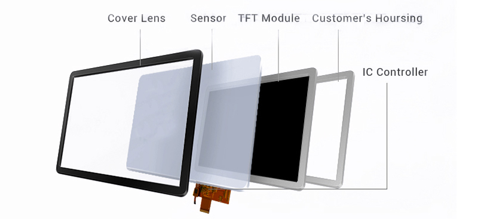
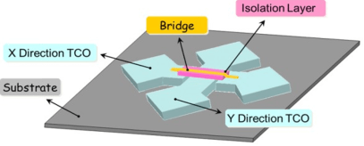
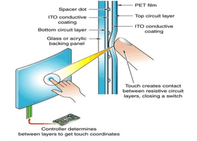

# Capacitive vs Resistive Touch Screens

!!! abstract "Quick answer"
    The difference between capacitive and resistive touch screens lies in how they detect a touch. A capacitive screen locates a finger by the change in capacitive coupling between the finger and the electrodes; it supports multi-touch and gestures and its cover lens can reach 9H hardness, but it needs a conductive touch object and is more sensitive to EMI. A resistive screen locates a touch when the upper and lower ITO conductive layers are pressed into contact; it works with gloves or a stylus, costs less, and resists interference well, but it is single-touch only and its transmission and hardness are lower. After 2007 the capacitive screen became mainstream, while the resistive screen survives in low-cost and specific-environment applications.

## Key Takeaways

- The common touch technologies on the market are resistive (RTP), surface capacitive, projected capacitive (PCAP / CTP), surface acoustic wave (SAW), and infrared (IR).
- A capacitive screen detects changes in capacitive coupling through an X / Y electrode array, and supports gestures such as zoom, swipe, and rotate as well as multi-touch.
- A resistive screen relies on the upper and lower ITO conductive layers being pressed into contact; its strengths are that it works with gloves or a stylus and is relatively reliable in harsh environments.
- Selection comes down to three questions: whether multi-touch is needed, whether the touch object is conductive, and how the environment constrains EMI and cost.

## 1. Touch Panel Technologies Overview

Many kinds of touch screen technology are on the market. The most common are resistive touch screens (RTP), surface capacitive touch screens, projected capacitive touch screens (PCAP or CTP), surface acoustic wave (SAW) touch screens, and infrared (IR) touch screens. How each one responds depends on the detection principle underneath it.

This article focuses on the two most widely used of them: capacitive and resistive touch screens.

## 2. Capacitive Touch Screen

<figure markdown="span" class="displaywiki-figure">
  [{ width="760" loading="lazy" }](touch-panel-types-capacitive-touch-panel.jpeg){ .displaywiki-image-link title="Open full-size image" }
  <figcaption>Exploded stack of a capacitive touch panel: the assembly relationship from the cover lens and sensor through the TFT module to the customer housing and the touch IC.</figcaption>
</figure>

The projected capacitive touch panel (PCAP) was in fact invented 10 years earlier than the first resistive touch screen, but it was not widely accepted by the market until Apple put it into the iPhone in 2007. After that, PCAP came to dominate the touch market in phones, IT, automotive, home appliances, industrial equipment, IoT, military, aviation, ATMs, and more.

<figure markdown="span" class="displaywiki-figure">
  [{ width="760" loading="lazy" }](touch-panel-types-capacitive-touch-panel-2.jpeg){ .displaywiki-image-link title="Open full-size image" }
  <figcaption>X / Y electrode array and the change in capacitive coupling before and after a touch, with the cover-lens touch screen stack at lower right and the typical characteristics of a projected capacitive solution listed below.</figcaption>
</figure>

### 2.1 Electrode Structure

A projected capacitive touch screen contains two sets of electrodes, X and Y, with an isolation layer between them. The transparent electrodes are usually made of ITO in a diamond pattern, joined with metal bridges.

<figure markdown="span" class="displaywiki-figure">
  [{ width="760" loading="lazy" }](touch-panel-types-p-cap-x-and-y-electrode-structure.png){ .displaywiki-image-link title="Open full-size image" }
  <figcaption>P-CAP X and Y electrode structure: the red and blue diamond electrode arrays form a local capacitive coupling where a finger comes close.</figcaption>
</figure>

<figure markdown="span" class="displaywiki-figure">
  [{ width="760" loading="lazy" }](touch-panel-types-metal-bridge-in-p-cap.png){ .displaywiki-image-link title="Open full-size image" }
  <figcaption>Metal bridge and isolation layer in a P-CAP: the X- and Y-direction ITO electrodes are crossed over by a bridge, and the isolation layer provides the insulation.</figcaption>
</figure>

When a finger touches the sensor surface, a capacitive coupling forms between the finger and the electrodes, which changes the electrostatic capacitance between the X and Y electrodes. The touch IC detects the change in the electrostatic field and works out the touch position.

<figure markdown="span" class="displaywiki-figure">
  [{ width="760" loading="lazy" }](touch-panel-types-projected-capacitive-touch-sensor.png){ .displaywiki-image-link title="Open full-size image" }
  <figcaption>Layer stack of a projected capacitive touch sensor: protective cover, electrode pattern layer, and transparent X / Y electrode layers stacked on a glass substrate.</figcaption>
</figure>

!!! warning "Production note"
    Under volume production or harsh conditions (high and low temperature, damp heat, vibration, ESD), check the datasheet curves for this parameter; running outside the specified range will significantly shorten lifetime.

### 2.2 Advantages of a Capacitive Touch Screen

- **Multi-touch and gestures**: supports single- and multi-touch, enabling gestures such as zoom, scroll, swipe, drag, rotate, and tap.
- **High cover-lens strength**: the cover lens can use tempered glass such as Corning Gorilla Glass, with a surface hardness of up to 9H.
- **Continuous evolution**: as the technology has advanced, projected capacitive panels can now support gloved-hand touch and touch with water on the surface.

## 3. Resistive Touch Screen

Before 2007, resistive touch screens were very popular on the market. As the name suggests, the technology relies on a change in resistance.

A resistive screen is built from a glass substrate as the lower layer and a film substrate (usually clear polycarbonate or PET) as the upper layer, each coated with a transparent conductive material, ITO (indium tin oxide). When the user presses a point on the screen with a finger or a stylus, the upper and lower ITO conductive layers come into contact, the resistance changes, and the RTP controller detects the change and calculates the touch position.

<figure markdown="span" class="displaywiki-figure">
  [{ width="760" loading="lazy" }](touch-panel-types-resistive-touchscreen-technology-rtp.png){ .displaywiki-image-link title="Open full-size image" }
  <figcaption>Structure of a resistive touch screen: the upper and lower ITO conductive layers are held apart by spacer dots, and pressing closes a local contact that the controller uses to work out the coordinates.</figcaption>
</figure>

<figure markdown="span" class="displaywiki-figure">
  [{ width="760" loading="lazy" }](touch-panel-types-resistive-touchscreens-advantages.jpeg){ .displaywiki-image-link title="Open full-size image" }
  <figcaption>Cross-section of a resistive touch screen: the upper and lower resistive circuit layers between the polyester film and the glass panel are separated by spacer dots, and pressing with a stylus brings the two layers into contact.</figcaption>
</figure>

With the rapid development of projected capacitive technology, the market share of resistive touch screens is shrinking quickly, but thanks to its low cost and greater reliability in harsh environments it still has value in some applications.

## 4. Resistive vs Capacitive Touch Screens

The following table shows the comparison of resistive and capacitive touch screens. It is up to your application to select the types of technology to use.

| Item | Resistive Touch | Capacitive Touch |
|---|---|---|
| Cost | Low | Relatively high |
| Multi-touch | No | Yes |
| Touch gestures | Difficult | Yes |
| Surface hardness | 3H, easy to scratch | Up to 9H |
| Power consumption | Low | Higher |
| Touch sensitivity | Low | High, adjustable |
| Touch resolution | Low | High |
| Image clarity | Average | Very good |
| Water and oil environments | No design change needed | Special design required |
| Surface decoration | Difficult | Easy |
| Custom shapes | Difficult | Easy |
| Size range | Small to medium | Small to very large |
| Sensitivity to EMI / RFI | Low | High |

## 5. Selection Guidance

- **Gesture and multi-touch needed**: favor capacitive, which resistive can hardly achieve.
- **Touch object is not conductive**: for gloved hands, a passive stylus, or a production line that requires protective gloves, resistive is the safer choice; if a capacitive screen is mandatory, pick a model that supports gloved-hand touch.
- **Strong electromagnetic interference**: a capacitive screen is more sensitive to EMI / RFI, while a resistive screen stays relatively stable under strong interference.
- **Cost-sensitive**: for small sizes and tight budgets, consider resistive first.
- **Outdoor or wet and oily environments**: a capacitive screen needs dedicated waterproofing and interference-resistance design; see the waterproof touch solutions.

## 6. Frequently Asked Questions

??? question "Q1: What is the core difference between a capacitive and a resistive touch screen?"
    The detection principle is different. A capacitive screen locates a touch from the change in capacitive coupling between the finger and the X / Y electrodes, so it needs a conductive touch object; a resistive screen locates a touch when the upper and lower ITO conductive layers are pressed into contact, so anything that can apply pressure can trigger it. This fundamental difference drives every other distinction between them: multi-touch, cover-lens hardness, sensitivity, and cost.

??? question "Q2: Why can a resistive screen be operated with gloves or a stylus?"
    Because a resistive screen detects only pressure, not conductivity. Whether it is a finger, a glove, a plastic stylus, or a metal pen, as long as it can press the upper film down onto the lower layer, a contact forms and the position can be located. A capacitive screen depends on the body's charge coupling with the electrodes, so ordinary gloves and insulated styluses cannot trigger it unless a capacitive solution specifically designed for gloved-hand touch is used.

??? question "Q3: A capacitive screen supports multi-touch, so why can a resistive screen not?"
    The X / Y electrodes of a capacitive screen form an array that can detect capacitance changes at several positions at once, so it can recognize multi-finger gestures. A resistive screen is a single pair of conductive films covering the whole surface; a press anywhere makes those two layers contact locally, and the controller can resolve only one contact point, with no way to tell several simultaneous presses apart. That is why it is inherently single-touch.

??? question "Q4: Is a resistive screen more reliable in harsh environments?"
    In many cases, yes. A resistive screen has a simple structure and is insensitive to electromagnetic interference, and it adapts better to damp, dusty environments or ones that require isolated operation (such as a gloved production line or an industrial terminal that needs a stylus). Its power consumption is also lower, which makes low-power designs easier.

??? question "Q5: What do the cover-lens hardness grades 3H and 9H mean?"
    These are pencil-hardness grades, and a higher number means more scratch resistance. The surface of a resistive screen is a relatively soft film layer, usually only around 3H, and is easily scratched by sharp objects; a capacitive screen can use a tempered glass cover lens with a hardness of up to 9H, which wears better in daily use. Applications with high durability requirements should therefore favor a capacitive screen with a strengthened cover lens.

??? question "Q6: Which touch screen should I choose in a strong electromagnetic interference environment?"
    A resistive screen is clearly less sensitive to EMI / RFI, so it is the safer choice in strong-interference environments such as those with variable-frequency drives and high-power motors. If a capacitive screen must be used, interference resistance has to be designed in at several levels: touch-IC selection, trace shielding, filtering, and firmware algorithms, with thorough validation against the actual site conditions.

## Related reading

- [GF, GFF, GG, and PG Capacitive Touch Structures](capacitive-touch-structures.md)
- [Air Bonding vs Optical Bonding for Displays](air-vs-optical-bonding.md)
- [Glove Touch, Waterproof Touch, and Interference Resistance](glove-waterproof-touch.md)

!!! info "Can't find what you need?"
    If you need more products, resources or support, please contact our team:

    [**:material-archive-arrow-down: Knowledge Base**](../../knowledge/tags.md){ .md-button .md-button--primary }
    [**:material-magnify: Products & Solutions**](https://viewedisplay.com/){ .md-button }
    [**:material-email: Contact Support**](mailto:support@viewedisplay.com){ .md-button }
