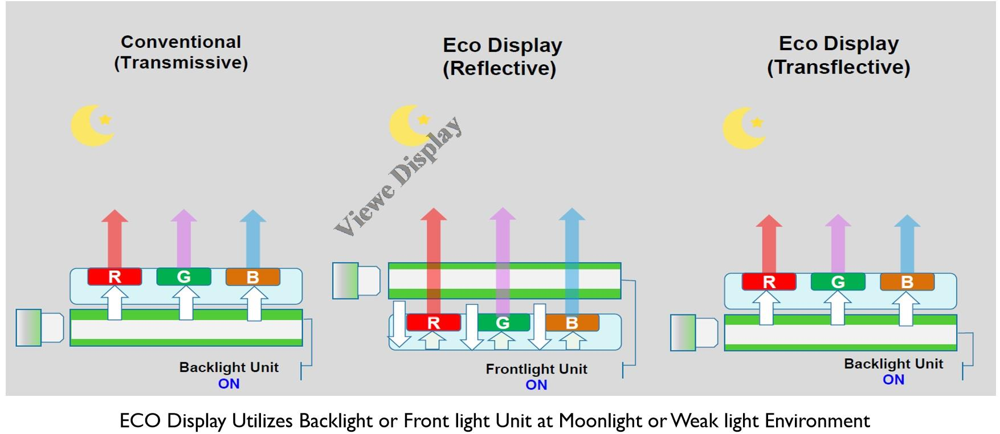
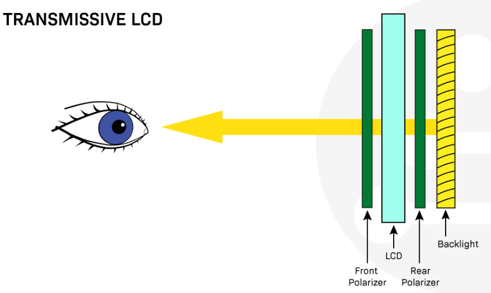
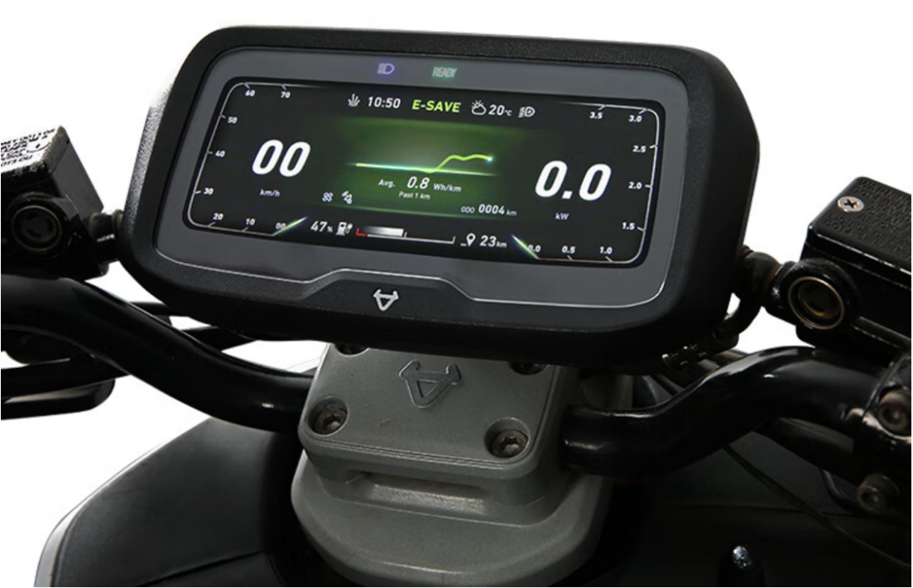

# Transmissive, Reflective, and Transflective LCDs Compared

!!! abstract "Quick answer"
    Transmissive LCDs rely on a backlight, reflective LCDs use ambient light, and transflective LCDs combine transmitted and reflected light. The best mode depends on the product’s lighting cycle and visual priorities.

## Key Takeaways

- Use transmissive LCDs for strong indoor color and broad availability when backlight power is acceptable.
- Use reflective LCDs for very low-power applications with adequate ambient light and modest color requirements.
- Use transflective LCDs when operation spans sunlight and darkness, after checking indoor appearance, backlight needs, and supply.

## Transmissive vs Reflective vs Transflective Displays

FAQ1: what is the difference between transmissive，reflective display and transflective display?

FAQ2: transmissive, reflective and transflective which one is better?

FAQ3: what is transflective display? is transflective display good?

FAQ4: what is advantage or disadvantage of transflective display?

FAQ5: what is transflective or reflective display used for?

FAQ6: what is transmissive display?

FAQ7: what is reflective display? is reflective display good?

FAQ8: what is the difference between Blanview and transflective display?

### Operating Principles

TFT Liquid Crystal Displays (LCDs) are widely used in electronic devices for all kinds of industries. They are typically divided into three display types based on their light transmission modes. The three main types of LCD modes are transmissive, reflective, and transflective.

The main difference is how they use light to illuminate the pixels in the display.

Types of LCD modes:

Transmissive LCDs require a backlight for clear visibility.

Reflective LCDs do not have a backlight and rely on external light sources.

Transflective LCDs combine both transmissive and reflective properties.

<figure markdown="span" class="displaywiki-figure">
  [{ width="760" loading="lazy" }](transmissive-reflective-transflective-transflective-lcds-combine-both-transmissive-and-reflective-properties.jpeg){ .displaywiki-image-link title="Open full-size image" }
  <figcaption>Transflective LCDs combine both transmissive and reflective properties</figcaption>
</figure>

Each display mode has its own advantages and disadvantages related to the available lighting conditions and the application's environment.

### Transmissive LCDs

Transmissive displays rely on a backlight to be visible. For this kind of display, light emitting from the back of the display glass must pass through the LCD towards the front to light the pixels. Transmissive LCDs are suitable in low-light environments since they rely on a backlight to be visible. These displays are also used in applications where high-resolution images, videos, and high quality are important, which is why you will commonly find  TFT displays with a transmissive display mode.

How do transmissive displays work?

Transmissive displays work by transmitting light through the surface of the display. This is achieved by using a series of layers, including a layer of liquid crystal that can be manipulated to control the amount of light passing through, a backlight to provide the light source and an outer layer of protective glass or plastic. When an electrical current is applied to a pixel in the display, it allows more or less light to pass through, creating an image.

<figure markdown="span" class="displaywiki-figure">
  [{ width="760" loading="lazy" }](transmissive-reflective-transflective-transmissive-lcd-uses.png){ .displaywiki-image-link title="Open full-size image" }
  <figcaption>Transmissive LCD uses</figcaption>
</figure>

The most common devices using transmissive LCDs are smartphones, tablets, computer monitors, and televisions. They are also used in digital cameras, camcorders, automotive displays, navigation systems, in-flight entertainment systems, medical equipment, kiosks, and point-of-sale (POS) terminals.

Advantages of transmissive LCDs

High image quality: Transmissive LCDs can produce high-quality, bright, vivid images with a wide color gamut and high contrast ratio.

Good visibility in low-light environments: Transmissive LCDs rely on a backlight to be visible, which makes them suitable for darker lighting conditions.

Wide viewing angles: Transmissive LCDs have wide viewing angles, making viewing the display from various positions easy.

Suitable for high-resolution: Transmissive LCDs can handle high-resolution images and videos.

Disadvantages of transmissive LCDs

High power consumption: Transmissive LCDs require a backlight to be visible, which increases power consumption and reduces the end product's battery life.

Reduced visibility in bright sunlight: Transmissive LCDs are not well-suited for use in direct sunlight, as the backlight can wash out the display.

Susceptible to glare: Transmissive LCDs can be affected by glare, making it difficult to view the display in certain lighting conditions.

### Reflective LCDs

Reflective displays rely on bright ambient light to be visible. There is no backlight source inside this kind of display; instead, light is reflected from the surrounding environment for the pixels to be visible.

How do reflective displays work?

Reflective LCDs work by using a reflective layer along with the polarizing filter, to reflect the light back to the user's eyes instead of emitting light from a backlight. The liquid crystal layer modulates the amount of light that is reflected back, creating the desired image.

<figure markdown="span" class="displaywiki-figure">
  [{ width="760" loading="lazy" }](transmissive-reflective-transflective-reflective-lcd-uses.png){ .displaywiki-image-link title="Open full-size image" }
  <figcaption>Reflective LCD uses</figcaption>
</figure>

Reflective LCDs are great for outdoor or sunlight-readable applications where the device is exposed to direct sunlight. These displays are also used in small handheld devices where power consumption is a concern.

The most common devices using reflective LCDs are outdoor applications such as GPS devices and portable devices such as e-readers, camera viewfinders, and digital watches.

Advantages of reflective LCDs

Low power consumption: Reflective LCDs do not require a backlight, which reduces their power consumption and extends the device's battery life.

High visibility in sunlight: The reflective nature of the display allows it to be easily read in bright sunlight.

Thin and lightweight: Reflective LCDs are thinner and lighter than transmissive LCDs since they don't have a backlight, making them well-suited for portable devices.

Disadvantages of reflective LCDs

Limited viewing angles: Reflective LCDs have a limited viewing angle, making it difficult to read the display from certain angles.

Poor performance in low light: Reflective LCDs are not well-suited for low-light environments, as they rely on bright ambient light to be visible.

Reduced color depth: Reflective LCDs typically have a reduced color depth compared to transmissive LCDs, which can affect the overall image quality.

### Transflective LCDs

Transflective displays combine backlighting and ambient light reflection to illuminate the pixels, resulting in a display with both transmissive and reflective properties.

How do transflective LCDs work?

In a transflective LCD, a backlight is used to illuminate the screen in low-light conditions, such as indoors or at night. In bright light conditions, such as outdoors or direct sunlight, the screen can be viewed by reflecting ambient light off the surface of the LCD.

<figure markdown="span" class="displaywiki-figure">
  [{ width="760" loading="lazy" }](transmissive-reflective-transflective-transflective-lcd-uses.png){ .displaywiki-image-link title="Open full-size image" }
  <figcaption>Transflective LCD uses</figcaption>
</figure>

Transflective LCDs are commonly used in outdoor devices，industrial and medical equipment, where it's essential to have high visibility in any lighting conditions. They are also widely used in marine, military, and aviation applications where the operator needs to see the display in bright and low light conditions.

Advantages of transflective LCDs

High visibility and contrast: Transflective LCDs combine the benefits of reflective and transmissive displays, providing good visibility in both bright sunlight and low-light environments.

Low power consumption: Transflective LCDs do not require a backlight always on, which reduces power consumption and extends battery life when the backlight is off.

Wide viewing angles: Transflective LCDs have wider viewing angles than reflective LCDs.

Disadvantages of transflective LCDs

Limited color depth: Transflective LCDs typically have a reduced color depth compared to transmissive LCDs, which can affect overall image quality.

### Selection Summary

In summary, transmissive LCDs are for low-light use, reflective LCDs are for bright-light use, and transflective LCDs work well in both environments.

<figure markdown="span" class="displaywiki-figure">
  [{ width="760" loading="lazy" }](transmissive-reflective-transflective-conclusion.png){ .displaywiki-image-link title="Open full-size image" }
  <figcaption>Conclusion</figcaption>
</figure>

Transmissive displays will continue to be used in applications where high-quality images and videos are required, such as televisions, computer monitors, and smartphones.

Reflective displays will continue to be used in applications where power consumption is a concern, such as in e-readers, small handheld devices, and outdoor applications.

Transflective displays are expected to be used in more portable devices and applications where visibility in changing lighting conditions is essential.

### Applications for Reflective and Transflective Displays

Rugged Phone and outdoor Handheld device:

<figure markdown="span" class="displaywiki-figure">
  [{ width="760" loading="lazy" }](transmissive-reflective-transflective-outdoor-transport-vehicle-motor-e-bike-bike-computer.jpg){ .displaywiki-image-link title="Open full-size image" }
  <figcaption>Outdoor transport vehicle: Motor, E-Bike, Bike computer</figcaption>
</figure>

<figure markdown="span" class="displaywiki-figure">
  [{ width="760" loading="lazy" }](transmissive-reflective-transflective-outdoor-transport-vehicle-motor-e-bike-bike-computer.png){ .displaywiki-image-link title="Open full-size image" }
  <figcaption>Outdoor transport vehicle: Motor, E-Bike, Bike computer</figcaption>
</figure>

<figure markdown="span" class="displaywiki-figure">
  [{ width="760" loading="lazy" }](transmissive-reflective-transflective-outdoor-transport-vehicle-motor-e-bike-bike-computer-2.png){ .displaywiki-image-link title="Open full-size image" }
  <figcaption>Outdoor transport vehicle: Motor, E-Bike, Bike computer</figcaption>
</figure>

<figure markdown="span" class="displaywiki-figure">
  [{ width="760" loading="lazy" }](transmissive-reflective-transflective-sports-devices.png){ .displaywiki-image-link title="Open full-size image" }
  <figcaption>Sports devices</figcaption>
</figure>

<figure markdown="span" class="displaywiki-figure">
  [{ width="760" loading="lazy" }](transmissive-reflective-transflective-sports-devices.jpeg){ .displaywiki-image-link title="Open full-size image" }
  <figcaption>Sports devices</figcaption>
</figure>

<figure markdown="span" class="displaywiki-figure">
  [{ width="760" loading="lazy" }](transmissive-reflective-transflective-sports-devices-2.png){ .displaywiki-image-link title="Open full-size image" }
  <figcaption>Sports devices</figcaption>
</figure>

<figure markdown="span" class="displaywiki-figure">
  [{ width="760" loading="lazy" }](transmissive-reflective-transflective-sports-devices-3.png){ .displaywiki-image-link title="Open full-size image" }
  <figcaption>Sports devices</figcaption>
</figure>

## Related reading

- [IPS, TN, VA, and FFS TFT Panel Technologies Compared](tft-panel-technologies.md)
- [a-Si, LTPS, and IGZO TFT Backplanes Compared](tft-backplane-technologies.md)
- [OLED Display Structure, Operation, and LCD Comparison](oled-display-basics.md)

## Frequently Asked Questions

??? question "Can a reflective LCD be used in the dark?"
    Not without front lighting or another illumination method because it depends on ambient light reflected through the display.

??? question "Does a transflective LCD eliminate the backlight?"
    No. It can use ambient light in bright conditions but normally still needs a backlight in low light or darkness.

??? question "Why can transflective color look different indoors?"
    The optical stack divides light between transmission and reflection, which can affect brightness, contrast, and color compared with a purely transmissive panel.

??? question "Which mode is best for battery-powered equipment?"
    It depends on the lighting cycle and UI. Reflective or transflective designs can reduce backlight demand, while transmissive panels may provide better indoor color and availability.

??? question "How should the three modes be compared in samples?"
    Compare them under darkness, office light, overcast daylight, and direct sun at the intended viewing angles, temperature, content, and power settings.

!!! info "Can't find what you need?"
    If you need more products, resources or support, please contact our team:

    [**:material-archive-arrow-down: Knowledge Base**](../../knowledge/tags.md){ .md-button .md-button--primary }
    [**:material-magnify: Products & Solutions**](https://viewedisplay.com/){ .md-button }
    [**:material-email: Contact Support**](mailto:support@viewedisplay.com){ .md-button }
