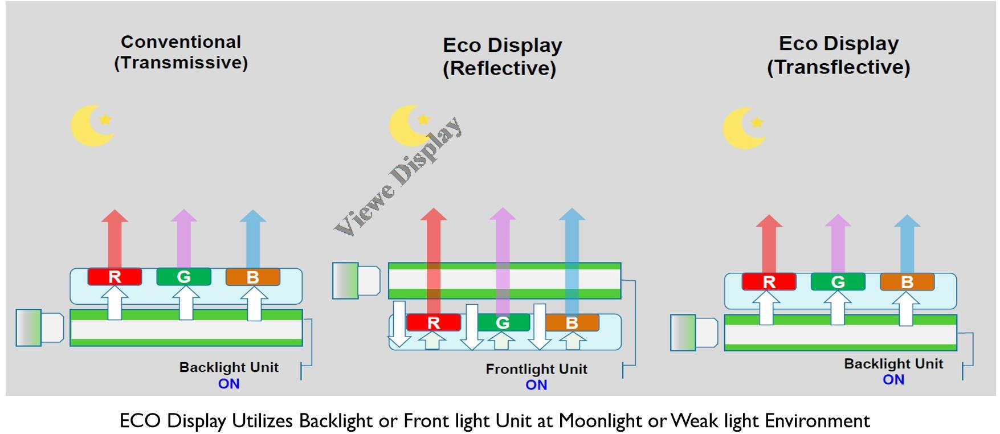
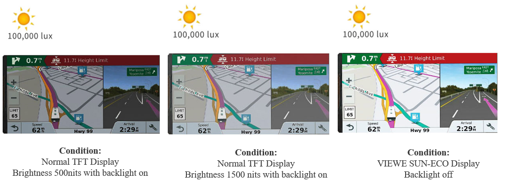
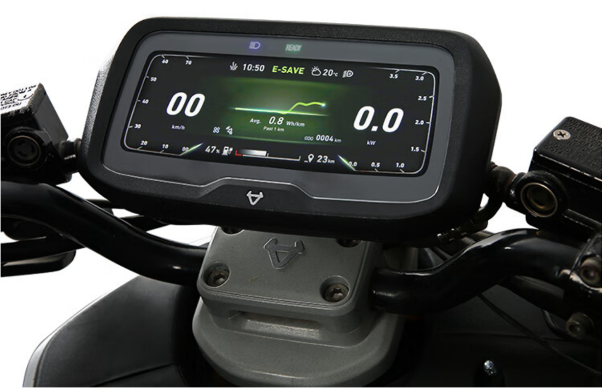
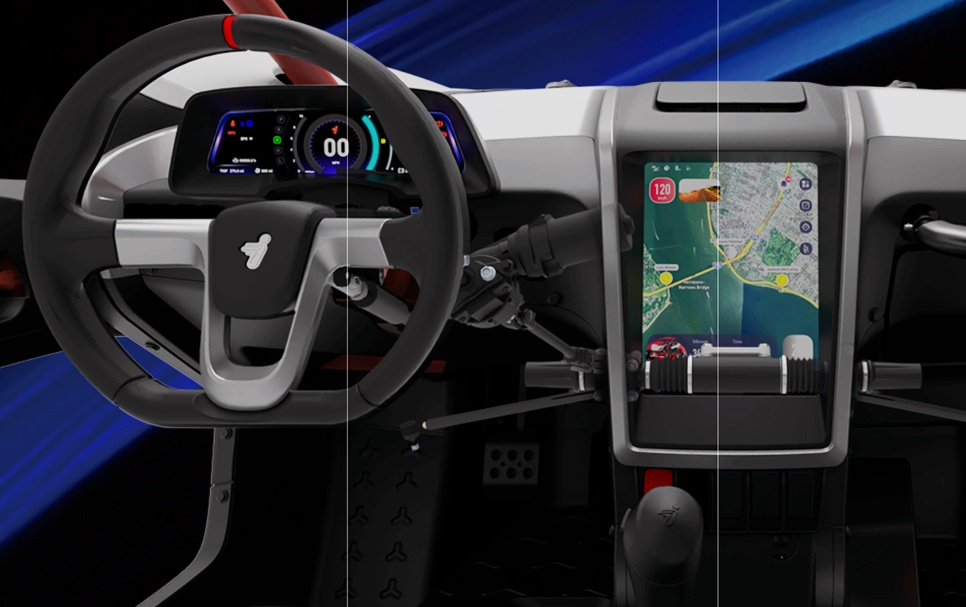
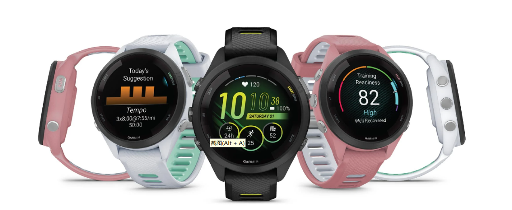

# Transmissive, Reflective, and Transflective LCDs Compared

!!! abstract "Quick answer"
    LCDs fall into three types by how they transmit light: transmissive panels need a backlight to be seen, reflective panels rely entirely on ambient light, and transflective panels carry both a backlight and a reflective structure. The core question in selection is not "which one is better" but what lighting conditions the device will be used in — choose transmissive mainly for indoor use, and reflective or transflective for bright outdoor light when power consumption matters.

## Key Takeaways

- The fundamental difference among the three is what light illuminates the pixels: a backlight, ambient light, or both.
- Transmissive panels offer the best picture quality and viewing angles, but sunlight washes out the backlight and power draw is the highest.
- Reflective panels have the lowest power consumption and the best sunlight readability, but they cannot be used in the dark, and their color depth and viewing angles are weaker.
- Transflective panels balance the two: backlight on in low light, reflection in strong light, at the cost of a compromise in color depth and cost.

## 1. Differences Between the Three Lighting Methods

Liquid crystal displays are widely used in electronic devices across all kinds of industries. By how they transmit light they can be grouped into three types, and the fundamental difference lies in how they illuminate the pixels on the screen:

<figure markdown="span" class="displaywiki-figure">
  [{ width="760" loading="lazy" }](transmissive-reflective-transflective-transflective-lcds-combine-both-transmissive-and-reflective-properties.jpeg){ .displaywiki-image-link title="Open full-size image" }
  <figcaption>How the three lighting modes are illuminated in a low-light (moonlight) environment: conventional transmissive on the left (backlight unit), reflective in the middle (frontlight unit), and transflective on the right; the difference comes down to where the light comes from.</figcaption>
</figure>

- **Transmissive LCDs**: need a backlight for clear visibility.
- **Reflective LCDs**: have no backlight and rely on external ambient light.
- **Transflective LCDs**: combine both transmissive and reflective properties.

Each mode has its own advantages and disadvantages that correspond to the available lighting conditions and the application environment.

## 2. Transmissive LCDs

### 2.1 Operating Principles

Transmissive displays rely on a light source behind the panel to illuminate the pixels: light emitted from the back of the display glass must travel forward through the liquid-crystal cell before it reaches the viewer.

<figure markdown="span" class="displaywiki-figure">
  [{ width="760" loading="lazy" }](transmissive-reflective-transflective-transmissive-lcd-uses.png){ .displaywiki-image-link title="Open full-size image" }
  <figcaption>Light path of a transmissive LCD: the backlight provides the light source, and the light passes through the rear polarizer, the LCD cell, and the front polarizer toward the viewer, with the liquid crystal controlling how much light gets through.</figcaption>
</figure>

These displays are built from a stack of layers: a liquid-crystal layer that controls the light, a backlight that provides the light source, and a protective outer layer of glass or plastic. When a current is applied to a pixel, the liquid crystal allows more or less light to pass through. Because they depend on a backlight, transmissive LCDs suit low-light environments, and they are also used where high-resolution images, video, and overall picture quality matter — which is why TFT displays commonly adopt the transmissive mode.

### 2.2 Advantages and Limitations

**Advantages**

- **High image quality**: bright, vivid pictures with a wide color gamut and high contrast.
- **Good visibility in low light**: relies on the backlight, which suits darker lighting conditions.
- **Wide viewing angles**: the picture stays easy to read from different positions.
- **Supports high resolution**: handles high-resolution images and video.

**Limitations**

- **High power consumption**: the backlight must stay lit, which increases power draw and shortens the end product's battery life.
- **Reduced readability in strong light**: sunlight washes out the backlight, making long use in direct sunlight unsuitable.
- **Affected by ambient light**: under some lighting conditions, glare and reflections interfere with viewing.

**Typical applications**: smartphones, tablets, computer monitors, and televisions, as well as digital cameras, camcorders, automotive displays, navigation systems, in-flight entertainment systems, medical equipment, kiosks, and point-of-sale (POS) terminals.

## 3. Reflective LCDs

### 3.1 Operating Principles

Reflective displays rely on bright ambient light and have no backlight source inside; ambient light enters from the surroundings and returns from a reflector, which is what makes the pixels visible.

<figure markdown="span" class="displaywiki-figure">
  [{ width="760" loading="lazy" }](transmissive-reflective-transflective-reflective-lcd-uses.png){ .displaywiki-image-link title="Open full-size image" }
  <figcaption>Light path of a reflective LCD: there is no backlight; ambient light (sunlight) enters from the front, passes through the front polarizer and the LCD cell, and is bounced back to the viewer by the reflector, with the liquid crystal modulating the amount of reflected light to form the image.</figcaption>
</figure>

Reflective LCDs work with a reflector together with the polarizer, bouncing light back toward the viewer's eyes instead of emitting light from a backlight. The liquid-crystal layer modulates the amount of reflected light to form the desired image. These displays suit outdoor and sunlight-readable applications, as well as power-sensitive portable devices.

### 3.2 Advantages and Limitations

**Advantages**

- **Low power consumption**: with no backlight, power draw drops significantly and battery life is extended.
- **High sunlight readability**: the reflective nature keeps the screen clearly readable in bright sunlight.
- **Thin and light**: without a backlight structure it is thinner and lighter than a transmissive panel, which suits portable devices.

**Limitations**

- **Limited viewing angles**: harder to read when viewed at oblique angles.
- **Poor performance in low light**: it depends on bright ambient light and cannot be used in the dark.
- **Lower color depth**: fewer color levels than a transmissive panel, which affects overall image quality.

**Typical applications**: outdoor GPS devices, e-readers, camera viewfinders, digital watches, and other portable devices.

## 4. Transflective LCDs

### 4.1 Operating Principles

Transflective displays combine a backlight with the reflection of ambient light to illuminate the pixels, so they carry both transmissive and reflective properties.

<figure markdown="span" class="displaywiki-figure">
  [{ width="760" loading="lazy" }](transmissive-reflective-transflective-transflective-lcd-uses.png){ .displaywiki-image-link title="Open full-size image" }
  <figcaption>Light path of a transflective LCD: the structure carries both a backlight and a transflector. In low light such as indoors or at night the backlight illuminates the screen; in strong outdoor light the transflector reflects ambient light so the picture stays readable.</figcaption>
</figure>

Under low lighting (indoors or at night) the backlight illuminates the screen; in bright conditions (outdoors or direct sunlight) the screen can be read by reflecting ambient light. That is why these displays are common in outdoor, industrial, and medical equipment that must stay visible under any lighting conditions.

### 4.2 Advantages and Limitations

**Advantages**

- **High visibility and contrast**: combines the strengths of reflective and transmissive designs, staying readable in both sunlight and low light.
- **Low power consumption**: the backlight does not have to stay on all the time, which reduces power draw and extends backlight life.
- **Wider viewing angles**: better viewing-angle behavior than a purely reflective panel.

**Limitations**

- **Limited color depth**: fewer color levels than a transmissive panel, which affects overall image quality.
- **Higher cost and structural complexity**: the transflector and the dual light-source design add process and cost overhead.

## 5. Side-by-Side Comparison of the Three Lighting Methods

| Dimension | Transmissive | Reflective | Transflective |
|---|---|---|---|
| Light source | Backlight | Ambient light | Backlight + reflected ambient light |
| Readability in strong light | Poor (backlight washes out) | Good | Good |
| Readability in the dark | Good | Poor | Good (backlight on) |
| Power consumption | High | Lowest | Medium to low |
| Color depth and image quality | Good | Lower | Medium |
| Viewing angle | Wide | Narrow | Wider |
| Thickness | Thicker (includes backlight) | Thin | Medium |

## 6. Measured Comparison in Strong Light

Under direct strong light of 100,000 lux, the difference between designs is immediately visible. The photo below shows the same navigation screen under three conditions: a normal TFT with the backlight fully on at 500 nits and at 1500 nits, and a transflective screen with the backlight **off**.

<figure markdown="span" class="displaywiki-figure">
  [{ width="760" loading="lazy" }](transmissive-reflective-transflective-conclusion.png){ .displaywiki-image-link title="Open full-size image" }
  <figcaption>Readability at 100,000 lux: a normal TFT (500 nits, backlight on), a normal TFT (1500 nits, backlight on), and the VIEWE SUN-ECO transflective display (backlight off). The transflective panel stays clear with the backlight off, showing that strong-light readability does not come down to brightness figures alone.</figcaption>
</figure>

This comparison reveals a fact that is often overlooked: in direct sunlight, simply raising the backlight brightness hits diminishing returns, because the light reflected off the screen surface is amplified as well. A transflective design turns ambient light itself into the light source, so it achieves better readability with the backlight off while cutting power consumption at the same time.

## 7. Typical Application Scenarios

Transflective and reflective designs mainly serve two demands — strong outdoor light and low power — and appear most often as outdoor handheld and transport devices and as sports and wearable products.

**Rugged phones and outdoor handheld devices**

<figure markdown="span" class="displaywiki-figure">
  [{ width="760" loading="lazy" }](transmissive-reflective-transflective-outdoor-transport-vehicle-motor-e-bike-bike-computer.jpg){ .displaywiki-image-link title="Open full-size image" }
  <figcaption>Rugged phone: in outdoor work and sports the screen is often in direct sunlight, so the lighting method matters more than peak brightness.</figcaption>
</figure>

**Outdoor GPS navigators**

<figure markdown="span" class="displaywiki-figure">
  [{ width="760" loading="lazy" }](transmissive-reflective-transflective-outdoor-transport-vehicle-motor-e-bike-bike-computer.png){ .displaywiki-image-link title="Open full-size image" }
  <figcaption>Outdoor GPS navigator: exposed to strong light for long periods and battery powered, it suits a transflective or reflective design.</figcaption>
</figure>

**E-motorcycle instrument clusters**

<figure markdown="span" class="displaywiki-figure">
  [{ width="760" loading="lazy" }](transmissive-reflective-transflective-outdoor-transport-vehicle-motor-e-bike-bike-computer-2.png){ .displaywiki-image-link title="Open full-size image" }
  <figcaption>E-motorcycle instrument cluster: the rider's view is often against the light or in strong light, so the cluster must stay readable in any lighting.</figcaption>
</figure>

**Bike computers**

<figure markdown="span" class="displaywiki-figure">
  [{ width="760" loading="lazy" }](transmissive-reflective-transflective-sports-devices.png){ .displaywiki-image-link title="Open full-size image" }
  <figcaption>Bike computer: small size, low power, and sunlight readability make it a classic transflective use case.</figcaption>
</figure>

**Electric off-road vehicle cockpits**

<figure markdown="span" class="displaywiki-figure">
  [{ width="760" loading="lazy" }](transmissive-reflective-transflective-sports-devices.jpeg){ .displaywiki-image-link title="Open full-size image" }
  <figcaption>Electric off-road vehicle cockpit: the center display and instruments sit in an open cockpit in direct sun, so strong-light readability must be evaluated.</figcaption>
</figure>

**Sports watches**

<figure markdown="span" class="displaywiki-figure">
  [{ width="760" loading="lazy" }](transmissive-reflective-transflective-sports-devices-2.png){ .displaywiki-image-link title="Open full-size image" }
  <figcaption>Sports watches: used for hours in the sun while running or riding outdoors, with power and readability both constrained.</figcaption>
</figure>

**Golf watches**

<figure markdown="span" class="displaywiki-figure">
  [{ width="760" loading="lazy" }](transmissive-reflective-transflective-sports-devices-3.png){ .displaywiki-image-link title="Open full-size image" }
  <figcaption>Golf watches: they must show course maps and shot data for long periods in bright light on open fairways — a typical sunlight-readable application.</figcaption>
</figure>

## 8. Selection Checklist

- **Fix the lighting environment first**: transmissive for mainly indoor use; reflective for long-term strong outdoor light where power supply is inconvenient; transflective when conditions switch frequently between bright and dark.
- **Quantify readability requirements**: do not judge by brightness (nits) alone; combine ambient illuminance (lux) and the actual viewing angle, and compare with measured photos when necessary.
- **Budget the power**: for battery-powered devices, calculate the backlight's share of total power; a transflective panel can switch the backlight off in strong light, which brings a clear gain.
- **Confirm image-quality requirements**: if color depth or color gamut is a hard requirement, evaluate whether the color-depth compromise of a reflective or transflective design is acceptable.
- **Check structure and cost**: the transflector and the dual light-source structure affect thickness and cost, and must be confirmed together with the product's mechanical design.

## 9. Frequently Asked Questions

??? question "Q1: How should I choose among transmissive, reflective, and transflective screens?"
    Look first at the lighting conditions the device will be used in: mainly indoors or at night, a transmissive panel gives the best picture quality; for long-term outdoor strong light on battery power, a reflective panel has the lowest power draw and is clearest in sunlight; when the environment switches frequently between strong and weak light (as with outdoor handheld devices), a transflective panel balances both and is the more robust compromise.

??? question "Q2: Why can a transflective screen turn its backlight off in strong light?"
    A transflective screen adds a transflector in front of the backlight structure: it passes backlight light and also reflects ambient light. In strong light, ambient light reflected by this layer returns to the viewer's eyes with enough brightness to read the screen, so the backlight can be switched off and power consumption drops with it.

??? question "Q3: Is a reflective LCD completely unusable in the dark?"
    A reflective display has no backlight and depends entirely on ambient light, so when ambient light is insufficient the picture indeed cannot be read. Some products add a frontlight to solve dark-environment reading, but that adds structural and power cost; if light conditions switch frequently, choosing a transflective design directly is more suitable.

??? question "Q4: Does a transflective screen sacrifice color performance?"
    There is a compromise. The reflective layer of the transflector takes up part of the transmitting area, so in transmission mode the brightness and color depth fall short of a pure transmissive panel of the same specification, and color depth in reflection mode is also weaker than a pure reflective panel. Confirm the target application's color-depth requirement during selection and, if necessary, evaluate the acceptability with real pictures.

??? question "Q5: What is the difference between a frontlight and a backlight?"
    A backlight sits behind the screen, with light passing from back to front through the liquid-crystal layer; a frontlight sits in front of or at the side of the screen, shining onto the display surface and then reflecting into the eye. Reflective and transflective displays usually rely on a frontlight, not a backlight, in dark environments; the two differ in structure, power consumption, and optical effect.

??? question "Q6: In strong outdoor light, does simply raising the brightness (nits) solve the problem?"
    The effect is limited. Ambient-light reflection at the screen surface grows with the outside illuminance, so simply raising the backlight brightness hits diminishing returns while power consumption keeps climbing. Changing the lighting method instead — using a transflective design to turn ambient light into the light source — is often more effective, which is exactly the value of transflective solutions in sunlight-readable scenarios.

## Related reading

- [IPS, TN, VA, and FFS TFT Panel Technologies Compared](tft-panel-technologies.md)
- [a-Si, LTPS, and IGZO TFT Backplanes Compared](tft-backplane-technologies.md)
- [OLED Display Structure, Operation, and LCD Comparison](oled-display-basics.md)

!!! info "Can't find what you need?"
    If you need more products, resources or support, please contact our team:

    [**:material-archive-arrow-down: Knowledge Base**](../../knowledge/tags.md){ .md-button .md-button--primary }
    [**:material-magnify: Products & Solutions**](https://viewedisplay.com/){ .md-button }
    [**:material-email: Contact Support**](mailto:support@viewedisplay.com){ .md-button }
