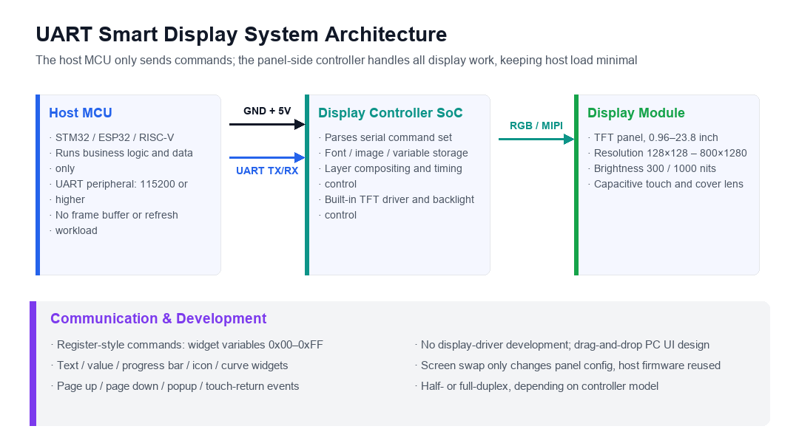

# UART Smart Display Solutions

!!! abstract "Quick answer"
    A UART smart display (also known as a serial display) hands display driving, font libraries, layer compositing, and timing control entirely to the panel-side controller, so the host MCU only sends commands over a serial link to refresh the UI. Its value is freeing the host from refresh workload: no frame buffer, no display driver to write, and no host firmware rewrite when the screen or UI changes. The trade-off is that refresh rate and animation capability are limited by serial bandwidth, making it best suited to scenarios centered on data presentation and status indication.

## Key Takeaways

- The panel-side controller integrates the TFT driver, font and image libraries, and layer compositing; the host MCU only handles business logic and serial communication.
- Selection starts with three things: the widgets and command set the controller supports, the UART baud rate and refresh capability, and the panel size, resolution, and brightness.
- Resolutions typically range from 128×128 to 800×1280, sizes from 0.96 to 23.8 inch, and brightness from 300 nits indoors to 1000 nits outdoors.
- The host side requires almost zero display-driver development, and the UI can be built by drag-and-drop on a PC; the bottleneck is serial bandwidth, so full-screen animation and video content are not a good fit.

## 1. What Is a UART Smart Display

UART (Universal Asynchronous Receiver/Transmitter) is one of the most classic and widely used serial communication protocols in embedded systems. A UART smart display splits the traditional "host directly drives the panel" architecture into two stages: the host MCU and the panel-side controller exchange only a stream of commands, and the controller completes all display work independently.

<figure markdown="span" class="displaywiki-figure">
  [{ width="760" loading="lazy" }](uart-smart-display-architecture-en.png){ .displaywiki-image-link title="Open full-size image" }
  <figcaption>The host MCU only sends commands; the panel-side controller handles fonts, layers, and timing, while the display module performs electro-optical conversion</figcaption>
</figure>

The direct result of this division of labor: the host no longer needs a frame buffer, refresh computing power, or even knowledge of the panel timing parameters. The communication method is simple and stable, which is exactly why it has replaced traditional parallel displays in so many scenarios.

## 2. Typical Application Scenarios

UART smart displays fit projects that "need a UI, but the host has limited computing power or development resources". Common scenarios include:

### 2.1 Industrial Control

Industrial automation equipment needs real-time monitoring and data display. A serial display can show sensor readings, equipment status, and control commands. These scenarios demand high reliability and real-time performance, and the stability of the panel-side controller directly determines whether the production line can keep running.

### 2.2 Medical Devices

Medical devices need to display patient monitoring data (such as heart rate, blood oxygen saturation, and blood pressure) and operating instructions. A serial display achieves low-power, high-precision data display so medical staff can obtain patient information in real time.

### 2.3 Smart Home

Temperature and humidity sensors, air quality monitors, and similar devices need to present environmental data. A serial display can be integrated into a smart home control system, providing environmental information display and a device control entry point.

### 2.4 Consumer Electronics

Smartwatches, fitness trackers, and similar products need an interactive interface within a tight power budget. The low power consumption of a serial display lets these devices run for a long time on a single charge.

### 2.5 Public Information Displays

Public display screens are used to publish advertisements, announcements, and real-time data, with high requirements for visual quality and remote updates. A serial display can have its content pushed centrally by the host.

## 3. Solution Advantages

| Advantage | Description |
|---|---|
| Stable communication | UART is a mature serial protocol that achieves reliable transmission in all kinds of industrial environments |
| Simple implementation | The protocol is easy to implement and integrates quickly with all kinds of embedded systems and microcontrollers, shortening development cycles |
| Low power consumption | The panel-side controller is usually designed for low power, suitable for battery-powered devices |
| Efficient data transfer | For scenarios that need real-time updates, serial commands refresh the UI with a very small amount of data |
| Strong compatibility | A universal protocol that works with all kinds of sensors and peripherals, providing a unified data display interface |
| Flexible expansion | Touch sensors, cameras, microphones, and other peripherals can be attached to extend functionality |
| Controlled cost | Compared with SPI or I2C direct-drive solutions, it requires fewer hardware resources and a friendlier overall solution cost |
| Reliable and durable | The panel and controller are usually built to industrial-grade requirements and tolerate harsh operating environments |

## 4. Requirements Analysis

Before committing to a solution, split the requirements into "what the user side needs" and "what the technical side must deliver".

**User-side requirements**

| Scenario | UI Requirement |
|---|---|
| Industrial control | Display sensor data and equipment status in real time |
| Medical devices | Display patient monitoring data and operating instructions |
| Smart home | Display environmental information and control status |
| Consumer electronics | Display device information and provide an interaction entry point |

**Technical-side requirements**

- Communication stability: data must be transmitted reliably even on sites with complex electromagnetic environments.
- Display quality: resolution, brightness, and viewing angle must match the operating environment.
- Low power consumption: battery-powered devices need a power budget covering the controller and backlight.
- Real-time performance: user operations and data updates must get a fast enough response.

## 5. Design and Development Essentials

### 5.1 Hardware Design

**Display panel**

- Resolution: 128×128 to 800×1280
- Size: 0.96 to 23.8 inch
- Brightness: 300 nits indoors, 1000 nits outdoors

**Controller**

- Processor: ARM Cortex-M / RISC-V series or other low-power MCUs (STM32, ESP32, etc.)
- UART module: integrated UART interface supporting multiple baud rates
- Expansion interfaces: RS-232 / RS-485 / CAN

**Power management**

- Supports a wide supply voltage range
- The whole unit is designed around a low-power target

### 5.2 Software Design

**Runtime environment**

- Bare-metal GUI: graphics applications without an operating system
- RTOS: FreeRTOS and other real-time operating systems

**Firmware**

- UART driver: implements stable serial communication
- Display driver: panel initialization and image rendering
- Data parsing: parses and dispatches commands received over the serial link

**Application layer**

- User interface: a clean, intuitive graphical interface
- Data updates: keep information timely and accurate
- Error handling: reliable status detection and exception handling mechanisms

### 5.3 Testing and Validation

**Hardware testing**: fully test the display panel, controller, and power management components, and verify stability and reliability under different environments.

**Software testing**: run functional tests to confirm that serial communication, the display driver, and the UI work correctly; run performance tests under high load to verify responsiveness.

**User experience testing**: invite target users to try the device, collect feedback, and iterate, making sure the interface and interaction match their habits.

## 6. Selection Considerations

- **Widgets and command set**: check whether common widgets such as text, values, progress bars, icons, and curves are supported, and whether the command set is easy to integrate.
- **Baud rate and refresh capability**: 115200 is a common starting point; complex UIs or frequent data refreshes call for higher baud rates and panel-side buffering.
- **Panel specifications**: size, resolution, brightness, and viewing angle must match the application environment; outdoor scenarios should favor high-brightness or transflective options.
- **Expansion interfaces**: when industrial buses such as RS-485 or CAN are needed, confirm the controller supports them natively or leaves expansion headroom.
- **Development workflow**: PC-based visual editing shortens UI development significantly; also confirm support for custom font libraries and image assets.
- **Supply and consistency**: in volume projects, panel batch consistency, long-term supply, and technical support matter just as much.

## 7. Frequently Asked Questions

??? question "Q1: How does a UART smart display differ from an SPI or RGB parallel display?"
    SPI and RGB parallel displays are usually driven directly by the host, which must handle initialization, screen refreshing, and frame buffer management. A UART smart display moves display driving, font libraries, and layer compositing down to the panel-side controller, so the host only sends commands, keeping host load and development effort minimal. The trade-off is that refresh capability is limited by serial bandwidth, so full-screen animation and high-frame-rate content fall behind host-driven solutions.

??? question "Q2: How much processing power and frame buffer does the host MCU need for a serial display?"
    Almost no frame buffer is needed. The host only runs the UART peripheral and business logic; a common Cortex-M0/M3 class MCU is enough, and ESP32 or STM32 devices can drive one easily. What really needs evaluating is serial bandwidth: the more complex the UI and the more frequent the updates, the higher the demands on baud rate and the controller's buffering capability.

??? question "Q3: Can a UART smart display handle Chinese characters and custom font libraries?"
    Yes. The panel-side controller usually has built-in font and image storage, supports common Chinese font libraries and imported custom fonts, and can also hold icons, boot logos, and other assets. During selection, confirm the font storage capacity, the supported character set range, and whether users are allowed to flash their own assets.

??? question "Q4: How are touch events sent back to the host?"
    After the panel-side controller samples the capacitive touch screen, it actively reports events or coordinate packets to the host over the serial link, so the host never handles touch scanning itself. Some controllers even carry touch and display data over the same serial link, eliminating a separate touch interface. During selection, confirm the report format, multi-touch support, and response latency.

??? question "Q5: Which UART baud rate should I choose?"
    For simple UIs and low-frequency data updates, 115200 is enough; with many UI elements, frequent refreshes, or a need for fast responses, move up to 230400, 460800, or higher, provided both the controller and the host support it with an acceptable error rate. Blindly raising the baud rate adds interference risk, especially over long cables.

??? question "Q6: Do I need to rewrite the host firmware when changing the screen or the UI?"
    Usually not. The UI resources and logic of a UART smart display mostly live in the panel-side controller; changing the screen only requires adapting to the new panel's command set and variable table, and the host's communication logic can often be reused. This is the main reason serial displays are popular in fast-iteration and small-batch custom projects.

## Related reading

- [Custom and Sunlight-Readable Display Solutions](custom-sunlight-readable-displays.md)
- [High-Reliability Display Solutions](high-reliability-displays.md)
- [IoT and AIoT Smart Display Solutions](iot-aiot-display.md)

!!! info "Can't find what you need?"
    If you need more products, resources or support, please contact our team:

    [**:material-archive-arrow-down: Knowledge Base**](../../knowledge/tags.md){ .md-button .md-button--primary }
    [**:material-magnify: Products & Solutions**](https://viewedisplay.com/){ .md-button }
    [**:material-email: Contact Support**](mailto:support@viewedisplay.com){ .md-button }
