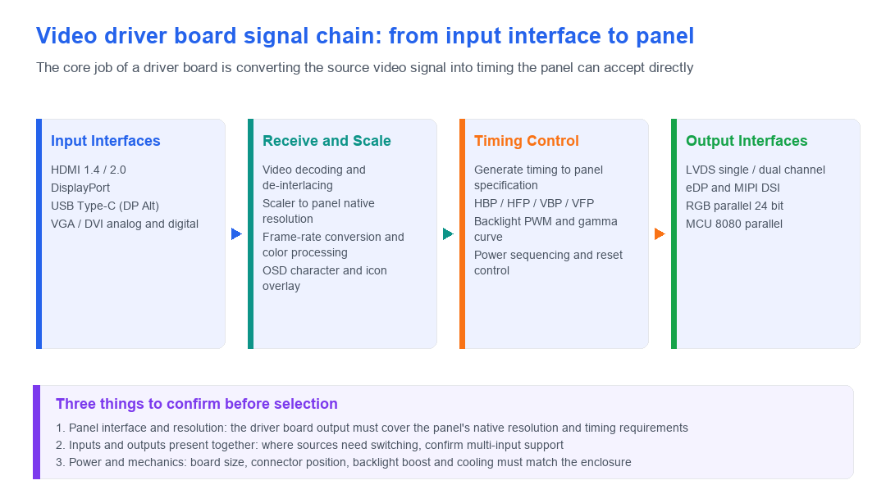

# Video Driver Board Display Solutions

!!! abstract "Quick answer"
    The core job of a video driver board comes down to one sentence: convert the video signal output by the source into the interface and timing the target panel can accept directly. It solves the "signals do not match" problem — computers, mainboards, and cameras output HDMI or DisplayPort, while the panel needs LVDS, eDP, MIPI DSI, or RGB parallel. When selecting one, focus on three things: the panel interface and native resolution, whether the required inputs and outputs exist at the same time, and whether power and mechanical design match.

## Key Takeaways

- A driver board handles interface and timing conversion, not the image content itself; resolution, frame rate, and color depth must all fit within the link bandwidth.
- Four common form factors: HDMI / VGA input boards, DisplayPort input boards, USB Type-C input boards, and display-interface-to-display-interface conversion boards.
- When the source resolution differs from the panel's native resolution, a Scaler is required to rescale the image; otherwise the picture is stretched or letterboxed.
- Select in order: confirm the panel interface and native resolution first, then check input interface types and whether multi-input switching is needed, and finally settle power supply and mechanical fit.

## 1. What a Video Driver Board Does

Video driver boards play a signal-bridging role in all kinds of display devices and embedded systems, converting video signals in different formats into formats the display can recognize. A typical board contains several stages: signal receive, decode, scaling, timing generation, and backlight control.

<figure markdown="span" class="displaywiki-figure">
  [{ width="760" loading="lazy" }](video-driver-board-signal-chain-en.png){ .displaywiki-image-link title="Open full-size image" }
  <figcaption>From input interface to panel: the complete signal chain of receive, scaling, timing control, and output interfaces</figcaption>
</figure>

## 2. Four Common Driver Board Types

### 2.1 HDMI / VGA to LVDS / MIPI / RGB Parallel / eDP Driver Board

- **Function**: Converts HDMI or VGA signals into LVDS, MIPI, RGB parallel, or eDP signals, for driving LCD panels with the corresponding interfaces.
- **Applications**: Widely used in computers, all-in-one machines, and display terminals.

### 2.2 DisplayPort to LVDS / MIPI / RGB Parallel / eDP Driver Board

- **Function**: Converts DisplayPort signals into LVDS, MIPI, RGB parallel, or eDP signals, suitable for high-resolution displays.
- **Applications**: Mainly used in devices that require high-bandwidth video transmission, such as high-end monitors and industrial display systems.

### 2.3 USB / Type-C to LVDS / MIPI / RGB Parallel / eDP Driver Board

- **Function**: Converts USB Type-C (DP Alt Mode) signals into LVDS, MIPI, RGB parallel, or eDP signals, suitable for high-resolution displays, and can carry audio at the same time.
- **Applications**: Latest computers, notebooks, tablets, and mobile devices.

### 2.4 MCU / RGB Parallel / MIPI / LVDS / eDP Interface Conversion Board

- **Function**: Converts between different display interfaces (MCU, RGB parallel, MIPI, LVDS, eDP), so the same panel can be matched to the output of different mainboards.
- **Applications**: Retrofit projects that need to pair a standard mainboard with an existing panel.

## 3. Interface Quick Reference

| Interface | Wire count and form | Typical per-link bandwidth | Common uses |
|---|---|---|---|
| RGB parallel (MCU 8080 / 6800) | Data lines + control lines, relatively many | Low | Small panels, direct MCU drive |
| SPI | 4 wires and up | Low | Small panels, low-speed refresh |
| LVDS | Differential pairs, single / dual channel | Medium | Industrial panels, notebook panels |
| MIPI DSI | Differential lanes, 1–4 lanes | High | Phones, tablets, high-PPI panels |
| eDP | Differential lanes | High | Notebooks, all-in-one machines, high-resolution panels |
| HDMI / DisplayPort | Differential pairs | Very high | External video source input |

## 4. Selection Considerations

- **Do the interfaces match**: First confirm the panel's interface type, lane count, and native resolution, then choose the driver board's output specification.
- **Resolution and bandwidth**: When the source resolution is higher than the panel's, a Scaler is required; when it is lower, the image is stretched — confirm this is acceptable.
- **Multi-input needed**: When switching between several signal sources, confirm the driver board supports multiple inputs and switching control.
- **Touch and audio**: A touch screen needs a USB or serial return channel; for scenarios with speakers, confirm whether audio can travel together with the video.
- **Power and thermal**: Confirm the board's supply voltage range, system power draw, and cooling conditions; high-brightness panels also need a backlight boost circuit.
- **Mechanical dimensions**: The board outline, connector positions, and mounting holes must fit into the enclosure.

## 5. Frequently Asked Questions

??? question "Q1: How does a video driver board differ from a plain adapter cable?"
    An adapter cable only makes a physical connection and requires both ends to have identical electrical specifications; a driver board contains receive, decode, and scaling stages, and can actively convert one interface and timing into another. Therefore, when the source and panel interfaces differ, or the resolutions do not match, a driver board is required instead of a cable.

??? question "Q2: How high a resolution can HDMI to LVDS support?"
    It depends on the specific solution. Single-channel LVDS usually corresponds to lower resolutions; higher resolutions need dual-channel LVDS and a higher pixel clock, and the driver chip's decoding capability and cable quality also matter. When selecting, use the maximum resolution stated in the driver board datasheet and leave some margin.

??? question "Q3: Why is a Scaler needed?"
    Because the source output resolution often differs from the panel's native resolution. Without a Scaler, the image is either cropped beyond the display area or leaves black borders on the screen. The Scaler rescales the image to the panel's native resolution and is the key stage that guarantees a full-screen, undistorted picture.

??? question "Q4: Can a driver board send touch data back to the host at the same time?"
    Yes, but you need to confirm that the driver board provides a touch return channel. The common approach is for the touch controller to send coordinates back to the host through USB or a serial port, where the host recognizes it as a standard touch or pointing device. If the driver board only handles video, touch needs a separate interface.

??? question "Q5: Which should I choose, MIPI DSI or LVDS?"
    Both are differential serial interfaces. MIPI DSI uses fewer pins and offers higher bandwidth per unit, suiting high-PPI and small-size high-resolution panels; LVDS is mature in industrial and notebook panels with a well-established ecosystem, and has more design cases for long cables and interference immunity. In practice the panel's native interface usually decides, and the driver board just needs to match it.

??? question "Q6: What should I watch out for in driver board power and thermal design?"
    For power, confirm the input voltage range and peak current; the backlight boost circuit is usually the largest power consumer and must match the panel's backlight specification. For thermal, evaluate the temperature rise of the driver chip and power devices, leave heat-dissipation paths in sealed enclosures, and prefer wide-temperature-grade components in high-temperature environments.

## Related reading

- [Custom and Sunlight-Readable Display Solutions](custom-sunlight-readable-displays.md)
- [High-Reliability Display Solutions](high-reliability-displays.md)
- [UART Smart Display Solutions](uart-smart-display.md)

!!! info "Can't find what you need?"
    If you need more products, resources or support, please contact our team:

    [**:material-archive-arrow-down: Knowledge Base**](../../knowledge/tags.md){ .md-button .md-button--primary }
    [**:material-magnify: Products & Solutions**](https://viewedisplay.com/){ .md-button }
    [**:material-email: Contact Support**](mailto:support@viewedisplay.com){ .md-button }
