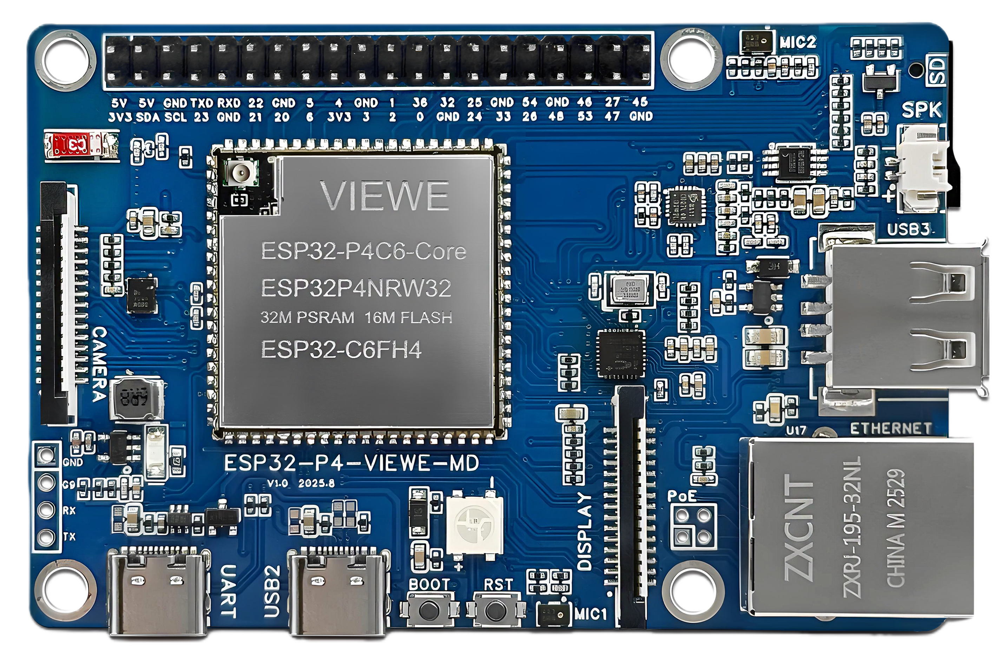
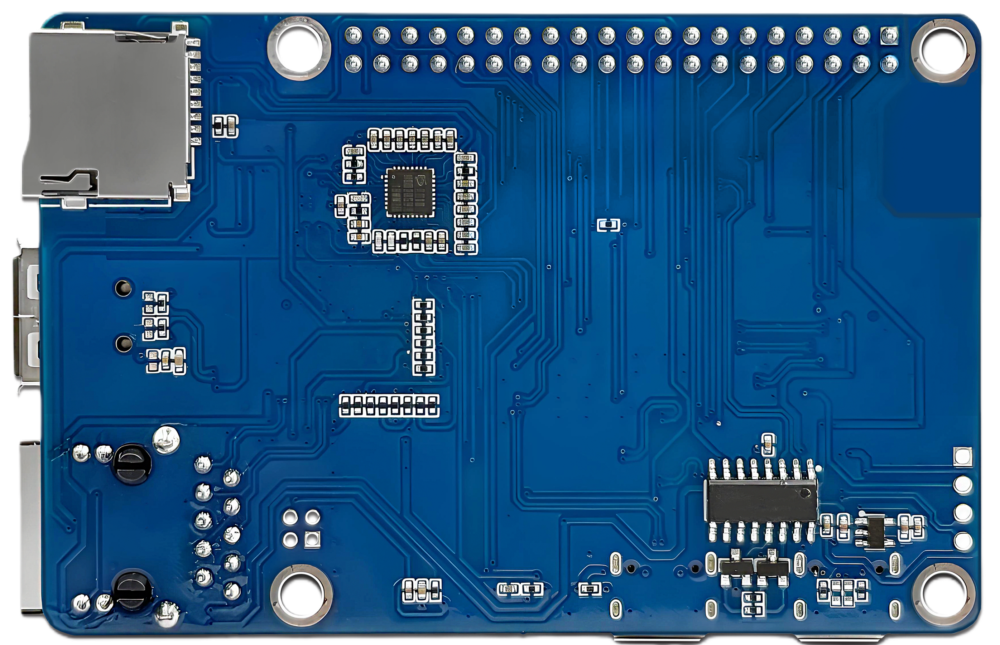

# ESP32-P4-Pi-VIEWE Dev Board

<div class="grid cards" markdown>

-   **ESP32-P4-Pi-VIEWE**
    ---
    development board is designed based on the VIEWE [ESP32-P4-Core](../esp32-p4-core/) module, which integrates **ESP32-P4** and **ESP32-C6** dual chips and supports Wi-Fi 6 and Bluetooth 5 wireless connections with **“Raspberry Pi” form factor**. 

    [:material-arrow-left: Back to Series](../embedded/index.md){ .md-button }
    [:material-cart: Official Store](https://viewedisplay.com/product/esp32-p4-pi-dev-board-wifi6/){ .md-button .md-button--primary }
    [:material-github: GitHub Repo](https://github.com/VIEWESMART/ESP32-P4-Pi){ .md-button }

</div>

<div align="center"> 
  
  
</div>


## 1. Introduction

The **ESP32-P4-Pi-VIEWE** development board is designed based on the VIEWE **ESP32-P4-Core** module, which integrates ESP32P4 and ESP32-C6 chips and supports Wi-Fi 6 and Bluetooth 5 wireless connections. It provides a variety of **Human-Machine Interface (HMI) interfaces**, including MIPI-CSI (integrated with Image Signal Processor ISP), MIPI-DSI, SPI, I2S, I2C, LED PWM, MCPWM, RMT, ADC, UART, and TWAI. In addition, it supports USB OTG 2.0 H5, reserves an **RJ45 Ethernet** interface, can be expanded with POE (Power over Ethernet) functionality, and is equipped with a 40-pin GPIO expansion interface. By adopting the industry-standard **“Raspberry Pi” form factor (85 x 56 mm)**, it offers a seamless upgrade path for developers looking to migrate from Linux-based systems to the more cost-effective and **real-time** capable ESP32-P4 ecosystem.

## 2. Functional Features

### 2.1 CPU

- **High-Performance System**: Equipped with a RISC-V 32-bit dual-core processor with DSP and instruction set extensions, floating-point arithmetic unit (FPU), and a main frequency of up to 400 MHz
- **Low-Power System**: Equipped with a RISC-V 32-bit single-core processor with a main frequency of up to 40 MHz
- **Wireless Coprocessor**: Equipped with an ESP32-C6 WIFI/BT coprocessor, expanding functions such as WIFI 6/Bluetooth 5 through SDIO

### 2.2 Memory

- **Read-Only Memory (ROM)**:
  - 128 KB of high-performance (HP) system ROM
  - 16 KB of low-power (LP) system ROM
- **RAM**:
  - 768 KB of high-performance (HP) L2 memory (L2MEM)
  - 32 KB of low-power (LP) SRAM
  - 8 KB of system tightly coupled memory (TCM)
- **External Memory**:
  - 32 MB PSRAM is stacked and sealed inside the package
  - 16MB Nor Flash is connected through the QSPI interface

### 2.3 Peripheral Interfaces

- **Multimedia Processing**:
  - Powerful image and voice processing capabilities
  - Dedicated interfaces including JPEG codec, Pixel Processing Accelerator (PPA), Image Signal Processor (ISP), and H.264 video encoder
- **On-Board Interfaces**:
  - MIPI-CSI, MIPI-DSI, USB 2.0 OTG, Ethernet
  - SDIO 3.0 SD card slot
  - Dual microphones and speaker terminals
  - RTC battery terminals
- **Expansion**:
  - 2×20 pin headers providing access to 28 remaining programmable GPIOs

## 3. Applications

With low power consumption, ESP32-P4 is an ideal choice for IoT devices in the following areas:

- Smart Home
- Industrial Automation
- Health Care
- Consumer Electronics
- Smart Agriculture
- Retail Self-Service Terminals (POS, Vending Machines)
- Service Robot
- Multimedia Player
- Cameras for Video Streaming
- High-Speed USB Host and Device
- Smart Voice Interaction Terminal
- Edge Vision AI Processor
- HMI Control Panel

## 4. Hardware Description

### 4.1 Module Introduction


| Component | Description |
|-----------|-------------|
| **01. ESP32-P4-Module** | ESP32-P4-Core Built-in ESP32-P4NRW32, ESP32-C6, 16MB Nor Flash, WIFI 6/Bluetooth 5 |
| **02. RGB LED** | RGB status indicator |
| **03. Ethernet port chip** | Ethernet controller |
| **04. ES8311** | Audio codec chip |
| **05. MIC1** | First microphone input |
| **06. Speaker interface** | MX1.25 2P connector, supporting 8Ω2W speaker |
| **07. Type-A interface** | USB OTG 2.0 High Speed interface |
| **08. 100 Mbps RJ45 Ethernet port** | Standard Ethernet connection |
| **09. PoE Module interface** | Supports external PoE module connection for PoE power supply |
| **10. Display interface** | MIPI-2lane display interface |
| **11. MIC2** | Second microphone input |
| **12. Button** | Boot button (press when powering on/resetting to enter download mode) and Reset button |
| **13. Type-C interface** | Can be used for power supply and program burning |
| **14. Type-C UART interface** | Can be used for power supply, program burning, and debugging |
| **15. CH340C** | USB to UART bridge |
| **16. ES7210** | Quad-channel digital microphone interface chip |
| **17. TF card slot** | SDIO 3.0 interface protocol |
| **18. ESP32-C6 UART interface** | UART connection to ESP32-C6 |
| **19. Power indicator light** | Power status indicator |
| **20. Camera interface** | MIPI 2-lane camera interface |
| **21. 6-axis attitude sensor** | 3-axis accelerometer and 3-axis gyroscope sensor |
| **22. ESP32-C6 SMD ANT** | SDIO interface protocol, expanding Wi-Fi 6 and Bluetooth 5 |
| **23. 40PIN Pin header** | GPIO expansion header |

### 4.2 GPIO Definition


## 5. Functional Block Diagram

The main components and connection methods of the ESP32-P4-Pi-VIEWE-Board are shown in the following figure:


## 6. Instructions for Use

This tutorial aims to guide users to set up the software environment for ESP32-P4 hardware development, and demonstrates how to use the ESP-IDF configuration menu, compile, and download firmware to the ESP32-P4 development board through simple examples.

### Preparation

#### Hardware
- ESP32-P4-Pi-VIEWE Development Board
- USB data cable (Type-A to Type-C, prepared as needed)
- Computer (Windows, Linux or macOS)

#### Software
!!! tip
    It is recommended to install ESP-IDF using an integrated development environment. If you are familiar with ESP-IDF, you can start directly from the ESP-IDF terminal. You can choose any of the following development methods:

    - **VSCode + ESP-IDF plugin** (recommended)
    - **Eclipse + ESP-IDF plugin** (Espressif-IDE)
    - **Arduino IDE**

## 7. Software

We provide comprehensive support for **Arduino**, **PlatformIO**, and **ESP-IDF** frameworks, with pre-ported **LVGL** examples.

### 7.1 Software Examples

Examples are available in the [GitHub Repository](examples).

| Framework | Example Path | Description |
|-----------|--------------|-------------|
| **Arduino** | `examples/arduino/gui/lvgl_v8` | **LVGL Benchmark**: Usage example of lvgl v8. It can also be directly opened in the Arduino IDE. |
| **ESP-IDF** | `examples/esp_idf/lvgl_v9_port` | **lvgl port**: Example of porting and using lvgl in esp-idf |
| **PlatformIO** | `examples/platformio/lvgl_v8_port` | **lvgl v8 port**: Usage example of lvgl v8. |

!!! note "Framework Support Status"
    - **Arduino**: Not supported temporarily, but we will provide corresponding steps and launch the update as soon as possible.
    - **PlatformIO**: Not supported temporarily, but we will provide corresponding steps and launch the update as soon as possible.

### 7.2 Getting Started

#### 7.2.1 Preparation

- **Hardware**: ESP32-P4-PI Board, USB-C Cable
- **Software**: 
  - VS Code (ESP-IDF v5.5+) 
  - Arduino IDE (v2.0+) 
  - VS Code (PlatformIO)
- **Libraries** (needed for Arduino IDE and PlatformIO):

| Library | Version | Description |
|---------|---------|-------------|
| `ESP32_Display_Panel` | `1.0.3+` | by Espressif, This is necessary to drive the screen |
| `ESP32_IO_Expander` | `Arduino automatic selection` | Dependency library of `ESP32_Display_Panel` |
| `esp-lib-utils` | `Arduino automatic selection` | Dependency library of `ESP32_Display_Panel` |
| `lvgl` | `8.4.0` | A free and open-source embedded graphics library |

#### 7.2.2 ESP-IDF Setup

1. **Open platformio example**
   - Go to GitHub to download the program. You can download the main branch by clicking on the "<> Code" with green text
   - Open the example using VS Code(ESP-IDF)

2. **Compile and upload**:
   - Click `build` in the upper right corner to compile
   - Connect the microcontroller to the computer. If the compilation is correct
   - Click `upload` in the upper right corner to download

#### 7.2.3 Arduino Setup ([Novice tutorial](https://github.com/VIEWESMART/VIEWE-Tutorial/blob/main/Arduino%20Tutorial/Arduino%20Getting%20Started%20Tutorial.md))

1. **Install [Arduino](https://www.arduino.cc/en/software)**
   - Choose installation based on your system type
   - Newcomers please refer to the [beginner's tutorial](https://github.com/VIEWESMART/VIEWE-Tutorial/blob/main/Arduino%20Tutorial/Arduino%20Getting%20Started%20Tutorial.md)

2. **Install ESP32 Board Package**:
   - Open Arduino IDE
   - Go to `File` > `Preferences`
   - Add to `Additional boards manager URLs`:
     ```
     https://espressif.github.io/arduino-esp32/package_esp32_index.json
     ```
   - Go to `Tools > Board > Boards Manager`
   - Search `esp32` by Espressif and install version **3.0.0+**

3. **Install Libraries**:
   - Go to `Sketch > Include Library > Library Manager`
   - Search `ESP32_Display_Panel` by Espressif and install version **1.0.4+**. You will be prompted whether to install its dependencies, please click **INSTALL ALL** to install all
   - Install `lvgl` (v8.4.0 recommended)

4. **Open example**:
   - Navigate to `File` > `Examples` > `ESP32_Display_Panel`
   - Select `Arduino` > `gui` > `lvgl_v8` > `simple_port`

5. **Select Board**:
   - Target: `ESP32P4 Dev Module`
   - Settings:
     - **Flash Size**: 32MB
     - **Partition Scheme**: 32M Flash
     - **PSRAM**: **OPI PSRAM** (Crucial!)

6. **Config ESP supported panel board**:
   - Open the `esp_panel_board_supported_conf.h` file in the example
   - Enable this file: change the `ESP_PANEL_BOARD_DEFAULT_USE_SUPPORTED` macro definition to `1`
   - Ensure you uncomment: `#define BOARD_VIEWE_ESP32_P4_PI`
     ```c
     ...
     /**
      * @brief Flag to enable supported board configuration (0/1)
      *
      * Set to `1` to enable supported board configuration, `0` to disable
      */
     #define ESP_PANEL_BOARD_DEFAULT_USE_SUPPORTED       (1)
     ...
     // #define BOARD_VIEWE_SMARTRING
     // #define BOARD_VIEWE_UEDX24240013_MD50E
     // #define BOARD_VIEWE_UEDX24320024E_WB_A
     // #define BOARD_VIEWE_UEDX24320028E_WB_A
     // #define BOARD_VIEWE_UEDX24320035E_WB_A
     // #define BOARD_VIEWE_UEDX32480035E_WB_A
     // #define BOARD_VIEWE_UEDX46460015_MD50ET
     // #define BOARD_VIEWE_UEDX48270043E_WB_A
     // #define BOARD_VIEWE_UEDX48480021_MD80E_V2
     // #define BOARD_VIEWE_UEDX48480021_MD80E
     // #define BOARD_VIEWE_UEDX48480021_MD80ET
     // #define BOARD_VIEWE_UEDX48480028_MD80ET
     // #define BOARD_VIEWE_UEDX48480040E_WB_A
     // #define BOARD_VIEWE_UEDX80480043E_WB_A
     // #define BOARD_VIEWE_UEDX80480050E_AC_A
     // #define BOARD_VIEWE_UEDX80480050E_WB_A
     // #define BOARD_VIEWE_UEDX80480050E_WB_A_2
     // #define BOARD_VIEWE_UEDX80480070E_WB_A
     #define BOARD_VIEWE_ESP32_P4_PI
     ...
     ```

7. **Configure the example**:
   - [Optional] Edit the macro definitions in the `lvgl_v8_port.h` file
     - **If using `RGB/MIPI-DSI` interface**, change the `LVGL_PORT_AVOID_TEARING_MODE` macro definition to `1`/`2`/`3` to enable the avoid tearing function. After that, change the `LVGL_PORT_ROTATION_DEGREE` macro definition to the target rotation degree
     - **If using other interfaces**, please don't modify the `LVGL_PORT_AVOID_TEARING_MODE` and `LVGL_PORT_ROTATION_DEGREE` macro definitions
   - [Optional] Edit the macro definitions in the `lv_conf.h` file
     - **If using `SPI/QSPI` interface**, change the `LV_COLOR_16_SWAP` macro definition to `1`

8. **Select the correct port**:
   - Connect to the device
   - Go to `Tools > Port`, Select the corresponding port

9. **Compile and upload**:
   - Click `√` in the upper right corner to compile
   - Connect the microcontroller to the computer. If the compilation is correct
   - Click `→` in the upper right corner to download

!!! tip "Configuration Tips"
    - In `esp_panel_board_supported_conf.h`, ensure you uncomment: `#define BOARD_VIEWE_ESP32_P4_PI`
    - Do not enable both `ESP_PANEL_BOARD_DEFAULT_USE_SUPPORTED` and `ESP_PANEL_BOARD_DEFAULT_USE_CUSTOM`
    - You cannot enable multiple esp supported panel boards at the same time

#### 7.2.4 PlatformIO Setup

1. **Open platformio example**
   - Go to GitHub to download the program. You can download the main branch by clicking on the "<> Code" with green text
   - Open the example using VS Code(PlatformIO)

2. **Configure PlatformIO**:
   - This example uses the `BOARD_ESPRESSIF_ESP32_S3_LCD_EV_BOARD_2_V1_5` board as default. Choose `BOARD_VIEWE_UEDX24320024E_WB_A` in the `[platformio]:default_envs` of the `platformio.ini` file

3. **Configure the example**:
   - [Optional] Edit the macro definitions in the `lvgl_v8_port.h` file
     - **If using `RGB/MIPI-DSI` interface**, change the `LVGL_PORT_AVOID_TEARING_MODE` macro definition to `1`/`2`/`3` to enable the avoid tearing function. After that, change the `LVGL_PORT_ROTATION_DEGREE` macro definition to the target rotation degree
     - **If using other interfaces**, please don't modify the `LVGL_PORT_AVOID_TEARING_MODE` and `LVGL_PORT_ROTATION_DEGREE` macro definitions

4. **Compile and upload the project**
   - Click the `√` (Compile) button
   - Connect the board to your computer. If the compilation is correct
   - Click the `→` (upload) button

## 8. Related Documents

<!-- | Document | Link |
|----------|------|
| **Camera Specification** | [peripheral/camera_datasheet.pdf](peripheral/camera_datasheet.pdf) |
| **Display Specification** | [Display Specification]() |
| **ESP32-P4 Datasheet (Chinese)** | [Datasheet/P4-Core%20Datasheet/esp32-p4-chip-revision-v1.3_datasheet_cn.pdf](Datasheet/P4-Core%20Datasheet/esp32-p4-chip-revision-v1.3_datasheet_cn.pdf) |
| **ESP32-P4 Datasheet (English)** | [Datasheet/P4-Core%20Datasheet/esp32-p4-chip-revision-v1.3_datasheet_en.pdf](Datasheet/P4-Core%20Datasheet/esp32-p4-chip-revision-v1.3_datasheet_en.pdf) |
| **ESP32-C6 Datasheet (Chinese)** | [Datasheet/P4-Core%20Datasheet/esp32-c6_datasheet_cn.pdf](Datasheet/P4-Core%20Datasheet/esp32-c6_datasheet_cn.pdf) |
| **ESP32-C6 Datasheet (English)** | [Datasheet/P4-Core%20Datasheet/esp32-c6_datasheet_en.pdf](Datasheet/P4-Core%20Datasheet/esp32-c6_datasheet_en.pdf) |
| **ESP32-P4 Technical Reference Manual (Chinese)** | [Datasheet/P4-Core%20Datasheet/Esp32-p4_technical_reference_manual_cn.pdf](Datasheet/P4-Core%20Datasheet/Esp32-p4_technical_reference_manual_cn.pdf) |
| **ESP32-P4 Technical Reference Manual (English)** | [Datasheet/P4-Core%20Datasheet/Esp32-p4_technical_reference_manual_en.pdf](Datasheet/P4-Core%20Datasheet/Esp32-p4_technical_reference_manual_en.pdf) |
| **ESP32-P4-Pi Datasheet** | [Datasheet/ESP32-P4-Pi-VIEWE_SPEC_V1.1.pdf](Datasheet/ESP32-P4-Pi-VIEWE_SPEC_V1.1.pdf) |
| **ESP32-P4-Pi Schematic** | [Schematic/SCH_ESP32-ESP32-P4-Pi-VIEWE-V1.1_2025-10-23.pdf](Schematic/SCH_ESP32-ESP32-P4-Pi-VIEWE-V1.1_2025-10-23.pdf) |
| **ESP32-P4-Core Schematic Diagram** | [Schematic/SCH_ESP32-P4-Core_2025-11-24.pdf](Schematic/SCH_ESP32-P4-Core_2025-11-24.pdf) |
| **ESP32-P4-Core Datasheet** | [Datasheet/P4-Core%20Datasheet/ESP32-P4-Core-VIEWE_SPEC_V1.0.pdf](Datasheet/P4-Core%20Datasheet/ESP32-P4-Core-VIEWE_SPEC_V1.0.pdf) |
| **IMU** | [Datasheet/peripheral/QMI8658A.pdf](Datasheet/peripheral/QMI8658A.pdf) | -->

### 📄 Product Documents
| Document Title | Type | Description |
| :--- | :--- | :--- |
| **[Product Datasheet](../../../assets/datasheet/ESP32-P4-Pi-VIEWE.pdf)** | PDF | Product Specification  |
| **[Schematic Diagram](../../../assets/schematic/SCH-ESP32-ESP32-P4-Pi-VIEWE-V1.1.pdf)** | PDF | Circuit Design & PCB Connections |
| **[Display Driver IC](../../../assets/datasheet/display/EK79007AD3_DS_REV1.0(1).pdf)** | PDF | EK79007AD3 Driver Manual |
| **[Camera Specification](../../../assets/datasheet/peripheral/camera_datasheet.pdf)** | PDF | MIPI-CSI Camera Module Spec |


### 🧠 Chip Datasheets
| Chip | Document | Language |
| :--- | :--- | :--- |
| **ESP32-P4** | [Datasheet](../../../assets/datasheet/chip/esp32-p4_datasheet_en.pdf) | English |
| **ESP32-P4**| [Datasheet](../../../assets/datasheet/chip/esp32-p4_datasheet_cn.pdf) | Chinese |
| **ESP32-P4**| [Tech Reference Manual](../../../assets/datasheet/chip/Esp32-p4_technical_reference_manual_en.pdf) | English |
| **ESP32-P4**| [Tech Reference Manual](../../../assets/datasheet/chip/Esp32-p4_technical_reference_manual_cn.pdf) | Chinese |
| **ESP32-C6** | [Datasheet](../../../assets/datasheet/chip/esp32-c6-wroom-1_wroom-1u_datasheet_en.pdf) | English |
| **ESP32-C6** | [Datasheet](../../../assets/datasheet/chip/esp32-c6-wroom-1_wroom-1u_datasheet_cn.pdf) | Chinese |

<!-- ## :material-face-agent: Technical Support

<div class="grid cards" markdown>

-   [**:material-github: GitHub Issues**](https://github.com/VIEWESMART/ESP32-P4-Pi/issues)
    ---
    Report bugs or request new features. Track development progress.

@ -343,18 +210,4 @@ Examples are available in the [GitHub Repository](examples).
    ---
    For direct technical support and business inquiries.

-   [**:material-magnify: More Products**](../esp32/index.md)
    ---
    Explore more relative products.    


</div> -->

<!-- --- -->
## 9. More Resource

!!! info "Can't find what you need?"    
    If you need more Support or Products or Resource, please contact our team: 

    [**:material-magnify: Resource Center**](../../support/resource.md){ .md-button .md-button--primary } 
    [**:material-magnify: More Products**](../embedded/index.md){ .md-button  }
    [**:material-email: Contact Support**](mailto:support@viewedisplay.com){ .md-button .md-button--primary }