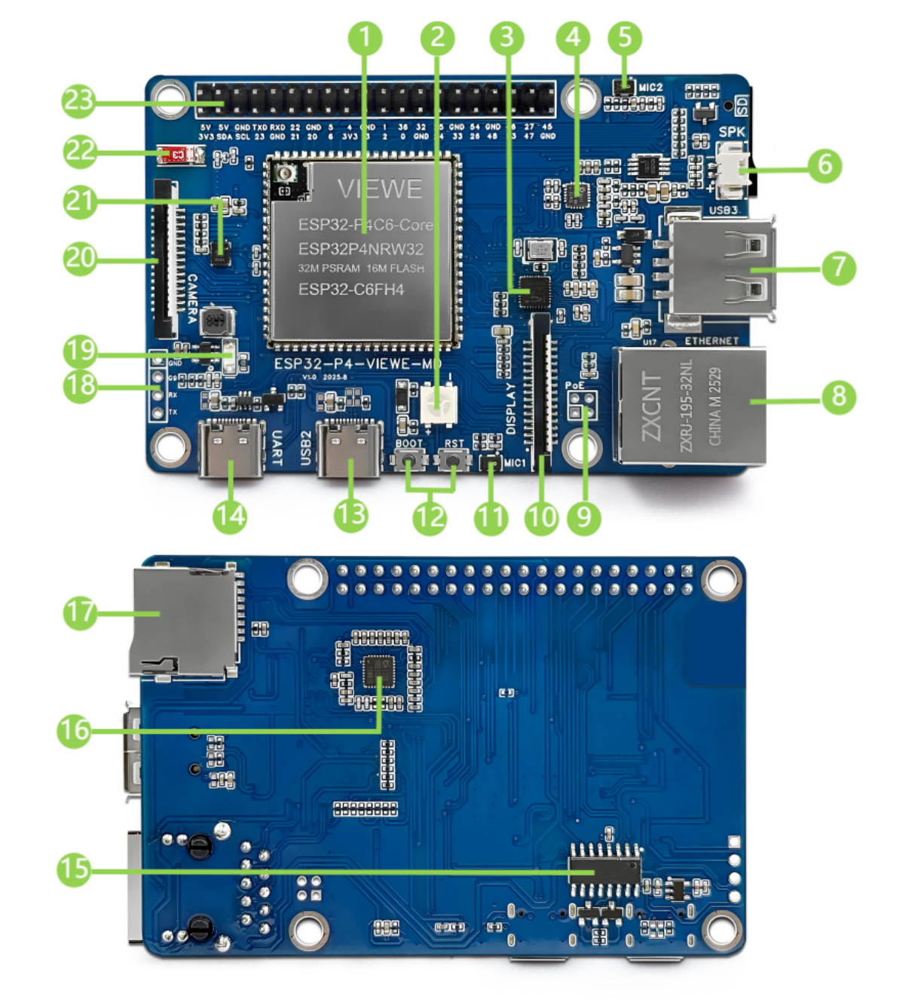
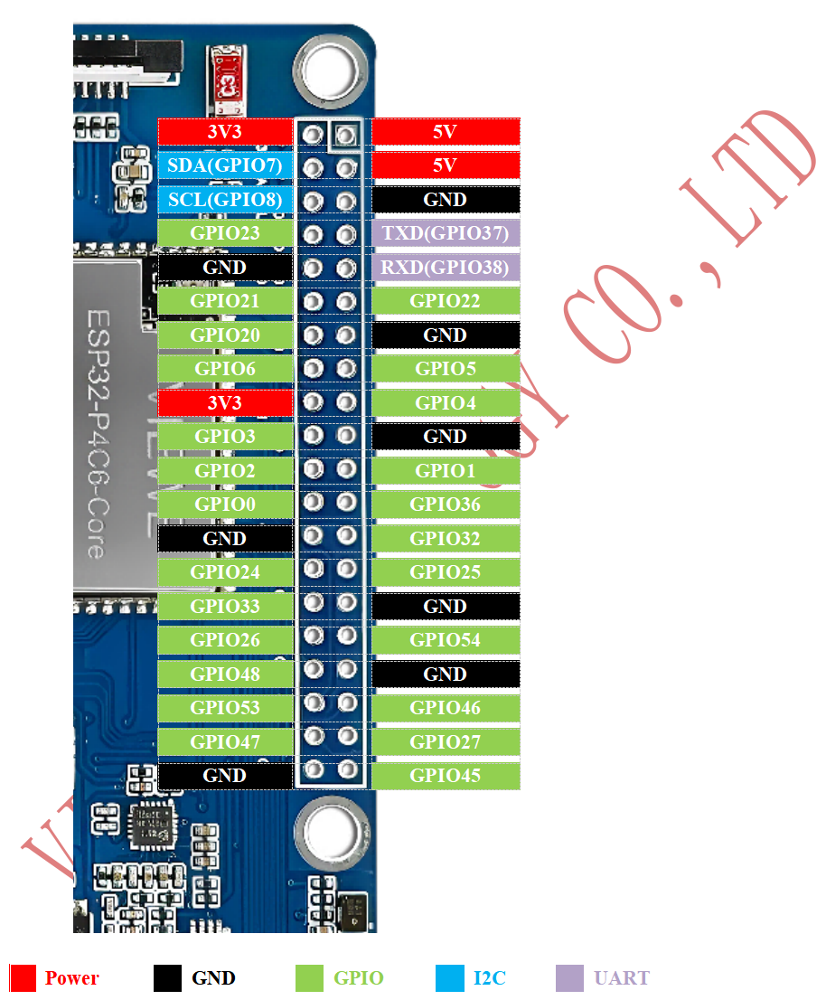
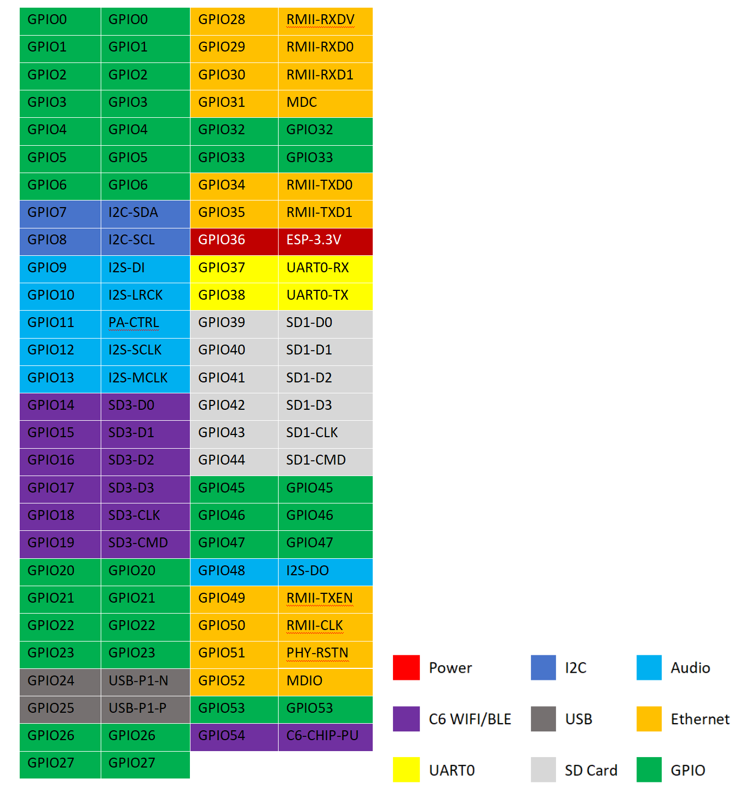
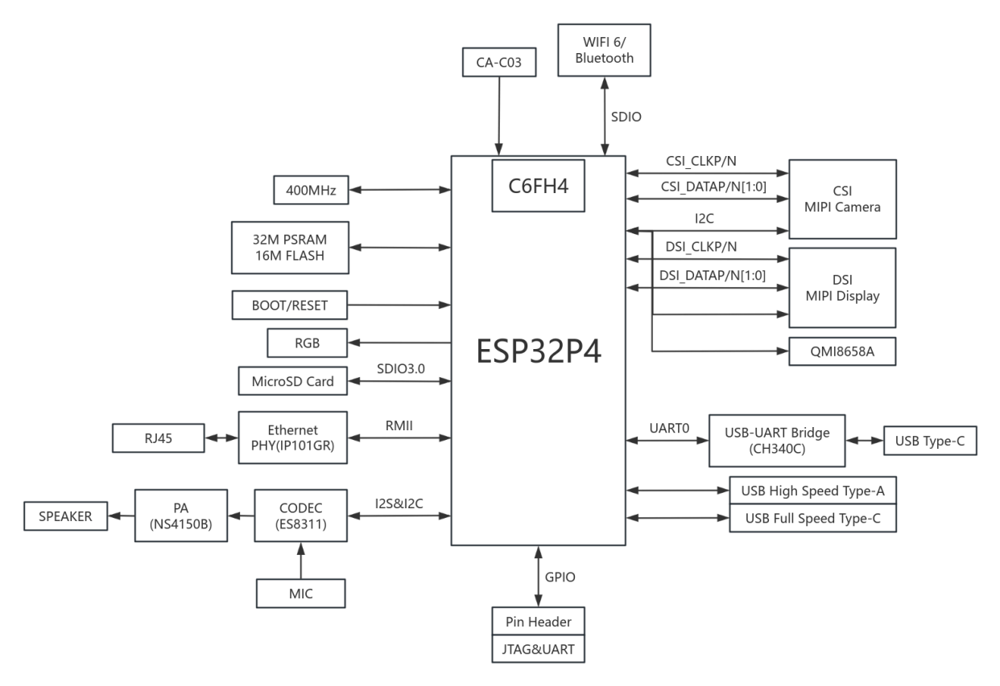

# ESP32-P4-Pi Development Kit


<div class="grid cards" markdown>

-   **ESP32-P4-Pi**
    ---
    Flagship development boards and smart screens based on **VIEWE ESP32-P4-Core**, equipped with a 7-inch **1024x600** DSI display, supporting Wi-Fi 6, H.264 hardware encoding, and a wealth of industrial interfaces.

    [:material-arrow-left: Back to Series](../esp32/){ .md-button }
    [:material-cart: Official Store](https://viewedisplay.com/product/7-inch-1024x600-esp32-p4-wifi6-touch-smart-hmi-uart-display/){ .md-button .md-button--primary }
    [:material-github: GitHub Repo](https://github.com/VIEWESMART/ESP32-P4-Pi/tree/main){ .md-button }

</div>

<div align="center"> 
  
  
</div>

---

## 1. Introduction

The **ESP32-P4-Pi-VIEWE** development board is designed based on the **VIEWE ESP32-P4-Core** module, which integrates the ESP32-P4 and ESP32-C6 chips and supports Wi-Fi 6 and Bluetooth 5 wireless connectivity.
The development board provides a variety of human-machine interface (HMI) interfaces, including MIPI-CSI (with integrated image signal processor ISP), MIPI-DSI, SPI, I2S, I2C, LED PWM, MCPWM, RMT, ADC, UART, and TWAI. It supports USB OTG 2.0 H5, reserves an RJ45 Ethernet interface (with extensible POE Power over Ethernet function), and is equipped with a 40-pin GPIO expansion interface.

### 1.1 Product Features
* **Processor**:
    * **VIEWE ESP32-P4-Core**: This module is equipped with the ESP32-P4 chip, which provides a high-performance RISC-V dual-core processor running at 400MHz and a low-power core operating at 40MHz, together with the ESP32-C6 chip serving as a Wi-Fi 6/BLE 5.0 coprocessor (connected via SDIO).
* **Memory**:
    * 32MB PSRAM (Stacked)，16MB NOR Flash。
* **Multimedia**:
    * **Display**: 7-inch IPS (1024x600), MIPI-DSI (2-Lane) 15-pin interface.
    * **Camera**: MIPI-CSI interface (supports 1080P @ 30fps input).
    * **Video**: Hardware H.264 encoding / JPEG decoding.
    * **Separate audio solution**: The ES7210 is dedicated to 4-channel microphone ADC (acquisition), and the ES8311 is a mono CODEC (playback + auxiliary acquisition). It communicates with the main controller via I2S/I2C and supports AEC (acoustic echo cancellation) and far-field voice wake-up.
* **Peripheral Interfaces**:
    * **Connections**: USB 2.0 OTG (Type-A), UART/USB (Type-C).
    * **Storage**: microSD card slot (SDIO 3.0 high-speed mode).
    * **Expansion**: 2x20 Pin headers (leading out GPIO, I2C, SPI, UART).
    * **Others**: WS2812B RGB LEDs, onboard USB-to-UART debug bridge, Ethernet (RJ45), dual microphones, speaker terminal, RTC battery terminal.

### 1.2 Applications
* Smart Home Control Panels
* Industrial HMI & Automation
* Edge AI Vision & Multimedia Players

---

## 2. Hardware Description

### 2.1 Module Overview
The detailed component layout is shown below:



| No. | Component | Description |
| :--- | :--- | :--- |
| **①** | **ESP32-P4-Core** | Main control chip module with built-in ESP32-C6 supporting Wi-Fi 6/Bluetooth 5 (integrated 16MB Flash and 32MB PSRAM). |
| **②** | **RGB LED** | WS2812B programmable LED. |
| **③** | **Ethernet Port Chip** | 100Mbps Ethernet-related chip. |
| **④** | **ES8311** | Audio codec chip. |
| **⑤** | **Microphone 1** | Digital microphone. |
| **⑥** | **Speaker Interface** | MX1.25 2P connector, supporting 8Ω 2W speakers. |
| **⑦** | **Type-A Port** | USB OTG 2.0 high-speed port. |
| **⑧** | **RJ45 Ethernet Port** | 100Mbps network port. |
| **⑨** | **PoE Module Interface** | Supports connection to an external PoE module for PoE power supply. |
| **⑩** | **DSI Display Interface** | MIPI 2-lane 15PIN interface. |
| **⑪** | **Microphone 2** | Digital microphone. |
| **⑫** | **Buttons** | Hold the boot button during power-on to enter download mode; the reset button restarts the device. |
| **⑬** | **Type-C Port** | Power supply and program burning. |
| **⑭** | **Type-C UART Port** | Power supply, program burning and debugging. |
| **⑮** | **CH340C** | USB to UART chip. |
| **⑯** | **ES7210** | Audio acquisition chip. |
| **⑰** | **TF Card Slot** | Pin header extension for ESP32-P4. |
| **⑱** | **ESP32-C6 UART Interface** | Pin header extension for ESP32-C6. |
| **⑲** | **Power Indicator** | 5V power indicator. |
| **⑳** | **CSI Camera Interface** | MIPI 2-lane CSI interface. |
| **㉑** | **6-Axis Motion Sensor** | QMI8658A (3-axis accelerometer + 3-axis gyroscope). |
| **㉒** | **ESP32-C6 Onboard Antenna** | SDIO interface extension for Wi-Fi 6 / Bluetooth 5. |
| **㉓** | **40PIN Header** | GPIO expansion interface. |


### 2.2 GPIO Definition (Pinout)
The complete pin mapping for the 2x20 pin header is as follows:



### 2.3 GPIO Function Details
Detailed function list for P4 and C6 GPIOs:




### 2.4 Mechanical Dimensions
Physical dimensions and mounting hole positions:


### 2.5 Functional Block Diagram 
The system architecture and connection between ESP32-P4 (Master) and ESP32-C6 (Slave):




---

## 3. Software Development

We provide a complete set of sample code based on **ESP-IDF**.

### 3.1 Quick Start

#### 3.1.1 Preparation

* **Hardware**: ESP32-P4-Pi development board, USB-C cable.

* **Software**: **ESP-IDF v5.5** or later (required).

#### 3.1.2 Compilation and Burning Steps

1. **Clone the code repository**
    ```bash
    git clone [https://github.com/VIEWESMART/ESP32-P4-Pi.git](https://github.com/VIEWESMART/ESP32-P4-Pi.git)
    ```

2. **Set the target chip**
    ```bash
    idf.py set-target esp32p4
    ```

3. **Wi-Fi Configuration (Important)**
    Since the P4 uses the C6 for Wi-Fi connectivity via SDIO, the following dependencies must be added:
    ```bash
    idf.py add-dependency "espressif/esp_wifi_remote"
    idf.py add-dependency "espressif/esp_hosted"
    ```

4. **Build & Flash**
    ```bash
    idf.py build flash monitor
    ```

### 3.2 Software Examples
There are **13 runnable examples** provided in the [`https://github.com/VIEWESMART/ESP32-P4-Pi/tree/main/examples/esp-idf`](https://github.com/VIEWESMART/ESP32-P4-Pi/tree/main/examples/esp-idf) directory.

| # | Example Name | Description | Key Tech / Features |
| :-: | :--- | :--- | :--- |
| **01** | [**HowToCreateProject**](https://github.com/VIEWESMART/ESP32-P4-SmartDisplay/tree/main/examples/esp-idf/01_HowToCreateProject) | **engineering template** | A Guide to Minimal CMake Setup. |
| **02** | [**HelloWorld**](https://github.com/VIEWESMART/ESP32-P4-SmartDisplay/tree/main/examples/esp-idf/02_HelloWorld) | **Sanity Check** | Basic UART log output. |
| **03** | [**attitude**](https://github.com/VIEWESMART/ESP32-P4-Pi/tree/main/examples/esp-idf/03-attitude) | **Attitude sensor** | Collect sensor data and print it |
| **04** | [**i2c_tools**](https://github.com/VIEWESMART/ESP32-P4-SmartDisplay/tree/main/examples/esp-idf/03_i2c_tools) | **Bus Scanner** | Detect Touch (GT911) & Audio addresses. |
| **05** | [**sdmmc**](https://github.com/VIEWESMART/ESP32-P4-SmartDisplay/tree/main/examples/esp-idf/06_sdmmc) | **SD Card** | Read/Write files using SDMMC Host. |
| **06** | [**wifistation**](https://github.com/VIEWESMART/ESP32-P4-SmartDisplay/tree/main/examples/esp-idf/07_wifistation) | **Wi-Fi 6** | Network via ESP32-C6 (SDIO). |
| **07** | [**audio_es7210**](https://github.com/VIEWESMART/ESP32-P4-Pi/tree/main/examples/esp-idf/07-audio_es7210)| **ES7210 Audio Acquisition** | Collect audio through a microphone and store it on an SD card (recording) |
| **08** | [**audio_es8311**](https://github.com/VIEWESMART/ESP32-P4-Pi/tree/main/examples/esp-idf/08-audio_es8311)| **ES8311 Audio Playback** | Drive the audio codec chip to play audio |
| **09** | [**ethernetbasic**](https://github.com/VIEWESMART/ESP32-P4-Pi/tree/main/examples/esp-idf/09_ethernetbasic)| **Ethernet** | Connect to the network by plugging in a network cable |
| **10** | [**color_panel_jd9165**](https://github.com/VIEWESMART/ESP32-P4-Pi/tree/main/examples/esp-idf/10_color_panel_jd9165) | **LCD test** | Simple RGB screen refresh test. |
| **11** | [**mipi_lcd_camera**](https://github.com/VIEWESMART/ESP32-P4-Pi/tree/main/examples/esp-idf/11_mipi_lcd_camera) | **Camera preview** | MIPI-CSI input -> MIPI-DSI output. |
| **12** | [**7inch_lvgl_demo_v9**](https://github.com/VIEWESMART/ESP32-P4-Pi/tree/main/examples/esp-idf/12_7inch_lvgl_demo_v9) | **Factory UI** | **LVGL 9** Benchmark and Touch Demonstration. |
| **13** | [**esp_brookesia_phone**](https://github.com/VIEWESMART/ESP32-P4-Pi/tree/main/examples/esp-idf/13_esp_brookesia_phone) | **Comprehensive demonstration** | Similar to mobile system examples. |

> [!TIP]
> **Arduino Support**: We are actively developing the Arduino BSP for P4. Stay tuned!
> **PlatformIO Support**: We are actively developing PlatformIO for P4. Stay tuned!

---

## 4. Related Documents & Resources

### 📄 Board Documents
| Document Title | Type | Description |
| :--- | :--- | :--- |
| **[ESP32-P4-Pi Datasheet](https://github.com/VIEWESMART/ESP32-P4-Pi/blob/main/Datasheet/ESP32-P4-Pi-VIEWE_SPEC_V1.1.pdf)** | PDF | Product Datasheet |
| **[Schematic Diagram](https://github.com/VIEWESMART/ESP32-P4-Pi/blob/main/Schematic/SCH_ESP32-ESP32-P4-Pi-VIEWE-V1.1_2025-10-23.pdf)** | PDF | Circuit Design Schematic |
| **[Display Datasheet](https://github.com/VIEWESMART/ESP32-P4-Pi/blob/main/Datasheet/display/ALL-UE070WS-RB30-A106A_SPEC_V1.0.pdf)** | PDF | 7.0" 1024x600 Display Datasheet |
| **[Display Driver Chip Manual](https://github.com/VIEWESMART/ESP32-P4-Pi/blob/main/Datasheet/display/JD9165BA_DS_V0.0.3-0418(1).pdf)** | PDF | EK79007AD3 Driver Manual |
| **[Camera Datasheet](../../../assets/datasheet/peripheral/camera_datasheet.pdf)** | PDF | MIPI-CSI Camera Module Specifications |

### 🧠 Chip Datasheets
| Chip | Document | Language |
| :--- | :--- | :--- |
| **ESP32-P4** | [Datasheet](../../../assets/datasheet/chip/esp32-p4_datasheet_en.pdf) | English |
| **ESP32-P4**| [Datasheet](../../../assets/datasheet/chip/esp32-p4_datasheet_cn.pdf) | Chinese |
| **ESP32-P4**| [Technical Reference Manual](../../../assets/datasheet/chip/Esp32-p4_technical_reference_manual_en.pdf) | English |
| **ESP32-P4**| [Technical Reference Manual](../../../assets/datasheet/chip/Esp32-p4_technical_reference_manual_cn.pdf) | Chinese |
| **ESP32-C6** | [Datasheet](../../../assets/datasheet/chip/esp32-c6-wroom-1_wroom-1u_datasheet_en.pdf) | English |
| **ESP32-C6** | [Datasheet](../../../assets/datasheet/chip/esp32-c6-wroom-1_wroom-1u_datasheet_cn.pdf) | Chinese |
| **ESP32-P4-Core** | [Datasheet](https://github.com/VIEWESMART/ESP32-P4-Pi/blob/main/Datasheet/P4-Core%20Datasheet/ESP32-P4-Core-VIEWE_SPEC_V1.0.pdf) | English |
| **ESP32-P4-Core** | [Schematic](https://github.com/VIEWESMART/ESP32-P4-Pi/blob/main/Schematic/SCH_ESP32-P4-Core_2025-11-24.pdf) | |

### 🛠️ Tools
* **[Flash Download Tool](../../../assets/software/flash_download_tool.zip)**: Utility for flashing firmware manually.

> [!IMPORTANT]
> For more resources, please explore the [**Resource Center**](../../support/resource.md).

---

## :material-face-agent: Technical Support

<div class="grid cards" markdown>

-   [**:material-github: GitHub Issues**](https://github.com/VIEWESMART/ESP32-P4-SmartDisplay/issues)
    ---
    Report bugs or request new features. Track development progress.

-   [**:material-email: Email Support**](mailto:smartrd1@viewedisplay.com)
    ---
    For direct technical support and business inquiries.

</div>