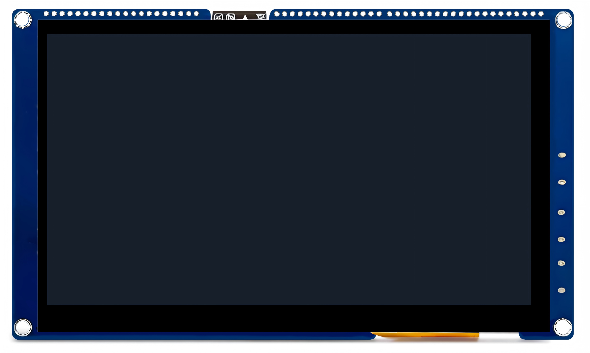
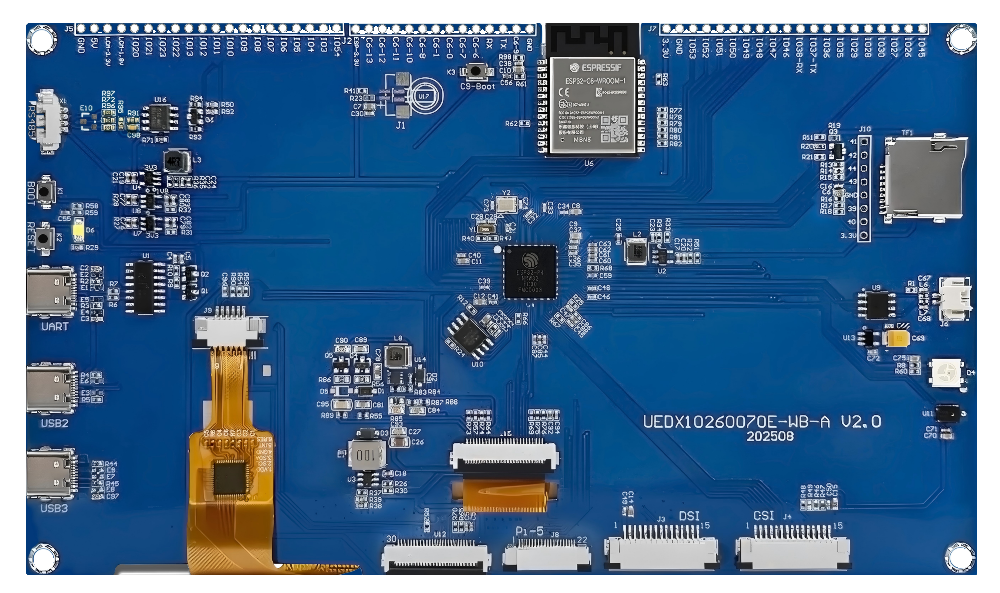
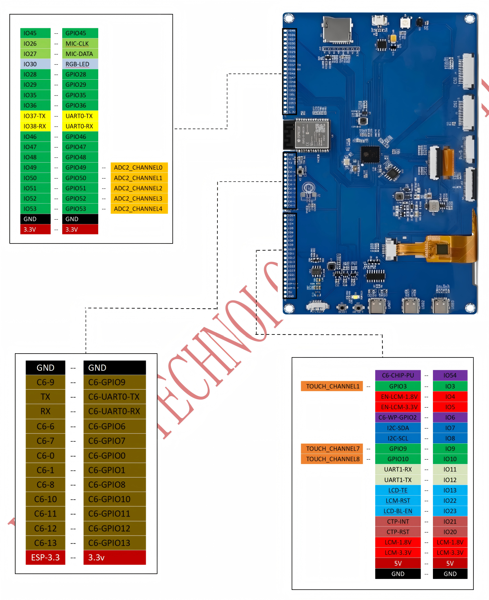
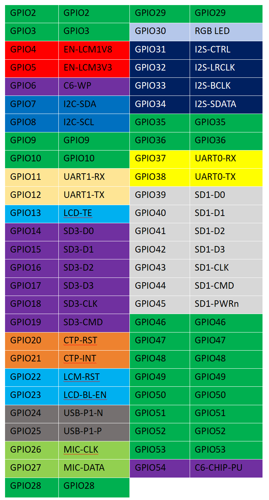
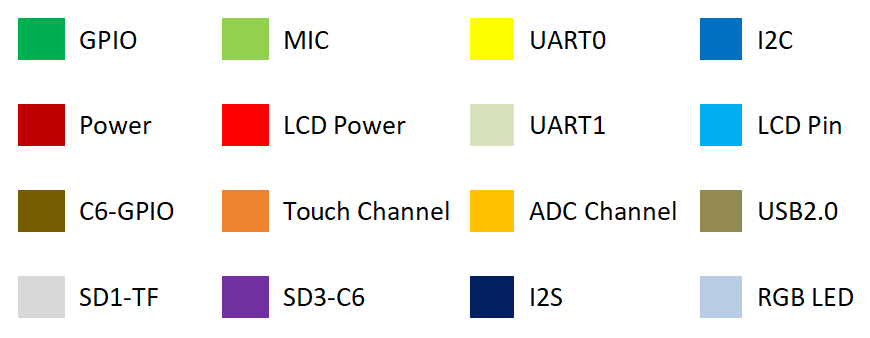
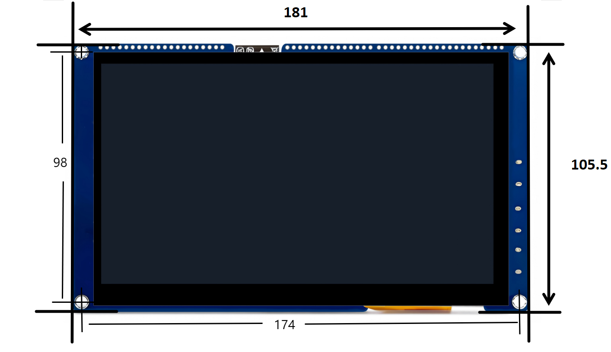
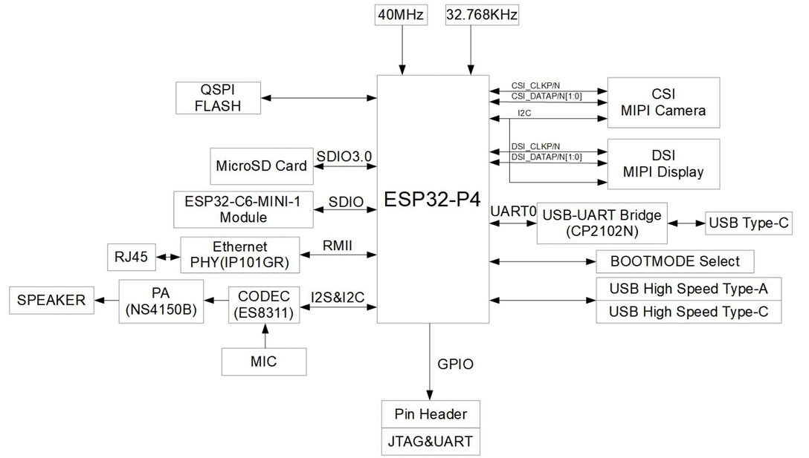

# 7" 1024x600 ESP32-P4 WiFi6 Touch Display


<div class="grid cards" markdown>

-   **UEP4S070H1024V600C-WBA**
    ---
    The **Ultimate Flagship** development board powered by **ESP32-P4** + **ESP32-C6**.
    Featuring a 7-inch **1024x600** IPS Display, Wi-Fi 6, H.264 Encoding, and rich industrial interfaces.

    [:material-arrow-left: Back to Series](../esp32/){ .md-button }
    [:material-cart: Official Store](https://viewedisplay.com/product/7-inch-1024x600-esp32-p4-wifi6-touch-smart-hmi-uart-display/){ .md-button .md-button--primary }
    [:material-github: GitHub Repo](https://github.com/VIEWESMART/ESP32-P4-SmartDisplay){ .md-button }

</div>

<div align="center"> 
  
  
</div>

---

## 1. Introduction

The **ESP32-P4-SmartDisplay** is a high-performance development board equipped with a 7-inch MIPI screen (1024x600). Designed by VIEWE, it combines the **ESP32-P4** (High-Performance MCU) with the **ESP32-C6** (Wi-Fi 6 + BT 5 Module).

This board integrates rich peripherals including USB OTG 2.0, MIPI-CSI Camera, H.264 Encoder, and Industrial Interfaces (RS485), making it an ideal platform for **HMI**, **Edge Computing**, and **Multimedia** applications.

### 1.1 Product Features
* **Processor**:
    * **ESP32-P4**: RISC-V Dual-Core HP @ 400MHz + LP Core @ 40MHz.
    * **ESP32-C6**: Wi-Fi 6 / BLE 5.0 Co-processor (via SDIO).
* **Memory**:
    * 32MB PSRAM (Stacked), 16MB NOR Flash.
* **Multimedia**:
    * **Display**: 7-inch IPS (1024x600) via MIPI-DSI (2-Lane).
    * **Camera**: MIPI-CSI Interface (Support 1080P @ 30fps).
    * **Video**: Hardware H.264 Encoding / JPEG Decoding.
    * **Audio**: Digital Mic (MSM2641D) + Speaker Amp (NS4168).
* **Peripherals**:
    * **Connectivity**: USB 2.0 OTG (Type-C), RS485 (Industrial Interface).
    * **Storage**: microSD Card Slot (SDIO 3.0 High Speed).
    * **Expansion**: 2x20 Pin Header (GPIOs, I2C, SPI, UART).
    * **Misc**: WS2812B RGB LED, Onboard USB-to-UART Bridge.

### 1.2 Applications
* Smart Home Control Panels
* Industrial HMI & Automation
* Edge AI Vision & Multimedia Players

---

## 2. Hardware Description

### 2.1 Module Overview
The detailed component layout is shown below:


| No. | Component | Description |
| :--- | :--- | :--- |
| **①** | **ESP32-P4NRW32** | Main SoC (Stacked 32MB PSRAM). |
| **②** | **ESP32-C6** | Wi-Fi 6 / Bluetooth 5 Co-processor (SDIO). |
| **③** | **Display Header** | MIPI-DSI 2-Lane (Compatible with VIEWE 4"/7"/10.1" Screens). |
| **④** | **15-Pin FPC** | Generic MIPI-DSI Interface. |
| **⑤** | **5B-MIPI** | Alternative Display Interface. |
| **⑥** | **Universal MIPI** | General Purpose MIPI Connector. |
| **⑦** | **Camera Interface** | MIPI-CSI 2-Lane (Supports 1080P Input). |
| **⑧** | **Touch Interface** | I2C Capacitive Touch Header (7-inch). |
| **⑨** | **USB Type-C** | **Power / UART / USB OTG 2.0**. |
| **⑩** | **RESET Button** | Hardware Reset. |
| **⑪** | **BOOT Button** | Press during power-on to enter Download Mode. |
| **⑫** | **RS485** | Industrial Serial Interface (Transceiver onboard). |
| **⑬** | **Mic** | Digital Microphone (MSM2641D). |
| **⑭** | **RGB LED** | WS2812B Addressable LED. |
| **⑮** | **Speaker** | Connector for External Speaker (NS4168 Amp). |
| **⑯** | **TF Card Slot** | SDIO 3.0 Interface. |
| **⑰** | **P4 GPIO** | Breakout header for ESP32-P4 pins. |
| **⑱** | **C6 GPIO** | Breakout header for ESP32-C6 pins. |
| **⑲** | **Power LED** | 5V Power Indicator. |

### 2.2 GPIO Definition (Pinout)
The complete pin mapping for the 2x20 headers:



### 2.3 GPIO Function Details
Detailed function list for P4 and C6 GPIOs:



> **LED Indicator Color Code:**
> 

### 2.4 Mechanical Dimensions
Physical size and mounting hole positions:



### 2.5 Functional Block Diagram 
The system architecture and connection between ESP32-P4 (Master) and ESP32-C6 (Slave):



!!! note "Hardware Version Info"
    This board is the standard version. It does not include an onboard Ethernet PHY (can be expanded via SPI/RMII).
    The audio circuit uses **MSM261D** (Mic) and **NS4168** (Amp).

---

## 3. Software

We provide a comprehensive collection of code examples based on **ESP-IDF**.

### 3.1 Getting Started

#### 3.1.1 Preparation

* **Hardware**: ESP32-P4-SmartDisplay Board, USB-C Cable.

* **Software**: **ESP-IDF v5.2** or later (Required).

#### 3.1.2 Build & Flash Steps

1.  **Clone the Repository**
    ```bash
    git clone https://github.com/VIEWESMART/ESP32-P4-SmartDisplay.git
    ```

2.  **Set Target**
    ```bash
    idf.py set-target esp32p4
    ```

3.  **Wi-Fi Configuration (Important)**
    Since P4 uses C6 for Wi-Fi via SDIO, you must add these dependencies:
    ```bash
    idf.py add-dependency "espressif/esp_wifi_remote"
    idf.py add-dependency "espressif/esp_hosted"
    ```

4.  **Build & Flash**
    ```bash
    idf.py build flash monitor
    ```

### 3.2 Software Examples
There are **11 ready-to-run examples** located in the [`https://github.com/VIEWESMART/ESP32-P4-SmartDisplay/tree/main/examples/esp-idf/`](https://github.com/VIEWESMART/ESP32-P4-SmartDisplay/tree/main/examples/esp-idf/) directory.

| # | Example Name | Description | Key Tech / Features |
| :-: | :--- | :--- | :--- |
| **01** | [**HowToCreateProject**](https://github.com/VIEWESMART/ESP32-P4-SmartDisplay/tree/main/examples/esp-idf/01_HowToCreateProject) | **Project Template** | Minimal CMake setup guide. |
| **02** | [**HelloWorld**](https://github.com/VIEWESMART/ESP32-P4-SmartDisplay/tree/main/examples/esp-idf/02_HelloWorld) | **Sanity Check** | Basic UART log output. |
| **03** | [**i2c_tools**](https://github.com/VIEWESMART/ESP32-P4-SmartDisplay/tree/main/examples/esp-idf/03_i2c_tools) | **Bus Scanner** | Detect Touch (GT911) & Audio addresses. |
| **04** | [**mic_msm261d**](https://github.com/VIEWESMART/ESP32-P4-SmartDisplay/tree/main/examples/esp-idf/04-mic_msm261d) | **Microphone** | Record audio via PDM/I2S. |
| **05** | [**I2SCodec_ns4168**](https://github.com/VIEWESMART/ESP32-P4-SmartDisplay/tree/main/examples/esp-idf/05_I2SCodec_ns4168) | **Speaker** | Play audio via I2S Amplifier. |
| **06** | [**sdmmc**](https://github.com/VIEWESMART/ESP32-P4-SmartDisplay/tree/main/examples/esp-idf/06_sdmmc) | **SD Card** | Read/Write files using SDMMC Host. |
| **07** | [**wifistation**](https://github.com/VIEWESMART/ESP32-P4-SmartDisplay/tree/main/examples/esp-idf/07_wifistation) | **Wi-Fi 6** | Network via ESP32-C6 (SDIO). |
| **08** | [**color_panel**](https://github.com/VIEWESMART/ESP32-P4-SmartDisplay/tree/main/examples/esp-idf/08_color_panel) | **LCD Test** | Simple RGB color sweep test. |
| **09** | [**camera_dsi**](https://github.com/VIEWESMART/ESP32-P4-SmartDisplay/tree/main/examples/esp-idf/09_camera_dsi) | **Camera Preview** | MIPI-CSI Input -> MIPI-DSI Output. |
| **10** | [**lvgl_demo_v9**](https://github.com/VIEWESMART/ESP32-P4-SmartDisplay/tree/main/examples/esp-idf/10_7inch_lvgl_demo_v9) | **Factory UI** | **LVGL 9** Benchmark & Touch Demo. |
| **11** | [**RS485_Test**](https://github.com/VIEWESMART/ESP32-P4-SmartDisplay/tree/main/examples/esp-idf/11_RS485_Test) | **Industrial** | UART RS485 communication test. |

> [!TIP]
> **Arduino Support**: We are actively working on the Arduino BSP for P4. Stay tuned!

---

## 4. Related Documents & Resources

### 📄 Board Documents
| Document Title | Type | Description |
| :--- | :--- | :--- |
| **[Smart Display Specification](../../../assets/datasheet/ESP32-P4-SmartDisplay_V1.1_SPEC.pdf)** | PDF | Product Specification  |
| **[Schematic Diagram](../../../assets/schematic/ESP32-P4-SmartDisplay.sch.pdf)** | PDF | Circuit Design & PCB Connections |
| **[Display Specification](../../../assets/datasheet/display/HT070IBC-27N7EK-HD%2030PTT3558%20MiPi%2030%E7%9B%B4.pdf)** | PDF | 7.0" 1024x600 IPS Panel Spec |
| **[Display Driver IC](../../../assets/datasheet/display/EK79007AD3_DS_REV1.0(1).pdf)** | PDF | EK79007AD3 Driver Manual |
| **[Camera Specification](../../../assets/datasheet/peripheral/camera_datasheet.pdf)** | PDF | MIPI-CSI Camera Module Spec |

### 🧠 Chip Datasheets
| Chip | Document | Language |
| :--- | :--- | :--- |
| **ESP32-P4** | [Datasheet](../../../assets/datasheet/chip/esp32-p4_datasheet_en.pdf) | English |
| **ESP32-P4**| [Datasheet](../../../assets/datasheet/chip/esp32-p4_datasheet_cn.pdf) | Chinese |
| **ESP32-P4**| [Tech Reference Manual](../../../assets/datasheet/chip/Esp32-p4_technical_reference_manual_en.pdf) | English |
| **ESP32-P4**| [Tech Reference Manual](../../../assets/datasheet/chip/Esp32-p4_technical_reference_manual_cn.pdf) | Chinese |
| **ESP32-C6** | [Datasheet](../../../assets/datasheet/chip/esp32-c6-wroom-1_wroom-1u_datasheet_en.pdf) | English |
| **ESP32-C6** | [Datasheet](../../../assets/datasheet/chip/esp32-c6-wroom-1_wroom-1u_datasheet_cn.pdf) | Chinese |

### 🛠️ Tools
* **[Flash Download Tool](../../../assets/software/flash_download_tool.zip)**: Utility for flashing firmware manually.

> [!IMPORTANT]
> For more resources, please explore the [**Resource Center**](../../support/resource.md).

---

## :material-face-agent: Technical Support

<div class="grid cards" markdown>

-   [**:material-github: GitHub Issues**](https://github.com/VIEWESMART/ESP32-P4-SmartDisplay/issues)
    ---
    Report bugs or request new features. Track development progress.

-   [**:material-email: Email Support**](mailto:smartrd1@viewedisplay.com)
    ---
    For direct technical support and business inquiries.

-   [**:material-magnify: More Products**](../esp32/index.md)
    ---
    Explore more relative products.    


</div>

