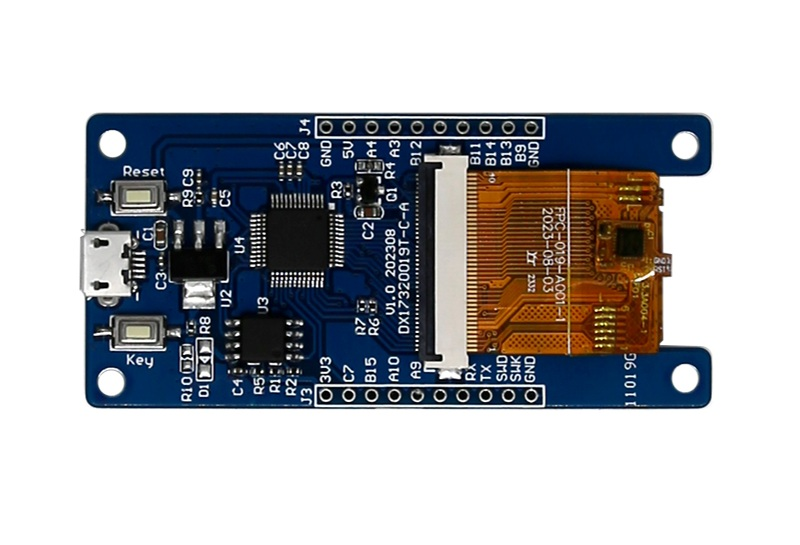
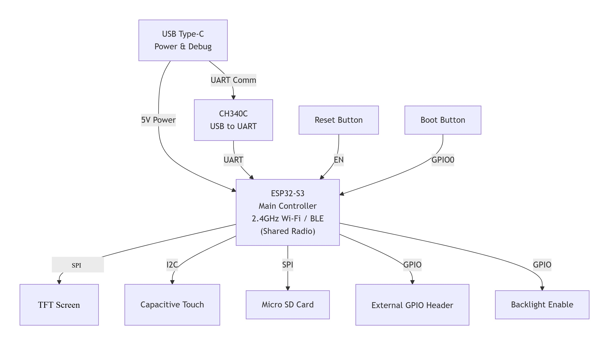

# 1.9" 170x320 ESP32-S3 Smart Touch Display


<div class="grid cards" markdown>

-   **UEDX17320019E-WB-A**
    ---
    The Compact Smart Display powered by ESP32-S3. Featuring a 1.9-inch 170x320 IPS Display with Capacitive Touch Screen, Wi-Fi & BLE 5, and SPI communication.

    [:material-arrow-left: Back to Series](../esp32/){ .md-button }
    [:material-cart: Official Store](https://viewedisplay.com/product/esp32-1-9-inch-170x320-mcu-ips-tft-display-touch-screen-arduino-lvgl/){ .md-button .md-button--primary }
    [:material-github: GitHub Repo](https://github.com/VIEWESMART/UEDX17320019E-ESP32-1.9inch-Touch-Display){ .md-button }

</div>

<div align="center">
  
</div>

---


## 1. Introduction

**UEDX17320019E-WB-A** is a compact smart display development board based on the ESP32-S3, featuring a 1.9-inch IPS touch screen (170x320). It is designed by VIEWE and is suitable for IoT and HMI applications requiring a small form factor with Wi-Fi/BLE connectivity.

### 1.1 Product Features

#### CPU
- **Processor**: Xtensa® 32-bit LX7 dual-core processor, main frequency up to 240 MHz.
- **Wireless**: Integrated Wi-Fi 2.4GHz (802.11 b/g/n) and Bluetooth 5 (LE) & BLE Mesh.

#### Memory
- **PSRAM**: 8 MB (Octal SPI)
- **Flash**: 16 MB

#### Peripheral Interfaces
- On-board USB port for power supply, programming, and serial debugging (CH340C).
- Reset and Boot buttons.

#### Display
| Parameter | Specification |
| :--- | :--- |
| Size | 1.9 Inch |
| Resolution | 170 x 320 |
| Screen Type | IPS |
| Driver IC | GC9307 |
| Interface Mode | SPI |
| Touch IC | CHSC6413 |
| Touch Type | CTP |

#### Other
- **Operating Temperature**: -20 ~ 70℃
- **Storage Temperature**: -30 ~ 80℃

### 1.2 Applications

With compact size and wireless connectivity, the UEDX17320019E-WB-Ais an ideal choice for IoT devices in the following areas:

- Smart Home Control Panels
- Industrial Automation HMI
- Smart Appliances
- Consumer Electronics
- Wearable Devices
- Educational Learning Platforms

---

## 2. Product Information

### 2.1 Interface Description

<div align="center">
  
</div>

- **Main Control Chip**: ESP32-S3-R8 (Dual-core, up to 240MHz, 8MB PSRAM, 16MB Flash)
- **Display Interface**: SPI (CS, SCK, MOSI) with GC9307 driver IC.
- **Touch Interface**: I2C (SDA/SCL) + Interrupt + Reset pins for CHSC6413 CTP.
- **USB**: 5V DC power supply & programming (CH340C USB-to-UART).
- **Buttons**: BOOT (GPIO0) for download mode; RESET (CHIP-EN) for system reset.
- **Backlight Control**: GPIO38.

#### Display Interface Pinout

| Pin | Function | ESP32-S3 Pin |
| :---: | :--- | :---: |
| CS | SPI Chip Select | IO10 |
| SCK | SPI Clock | IO12 |
| MOSI | SPI MOSI (Data) | IO13 |
| RST | Reset | IO1 |
| BACKLIGHT | Backlight Control | IO38 |

#### TP Interface Pinout

| Pin | Function | ESP32-S3 Pin |
| :---: | :--- | :---: |
| RST | Touch Reset | IO3 |
| INT | Touch Interrupt | IO8 |
| SDA | I2C Data | IO9 |
| SCL | I2C Clock | IO46 |

#### USB (CH340C) Pinout

| Pin | Function | ESP32-S3 Pin |
| :---: | :--- | :---: |
| D+ (USB-DP) | USB Data+ | IO20 |
| D- (USB-DN) | USB Data- | IO19 |

#### Button Pinout

| Button | Function | ESP32-S3 Pin |
| :---: | :--- | :---: |
| BOOT | Download Mode | IO0 |
| RESET | System Reset | CHIP-EN |

<!-- ### 2.2 GPIO Definition

<div align="center">
  
</div> -->

---

## 3. Functional Block Diagram

<div align="center">
  
</div>

!!! note "Shared Radio"
    The ESP32-S3 features a 2.4 GHz radio supporting Wi-Fi (802.11 b/g/n) and Bluetooth 5 (LE). Because they share the same RF front-end, Wi-Fi and BLE cannot transmit or receive simultaneously; the radio switches between protocols as needed.

---

## 4. Software

We provide comprehensive support for **Arduino**, **PlatformIO**, and **ESP-IDF** frameworks, with examples for display and touch functionality.

### 4.1 Software Examples

Examples are available in the [GitHub Repository (examples)](/examples).

| Framework | Example Path | Description |
| :--- | :--- | :--- |
| Arduino | `examples/arduino/` | Display and touch examples for Arduino IDE. |
| ESP-IDF | `examples/esp_idf/` | Display and touch examples for ESP-IDF. |
| PlatformIO | `examples/platformio/` | Display and touch examples for PlatformIO. |

!!! tip "Software Compatibility"
    The examples are designed for the UEDX17320019E-WB-Adevelopment board. Please ensure you select the correct board configuration before compiling.

### 4.2 Getting Started

#### 4.2.1 Preparation

- **Hardware**: UEDX17320019E-WB-ABoard, USB Cable
- **Software**: VS Code (ESP-IDF v5.1+) / Arduino IDE (v2.0+) / VS Code (PlatformIO)

**Required Libraries (Arduino IDE & PlatformIO):**

| Library | Version | Description |
| :--- | :--- | :--- |
| GFX Library for Arduino | Latest | By Moon. Required to drive the SPI display. |
| lvgl | 8.4.0 | Free and open-source embedded graphics library. |

**Supported Frameworks:**

| Framework | Version |
| :--- | :--- |
| ESP-IDF | v5.1 / v5.2 / v5.3 |
| Arduino IDE | esp32 >= v3.0.7 |
| PlatformIO | — |

#### 4.2.2 ESP-IDF Setup

1. **Download**: Go to GitHub and download the program from the main branch (click "<> Code").
2. **Open**: Open the example using VS Code with ESP-IDF extension.
3. **Compile & Upload**:
    - Click `Build` in the upper right corner to compile.
    - Connect the microcontroller to the computer.
    - Click `Upload` to flash the firmware.


#### 4.2.3 Arduino Setup

!!! tip "Novice Tutorial"
    Refer to the [Arduino Getting Started Tutorial](../../support/FAQ-Arduino-ESP32.md) for detailed guidance.

1. **Install Arduino IDE**: Download from [arduino.cc](https://www.arduino.cc/en/software), choose installation based on your system type.

2. **Install ESP32 Board Package**:
    - Go to `Tools > Board > Boards Manager`
    - Search `esp32` by Espressif and install version **3.0.7+**

3. **Install Libraries**:
    - Go to `Sketch > Include Library > Library Manager`
    - Search and install `GFX Library for Arduino` (by Moon).
    - Install `lvgl` (**v8.4.0** recommended)

4. **Open Example**:
    - Download the example from the repository and open it in Arduino IDE.

5. **Select Board & Settings**:

    ```c
    // Enable supported board configuration
    #define ESP_PANEL_BOARD_DEFAULT_USE_SUPPORTED       (1)

    // Uncomment ONLY the target board
    #define BOARD_VIEWE_UEDX17320019E_WB_A
    ```
    !!! warning "Important"
        - Do **NOT** enable both `ESP_PANEL_BOARD_DEFAULT_USE_SUPPORTED` and `ESP_PANEL_BOARD_DEFAULT_USE_CUSTOM` simultaneously.
        - Do **NOT** enable multiple board definitions at the same time.
    

6. **Select Port**: Go to `Tools > Port` and select the correct COM port.

7. **Compile & Upload**:
    - Click `✓` to compile.
    - Click `→` to upload.

<!-- <p align="center">
  
  
</p> -->

#### 4.2.4 PlatformIO Setup

!!! tip "Novice Tutorial"
    Refer to the [PlatformIO Getting Started Tutorial](../../support/FAQ-PlatformIO.md) for detailed guidance.

1.  **Install PlatformIO IDE**:
    - Install [Visual Studio Code](https://code.visualstudio.com/Download).
    - Open **Extensions** (++ctrl+shift+x++), search for **PlatformIO IDE** and install it.

2.  **Open platformio example**:
    - Go to GitHub to download the program (click the green **<> Code** button).
    - Open the **PlatformIO** folder in VS Code. PlatformIO will auto-detect the project.

3.  **Configure PlatformIO**:
    - Open `platformio.ini` in the project folder.
    - Under the `[platformio]` section, uncomment and select the example to flash (`default_envs = xxx`).

4.  **Compile and upload the project**:
    - Click the `✓` (Compile) button in the bottom left corner.
    - Connect the board to your computer.
    - Click the `→` (Upload) button.

<!-- <p align="center">
  
  
</p> -->

---

## 5. Related Documents

| Document | Link |
| :--- | :--- |
| Product Specification | [UEDX17320019E-WB-A.pdf](../../../assets/datasheet/UEDX17320019E-WB-A.pdf) |
| Schematic Diagram | [SCH-UEDX17320019E-WB-A.pdf](../../../assets/schematic/SCH-UEDX17320019E-WB-A.pdf) |
| ESP32-S3 Datasheet (EN) | [esp32-s3_datasheet_en.pdf](../../../assets/datasheet/chip/esp32-s3-wroom-1_wroom-1u_datasheet_en.pdf) |
<!-- | Display Datasheet | [GC9307 Datasheet](../../../assets/datasheet/GC9307.pdf) |
| Touch IC Datasheet | [CHSC6413 Datasheet](../../../assets/datasheet/CHSC6413.pdf) | -->

---

## 6. Firmware Download

1. Open the **ESP32 Burning Tool** located in the project's `tools` folder.
2. Select the correct chip model and burning method, then click **OK**.
3. Follow steps **1 → 2 → 3 → 4 → 5** as shown below to flash the firmware.
4. If burning fails, **hold the BOOT button** and retry.

Firmware files are located in the [`firmware/`](./firmware/) directory. Refer to the version description inside to choose the appropriate file.

<p align="center" width="100%">
  
  
</p>

---

## 7. FAQ

??? question "After reading the tutorials, I still don't know how to build the programming environment. What should I do?"
    Refer to the [VIEWE-FAQ](../../support/faq.md) document for detailed environment setup instructions.

??? question "Why does Arduino IDE prompt me to update library files? Should I update them?"
    **Choose NOT to update.** Different versions of library files may not be mutually compatible. Updating may break existing functionality.

??? question "Why is there no serial data output on the 'Uart' interface?"
    The default configuration uses USB as UART0 serial output for debugging. The external "Uart" header is also connected to UART0 but won't output data without reconfiguration.

    **For PlatformIO users:**  
    In `platformio.ini`, change under `build_flags`:
    ```
    -D ARDUINO_USB_CDC_ON_BOOT=true   →   -D ARDUINO_USB_CDC_ON_BOOT=false
    ```

    **For Arduino users:**  
    Go to `Tools > USB CDC On Boot` and select **Disabled**.

??? question "Why does the board continuously fail to download the program?"
    **Hold down the BOOT button** while clicking upload/download, then release after the connection is established.

!!! info "Can't find what you need?"    
    If you need more Products or Resource or Support, please contact our team: 

    [**:material-archive-arrow-down: Resource Center**](../../support/resource.md){ .md-button .md-button--primary } 
    [**:material-magnify: More Products**](../esp32/index.md){ .md-button  }
    [**:material-email: Contact Support**](mailto:support@viewedisplay.com){ .md-button }
