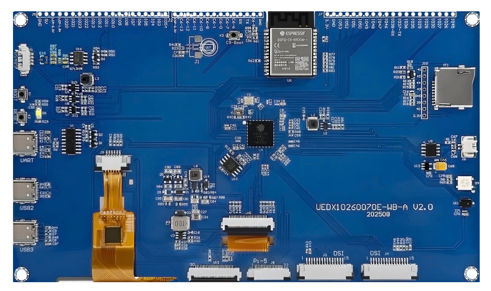
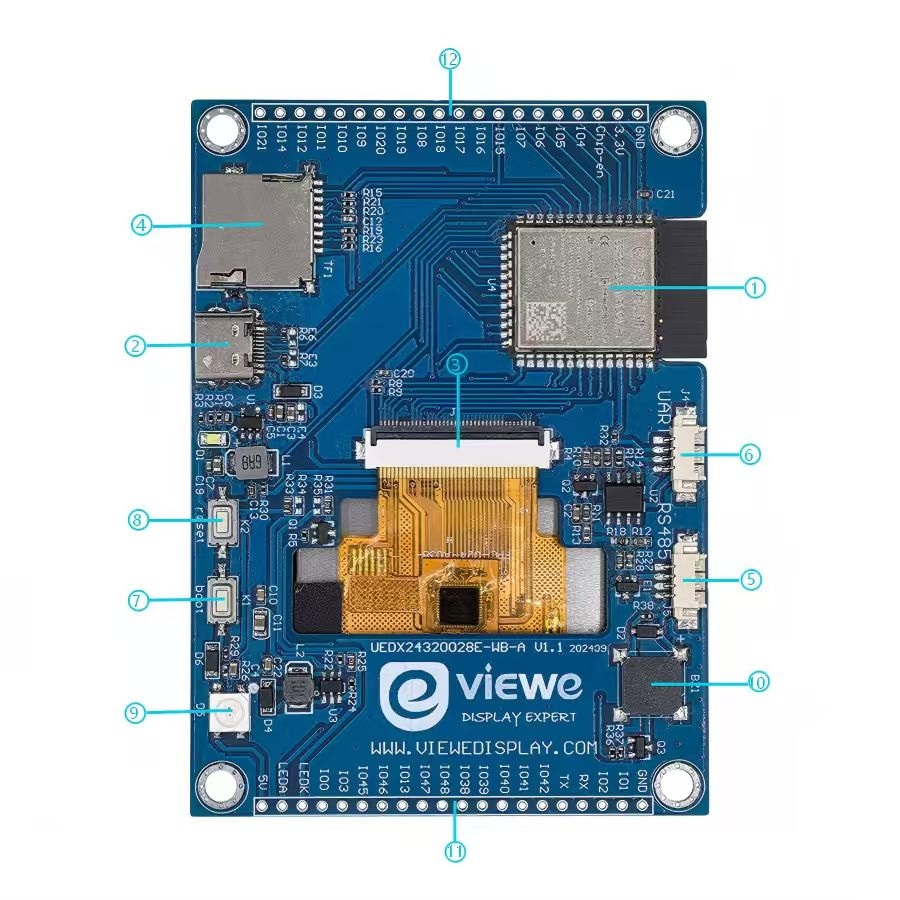

# 2.4" 240x320 ESP32-S3 Smart Touch Display


<div class="grid cards" markdown>

-   **UEDX24320024E-WB-A**
    ---
    VIEWE 2.4-inch ESP32-S3 Smart Display is an HMI module engineered for IoT and industrial automation. Featuring a vibrant 240x320 IPS capacitive touchscreen, it is powered by a robust 240MHz ESP32-S3 processor with built-in Wi-Fi and BLE 5. Supporting Arduino and LVGL, it offers rich UART interfaces for rapid GUI development.

    [:material-arrow-left: Back to Series](../esp32/){ .md-button }
    [:material-cart: Official Store](https://viewedisplay.com/product/esp32-2-4-inch-240x320-rgb-ips-tft-display-touch-screen-arduino-lvgl-wifi-ble-uart-smart-module/){ .md-button .md-button--primary }
    [:material-github: GitHub Repo](https://github.com/VIEWESMART/UEDX24320028ESP32-2.4inch-Touch-Display){ .md-button }

</div>

<div align="center"> 
  
  <!--  -->
</div>

---

## 1. Introduction

The UEDX24320024E-WB-A is a high-performance HMI smart display module equipped with a 2.4-inch SPI screen (240x320). Powered by the ESP32-S3-WROOM-1-N16R8 module, it integrates 2.4GHz Wi-Fi and Bluetooth 5 (LE) capabilities.

The board features a high-speed SPI Interface for the display, ensuring smooth UI performance. It also includes a Capacitive Touch Panel (CHSC6540), rich GPIO expansion, and supports popular frameworks like Arduino, ESP-IDF, and PlatformIO.

### 1.1 Product Features

- **Processor:**
    - ESP32-S3: Xtensa® Dual-Core 32-bit LX7 MCU @ 240MHz.
    - Integrated 2.4 GHz Wi-Fi (802.11 b/g/n) & Bluetooth 5 (LE).
- **Memory:**
    - 16MB Quad SPI Flash.
    - 8MB Octal SPI PSRAM.
- **Display & Touch:**
    - Screen: 2.4-inch TFT LCD (240x320 Resolution).
    - Interface: SPI Interface.
    - Driver IC: GC9307.
    - Touch: Capacitive Multi-Touch (CHSC6540) via I2C.
- **Peripherals:**
    - Connectivity: USB-C (UART/Program), UART, RS485 (Optional/Expansion).
    - Storage: TF Card Slot (SDIO/SPI).
    - Audio: Onboard Buzzer.
    - Expansion: GPIO Header (UART, I2C, SPI, IOs).

### 1.2 Applications

- Industrial HMI Control Panels
- Smart Home Automation Centers
- Medical Devices & Instruments
- IoT Data Dashboards

## 2. Hardware Description

### 2.1 Module Overview

The detailed component layout is shown below:

<p align="left">
  
</p>

| No. | Component | Description |
| :--- | :--- | :--- |
| ① | ESP32-S3-N16R8 | Main SoC (16MB Flash / 8MB PSRAM). |
| ② | USB-C Port | Power (5V) / Firmware Download / UART Debug (CH340C). |
| ③ | Display+Touch Interface | 40-Pin RGB Interface FPC Connector. |
| ④ | TF Card Slot | For external storage (Images/Logs). |
| ⑤ | RS485 | Reserved pads/header for Industrial Serial communication. |
| ⑥ | UART | Reserved pads/header for Industrial Serial communication. |
| ⑦ | BOOT Button | Press during power-on to enter Download Mode. |
| ⑧ | RESET Button | Hardware System Reset. |
| ⑨ | RGB LED | Magic color light with built-in WS2812B. |
| ⑩ | Buzzer | - |
| ⑪ ⑫ | Expansion Header | GPIOs, 5V, 3.3V, GND for external sensors. |

### 2.2 GPIO Definition (Pinout)

The mapping for the Display and Touch interfaces:

#### Display (SPI Interface)

| IPS Screen Pin | ESP32S3 Pin |
| :--- | :--- |
| CS | IO42 |
| SCK | IO40 |
| MOSI | IO45 |
| DC | IO41 |
| RST | IO39 |
| BACKLIGHT | IO13 |

#### Touch (CHSC6540)

| Touch Chip Pin | ESP32S3 Pin |
| :--- | :--- |
| RST | IO2 (Not Used) |
| INT | IO4 (Not Used) |
| SDA | IO1 |
| SCL | IO3 |

#### Peripherals

| USB (CH340C) Pin | ESP32S3 Pin |
| :--- | :--- |
| D+ (USB-DP) | IO20 |
| D- (USB-DN) | IO19 |

| Button Pin | ESP32S3 Pin |
| :--- | :--- |
| boot | IO0 |
| reset | chip-en |

| SD Card Pin | ESP32S3 Pin |
| :--- | :--- |
| D1 | IO18 |
| D2 | IO15 |
| MOSI | IO17 |
| MISO | IO16 |

| UART/RS485 Pin | ESP32S3 Pin |
| :--- | :--- |
| UART TX | IO43 (RXD0) |
| UART RX | IO44 (TXD0) |

| RGB LED Pin | ESP32S3 Pin |
| :--- | :--- |
| RGB LED | IO0 |

| Buzzer Pin | ESP32S3 Pin |
| :--- | :--- |
| buzzer | IO38 |

## 3. Software

We provide comprehensive support for Arduino, PlatformIO, and ESP-IDF frameworks, with pre-ported LVGL examples.

### 3.1 Software Examples

Examples are available in the [GitHub Repository](examples).

| Framework | Example Path | Description |
| :--- | :--- | :--- |
| Arduino | `examples/arduino/gui/lvgl_v8` | LVGL Benchmark: Usage example of lvgl v8. It can also be directly opened in the Arduino IDE. |
| esp-idf | `examples/esp_idf/lvgl_v9_port` | lvgl port: Example of porting and using lvgl in esp-idf |
| PlatformIO | `examples/platformio/lvgl_v8_port` | lvgl v8 port: Usage example of lvgl v8. |

### 3.2 Getting Started

#### 3.2.1 Preparation

- **Hardware:** UEDX24320024E_WB_A Board, USB-C Cable.
- **Software:** VS Code (ESP-IDF v5.3+) or Arduino IDE (v2.0+) or VS Code (PlatformIO).
- **Library:** The following libraries are needed for Arduino IDE and PlatformIO

| Libraries | version | Description |
| :--- | :--- | :--- |
| ESP32_Display_Panel | 1.0.3+ | by Espressif, This is necessary to drive the screen. |
| ESP32_IO_Expander | Arduino automatic selection | The dependency library of ESP32_Display_Panel should be selected for installation together during the installation process. |
| esp-lib-utils | Arduino automatic selection | The dependency library of ESP32_Display_Panel should be selected for installation together during the installation process. |
| lvgl | 8.4.0 | A free and open-source embedded graphics library. |

#### 3.2.2 ESP-IDF Setup

1. **Open platformio example**
   Go to GitHub to download the program. You can download the main branch by clicking on the "<> Code" with green text.
2. **Open the example using VS Code(ESP-IDF)**
3. **Compile and upload:**
    - Click `build` in the upper right corner to compile.
    - Connect the microcontroller to the computer. If the compilation is correct.
    - Click `upload` in the upper right corner to download.

#### 3.2.3 Arduino Setup

1. **Install [Arduino](https://www.arduino.cc/en/software)**
   Choose installation based on your system type. Newcomers please refer to the [beginner's tutorial](../../support/tutorials.md).
2. **Install ESP32 Board Package:**
    - Open Arduino IDE
    - Go to `File` > `Preferences`
    - Add to `Additional boards manager URLs`:
      ```text
      https://espressif.github.io/arduino-esp32/package_esp32_index.json
      ```
    - Go to Tools > Board > Boards Manager.
    - Search `esp32` by Espressif and install version 3.0.0+.
3. **Install Libraries:**
    - Go to Sketch > Include Library > Library Manager.
    - Search `ESP32_Display_Panel` by Espressif and install version 1.0.3+. You will be prompted whether to install its dependencies, please click INSTALL ALL to install all.
    - Install `lvgl` (v8.4.0 recommended).
4. **Open example:**
    - Navigate to `File` > `Examples` > `ESP32_Display_Panel`
    - Select `Arduino` > `gui` > `lvgl_v8` > `simple_port`
5. **Select Board:**
    - Target: `ESP32S3 Dev Module`.
    - Settings:
        - Flash Size: 16MB (128Mb)
        - Partition Scheme: 16M Flash (3MB APP/9.9MB FATFS)
        - PSRAM: OPI PSRAM (Crucial!)
6. **Config esp supported panel board:**
   Open the `esp_panel_board_supported_conf.h` file in the example. Enable this file: change the `ESP_PANEL_BOARD_DEFAULT_USE_SUPPORTED` macro definition to `1`. Ensure you uncomment: `#define BOARD_VIEWE_UEDX24320024E_WB_A`

   ```c
   /**
    * @brief Flag to enable supported board configuration (0/1)
    *
    * Set to `1` to enable supported board configuration, `0` to disable
    */
   #define ESP_PANEL_BOARD_DEFAULT_USE_SUPPORTED       (1)

   // #define BOARD_VIEWE_SMARTRING
   // #define BOARD_VIEWE_UEDX24240013_MD50E
   #define BOARD_VIEWE_UEDX24320024E_WB_A
   // #define BOARD_VIEWE_UEDX24320028E_WB_A
   // #define BOARD_VIEWE_UEDX24320035E_WB_A
   // #define BOARD_VIEWE_UEDX32480035E_WB_A
   // #define BOARD_VIEWE_UEDX46460015_MD50ET
   // #define BOARD_VIEWE_UEDX48270043E_WB_A
   // #define BOARD_VIEWE_UEDX48480021_MD80E_V2
   // #define BOARD_VIEWE_UEDX48480021_MD80E
   // #define BOARD_VIEWE_UEDX48480021_MD80ET
   // #define BOARD_VIEWE_UEDX48480028_MD80ET
   // #define BOARD_VIEWE_UEDX48480040E_WB_A
   // #define BOARD_VIEWE_UEDX80480043E_WB_A
   // #define BOARD_VIEWE_UEDX80480050E_AC_A
   // #define BOARD_VIEWE_UEDX80480050E_WB_A
   // #define BOARD_VIEWE_UEDX80480050E_WB_A_2
   // #define BOARD_VIEWE_UEDX80480070E_WB_A
   ```

7. **Configure the example:**
    - *[Optional]* Edit the macro definitions in the `lvgl_v8_port.h` file:
        - If using `RGB/MIPI-DSI` interface, change the `LVGL_PORT_AVOID_TEARING_MODE` macro definition to `1` / `2` / `3` to enable the avoid tearing function. After that, change the `LVGL_PORT_ROTATION_DEGREE` macro definition to the target rotation degree.
        - If using other interfaces, please don't modify the `LVGL_PORT_AVOID_TEARING_MODE` and `LVGL_PORT_ROTATION_DEGREE` macro definitions.
    - *[Optional]* Edit the macro definitions in the `lv_conf.h` file:
        - If using `SPI/QSPI` interface, change the `LV_COLOR_16_SWAP` macro definition to `1`.
8. **Select the correct port:**
    - Connect to the device.
    - Go to Tools > Port, Select the corresponding port.
9. **Compile and upload:**
    - Click `√` in the upper right corner to compile.
    - Connect the microcontroller to the computer. If the compilation is correct.
    - Click `→` in the upper right corner to download.

!!! tip "Configuration Note"
    In `esp_panel_board_supported_conf.h`, ensure you uncomment:
    `#define BOARD_VIEWE_UEDX24320024E_WB_A`

    Do not enable both `ESP_PANEL_BOARD_DEFAULT_USE_SUPPORTED` and `ESP_PANEL_BOARD_DEFAULT_USE_CUSTOM`.
    You cannot enable multiple esp supported panel boards at the same time.

#### 3.2.4 PlatformIO Setup

1. **Open platformio example**
   Go to GitHub to download the program. You can download the main branch by clicking on the "<> Code" with green text.
2. **Open the example using VS Code(PlatformIO)**
3. **Configure PlatformIO:**
   This example uses the `BOARD_ESPRESSIF_ESP32_S3_LCD_EV_BOARD_2_V1_5` board as default. Choose `BOARD_VIEWE_UEDX24320024E_WB_A` in the `[platformio]:default_envs` of the `platformio.ini` file.
4. **Configure the example:**
    - *[Optional]* Edit the macro definitions in the `lvgl_v8_port.h` file:
        - If using `RGB/MIPI-DSI` interface, change the `LVGL_PORT_AVOID_TEARING_MODE` macro definition to `1` / `2` / `3` to enable the avoid tearing function. After that, change the `LVGL_PORT_ROTATION_DEGREE` macro definition to the target rotation degree.
        - If using other interfaces, please don't modify the `LVGL_PORT_AVOID_TEARING_MODE` and `LVGL_PORT_ROTATION_DEGREE` macro definitions.
5. **Compile and upload the project**
    - Click the `√`(Compile) button.
    - Connect the board to your computer. If the compilation is correct.
    - Click the `→`(upload) button.

## 4. Related Documents & Resources

- [Products Specification](information/UEDX24320024E-WB-A%20V1.0%20SPEC.pdf)
- [Display Datasheet](information/UE024QV-RB40-A038A.pdf)
- [Touch IC](information/DS_CHSC6540_V1.0%20Datasheet.pdf)
- [5050RGB-LED](information/C2843785_RGB%2BLED(Built-in%20IC)_XL-5050RGBC-WS2812B_specification_WJ1123912.PDF)
- [Buzzer](information/C7544813_Buzzer_HYG-8503A_specification_WJ436381.PDF)
- [CH340C](information/C84681_USB%20Conversion%20chip_CH340C_specification_WJ1187874.PDF)
- [Schematic](Schematic/UEDX24320028E-WB-A%20V1.1%20sch.png)

## 5. Firmware Download

1. Open the project file "tools" and locate the ESP32 burning tool. Open it.
2. Select the correct burning chip and burning method, then click "OK." As shown in the picture, follow steps 1->2->3->4->5 to burn the program. If the burning is not successful, press and hold the "BOOT-0" button and then download and burn again.
3. Burn the file in the root directory of the project file "[firmware](./firmware/)" file. There is a description of the firmware file version inside, just choose the appropriate version to download.

<p align="center" width="100%">
  
  
</p>


##❓FAQ

??? question "After reading the above tutorials, I still don't know how to build the programming environment?"
    Refer to the [VIEWE-FAQ](../../support/faq.md) document for detailed environment setup instructions.

??? question " Why does Arduino IDE prompt me to update library files when I open it? Should I update them or not?"
    Choose not to update library files. Different versions of library files may not be mutually compatible, so it is not recommended to update library files.

??? question "Why is there no serial data output on the "Uart" interface on my board? Is it defective and unusable?"
    The default project configuration uses the USB interface as Uart0 serial output for debugging purposes. The "Uart" interface is connected to Uart0, so it won't output any data without configuration.   
    For PlatformIO users, please open the project file "platformio.ini" and modify the option under "build_flags = xxx" from "-D ARDUINO_USB_CDC_ON_BOOT=true" to "-D ARDUINO_USB_CDC_ON_BOOT=false" to enable external "Uart" interface.  
    For Arduino users, open the "Tools" menu and select "USB CDC On Boot: Disabled" to enable the external "Uart" interface.  

??? question "Why is my board continuously failing to download the program?"
    Please hold down the "BOOT" button and try downloading the program again.  


!!! info "Can't find what you need?"    
    If you need more Products or Resource or Support, please contact our team: 

    [**:material-archive-arrow-down: Resource Center**](../../support/resource.md){ .md-button .md-button--primary } 
    [**:material-magnify: More Products**](../esp32/index.md){ .md-button  }
    [**:material-email: Contact Support**](mailto:support@viewedisplay.com){ .md-button }