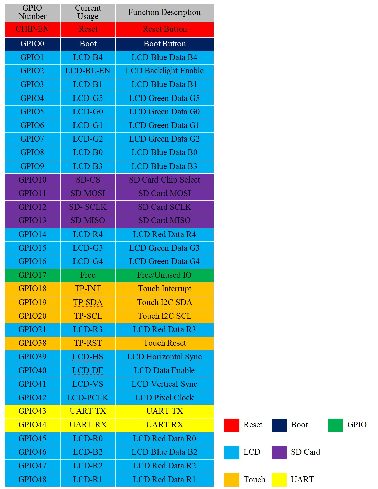
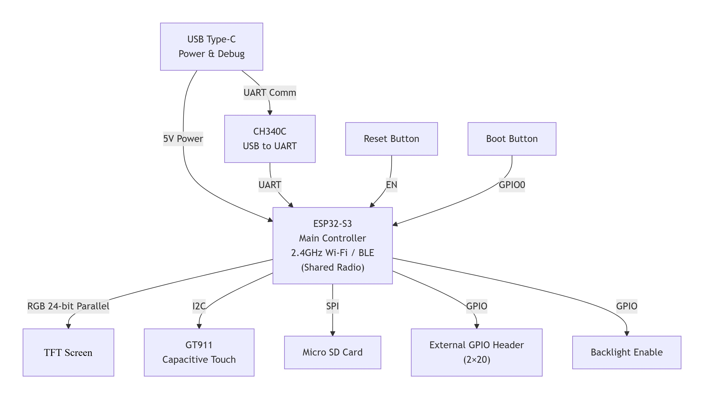

# 4.3" 800x480 ESP32-S3 Smart Touch Display


<div class="grid cards" markdown>

-   **UEDX80480043E-WB**
    ---
    The Mainstream AIoT Smart Display powered by ESP32-S3. Featuring a 4.3-inch 800x480 IPS TFT Display with Capacitive Touch Screen, Wi-Fi & BLE 5, and rich expansion interfaces.

    [:material-arrow-left: Back to Series](../esp32/){ .md-button }
    [:material-cart: Official Store](https://viewedisplay.com/product/esp32-4-3-inch-800x480-rgb-ips-tft-display-touch-screen-arduino-lvgl/){ .md-button .md-button--primary }
    [:material-github: GitHub Repo](https://github.com/VIEWESMART/UEDX80480043ESP32-4.3inch-Touch-Display){ .md-button }

</div>

<div align="center"> 
  
  <!--  -->
</div>

---


## 1. Introduction

**UEDX80480043E-WB-B** is a high-performance smart display development board based on the ESP32-S3, featuring a 4.3-inch RGB touch screen (800x480). It is designed by VIEWE and is suitable for IoT and HMI applications requiring rich peripheral interfaces and Wi-Fi/BLE connectivity.

### 1.1 Product Features

#### CPU
- **Processor**: Xtensa® 32-bit LX7 dual-core processor, main frequency up to 240 MHz.
- **Wireless**: Integrated Wi-Fi 2.4GHz (802.11 b/g/n) and Bluetooth 5 (LE) & BLE Mesh.

#### Memory
- **PSRAM**: 8 MB
- **Flash**: 16 MB

#### Peripheral Interfaces
- Two 2x20 Pin Headers breaking out multiple programmable GPIOs (SPI, UART, I2C, I2S, LCD, Camera, USB OTG, etc.).
- On-board USB Type-C port for power supply, programming, and serial debugging (CH340C).
- On-board Micro SD card slot (SPI interface).
- Reset and Boot buttons.

#### Display
| Parameter | Specification |
| :--- | :--- |
| Size | 4.3 Inch |
| Resolution | 800 x 480 |
| Pixel Arrangement | RGB Vertical Stripe |
| Interface Mode | 40PIN RGB 24bits |
| Driver IC | ST7262E43-G4 |
| Touch IC | GT911 |
| Brightness | 400 cd/m² |
| Touch Type | CTP |

#### Other
- **Operating Temperature**: -20 ~ 70℃
- **Storage Temperature**: -30 ~ 80℃

### 1.2 Applications

With rich connectivity and powerful processing capabilities, the UEDX80480043E-WB-B is an ideal choice for IoT devices in the following areas:

- Smart Home Control Panels
- Industrial Automation HMI
- Smart Appliances
- Consumer Electronics
- Wireless Data Loggers
- Touch Screen Interfaces
- Educational Learning Platforms

---

## 2. Product Information

### 2.1 Interface Description  
<div align="center"> 
  
  <!--  -->
</div>
- **Main Control Chip**: ESP32S3-MCN16R8 (Dual-core, up to 240MHz)
- **Display Interface**: 40-Pin RGB 24-bit output (R0-R7, G0-G7, B0-B7). Only RGB565 is usable due to chip limitations.
- **SD Card Slot**: SPI interface for external storage expansion.
- **Touch Interface**: I2C (SDA/SCL) + Interrupt + Reset pins for GT911 CTP.
- **USB Type-C**: 5V DC power supply & programming.
- **UART Serial Port**: Standard TX/RX for debugging or communication.
- **RGB-LED**: WS2812B onboard.
- **Buttons**: BOOT (GPIO0) for download mode; RESET (CHIP-EN) for system reset.
- **4-pin 1.5mm Header**: Optional I2C/UART breakout. Remove RGB LEDs if interference is a concern.
- **External GPIO Headers**: Dual-row 2x21 headers providing ADC, touch sensors, and digital I/O.

#### Display Interface Pinout

| Pin No. | Symbol | I/O | Description |
| :---: | :--- | :---: | :--- |
| 1 | LEDK | P | Power supply for backlight cathode |
| 2 | LEDA | P | Power supply for backlight anode |
| 3 | GND | P | Power Ground |
| 4 | VDD | P | Internal logic power regulator (3.3V) |
| 5-12 | R0-R7 | I | Red data input |
| 13-20 | G0-G7 | I | Green data input |
| 21-28 | B0-B7 | I | Blue data input |
| 29 | GND | P | Power Ground |
| 30 | CLK | I | Pixel clock input (Negative polarity) |
| 31 | DISP | I | Standby mode (Normally pulled high) |
| 32 | HSYNC | I | Horizontal sync signal (Negative polarity) |
| 33 | VSYNC | I | Vertical sync signal (Negative polarity) |
| 34 | DEN | I | Data input enable (Active High) |
| 35 | NC | I | Dummy |
| 36 | GND | P | Power Ground |
| 37 | XR | - | Dummy |
| 38 | YD | - | Dummy |
| 39 | XL | - | Dummy |
| 40 | YU | - | Dummy |

> **Legend**: I = Input; O = Output; P = Power

#### TP Interface Pinout

| Pin No. | Symbol | I/O | Description |
| :---: | :--- | :---: | :--- |
| 1 | GPIO20 | P | TP SCL |
| 2 | GPIO19 | P | TP SDA |
| 3 | GPIO18 | P | INT (Not actually used) |
| 4 | GND | P | Power Ground |
| 5 | VDD | I | Internal logic power regulator (3.3V) |
| 6 | GPIO38 | I | RTP-csb / CTP-rst |
| 7 | GND | P | Power Ground |
| 8 | GND | P | Power Ground |

### 2.2 GPIO Definition

<div align="center"> 
  
  <!--  -->
</div>

---

## 3. Functional Block Diagram

<div align="center"> 
  
  <!--  -->
</div>

!!! note "Shared Radio"
    The ESP32-S3 features a 2.4 GHz radio supporting Wi-Fi (802.11 b/g/n) and Bluetooth 5 (LE). Because they share the same RF front-end, Wi-Fi and BLE cannot transmit or receive simultaneously; the radio switches between protocols as needed. This is indicated by “Shared Radio” in the block diagram.

---

## 4. Software

We provide comprehensive support for **Arduino**, **PlatformIO**, and **ESP-IDF** frameworks, with pre-ported LVGL examples.

!!! tip "Software Compatibility"
    There is no software difference between UEDX80480043E-WB-A and UEDX80480043E-WB-B. Therefore, we will use them uniformly and refer to **UEDX80480043E-WB-A** as the name of the development board hereinafter.

### 4.1 Software Examples

Examples are available in the [GitHub Repository (examples)](/examples).

| Framework | Example Path | Description |
| :--- | :--- | :--- |
| Arduino | `examples/arduino/gui/lvgl_v8` | LVGL Benchmark: Demonstrates 800x480 UI rendering. Can be opened directly in Arduino IDE. |
| ESP-IDF | `examples/esp_idf/lvgl_v9_demo_4_3inch` | LVGL port: Example of porting and using LVGL in ESP-IDF |
| ESP-IDF | `examples/esp_idf/squareline_coffee_4_3inch` | SquareLine port: Example of porting and using SquareLine in ESP-IDF |
| ESP-IDF | `examples/esp_idf/sd_card_spi` | SD Card: Examples of using an SD card on the device |
| PlatformIO | `examples/platformio/lvgl_v8_port` | LVGL v8 port: Usage example of LVGL v8 |

### 4.2 Getting Started

#### 4.2.1 Preparation

- **Hardware**: UEDX80480043E-WB-A or UEDX80480043E-WB-B Board, USB-C Cable
- **Software**: VS Code (ESP-IDF v5.3+) / Arduino IDE (v2.0+) / VS Code (PlatformIO)

**Required Libraries (Arduino IDE & PlatformIO):**

| Library | Version | Description |
| :--- | :--- | :--- |
| ESP32_Display_Panel | 1.0.3+ | By Espressif. Required to drive the screen. |
| ESP32_IO_Expander | Auto-selected | Dependency of ESP32_Display_Panel. Install together. |
| esp-lib-utils | Auto-selected | Dependency of ESP32_Display_Panel. Install together. |
| lvgl | 8.4.0 | Free and open-source embedded graphics library. |

#### 4.2.2 ESP-IDF Setup

1. **Download**: Go to GitHub and download the program from the main branch (click "<> Code").
2. **Open**: Open the example using VS Code with ESP-IDF extension.
3. **Compile & Upload**:
    - Click `Build` in the upper right corner to compile.
    - Connect the microcontroller to the computer.
    - Click `Upload` to flash the firmware.

#### 4.2.3 Arduino Setup

!!! tip "Novice Tutorial"
    Refer to the [Arduino Getting Started Tutorial](../../support/FAQ-Arduino-ESP32.md) for detailed guidance.

1. **Install ESP32 Board Package**:
    - Go to `Tools > Board > Boards Manager`
    - Search `esp32` by Espressif and install version **3.0.0+**

2. **Install Libraries**:
    - Go to `Sketch > Include Library > Library Manager`
    - Search `ESP32_Display_Panel` by Espressif and install **1.0.3+**. Click **INSTALL ALL** when prompted for dependencies.
    - Install `lvgl` (**v8.4.0** recommended)

3. **Open Example**:
    - Navigate to `File > Examples > ESP32_Display_Panel > Arduino > gui > lvgl_v8 > simple_port`

4. **Select Board & Settings**:
    - Target: `ESP32S3 Dev Module`
    - Flash Size: **16MB (128Mb)**
    - Partition Scheme: **16M Flash (3MB APP/9.9MB FATFS)**
    - PSRAM: **OPI PSRAM** *(Crucial!)*

5. **Configure Supported Panel Board**:
    Open `esp_panel_board_supported_conf.h` in the example and make the following changes:

    ```c
    // Enable supported board configuration
    #define ESP_PANEL_BOARD_DEFAULT_USE_SUPPORTED       (1)

    // Uncomment ONLY the target board
    #define BOARD_VIEWE_UEDX80480043E_WB_A
    ```

    !!! warning "Important"
        - Do **NOT** enable both `ESP_PANEL_BOARD_DEFAULT_USE_SUPPORTED` and `ESP_PANEL_BOARD_DEFAULT_USE_CUSTOM` simultaneously.
        - Do **NOT** enable multiple board definitions at the same time.

6. **Configure Example Macros (Optional)**:

    In `lvgl_v8_port.h`:
    - For **RGB/MIPI-DSI** interface: Set `LVGL_PORT_AVOID_TEARING_MODE` to `1`/`2`/`3` and set `LVGL_PORT_ROTATION_DEGREE` to the target rotation.
    - For **other interfaces**: Do NOT modify these macros.

    In `lv_conf.h`:
    - For **SPI/QSPI** interface: Set `LV_COLOR_16_SWAP` to `1`.

7. **Select Port**: Go to `Tools > Port` and select the correct COM port.

8. **Compile & Upload**:
    - Click `✓` to compile.
    - Click `→` to upload.

!!! tip "Configuration"
    Configuration: In esp_panel_board_supported_conf.h, ensure you uncomment: #define BOARD_VIEWE_UEDX80480043E_WB_A Do not enable both ESP_PANEL_BOARD_DEFAULT_USE_SUPPORTED and ESP_PANEL_BOARD_DEFAULT_USE_CUSTOM You cannot enable multiple esp supported panel boards at the same time.

#### 4.2.4 PlatformIO Setup

1.  **Open platformio example**
    * go to GitHub to download the program. You can download the main branch by clicking on the "<> Code" with green text
    * Open the example using VS Code(PlatformIO)
2.  **Configure PlatformIO**:
    * This example uses the `BOARD_ESPRESSIF_ESP32_S3_LCD_EV_BOARD_2_V1_5` board as default. Choose `BOARD_VIEWE_UEDX80480043E_WB_A` in the `[platformio]:default_envs` of the `platformio.ini` file.
3.  **Configure the example**:
    - [Optional] Edit the macro definitions in the `lvgl_v8_port.h` file
        - **If using `RGB/MIPI-DSI` interface**, change the `LVGL_PORT_AVOID_TEARING_MODE` macro definition to `1`/`2`/`3` to enable the avoid tearing function. After that, change the `LVGL_PORT_ROTATION_DEGREE` macro definition to the target rotation degree
        - **If using other interfaces**, please don't modify the `LVGL_PORT_AVOID_TEARING_MODE` and `LVGL_PORT_ROTATION_DEGREE` macro definitions
4.  **Compile and upload the project**
    - Click the `√`(Compile) button
    - Connect the board to your computer.If the compilation is correct.
    - Click the `→`(upload) button
---


## 5. Related Documents

| Document | Link |
| :--- | :--- |
| Product Specification | [UEDX80480043E-WB-B.pdf](../../../assets/datasheet/UEDX80480043E-WB-B.pdf) |
| Schematic Diagram | [SCH-UEDX80480043E-WB-B.pdf](../../../assets/schematic/SCH-UEDX80480043E-WB.pdf) |
| 2D Drawing (DWG) | [UEDX80480043E-WB-B.dwg](../../../assets/dimension/UEDX80480043E-WB-B-2D.dwg) |
| ESP32-S3-WROOM-1 Datasheet (CN) | [esp32-s3-wroom-1_datasheet_cn.pdf](../../../assets/datasheet/chip/esp32-s3-wroom-1_wroom-1u_datasheet_cn.pdf) |
| ESP32-S3-WROOM-1 Datasheet (EN) | [esp32-s3-wroom-1_datasheet_en.pdf](../../../assets/datasheet/chip/esp32-s3-wroom-1_wroom-1u_datasheet_en.pdf) |

---

## 6. Firmware Download

1. Open the **ESP32 Burning Tool** located in the project's `tools` folder.
2. Select the correct chip model and burning method, then click **OK**.
3. Follow steps **1 → 2 → 3 → 4 → 5** as shown below to flash the firmware.
4. If burning fails, **hold the BOOT-0 button** and retry.

Firmware files are located in the [`firmware/`](./firmware/) directory. Refer to the version description inside to choose the appropriate file.

<p align="center" width="100%">
  
  
</p>
---

## 7. FAQ

??? question "After reading the tutorials, I still don't know how to build the programming environment. What should I do?"
    Refer to the [VIEWE-FAQ](../../support/faq.md) document for detailed environment setup instructions.

??? question "Why does Arduino IDE prompt me to update library files? Should I update them?"
    **Choose NOT to update.** Different versions of library files may not be mutually compatible. Updating may break existing functionality.

??? question "Why is there no serial data output on the 'Uart' interface?"
    The default configuration uses USB as UART0 serial output for debugging. The external "Uart" header is also connected to UART0 but won't output data without reconfiguration.

    **For PlatformIO users:**  
    In `platformio.ini`, change under `build_flags`:
    ```
    -D ARDUINO_USB_CDC_ON_BOOT=true   →   -D ARDUINO_USB_CDC_ON_BOOT=false
    ```

    **For Arduino users:**  
    Go to `Tools > USB CDC On Boot` and select **Disabled**.

??? question "Why does the board continuously fail to download the program?"
    **Hold down the BOOT button** while clicking upload/download, then release after the connection is established.

!!! info "Can't find what you need?"    
    If you need more Products or Resource or Support, please contact our team: 

    [**:material-archive-arrow-down: Resource Center**](../../support/resource.md){ .md-button .md-button--primary } 
    [**:material-magnify: More Products**](../esp32/index.md){ .md-button  }
    [**:material-email: Contact Support**](mailto:support@viewedisplay.com){ .md-button }