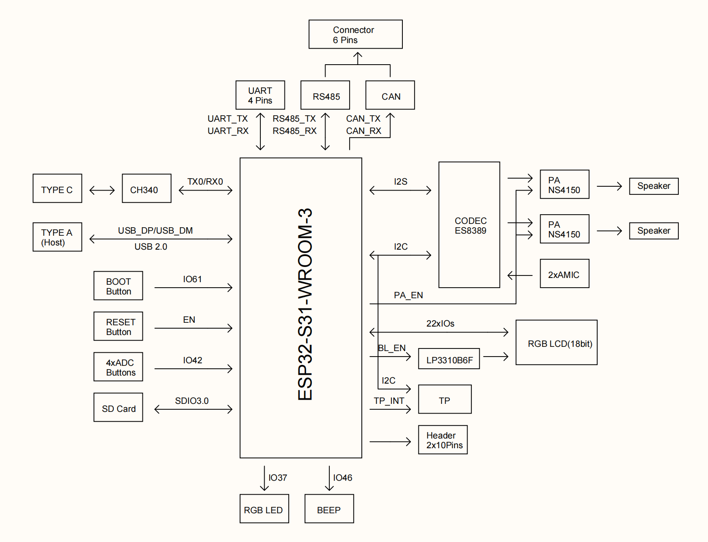

# 4.3" 800x480 ESP32-S31 WiFi6 Touch Display


<div class="grid cards" markdown>

-   **UES31S043H800V480C-U**
    ---
    The **Next-Gen Flagship** ESP32 Smart Display module powered by **ESP32-S31** (Dual-Core RISC-V @ 320 MHz).
    Featuring a 4.3-inch **800x480** IPS Display, **Wi-Fi 6** + Bluetooth 5.4 + 802.15.4, **USB 2.0 High-Speed OTG**, stereo audio, and industrial **RS485 / CAN** interfaces.

    [:material-arrow-left: Back to Series](../esp32/){ .md-button }
    [:material-cart: Official Store](https://viewedisplay.com/product/4-3-inch-800x480-esp32-s31-wifi6-touch-smart-hmi-uart-display/){ .md-button .md-button--primary }
    [:material-github: GitHub Repo](https://github.com/VIEWESMART/PLCM-UES31S043H800V480C-U){ .md-button }

</div>

<div align="center"> 
  
</div>

---

## 1. Introduction

The **UES31S043H800V480C-U** is a high-performance smart display module designed by VIEWE. It is based on the Espressif **ESP32-S31-WROOM-3** module and a 4.3-inch RGB capacitive touch panel (800x480). The LCD and touch devices are the same as those used on the UEDX80480043E-WB-B (ST7262 driver IC and GT911 CTP). The main board is a new design around the ESP32-S31: a dual-core 32-bit RISC-V MCU running at up to 320 MHz, with Wi-Fi 6, Bluetooth 5.4 LE plus Bluetooth Classic, USB 2.0 High-Speed OTG, stereo audio, SDIO 3.0 storage, and RS485 / CAN industrial interfaces.

!!! warning "ESP32-S31 is a preview device"
    ESP-IDF builds must use the `--preview` option, for example `idf.py --preview set-target esp32s31`. Numbered stable releases do not include `esp32s31`. Module ratings follow the Espressif **ESP32-S31-WROOM-3** datasheet (pre-release).

### 1.1 Product Features

* **Processor**:
    * **ESP32-S31**: RISC-V 32-bit dual-core processor, main frequency up to **320 MHz**, plus a ULP-RISC-V coprocessor.
    * **Wireless**: 2.4 GHz **Wi-Fi 6** (IEEE 802.11 b/g/n/ax, HT20/40, up to 150 Mbps), **Bluetooth 5.4 LE** (including LE Audio), **Bluetooth Classic** (BR/EDR), and **IEEE 802.15.4** (Zigbee / Thread).
    * **Antenna**: On-module PCB antenna.
    * **Security**: Secure Boot, Flash / PSRAM encryption, cryptographic acceleration, and TEE.
* **Memory**:
    * **On-chip**: 320 KB ROM, 512 KB SRAM, 32 KB low-power SRAM.
    * **Module**: **16 MB Quad SPI Flash + 16 MB Octal SPI PSRAM** (ESP32-S31-WROOM-3-N16R16V), accessible in parallel.
* **Display**:
    * **Panel**: 4.3-inch IPS, **800x480**, RGB Vertical Stripe.
    * **Interface**: 40-pin RGB 24-bit.
    * **Driver IC**: **ST7262E43-G4**. **Touch IC**: **GT911** (Capacitive).
    * **Brightness**: 400 cd/m² (typ.).
    * **Verified timing**: PCLK 18 MHz, negative polarity; HSYNC 1/40/20; VSYNC 1/10/5.
* **Peripherals**:
    * **USB Type-C**: 5 V power, firmware download, and serial debug (CH340C bridged to UART0).
    * **USB Type-A**: Dedicated **USB 2.0 High-Speed OTG PHY** (USB_DP / USB_DM, not GPIOs). Host 5 V through TPS2051C (~500 mA).
    * **Storage**: On-board MicroSD slot, **4-bit SDMMC / SDIO 3.0**.
    * **Audio**: **ES8389** stereo codec, dual **NS4150B** speaker amplifiers, dual analog microphones, L/R speaker connectors.
    * **Industrial**: **RS485** (SIT3088E, hardware automatic direction) and **CAN** (SIT1050T + on-chip TWAI) on a 6-pin terminal.
    * **Expansion**: **2x10 pin 2.54 mm header (H1)** with UART0 / UART1, I2C, RS485 / CAN GPIOs, 3.3 V / 5 V / GND.
    * **Misc**: Four ADC keys, RESET / BOOT buttons, WS2812B RGB LED, and a 3 kHz passive buzzer (not attached by default).
* **Other**:
    * **Operation Temperature**: -20 ~ 70 °C (limited by the LCD).
    * **Storage Temperature**: -30 ~ 80 °C.
    * **MCU module rating**: -40 ~ 85 °C.

### 1.2 Applications

With rich connectivity and powerful processing capabilities, the UES31S043H800V480C-U is an ideal choice for IoT devices in the following areas:

* Smart Home Control Panels
* Industrial Automation HMI
* Smart Appliances
* Consumer Electronics
* Wireless Data Loggers
* Touch Screen Interfaces
* Educational Learning Platforms

### 1.3 Product Naming

| Field | Code | Meaning |
| :--- | :--- | :--- |
| **Form** | PLCM | PCB + LCM (Display) |
| **Brand / series** | UE | VIEWE smart display module |
| **MCU** | S31 | ESP32-S31-WROOM-3 |
| **Size** | S043 | 4.3 inch |
| **Resolution** | H800V480 | 800x480 |
| **Touch** | C | Capacitive (GT911) |
| **Bus** | U | UART / RS485 / I2C / CAN / USB 2.0 High-Speed OTG |

---

## 2. Product Information

### 2.1 Interface Description

This module achieves efficient communication with the main control unit via UART, RS485 and CAN buses, and supports USB 2.0 High-Speed OTG functions to meet diverse data interaction requirements. The capacitive touch screen adopts the GT911 solution to deliver a smooth and responsive touch experience. The 4.3-inch screen features an 800x480 high-definition resolution, ensuring clear and delicate display content. Integrated with the ESP32-S31-WROOM-3, it balances high-performance processing and low-power operation.

<div align="center"> 
  
</div>

| No. | Interface | Description |
| :---: | :--- | :--- |
| 1 | **Main Control Module** | ESP32-S31-WROOM-3. Dual-core RISC-V, up to 320 MHz, 16 MB Flash + 16 MB PSRAM, PCB antenna. |
| 2 | **Display Interface** | 40-pin RGB output. The panel is 24-bit capable; this board wires **RGB666** (R2-R7 / G2-G7 / B2-B7). See the Display Interface table. |
| 3 | **SD Card Slot** | 4-bit SDMMC. CLK = GPIO24, CMD = GPIO25, D0-D3 = GPIO20-23, SD_CTRL = GPIO60 (active low). Examples mount FAT at `SDMMC_FREQ_HIGHSPEED`. Assert GPIO60 low before initializing the host. |
| 4 | **Touch Interface** | I2C (SDA = GPIO0, SCL = GPIO1, 400 kHz) to GT911, shared with ES8389. INT is GPIO38 and RST is present on the 6-pin FPC. The specification says verified examples leave INT and RST unused. |
| 5 | **USB Type-C** | 5 V DC input, programming, and serial debug through CH340C (UART0). Hold BOOT (GPIO61), then tap RESET. |
| 6 | **USB Type-A** | USB 2.0 High-Speed OTG PHY (USB_DP / USB_DM). Host 5 V via TPS2051C. VBUS-EN is pulled high by hardware. Type-A defaults to supplying 5 V as a USB Host. When the same port is used as a Device attached to a PC, avoid back-feeding VBUS from both ends. |
| 7 | **UART Helper (4-pin, 2.5 mm)** | GND / RX / TX / VCC for an external serial adapter. |
| 8 | **RGB LED (WS2812B)** | One XL-5050RGBC-WS2812B, DIN = GPIO37, powered from 5 V with a level-shift network. |
| 9 | **Boot Button** | BOOT (GPIO61, SW2) for firmware download mode. Also on H1. |
| 10 | **Reset Button** | RESET (CHIP-EN, SW1). |
| 11 | **External GPIO Header H1** | 2x10 pins, 2.54 mm. See the H1 table. |
| 12 | **Industrial Terminal CN3 (CAN / RS485)** | CAN_H, CAN_L, VCC, GND, 485_B, 485_A. Follow the PCB silkscreen. |
| 13 | **Audio** | Speaker L / R (CN2 / CN1), 2-pin 1.25 mm, and on-board microphones MIC1 / MIC2, through ES8389 and NS4150B. |
| 14 | **ADC Buttons** | SW3-SW6 on GPIO42. |
| 15 | **Buzzer** | BEEP_EN = GPIO46, high = on, 3 kHz passive type. |
| 16 | **DCIN / 5V_SEL** | External 5 V input and 5 V source-selection jumper. |

### 2.2 GPIO Definition

<div align="center"> 
  
</div>

!!! note "Idle pins"
    The **green-marked GPIO** pins (GPIO55-57) are idle IOs and are not occupied by any function.

| GPIO Number | Current Usage | Function Description |
| :--- | :--- | :--- |
| **CHIP-EN** | Reset | RESET button (SW1) |
| **GPIO0** | I2C SDA | GT911 + ES8389. Pulled high at reset (normal boot). Not the BOOT key; also on H1 |
| **GPIO1** | I2C SCL | GT911 + ES8389; also on H1 |
| **GPIO2-7** | LCD-R2-R7 | LCD red data, high 6 bits |
| **GPIO8-13** | LCD-G2-G7 | LCD green data, high 6 bits |
| **GPIO14-19** | LCD-B2-B7 | LCD blue data, high 6 bits |
| **GPIO20-23** | SD-D0-D3 | SDMMC 4-bit data |
| **GPIO24** | SD-CLK | SDMMC clock |
| **GPIO25** | SD-CMD | SDMMC command |
| **USB_DP / USB_DM** | USB 2.0 HS PHY | Dedicated module pins. Do not configure as GPIO |
| **GPIO33** | UART1 TX | Verified as UART1 TX; also a USB Serial / JTAG pad |
| **GPIO34** | UART1 RX | Verified as UART1 RX |
| **GPIO35** | RS485 TX | SIT3088E DI; S8050 auto-drives DE/~RE; also on H1 |
| **GPIO36** | RS485 RX | SIT3088E RO; also on H1 |
| **GPIO37** | WS2812 DIN | On-board XL-5050RGBC-WS2812B |
| **GPIO39** | LCD-BL-EN | Backlight enable, active high |
| **GPIO40** | LCD-PCLK | Pixel clock, 18 MHz, negative polarity |
| **GPIO42** | ADC KEY | SW3-SW6 resistor ladder, ADC1, ~0-2 V usable range |
| **GPIO43** | LCD-DE | Data enable |
| **GPIO44** | LCD-HS | Horizontal sync (GPIO number, not USB_DM) |
| **GPIO45** | LCD-VS | Vertical sync (GPIO number, not USB_DP) |
| **GPIO46** | BEEP-EN | Buzzer, active high; 3 kHz PWM recommended |
| **GPIO47** | PA-EN | NS4150B amplifier enable, active high |
| **GPIO48** | I2S MCLK | Present on schematic; firmware examples leave NC (codec `no_mclk`) |
| **GPIO49** | I2S BCK | ES8389 bit clock |
| **GPIO50** | I2S WS | ES8389 word select / LRCK |
| **GPIO51** | I2S DOUT | MCU → ES8389 DAC |
| **GPIO52** | I2S DIN | ES8389 ADC → MCU |
| **GPIO53** | CAN TX | SIT1050T TXD |
| **GPIO54** | CAN RX | SIT1050T RXD |
| **GPIO55-57** | H1 GPIO | Broken out on H1 |
| **TX0 (IO58) / RX0 (IO59)** | UART0 | CH340C download / log; also on H1 |
| **GPIO60** | SD-CTRL | SD 3.3 V power switch, active low |
| **GPIO61** | BOOT | BOOT button (SW2); also on H1 |

### 2.3 Display Interface (40-pin)

| Pin No. | Symbol | I/O | Description |
| :---: | :--- | :---: | :--- |
| 1 | LEDK | P | Power supply for backlight cathode |
| 2 | LEDA | P | Power supply for backlight anode |
| 3 | GND | P | Power ground |
| 4 | VDD | P | Logic supply, 3.3 V |
| 5-12 | R0-R7 | I | Red data. This board uses R2-R7 (GPIO2-7). R0/R1 = NC |
| 13-20 | G0-G7 | I | Green data. This board uses G2-G7 (GPIO8-13). G0/G1 = NC |
| 21-28 | B0-B7 | I | Blue data. This board uses B2-B7 (GPIO14-19). B0/B1 = NC |
| 29 | GND | P | Power ground |
| 30 | CLK | I | Pixel clock, negative polarity (GPIO40) |
| 31 | DISP | I | Standby mode. Normally pulled high |
| 32 | HSYNC | I | Horizontal sync, negative polarity (GPIO44) |
| 33 | VSYNC | I | Vertical sync, negative polarity (GPIO45) |
| 34 | DEN | I | Data enable. Display access is enabled when DE is H (GPIO43) |
| 35 | NC | I | Dummy |
| 36 | GND | P | Power ground |
| 37-40 | XR / YD / XL / YU | - | Dummy |

### 2.4 TP Interface (6-pin)

| Pin No. | Symbol | I/O | Description |
| :---: | :--- | :---: | :--- |
| 1 | RST | P | Touch reset on FPC; not used |
| 2 | 3.3V | P | 3.3 V logic supply |
| 3 | GND | P | Power ground |
| 4 | INT | I | Touch interrupt on FPC; TP INT = GPIO38 |
| 5 | SDA | I | SDA = GPIO0, shared with ES8389 |
| 6 | SCL | P | SCL = GPIO1, 400 kHz, shared with ES8389 |

### 2.5 Display Information

| Item | Specification | Unit | Remark |
| :--- | :--- | :--- | :--- |
| **Pixel Driving Element** | IPS TFT | - | - |
| **Screen Size** | 4.3 | Inch | Diagonal |
| **Resolution** | 800 (W) x 3 (RGB) x 480 (H) | Dots | - |
| **Interface** | RGB 24 bits | - | 40 PIN |
| **Module Power Consumption** | 1.04 | Watt | Typ. |
| **Active Area** | 95.04 (W) x 53.86 (H) | mm | - |
| **Pixel Pitch (W x H)** | 0.1188 (W) x 0.1122 (H) | mm | - |
| **Module Size (W x H x D)** | 105.52 (W) x 67.17 (H) x 2.8 (D) | mm | Tolerance: ±0.2 |
| **Luminance** | 400 | cd/m² | Typ. |
| **Viewing Direction** | All O'clock | - | - |
| **Display Color** | 16.2M Colors | 24 bits | - |

### 2.6 LCD RGB Timing (Verified)

| Parameter | Value |
| :--- | :--- |
| **PCLK** | 18 MHz, `pclk_active_neg=true` |
| **Horizontal resolution** | 800 |
| **Vertical resolution** | 480 |
| **HSYNC pulse / back porch / front porch** | 1 / 40 / 20 |
| **VSYNC pulse / back porch / front porch** | 1 / 10 / 5 |
| **Framebuffer** | RGB888 in PSRAM, one framebuffer |

### 2.7 Audio Interface

The audio codec is Everest **ES8389** (I2C 7-bit address `0x20`). **I2S0** is used in full duplex. 48 kHz / 16-bit / stereo playback and record have been verified. MCLK is not required (codec configured with `no_mclk`). Dual **NS4150B** Class-D amplifiers drive the left and right speakers. `PA_EN` = GPIO47. MIC1 and MIC2 are on-board analog microphones.

| Signal | GPIO / Device | Description |
| :--- | :--- | :--- |
| **I2C SDA / SCL** | GPIO0 / GPIO1 | Shared with GT911, 400 kHz |
| **I2S BCK** | GPIO49 | Bit clock |
| **I2S WS** | GPIO50 | Word select / LRCK |
| **I2S DOUT** | GPIO51 | DAC playback |
| **I2S DIN** | GPIO52 | ADC record |
| **I2S MCLK** | NC in firmware | Optional on schematic |
| **PA_EN** | GPIO47 | High = amplifier on |
| **Speaker** | CN1 / CN2 | NS4150B differential output, typ. 4 Ω / 3 W class |

### 2.8 H1 Header (2 x 10, 2.54 mm)

| Number | Left | Number | Right |
| :---: | :--- | :---: | :--- |
| 1 | 3V3 | 2 | 5V |
| 3 | 3V3 | 4 | 5V |
| 5 | GND | 6 | GND |
| 7 | GPIO0 (SDA) | 8 | TX1 (GPIO33) |
| 9 | GPIO1 (SCL) | 10 | RX1 (GPIO34) |
| 11 | GPIO35 (485_TX) | 12 | GPIO36 (485_RX) |
| 13 | GPIO53 (CAN_TX) | 14 | GPIO54 (CAN_RX) |
| 15 | GPIO55 | 16 | GPIO56 |
| 17 | GPIO57 | 18 | TX0 |
| 19 | GPIO61 (BOOT) | 20 | RX0 |

!!! warning "Shared pins"
    GPIO35/36 and GPIO53/54 on H1 are in parallel with the on-board RS485 and CAN transceivers. Do not drive both the header and the terminal at the same time. GPIO0/1 already have I2C pull-ups.

### 2.9 USB 2.0 Interface

ESP32-S31 integrates a **USB 2.0 High-Speed OTG PHY** on dedicated USB_DP / USB_DM pins (package pins 44 / 45 of the chip). These are not GPIOs and need no GPIO-matrix setup. The board provides two physical connectors:

| Port | Bridge / PHY | Role | Notes |
| :--- | :--- | :--- | :--- |
| **Type-C** | CH340C → UART0 | Download / log / 5 V in | Hold BOOT (GPIO61), then tap RESET |
| **Type-A** | USB 2.0 HS PHY | OTG Host or Device | TPS2051C sources 5 V; VBUS-EN hard-wired high |

**Verified applications:**
1. **TinyUSB HID mouse** mapped from the touch panel - class-compliant on Windows and Linux, no custom driver.
2. **USB extended display** - host-side IDD / vendor driver required, JPEG decode to the RGB panel.

Type-A defaults to supplying 5 V as a USB Host. When the same port is used as a Device attached to a PC, avoid back-feeding VBUS from both ends.

### 2.10 UART / RS485 / CAN

| Interface | Controller | MCU Pins | External | Verified Setting |
| :--- | :--- | :--- | :--- | :--- |
| **UART0** | CH340C | TX0 / RX0 | Type-C / H1 | Download and monitor |
| **UART1** | GPIO matrix | TX = 33, RX = 34 | H1 TX1 / RX1 | 115200 8N1 |
| **RS485** | SIT3088E + UART | TX = 35, RX = 36 | CN3 485_A / 485_B / GND | 115200 8N1, auto DE |
| **CAN** | SIT1050T + TWAI | TX = 53, RX = 54 | CN3 CAN_H / CAN_L / GND | 500 kbit/s, Classic CAN |

**CN3 terminal** (follow the PCB silkscreen):

| Silk | Function |
| :--- | :--- |
| **CAN_H** | CAN high |
| **CAN_L** | CAN low |
| **VCC** | 5 V - check jumper and load before using as a supply |
| **GND** | Common ground |
| **485_B** | RS485 B |
| **485_A** | RS485 A |

**RS485**: `DE/~RE` is switched automatically from 485_TX through an S8050. Treat the port as a normal UART in software; **do not configure RTS**. 120 Ω termination and A-pull-up / B-pull-down are on board.

**CAN**: 120 Ω termination on board; CAN_GND is tied to system ground through 0 Ω.

!!! danger "Do not connect a USB-TTL adapter to A/B or CAN_H/L"

### 2.11 Storage, Keys, LED

**Micro SD**: SDMMC 4-bit - CLK = GPIO24, CMD = GPIO25, D0-D3 = GPIO20-23, SD_CTRL = GPIO60 (active low). Examples mount FAT at `SDMMC_FREQ_HIGHSPEED`. **Assert GPIO60 low before initializing the host.**

**ADC keys** (measured on the real board):

| Key | Typical Voltage | Software Window | Remark |
| :--- | :--- | :--- | :--- |
| **Idle** | ≈3.3 V (pull-up) | Saturated / idle | S31 ADC 0 dB ≈ 0-2 V; idle saturates |
| **SW3** | ≈0.38 V | 100-600 mV | GPIO42 |
| **SW4** | ≈0.82 V | 600-1080 mV | GPIO42 |
| **SW5** | ≈1.34 V | 1080-1605 mV | GPIO42 |
| **SW6** | ≈1.87 V | 1605-2200 mV | GPIO42 |

Two keys cannot be detected at once (inherent to the divider). Silkscreen order on some drawings does not match the measured voltages; use the table above.

**RGB LED**: one WS2812B, DIN = GPIO37. **Buzzer**: 3 kHz passive buzzer, BEEP-EN = GPIO46, not attached by default.

### 2.12 Voltage & Current

| Item | Conditions | Min | Typ | Max | Unit |
| :--- | :--- | :---: | :---: | :---: | :---: |
| **Power Voltage** | DC | - | 5.0 | - | V |
| **Operation Current** | VCC = +5 V, maximum backlight current | 80 | 320 | 500 | mA |
| **Operation Current** | VCC = +5 V, backlight off | - | 100 | - | mA |

**Recommended power supply: 5 V 1 A DC.**

### 2.13 Reliability Test

| Item | Conditions | Min | Typ | Max | Unit |
| :--- | :--- | :---: | :---: | :---: | :---: |
| **Working Temperature** | 60% RH at 5 V voltage | -20 | 25 | 70 | °C |
| **Storage Temperature** | --- | -30 | 25 | 85 | °C |
| **Working Humidity** | 25 °C | 10% | 60% | 90% | RH |
| **ESD** | --- | Contact: ±4KV / Air: ±8KV | | | KV |

### 2.14 Mechanical Drawing

<div align="center"> 
  
</div>

!!! note "Mechanical Notes"
    * Display type: 4.3" 800x480 TFT LCD, transmissive normally black.
    * Viewing direction: All O'clock. LCM Driver IC: ST7262E43-G4.
    * TP type: G+G. Lens material: AGC. Lens surface hardness: 3H, window transmittance ≥ 85%.
    * Backlight LED: 27 pcs white LEDs, If = 40 mA, Vf = 16 V (typ.).
    * Active Area: 95.04 x 53.86 mm. LCM outline: 105.52 ± 0.2 x 67.2 ± 0.2 mm.
    * Unspecified tolerance: ±0.2 mm. RoHS 2.0 compliant.

---

## 3. Functional Block Diagram

The ESP32-S31 integrates the display (RGB), touch (I2C), audio (I2S), storage (SDIO 3.0), industrial (UART / RS485 / CAN) and USB 2.0 HS OTG subsystems on a single module.

<div align="center"> 
  
</div>

!!! note "Shared RF front-end"
    ESP32-S31 includes a 2.4 GHz radio that supports Wi-Fi 6, Bluetooth 5.4 (LE), Bluetooth Classic, and 802.15.4. Because they share the same RF front-end, **Wi-Fi and Bluetooth cannot transmit or receive simultaneously**; the radio switches between protocols as needed. USB 2.0 High-Speed is an independent PHY and does not share that front-end.

---

## 4. Software

We provide a comprehensive collection of code examples based on **ESP-IDF**. Every project uses the board support package **`viewesmart/bsp_ues31s043h800v480c_u`**.

!!! warning "ESP32-S31 requires ESP-IDF master"
    ESP32-S31 can only use **ESP-IDF master**. Stable releases such as 5.4 or 5.5 do not include this chip. Install Espressif **EIM** first, then install the **master** branch. All `idf.py` commands for this target need the `--preview` option.

### 4.1 Getting Started

#### 4.1.1 Preparation

* **Hardware**: UES31S043H800V480C-U board, USB-C cable.
* **Software**: **ESP-IDF master** (Required) with the `esp32s31` target available.

#### 4.1.2 Build & Flash Steps

1.  **Clone the Repository**
    ```bash
    git clone https://github.com/VIEWESMART/PLCM-UES31S043H800V480C-U.git
    ```

2.  **Check the Toolchain**
    ```bash
    idf.py --version
    idf.py --preview --list-targets
    ```
    `idf.py --version` must show a path that contains `master`. The target list must include `esp32s31`.

3.  **Open One Example Folder**
    Each numbered folder is its own project. Do not build from `examples/` or `examples/esp-idf`.
    Example: `examples/esp-idf/01_display_touch`.

4.  **Build, Flash, and Monitor**
    Connect USB Type-C and select the **USB-SERIAL CH340** port (`COMx` below). From that example folder:
    ```bash
    idf.py --preview set-target esp32s31
    idf.py --preview -p COMx flash monitor
    ```

!!! tip "Flash success indicators"
    Flash succeeded when the log shows **100%**, **Hash of data verified**, **Hard resetting via RTS pin...**, then `Project name:` plus that folder name. Press `Ctrl+]` to leave the monitor.

### 4.2 Software Examples

There are **18 ready-to-run examples** located in the [`examples/esp-idf`](https://github.com/VIEWESMART/PLCM-UES31S043H800V480C-U/tree/main/examples/esp-idf) directory.

| # | Example Name | Description | Key Tech / Features |
| :-: | :--- | :--- | :--- |
| **01** | [**display_touch**](https://github.com/VIEWESMART/PLCM-UES31S043H800V480C-U/tree/main/examples/esp-idf/01_display_touch) | **LCD / Touch** | LCD, GT911, backlight. |
| **02** | [**audio_speaker**](https://github.com/VIEWESMART/PLCM-UES31S043H800V480C-U/tree/main/examples/esp-idf/02_audio_speaker) | **Speaker** | ES8389 speaker playback. |
| **03** | [**audio_mic**](https://github.com/VIEWESMART/PLCM-UES31S043H800V480C-U/tree/main/examples/esp-idf/03_audio_mic) | **Microphone** | Microphone recording to SD. |
| **04** | [**sdcard**](https://github.com/VIEWESMART/PLCM-UES31S043H800V480C-U/tree/main/examples/esp-idf/04_sdcard) | **SD Card** | TF / SDMMC 4-bit, mount FAT. |
| **05** | [**adc_buttons**](https://github.com/VIEWESMART/PLCM-UES31S043H800V480C-U/tree/main/examples/esp-idf/05_adc_buttons) | **ADC Keys** | SW3-SW6 resistor ladder on GPIO42. |
| **06** | [**uart1**](https://github.com/VIEWESMART/PLCM-UES31S043H800V480C-U/tree/main/examples/esp-idf/06_uart1) | **UART1** | UART1 GPIO33/34 loopback. |
| **07** | [**rs485**](https://github.com/VIEWESMART/PLCM-UES31S043H800V480C-U/tree/main/examples/esp-idf/07_rs485) | **RS485** | RS485 GPIO35/36, auto direction. |
| **08** | [**can**](https://github.com/VIEWESMART/PLCM-UES31S043H800V480C-U/tree/main/examples/esp-idf/08_can) | **CAN Bus** | CAN GPIO53/54, 500 kbit/s Classic CAN. |
| **09** | [**wifi_sta**](https://github.com/VIEWESMART/PLCM-UES31S043H800V480C-U/tree/main/examples/esp-idf/09_wifi_sta) | **Wi-Fi 6** | Wi-Fi 6 station. |
| **10** | [**ble_gatt**](https://github.com/VIEWESMART/PLCM-UES31S043H800V480C-U/tree/main/examples/esp-idf/10_ble_gatt) | **BLE HID** | BLE HID remote (`S31-BSP-HID`). |
| **11** | [**bt_spp**](https://github.com/VIEWESMART/PLCM-UES31S043H800V480C-U/tree/main/examples/esp-idf/11_bt_spp) | **BLE UART** | BLE UART echo (`S31-BSP-UART`). |
| **12** | [**usb_hid**](https://github.com/VIEWESMART/PLCM-UES31S043H800V480C-U/tree/main/examples/esp-idf/12_usb_hid) | **USB HID** | USB HID mouse from touch. |
| **13** | [**led_buzzer**](https://github.com/VIEWESMART/PLCM-UES31S043H800V480C-U/tree/main/examples/esp-idf/13_led_buzzer) | **LED / Buzzer** | WS2812 + buzzer. |
| **14** | [**avi_player**](https://github.com/VIEWESMART/PLCM-UES31S043H800V480C-U/tree/main/examples/esp-idf/14_avi_player) | **AVI Player** | SD AVI + JPEG + speaker. |
| **15** | [**mp4_player**](https://github.com/VIEWESMART/PLCM-UES31S043H800V480C-U/tree/main/examples/esp-idf/15_mp4_player) | **MP4 Player** | SD MP4 / MJPEG + AAC + speaker. |
| **16** | [**sd_music**](https://github.com/VIEWESMART/PLCM-UES31S043H800V480C-U/tree/main/examples/esp-idf/16_sd_music) | **Music Player** | SD MP3 + LVGL player. |
| **17** | [**bt_audio**](https://github.com/VIEWESMART/PLCM-UES31S043H800V480C-U/tree/main/examples/esp-idf/17_bt_audio) | **BT Audio** | Classic A2DP / HFP + LVGL (`S31-BT-AUDIO`). |
| **18** | [**lvgl**](https://github.com/VIEWESMART/PLCM-UES31S043H800V480C-U/tree/main/examples/esp-idf/18_lvgl) | **Factory UI** | LVGL widgets + touch. |

!!! note "Example-specific configuration"
    * Before flashing **`09_wifi_sta`**, edit `EXAMPLE_WIFI_SSID` and `EXAMPLE_WIFI_PASSWORD` in `main/main.c` to your own 2.4 GHz access point.
    * **`17_bt_audio`** needs `$env:SDKCONFIG_DEFAULTS = "sdkconfig.defaults;sdkconfig.defaults.esp32s31.classic"` set before `idf.py`, and must not use `idf.py bmgr`. Clear that variable before building a BLE example.
    * **BLE (`10`, `11`) and Classic Bluetooth (`17`) must not be combined in one firmware.**

!!! tip "Arduino Support"
    The sample programs related to Arduino IDE are still being adapted. Stay tuned.

---

## 5. Related Documents & Resources

### 📄 Product Documents
| Document | Link |
| :--- | :--- |
| Smart Display Specification V1.0 | [UES31S043H800V480C-U.pdf](../../../assets/datasheet/UES31S043H800V480C-U.pdf) |
| Schematic Diagram | [SCH_UES31S043H800V480C-U.pdf](../../../assets/schematic/SCH_UES31S043H800V480C-U.pdf) |
| Display Specification (UE043WV-RB40-A070A) | [UE043WV-RB40-A070A_V1.0.pdf](../../../assets/datasheet/display/UE043WV-RB40-A070A_V1.0.pdf) |

### 🧠 Chip Datasheets
| Chip | Document | Language |
| :--- | :--- | :--- |
| **ESP32-S31-WROOM-3** | [Datasheet](../../../assets/datasheet/chip/esp32-s31-wroom-3_wroom-3u_datasheet_en.pdf) | English |
| **ESP32-S31-WROOM-3** | [Datasheet](../../../assets/datasheet/chip/esp32-s31-wroom-3_wroom-3u_datasheet_cn.pdf) | Chinese |

### 🔧 Peripheral Datasheets
| Component | Document |
| :--- | :--- |
| **ST7262** (LCD Driver) | [Datasheet](../../../assets/datasheet/display/ST7262.pdf) |
| **GT911** (Touch IC) | [Datasheet (EN)](../../../assets/datasheet/touch/GT911_EN_Datasheet.pdf) / [Datasheet (CN)](../../../assets/datasheet/touch/GT911_CN_Datasheet.pdf) |
| **NS4150B** (Speaker Amp) | [Datasheet](../../../assets/datasheet/peripheral/NS4150B.pdf) |
| **TPS2051C** (USB Power Switch) | [Datasheet](../../../assets/datasheet/peripheral/TPS2051CDBVR.pdf) |
| **CH340C** (USB to Serial) | [Datasheet](../../../assets/datasheet/peripheral/CH340C.pdf) |
| **WS2812B** (RGB LED) | [Datasheet](../../../assets/datasheet/peripheral/XL-5050RGBC-WS2812B%20RGB%20LED.PDF) |

---

## 6. FAQ

??? question "Why does idf.py say the target esp32s31 is unknown?"
    ESP32-S31 is a **preview device**. Numbered stable releases (5.4, 5.5) do not include it. Install **ESP-IDF master** and pass `--preview` to every command, for example `idf.py --preview set-target esp32s31`.

??? question "How do I enter download mode?"
    Hold the **BOOT** button (GPIO61) and tap **RESET**, then release BOOT. Connect the USB Type-C port and select the USB-SERIAL CH340 port.

??? question "Do I need to configure RTS for RS485?"
    No. `DE/~RE` is switched automatically from 485_TX through an S8050. Treat the port as a normal UART in software and **do not configure RTS**.

??? question "Can I use the H1 header pins and the CN3 terminal at the same time?"
    No. GPIO35/36 and GPIO53/54 on H1 are in parallel with the on-board RS485 and CAN transceivers. Do not drive both the header and the terminal at the same time.

??? question "Why is MCLK not used for the audio codec?"
    GPIO48 (I2S MCLK) is present on the schematic, but the firmware examples leave it NC and configure the ES8389 with `no_mclk`. 48 kHz / 16-bit / stereo playback and record have been verified.

??? question "Can I run Wi-Fi and Bluetooth at the same time?"
    They share the same 2.4 GHz RF front-end, so Wi-Fi and Bluetooth cannot transmit or receive simultaneously; the radio switches between protocols as needed. Note also that BLE (examples 10, 11) and Classic Bluetooth (example 17) must not be combined in one firmware.

??? question "There is no log on the external UART header. Is the port dead?"
    No. Download and the default log use **UART0** through the Type-C CH340C bridge (TX0 / RX0, IO58 / IO59). UART1 is GPIO33 (TX) and GPIO34 (RX) on H1, 115200 8N1. Do not connect a USB-TTL adapter to RS485 A/B or CAN_H/L.

??? question "Why do the ADC key voltages printed on the silkscreen not match the readings?"
    Silkscreen order on some drawings does not match the measured voltages. Use the measured table in Section 2.11: SW3 ≈0.38 V, SW4 ≈0.82 V, SW5 ≈1.34 V, SW6 ≈1.87 V.

---

## Related reading

<div class="grid cards" markdown>

-   [**:material-view-module: ESP32 Smart Display Series**](../esp32/index.md)
    ---
    Explore the full ESP32 display family, from 1.28" knobs to 11" HD panels.

-   [**:material-chip: ESP32-P4 Displays: Interfaces & Limits**](../../knowledge/posts/esp32-p4-display.md)
    ---
    Where ESP32 display platforms sit in terms of interface options and resolution ceilings.

-   [**:material-file-document: RGB LCD Timing Parameters Explained**](../../knowledge/posts/lcd-panel-timing-parameters.md)
    ---
    How HBP / HFP / VBP / VFP shape a working RGB panel configuration.

</div>

!!! info "Can't find what you need?"
    If you need more Products or Resource or Support, please contact our team:

    [**:material-archive-arrow-down: Resource Center**](../../support/resource.md){ .md-button .md-button--primary }
    [**:material-magnify: More Products**](../esp32/index.md){ .md-button  }
    [**:material-email: Contact Support**](mailto:support@viewedisplay.com){ .md-button }
