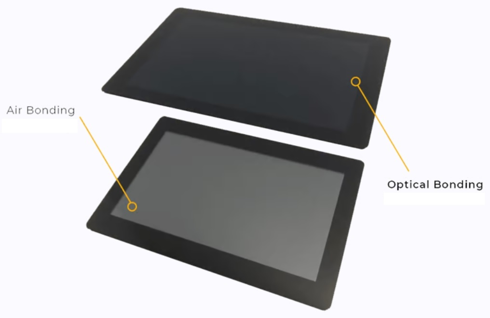

# 显示屏框贴与全贴合对比

!!! abstract "快速结论"
    本指南解释了框贴与光学贴合,相关的设计折衷以及工程师在选择显示解决方案时应验证的点.

## 核心要点

- 系统了解显示屏框贴与全贴合对比，包括关键原理、优缺点、应用场景和工程选型要点。
- 根据下文比较相关技术、应用条件和设计取舍。
- 最终选型前，应确认光学、电气、结构、环境与量产要求。

## 贴合技术分类

### 框贴

框贴技术是通过使用粘贴带 (通常是双面胶) 来沿显示屏外框的侧边与LCM结合触摸屏.因此,它是内部空气隙间.这就是为什么人们还称框贴.

1. **优势**

<figure markdown="span" class="displaywiki-figure">
  [{ width="760" loading="lazy" }](air-vs-optical-bonding-advantages.jpeg){ .displaywiki-image-link title="查看原图" }
  <figcaption>优势</figcaption>
</figure>

- 成熟工艺和稳定的产量

- 简单的工艺和低成本

- 简单的重工过程

2. **局限**

- 在TP和LCM之间的空气间隙增加反射,降低光传输率,从而降低显示性能.

- 空气间隙允许污垢和尘埃颗粒进入.

- 结构相对厚

### 光学贴合

光学贴合.通过OCA光学胶将触摸屏(或盖板)与显示屏全面粘合到一起,也称全贴合。光学贴合消除了传统液晶显示器使用光学级的粘合剂中存在的空气间隙.

<figure markdown="span" class="displaywiki-figure">
  [{ width="760" loading="lazy" }](air-vs-optical-bonding-optical-bonding.jpeg){ .displaywiki-image-link title="查看原图" }
  <figcaption>光学贴合</figcaption>
</figure>

这种贴合方式可以减少玻璃和液晶面板之间的反射量以及外部环境光的反射，提升透过率和对比度。

<figure markdown="span" class="displaywiki-figure">
  [{ width="760" loading="lazy" }](air-vs-optical-bonding-air-bonding-vs-optical-bonding-for-displays-diagram-3.png){ .displaywiki-image-link title="查看原图" }
</figure>

通过这种对比度的改善,光学贴合解决了户外显示器阳光下可视问题。

<figure markdown="span" class="displaywiki-figure">
  [{ width="760" loading="lazy" }](air-vs-optical-bonding-air-bonding-vs-optical-bonding-for-displays-diagram-4.png){ .displaywiki-image-link title="查看原图" }
</figure>

除了光学贴合带来的视觉显示优势外,

1. 首先是耐用性,光学贴合消除了设备内的空气间隙,防止灰尘和水汽的进入，保护LCD免受湿度/雾化和尘埃的影响。

2. 其次，光学全贴合尤其适合用到INCELL 的显示屏。

液晶光学贴合由三个主要阶段组成: 

1. 首先我们需要选择适当的光学清晰的OCA并贴敷在整个显示表面上.

2. 粘合和固化 触摸面板在液晶屏幕上被仔细叠加,避免任何空隙或泡.

3. 脱泡工序，采用高压脱泡的工艺，消除贴合的残留气泡

### 框贴 VS 光学贴合

<figure markdown="span" class="displaywiki-figure">
  [{ width="760" loading="lazy" }](air-vs-optical-bonding-light-transmittance-and-reflection-through-air-bonding-and-optical-bon.jpeg){ .displaywiki-image-link title="查看原图" }
  <figcaption>通过框贴和光学贴合的光传输和反射</figcaption>
</figure>

实物效果对比

<figure markdown="span" class="displaywiki-figure">
  [{ width="760" loading="lazy" }](air-vs-optical-bonding-display-on-status-sun-readable.jpeg){ .displaywiki-image-link title="查看原图" }
  <figcaption>显示OFF状态下的一体黑</figcaption>
</figure>

|  | 框贴 | 光学贴合 |
| --- | --- | --- |
| 光的反射 | 高 | 低 |
| 透过率 | 平均水平 | 较高 |
| 防湿 | 平均水平 | 非常好. |
| 防尘 | 平均水平 | 非常好. |
| 显示效果 | 平均水平 | 很好. |
| 结构强度 | 平均水平 | 强大 |
| 费用 | 平均水平 | 较高 |

选择建议

鉴于您的触摸显示器采用适用的粘合方法,我们可以分享我们的项目经验: 从显示和触摸性能来看,光学贴合比框贴更好。基于成本考虑,框贴是一个可行的选择. 在我们的项目经验中,大多数使用电容式触摸屏的项目选择了光学贴合. 

目前,这两个技术都是共同的,选择取决于项目的具体要求和预算. 根据您的要求,优奕视界可提供触两种贴合技术.

## 相关阅读

- [电容式与电阻式触摸屏对比](touch-panel-types.md)
- [GF、GFF、GG 与 PG 电容触摸结构](capacitive-touch-structures.md)
- [手套触控、防水触控与抗干扰设计](glove-waterproof-touch.md)
