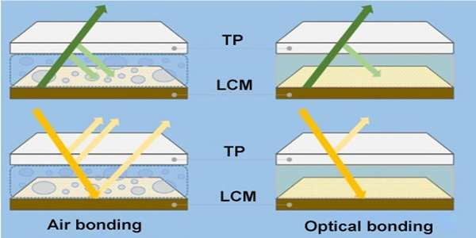

# 显示屏框贴与全贴合对比

!!! abstract "快速结论"
    框贴（Air Bonding）与光学贴合（Optical Bonding，全贴合）的差别只在触摸屏与液晶模组之间那一层：框贴靠边缘双面胶固定、中间保留空气间隙，工艺简单、成本低、易返工；光学贴合用 OCA 光学胶把两层完全粘合、消除空气层，带来更高透过率、更低反射，是解决阳光下可视性的关键手段，但成本更高、返工难度大。多数电容触摸项目会优先选择光学贴合。

## 核心要点

- 框贴在 TP 与 LCM 之间保留空气间隙，是反射增加、进灰与结构偏厚的根源。
- 光学贴合用 OCA 光学胶把触摸屏或盖板与显示屏全面粘合，消除空气层。
- 消除空气层后反射路径大幅减少，透过率与对比度提升，户外可视性明显改善。
- 光学贴合还带来防尘防水汽与结构强度提升；代价是成本更高、工艺更复杂、返工更困难。

## 1. 两种贴合方式

显示屏与触摸屏（或盖板）之间如何连接，直接决定了光学表现与可靠性。行业内主要有两种做法：框贴与光学贴合。

### 1.1 框贴（Air Bonding）

框贴通过粘贴带（通常是双面胶）沿显示屏外框的四边，把触摸屏与 LCM（液晶模组）粘接在一起，两者之间保留一层空气间隙。这正是它也被称为气隙贴合的原因。

<figure markdown="span" class="displaywiki-figure">
  [{ width="760" loading="lazy" }](air-vs-optical-bonding-advantages.jpeg){ .displaywiki-image-link title="查看原图" }
  <figcaption>框贴结构剖面：触摸屏（TP）与液晶模组（LCM）之间保留一层空气间隙，两者仅靠边缘的双面胶粘接固定，这也是"框贴"名称的由来。</figcaption>
</figure>

**优势**

- 工艺成熟，产量稳定
- 工序简单，成本低
- 返工（重工）流程简单

**局限**

- TP 与 LCM 之间的空气间隙会增加反射、降低光透过率，从而拉低显示性能。
- 空气间隙为灰尘与颗粒物提供了进入通道。
- 整体结构相对偏厚。

### 1.2 光学贴合（Optical Bonding）

光学贴合通过 OCA 光学胶，把触摸屏（或盖板）与显示屏全面粘合在一起，因此也被称为全贴合。它消除了传统框贴结构中存在的那层空气间隙。

<figure markdown="span" class="displaywiki-figure">
  [{ width="760" loading="lazy" }](air-vs-optical-bonding-optical-bonding.jpeg){ .displaywiki-image-link title="查看原图" }
  <figcaption>光学贴合结构剖面：TP 与 LCM 之间由光学胶完全填充，空气层被消除，界面折射突变随之消失。</figcaption>
</figure>

这种贴合方式可以减少玻璃与液晶面板之间的反射，以及外部环境光的反射，从而提升透过率与对比度。

<figure markdown="span" class="displaywiki-figure">
  [{ width="760" loading="lazy" }](air-vs-optical-bonding-air-bonding-vs-optical-bonding-for-displays-diagram-3.png){ .displaywiki-image-link title="查看原图" }
  <figcaption>光路对比：左侧框贴因存在空气间隙，环境光在界面之间多次反射并散射，进入面板的有效光减少；右侧光学贴合消除空气层后，反射路径明显减少，光损失更小。</figcaption>
</figure>

正是这种对比度的改善，让光学贴合成为解决户外显示器"阳光下可视"问题的关键手段。

<figure markdown="span" class="displaywiki-figure">
  [{ width="760" loading="lazy" }](air-vs-optical-bonding-air-bonding-vs-optical-bonding-for-displays-diagram-4.png){ .displaywiki-image-link title="查看原图" }
  <figcaption>强环境光下的实际显示效果对比：左侧普通 LCD 因表面反射而明显发白、对比度下降；右侧光学贴合 LCD 的色彩饱和度与对比度基本保持，这正是解决"阳光下可视"问题的关键。</figcaption>
</figure>

除了光学上的改善，光学贴合还带来两点实际收益：

1. **耐用性提升**：消除设备内部的空气间隙后，灰尘与水汽难以进入，LCD 得以免受湿度、雾化与尘埃的影响。
2. **适配 In-Cell 屏**：光学全贴合尤其适合 In-Cell 结构的显示屏。

**液晶光学贴合的三个主要阶段**

1. 选择合适的光学级 OCA 胶，并贴敷在整个显示表面上。
2. 粘合与固化：把触摸面板仔细叠加在液晶屏上，避免任何空隙或气泡。
3. 脱泡：采用高压脱泡工艺，消除贴合过程中残留的气泡。

## 2. 框贴与光学贴合对比

<figure markdown="span" class="displaywiki-figure">
  [{ width="760" loading="lazy" }](air-vs-optical-bonding-light-transmittance-and-reflection-through-air-bonding-and-optical-bon.jpeg){ .displaywiki-image-link title="查看原图" }
  <figcaption>框贴与光学贴合在光传输与反射上的差异：左侧空气层界面的多次反射被右侧的连续光学介质消除</figcaption>
</figure>

整机外观上的差异同样直观：

<figure markdown="span" class="displaywiki-figure">
  [{ width="760" loading="lazy" }](air-vs-optical-bonding-display-on-status-sun-readable.jpeg){ .displaywiki-image-link title="查看原图" }
  <figcaption>整机外观对比：上方框贴因空气间隙反射环境光，熄屏时屏幕偏灰、边缘发亮；下方光学贴合呈现一体黑，黑度更深、盖板与显示区过渡更干净。</figcaption>
</figure>

| 对比项 | 框贴 | 光学贴合 |
|---|---|---|
| 光的反射 | 高 | 低 |
| 透过率 | 中等 | 较高 |
| 防湿 | 中等 | 优秀 |
| 防尘 | 中等 | 优秀 |
| 显示效果 | 中等 | 很好 |
| 结构强度 | 中等 | 强 |
| 成本 | 中等 | 较高 |
| 返工难度 | 简单 | 困难 |

## 3. 选型建议

从显示与触摸性能来看，光学贴合明显优于框贴；从成本角度看，框贴是可行的折中方案。在项目实践中，多数采用电容式触摸屏的项目最终选择了光学贴合。

两种技术在当下都有广泛应用，选择取决于项目对光学表现、可靠性、结构厚度与预算的具体要求。优奕视界可同时提供框贴与光学贴合两种工艺方案。

## 4. 常见问题（FAQ）

??? question "Q1：框贴和光学贴合最本质的区别是什么？"
    区别只在触摸屏与液晶模组之间那一层介质。框贴用边缘双面胶固定，中间保留空气间隙；光学贴合用 OCA 光学胶把两层全面粘合，空气层被完全消除。空气层的存在与否，直接决定了反射、透过率、进灰风险与结构厚度。

??? question "Q2：光学贴合为什么能改善阳光下可视性？"
    因为空气与玻璃的折射率差异很大，环境光在空气层界面会产生明显反射，把屏幕本身发出的光"淹没"。光学贴合用折射率接近玻璃的光学胶填充间隙，消除界面突变，反射路径大幅减少，对比度因而提升，在强环境光下画面不易发白。

??? question "Q3：框贴的返工真的比光学贴合简单吗？"
    是的。框贴只依靠边缘胶带固定，拆解时对 TP 与 LCM 的损伤风险较低；光学贴合是整面粘合，拆解需要专门的分割与清理工艺，且分离后 OCA 残胶处理困难，通常意味着 TP 或 LCM 报废，因此返工成本高得多。

??? question "Q4：OCA 和 OCR 有什么区别？"
    两者都是光学胶，差别在形态与工艺。OCA 是固态光学胶膜，需要按尺寸裁切后真空贴合，工艺稳定、厚度均匀，适合标准化产线；OCR 是液态光学胶，通过点胶后固化，能更好地适应曲面或不规则边界，但工艺控制难度更高。选型需结合屏体形状与产量。

??? question "Q5：什么情况下选框贴更合适？"
    预算敏感、对光学表现要求不高、或需要频繁返工与维修的项目适合框贴。此外，小批量试产或结构上必须保留可拆性的场景，框贴的工艺门槛与风险都更低。若应用环境无强环境光、也无防尘防水要求，框贴的劣势不会明显暴露。

??? question "Q6：光学贴合能提升结构强度吗？"
    能。整面粘合后，触摸屏与液晶模组形成一个整体受力结构，抗冲击与抗弯能力优于仅靠边缘固定的框贴。因此在需要更强机械可靠性的整机设计中，光学贴合同样是加分项。

## 相关阅读

- [电容式与电阻式触摸屏对比](touch-panel-types.md)
- [GF、GFF、GG 与 PG 电容触摸结构](capacitive-touch-structures.md)
- [手套触控、防水触控与抗干扰设计](glove-waterproof-touch.md)

## 参考数据来源

本文涉及的标准、规格与资料：

- [阳光下可视方案](https://viewedisplay.com/sun-readable/)
- [IPC-A-610 电子组件的可接受性](https://shop.ipc.org/ipc-a-610)

!!! info "没有找到您需要的内容？"
    如果您需要更多产品、资源或技术支持，欢迎联系我们的团队：

    [**:material-archive-arrow-down: 知识库**](../../knowledge/tags.md){ .md-button .md-button--primary }
    [**:material-magnify: 产品与解决方案**](https://www.chinasunyee.com){ .md-button }
    [**:material-email: 联系技术支持**](mailto:info@chinasunyee.com){ .md-button }
