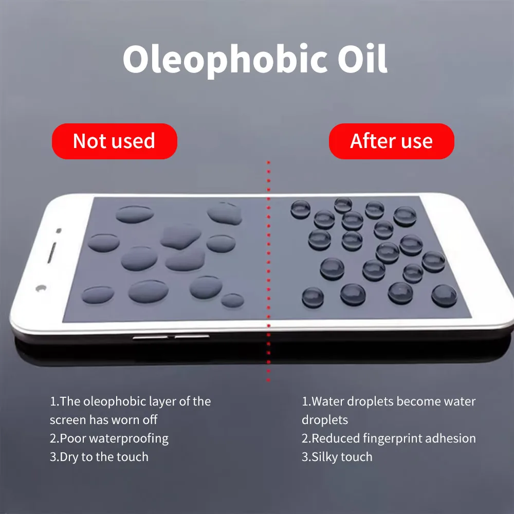
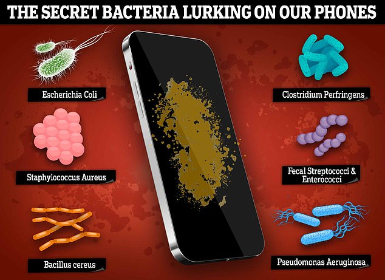
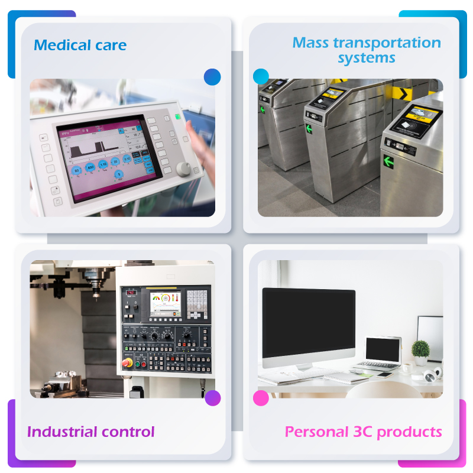
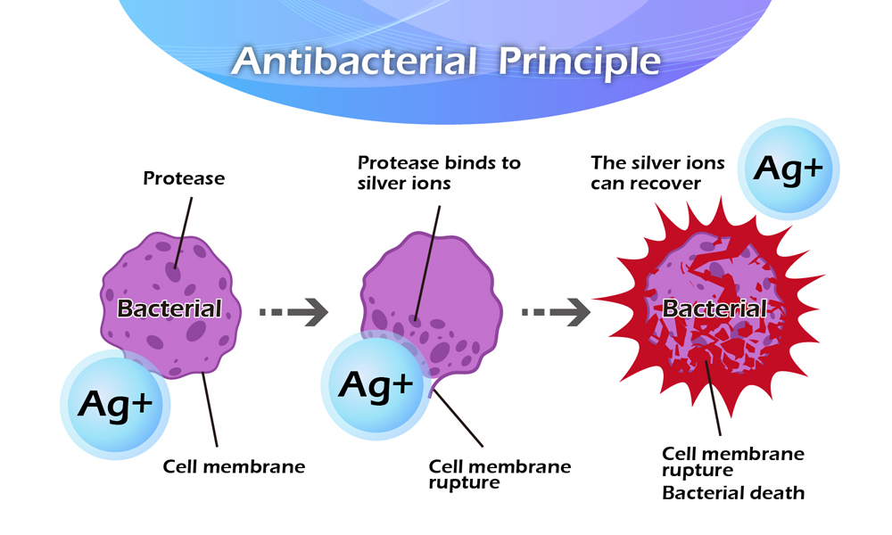
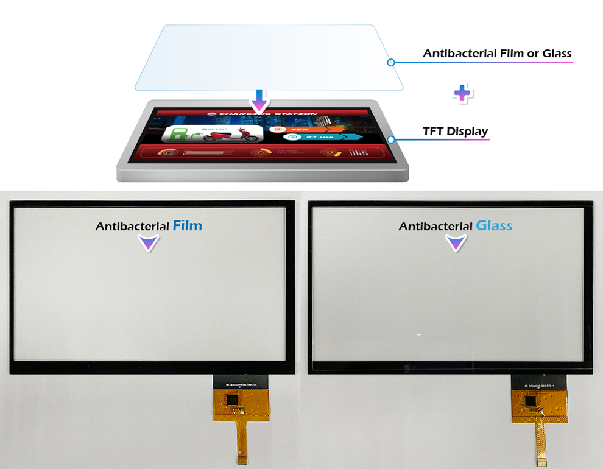
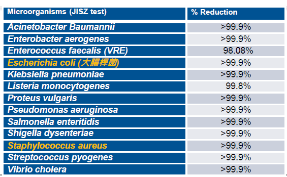

# 盖板防指纹与抗菌表面处理

!!! abstract "快速结论"
    本指南解释了防指纹和抗菌玻璃,相关的设计差距以及工程师在选择显示解决方案时应该验证的点.

## 核心要点

- 系统了解盖板防指纹与抗菌表面处理，包括关键原理、优缺点、应用场景和工程选型要点。
- 根据下文比较相关技术、应用条件和设计取舍。
- 最终选型前，应确认光学、电气、结构、环境与量产要求。

## AF:防指纹

防指纹技术的作用

反指纹 (AF) 技术旨在尽量减少对盖板玻璃表面的指纹,污染物和其他污染物的存在,确保设备在使用过程中保持清洁和视觉吸引力.AF技术的主要作用包括:

减少指纹残留量:AF涂层有效降低玻璃表面的指纹粘合性,保持屏幕清洁,保持原始外观.

轻松清洁:AF涂料具有水和油性特性,使其更容易擦除污垢和指纹,从而保持屏幕的透明度.

增强耐用性:AF涂层不仅减少了指纹残留量,而且还提高了表面耐用度,防止每天使用的划痕和磨损,从而延长了设备的寿命.

改善用户体验:通过减少指纹和污染,AF涂层为用户提供更清洁,更清晰的屏幕,提高整体视觉体验并降低经常清洁的需要.

<figure markdown="span" class="displaywiki-figure">
  [{ width="760" loading="lazy" }](anti-fingerprint-antibacterial-the-advantages-of-af-anti-fingerprint-technology.jpeg){ .displaywiki-image-link title="查看原图" }
  <figcaption>抗指纹技术的优势</figcaption>
</figure>

采用AF技术覆盖板玻璃提供了几个优势,提高了用户体验和维护便利性:

设备外观改善:AF涂层使屏幕表面更平滑,更清洁,保持优质的外观,特别是在高端电子产品上,突出其精致和高质量的设计.

降低维护成本:由于AF涂层使屏幕更容易清洁,因此用户不需要经常清洁和维护屏幕,从而减少维护费用和时间.

设备寿命延长:AF涂层有效地防止痕和磨损,保护屏幕表面并确保设备在更长时间内保持良好状态.

提高用户满意度:清洁,无指纹的屏幕表面提供更好的视觉质量和更愉快的用户体验,从而增加对设备的整体满意性.

<figure markdown="span" class="displaywiki-figure">
  [{ width="760" loading="lazy" }](anti-fingerprint-antibacterial-processes-and-techniques-for-implementing-af-anti-fingerprint-technolo.png){ .displaywiki-image-link title="查看原图" }
  <figcaption>实施AF (反指纹) 技术的过程和技术</figcaption>
</figure>

实施AF涂层涉及各种工艺和技术,主要包括:

表面准备:在使用AF涂层之前,必须清洁和预处理玻璃表面,以确保它没有尘埃,无油和无湿度.这通常包括超声波清洗和血清洗等过程.

溶凝方法:一种常见的AF涂层方法是 sol-gel 过程.这种方法包括通过化学反应在玻璃表面创建薄有机或无机聚合物膜,从而提供水性和油性特征.

空气沉积:包括物理蒸汽沉积 (PVD) 和化学蒸汽存储 (CVD) 在内的真空沉积技术涉及在真空环境中将原子或分子形式的涂层材料沉积在玻璃表面上,形成具有反指纹性质的薄膜.

喷涂:喷涂技术包括将防指纹涂层均地喷涂在玻璃表面上.此过程需要仔细控制涂料的统一性和厚度,以确保有效性.

紫外线固化:一些AF涂料需要UV固化才能达到最佳性能. UV固化增强了涂料的粘合性和耐久性,提高了反指纹效果.

实施反指纹技术的关键步骤

基板准备:选择合适的玻璃或塑料基板,并进行清洁处理以确保无尘,无油和没有湿度的表面.

涂料应用:根据具体的应用要求,选择适当的涂层过程 (如凝,真空沉积,喷涂等) 并均地将防指纹涂料应用于基板表面.

固化和硬化:对于一些涂料,在应用后需要固化及硬化的过程.这些过程可能包括热处理,紫外线硬化或其他化学反应,具体取决于使用的涂料整理.

质量控制:使用光学显微镜,接触角测量和其他方法检查涂料的均性,粘合性,耐用性和反指纹效果,以确保符合设计规格.

最终检查和包装:进行彻底的检查,以确保没有缺陷.

## 结论

在盖板玻璃中应用AF (反指纹) 技术显著减少了指纹和污垢残留物,从而提高了设备的外观和用户体验. 通过各种工艺和技术,如凝,真空沉积,喷涂涂料和紫外线固化,实现了高质量的防指纹涂料. 这不仅提高了设备的市场竞争力,而且还提供了多种优势,包括降低维护成本和延长设备使用寿命. 未来,随着技术的不断进步,AF涂料的性能和应用领域将进一步扩大,为更多显示设备提供优质的用户体验.

## 抗菌处理

抗菌盖板玻璃的作用

抗菌盖板玻璃旨在抑制电子设备表面的细菌,病毒和其他微生物的生长和传播.抗菌蓋玻璃的主要作用包括:

减少微生物污染:通过将抗菌剂纳入玻璃中,可显著降低有害微生物的生长.这有助于保持更干净的表面,特别是在智能手机,平板电脑和公共门等高度接触的地方.

提高卫生状况:抗菌盖板玻璃通过最小化通过触摸传染微生物的风险来促进更好的卫生. 这在医院,学校和公共交通等环境中尤其重要,其中清洁是至关重要的.

提供持久保护:封面玻璃的抗菌性质旨在具有持久性,为整个设备使用寿命提供对微生物污染的持续保护.

提高用户信心:知道他们的设备受到有害微生物的保护,可以给用户带来安宁,特别是在全球卫生问题如流行病的情况下.

<figure markdown="span" class="displaywiki-figure">
  [{ width="760" loading="lazy" }](anti-fingerprint-antibacterial-the-advantages-of-anti-bacteria-cover-glass.jpeg){ .displaywiki-image-link title="查看原图" }
  <figcaption>抗菌遮盖板玻璃的好处</figcaption>
</figure>

<figure markdown="span" class="displaywiki-figure">
  [{ width="760" loading="lazy" }](anti-fingerprint-antibacterial-the-advantages-of-anti-bacteria-cover-glass.png){ .displaywiki-image-link title="查看原图" }
  <figcaption>抗菌遮盖板玻璃的好处</figcaption>
</figure>

<figure markdown="span" class="displaywiki-figure">
  [{ width="760" loading="lazy" }](anti-fingerprint-antibacterial-the-advantages-of-anti-bacteria-cover-glass-2.jpeg){ .displaywiki-image-link title="查看原图" }
  <figcaption>抗菌遮盖板玻璃的好处</figcaption>
</figure>

在盖板玻璃中应用抗菌技术提供了几个优势,提高了用户体验和电子设备的安全性:

健康与安全:抗菌涂层玻璃通过减少经常触摸的表面上的细菌和病毒存在,有助于防止传染病传播.

减少清洁频率:由于抗菌特性,设备需要更少的清洗,这可以为用户节省时间和精力.

提高设备寿命:抗菌涂层还可以保护对微生物生长造成的表面退化,从而延长设备盖板玻璃的使用寿命.

市场差异化:采用抗菌技术可以在竞争激烈的市场中区分产品,吸引健康意识的消费者和具有严格卫生要求的行业.

<figure markdown="span" class="displaywiki-figure">
  [{ width="760" loading="lazy" }](anti-fingerprint-antibacterial-processes-and-techniques-for-implementing-anti-bacteria-cover-glass.jpeg){ .displaywiki-image-link title="查看原图" }
  <figcaption>实施抗菌盖板玻璃的过程和技术</figcaption>
</figure>

<figure markdown="span" class="displaywiki-figure">
  [{ width="760" loading="lazy" }](anti-fingerprint-antibacterial-processes-and-techniques-for-implementing-anti-bacteria-cover-glass-2.jpeg){ .displaywiki-image-link title="查看原图" }
  <figcaption>实施抗菌盖板玻璃的过程和技术</figcaption>
</figure>

在盖板玻璃中实现抗菌性质涉及各种工艺和技术,包括:

抗菌剂的加入:在制造过程中,可以将银离子,铜或等抗细虫剂纳入玻璃中.这些药物破坏了微生物的细胞功能,阻止它们的生长和繁殖.

表面涂料:通过对玻璃表面施加涂料,还可以实现抗菌性质.这些涂料通常含有抗菌剂,以防止微生物的防护屏障.

离子交换过程:这种过程包括通过化学水浴取代玻璃中的离子,用抗菌离子 (例如银离子).

溶凝过程: sol-gel 过程涉及创建一个状悬浮 (sol) 转变为一种类似凝的网络 (gel).反细菌剂被纳入 sol,然后将其应用到玻璃表面并固化以形成持久的抗菌涂层.

塑料处理:可以使用塑料治疗来增强抗菌涂层对玻璃表面的粘合性.此过程包括将玻璃暴露于血,从而改变其表面特性并改善抗细病毒涂层的结合性

VIEWE 抗菌剂:

当细菌或细菌接触到产品表面时,产品的银离子会与细菌或者细菌的细胞膜接触. 在两者反应中,银离子会迅速有效地摧毁细菌和微生物; 在此之后,银离子将从死细菌和细菌中释放出来,然后继续对其他接触活细菌及细菌进行重复的生物化学反应,直到细菌与细菌被消除.银离ons的影响是长期的杀菌剂,具有持久效果.

<figure markdown="span" class="displaywiki-figure">
  [{ width="760" loading="lazy" }](anti-fingerprint-antibacterial-viewe-antibacterial-solutions.jpeg){ .displaywiki-image-link title="查看原图" }
  <figcaption>VIEWE 抗菌剂</figcaption>
</figure>

VIEWE推出相关抗菌系列产品,在长期使用后将保持抗菌效果. 生物测试结果显示,它有效地抑制埃舍里奇亚 coli和斯塔菲洛科克 aureus,抗菌效果达到99%以上,反细菌能力随着时间的推移不会下降.

<figure markdown="span" class="displaywiki-figure">
  [{ width="760" loading="lazy" }](anti-fingerprint-antibacterial-anti-fingerprint-and-antibacterial-cover-lens-treatments-diagram-9.jpeg){ .displaywiki-image-link title="查看原图" }
</figure>

它通过使用高温离子交换方法来交换和结合银离子与玻璃中的其他离子.如图所示,抗菌玻璃的抗菌效果非常好.同时,它的光学特性和表面痕耐性都具有出色性能. 对于产品组合,设计考虑因素可以与盖板玻璃相结合.

<figure markdown="span" class="displaywiki-figure">
  [{ width="760" loading="lazy" }](anti-fingerprint-antibacterial-99-kill-rate-at-broad-range-of-bacteria-jisz-and-iso-test.jpeg){ .displaywiki-image-link title="查看原图" }
  <figcaption>在广泛的细菌中死亡率 > 99% (JISZ和ISO测试)</figcaption>
</figure>

<figure markdown="span" class="displaywiki-figure">
  [{ width="760" loading="lazy" }](anti-fingerprint-antibacterial-99-kill-rate-at-broad-range-of-bacteria-jisz-and-iso-test.png){ .displaywiki-image-link title="查看原图" }
  <figcaption>在广泛的细菌中死亡率 > 99% (JISZ和ISO测试)</figcaption>
</figure>

<figure markdown="span" class="displaywiki-figure">
  [{ width="760" loading="lazy" }](anti-fingerprint-antibacterial-conclusion.png){ .displaywiki-image-link title="查看原图" }
  <figcaption>结论</figcaption>
</figure>

通过制有害微生物的生长,抗菌盖板玻璃在提高电子设备的卫生和安全方面发挥着关键作用. 这种技术不仅为健康和安全带来了好处,而且还提供了减少清洁频率,提高设备寿命以及市场差异化等优势. 随着对卫生安全电子设备的需求不断增长,抗菌防护玻璃的实施和开发将进一步扩大,为不同环境中的用户提供优质保护和安宁.

## 相关阅读

- [显示屏盖板材料、厚度与表面处理](cover-lens-materials-treatments.md)
- [显示屏减反射与防眩光处理对比](anti-reflective-vs-anti-glare.md)
- [显示产品盖板定制指南](cover-lens-customization.md)
