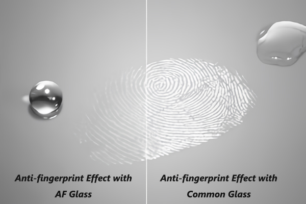
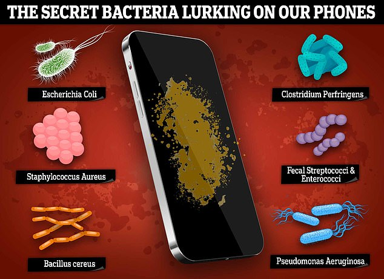
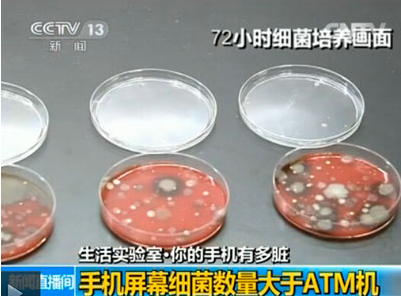
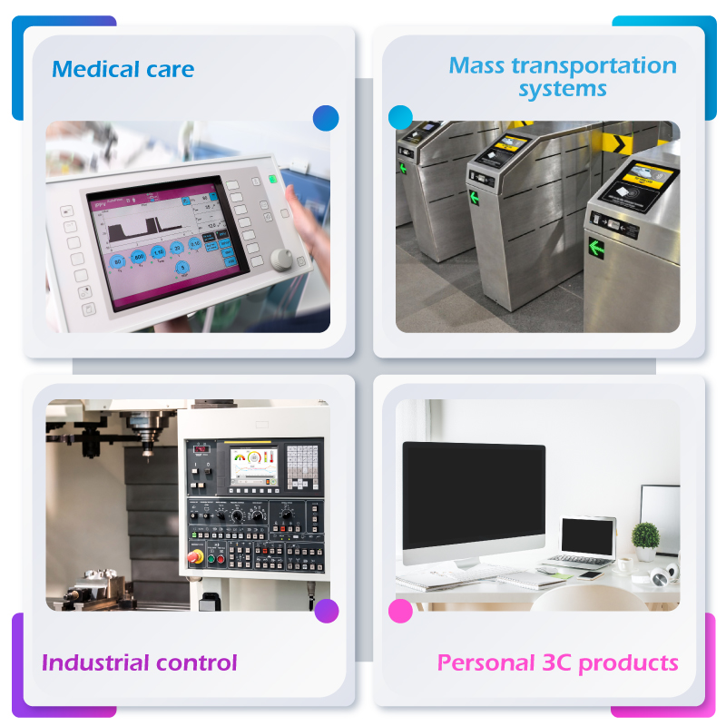
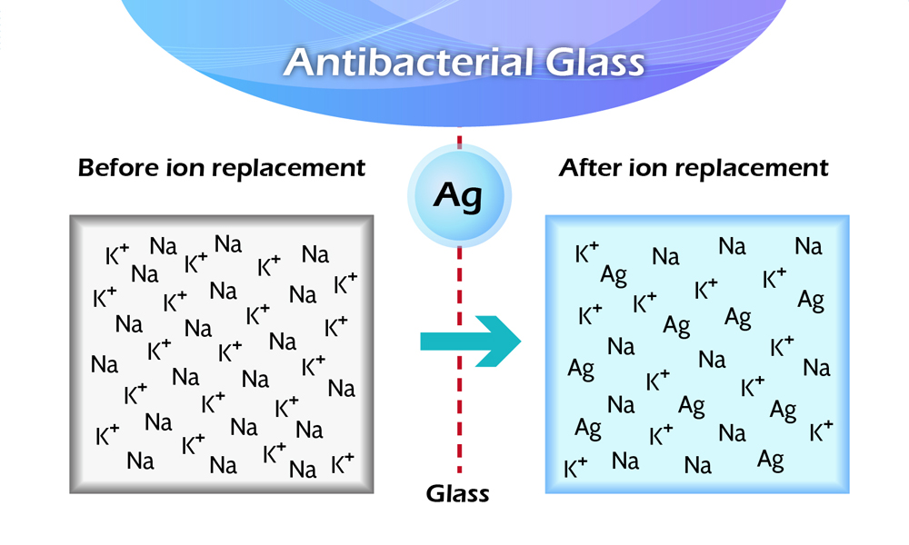
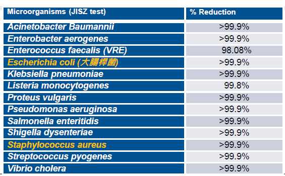

# 盖板防指纹与抗菌表面处理

!!! abstract "快速结论"
    盖板玻璃除了透光与保护，还可以承担两项功能：AF 防指纹处理通过疏油疏水涂层减少指纹与污渍附着，让屏幕更易清洁；抗菌处理通过银离子等抗菌成分抑制表面微生物繁殖。两者工艺路线不同，可以叠加使用，选择时要结合使用场景、耐磨寿命与成本综合判断。

## 核心要点

- AF（Anti-Fingerprint）涂层的本质是一层疏油疏水薄膜，降低指纹与油污的附着力，同时带来顺滑触感。
- AF 涂层的实施方式包括溶胶凝胶、真空沉积（PVD / CVD）、喷涂与 UV 固化，工艺不同则耐久性不同。
- 抗菌盖板通过银离子等抗菌成分抑制微生物，实现路径分为"贴抗菌膜"与"玻璃本体掺杂"两类。
- 抗菌性能需要通过标准测试验证（如 JISZ、ISO 方法），并关注刮擦后的衰减情况，而非只看初始指标。

## 1. 盖板表面的两类功能处理

盖板玻璃是用户与设备直接接触的界面。除了透光、耐磨与保护显示模组，它还可以通过表面处理获得两项附加功能：一是防指纹（AF），解决"屏幕总留指纹"的问题；二是抗菌，解决"高频接触表面滋生微生物"的问题。两者目标不同，工艺也各自独立。

## 2. AF 防指纹处理

### 2.1 作用

AF 技术的目标是尽量减少指纹、油污与其他污染物在盖板玻璃表面的附着，让设备在使用过程中保持清洁与视觉观感。主要作用包括：

- **减少指纹残留**：涂层有效降低玻璃表面对指纹油脂的附着力，保持屏幕清洁与原貌。
- **易于清洁**：涂层具备疏水疏油特性，污渍与指纹更容易被擦除，维持屏幕通透度。
- **增强耐用性**：涂层在减少指纹的同时也提升表面耐磨性，抵御日常使用中的划痕与磨损，延长设备寿命。
- **改善体验**：更清洁清晰的屏幕提高整体视觉体验，并减少频繁清洁的需要。

<figure markdown="span" class="displaywiki-figure">
  [{ width="760" loading="lazy" }](anti-fingerprint-antibacterial-the-advantages-of-af-anti-fingerprint-technology.jpeg){ .displaywiki-image-link title="查看原图" }
  <figcaption>AF 玻璃与普通玻璃的效果对比：左侧为 AF 玻璃，水滴保持球形、表面无指纹残留；右侧为普通玻璃，水滴摊开成片、指纹痕迹清晰可见。</figcaption>
</figure>

### 2.2 采用 AF 技术的收益

- **改善外观**：表面更平滑洁净，在高端电子产品上尤为明显。
- **降低维护成本**：屏幕更易清洁，用户无需频繁维护，减少时间与耗材支出。
- **延长设备寿命**：有效抵御划痕与磨损，保护屏幕表面。
- **提升用户满意度**：干净无指纹的表面带来更好的视觉质量。

### 2.3 工艺与技术

实施 AF 涂层涉及多种工艺与技术，主要包括：

- **表面准备**：涂布前必须清洁并预处理玻璃表面，确保无尘、无油、无水分，通常包括超声波清洗与等离子清洗等步骤。
- **溶胶凝胶法**：通过化学反应在玻璃表面生成薄的有机或无机聚合物膜，从而赋予疏水疏油特性。
- **真空沉积**：包括物理气相沉积（PVD）与化学气相沉积（CVD），在真空环境中把涂层材料以原子或分子形式沉积到玻璃表面，形成具有防指纹性质的薄膜。
- **喷涂**：把防指纹涂料均匀喷涂在玻璃表面，需要严格控制涂层的均匀性与厚度以保证有效性。
- **UV 固化**：部分 AF 涂料需要紫外固化才能达到最佳性能，UV 固化可增强涂层的结合力与耐久性。

### 2.4 实施关键步骤

1. **基板准备**：选择合适的玻璃或塑料基板并做清洁处理，确保无尘、无油、无水分。
2. **涂料应用**：根据应用要求选择合适工艺（溶胶凝胶、真空沉积、喷涂等），将防指纹涂料均匀涂布在基板表面。
3. **固化与硬化**：部分涂料在涂布后需固化与硬化，方式包括热处理、紫外线硬化或其他化学反应，取决于涂料类型。
4. **质量控制**：使用光学显微镜、接触角测量等方法检查涂层的均匀性、结合力、耐久性与防指纹效果，确认是否符合设计规格。
5. **最终检查与包装**：进行彻底检查，确保没有缺陷后进入包装。

<figure markdown="span" class="displaywiki-figure">
  [{ width="760" loading="lazy" }](anti-fingerprint-antibacterial-processes-and-techniques-for-implementing-af-anti-fingerprint-technolo.png){ .displaywiki-image-link title="查看原图" }
  <figcaption>疏油涂层的作用：左侧为涂层损耗后的状态，水滴摊开、防水性差、触感干涩；右侧为涂层完好时，水滴成珠、指纹附着减少、触感顺滑。这也是评估 AF 涂层是否失效的直观判据。</figcaption>
</figure>

**小结**：在盖板玻璃上应用 AF 技术可显著减少指纹与污垢残留，提升设备外观与使用体验。溶胶凝胶、真空沉积、喷涂与 UV 固化等工艺各有适用范围，实际方案常组合使用。

## 3. 抗菌处理

### 3.1 作用

抗菌盖板玻璃的目标是抑制电子设备表面细菌、病毒与其他微生物的生长与传播，主要作用包括：

- **减少微生物污染**：把抗菌剂引入玻璃中，可显著降低有害微生物的繁殖，在智能手机、平板电脑与公共门把手等高频接触场景中尤为重要。
- **提高卫生状况**：通过降低接触传播微生物的风险促进卫生，在医院、学校与公共交通等场所尤其重要。
- **提供持久保护**：抗菌性质贯穿设备使用寿命，提供对微生物污染的持续抑制。
- **提高用户信心**：在公共卫生事件频发的背景下，让用户对设备表面的卫生状况更放心。

<figure markdown="span" class="displaywiki-figure">
  [{ width="760" loading="lazy" }](anti-fingerprint-antibacterial-the-advantages-of-anti-bacteria-cover-glass.jpeg){ .displaywiki-image-link title="查看原图" }
  <figcaption>手机表面常见的致病菌：包括大肠杆菌（Escherichia Coli）、金黄色葡萄球菌（Staphylococcus Aureus）、蜡样芽孢杆菌（Bacillus cereus）、产气荚膜梭菌（Clostridium Perfringens）、粪链球菌与肠球菌、铜绿假单胞菌（Pseudomonas Aeruginosa）等。</figcaption>
</figure>

<figure markdown="span" class="displaywiki-figure">
  [{ width="760" loading="lazy" }](anti-fingerprint-antibacterial-the-advantages-of-anti-bacteria-cover-glass.png){ .displaywiki-image-link title="查看原图" }
  <figcaption>媒体对手机屏幕细菌的培养实验：72 小时培养结果显示，手机屏幕的细菌数量高于 ATM 机。高频触摸且不便清洁的表面，正是抗菌盖板的主要目标场景。</figcaption>
</figure>

<figure markdown="span" class="displaywiki-figure">
  [{ width="760" loading="lazy" }](anti-fingerprint-antibacterial-the-advantages-of-anti-bacteria-cover-glass-2.jpeg){ .displaywiki-image-link title="查看原图" }
  <figcaption>家庭场景中的接触风险：婴幼儿与儿童常把设备贴近面部甚至放入口中，使高频接触表面的卫生要求进一步提高。</figcaption>
</figure>

<figure markdown="span" class="displaywiki-figure">
  [{ width="760" loading="lazy" }](anti-fingerprint-antibacterial-processes-and-techniques-for-implementing-anti-bacteria-cover-glass-2.jpeg){ .displaywiki-image-link title="查看原图" }
  <figcaption>教育娱乐场景：儿童使用平板时长时间、大面积触摸屏幕，抗菌处理可降低接触传播风险。</figcaption>
</figure>

### 3.2 抗菌技术的收益

- **健康与安全**：减少经常触摸表面上的细菌与病毒，有助于防止传染病传播。
- **减少清洁频率**：具备抗菌特性后，设备所需的清洁次数更少，节省时间与精力。
- **延长设备寿命**：抗菌涂层可减缓微生物生长导致的表面退化，延长盖板玻璃寿命。
- **市场差异化**：在竞争激烈的市场中形成卖点，吸引关注健康及有严格卫生要求的行业客户。

### 3.3 实现工艺

在盖板玻璃中实现抗菌性质的工艺路径包括：

- **抗菌剂掺入**：制造过程中把银离子、铜等抗菌成分引入玻璃。这些成分破坏微生物的细胞功能，阻止其生长与繁殖。
- **表面涂布**：在玻璃表面施加含抗菌剂的涂层，形成抑制微生物的屏障。
- **离子交换**：通过化学浴把玻璃中的离子置换成抗菌离子（例如银离子）。
- **溶胶凝胶**：溶胶凝胶过程先形成溶胶，再转变为凝胶网络。把抗菌剂加入溶胶中，涂布到玻璃表面后固化，形成持久抗菌涂层。
- **等离子处理**：通过等离子体处理改变玻璃表面特性，增强抗菌涂层与表面的结合力。

<figure markdown="span" class="displaywiki-figure">
  [{ width="760" loading="lazy" }](anti-fingerprint-antibacterial-processes-and-techniques-for-implementing-anti-bacteria-cover-glass.jpeg){ .displaywiki-image-link title="查看原图" }
  <figcaption>抗菌盖板的主要应用场景：医疗护理设备、公共交通闸机、工业控制面板与个人 3C 产品。这些场景的共同点是表面被多人高频接触且难以频繁清洁。</figcaption>
</figure>

### 3.4 银离子抗菌原理

抗菌成分中，银离子的作用机制最为典型。当细菌接触到产品表面时，玻璃中的银离子会与细菌的细胞膜接触：

<figure markdown="span" class="displaywiki-figure">
  [{ width="760" loading="lazy" }](anti-fingerprint-antibacterial-viewe-antibacterial-solutions.jpeg){ .displaywiki-image-link title="查看原图" }
  <figcaption>银离子抗菌原理：银离子（Ag⁺）与细菌的蛋白酶结合，破坏细胞膜结构，导致细胞内容物外泄、细菌死亡。反应结束后银离子重新释放，可继续作用于其他细菌，因此具有长期的杀菌效果。</figcaption>
</figure>

银离子在反应中迅速并有效地破坏细菌与微生物的结构；反应完成后，银离子会从已死亡的细菌中释放出来，继续与后续接触到的活菌发生反应，因此是一种具有持久效果的长期杀菌剂。

<figure markdown="span" class="displaywiki-figure">
  [{ width="760" loading="lazy" }](anti-fingerprint-antibacterial-anti-fingerprint-and-antibacterial-cover-lens-treatments-diagram-9.jpeg){ .displaywiki-image-link title="查看原图" }
  <figcaption>抗菌玻璃的离子交换工艺：高温下通过化学浴把银离子置入玻璃网络，置换原有的钠（Na）与钾（K）离子。由于抗菌成分结合在玻璃本体中，因此不易被磨掉，效果可长期保持。</figcaption>
</figure>

## 4. 优奕视界抗菌方案

优奕视界的抗菌方案通过高温离子交换方法，把银离子交换并结合到玻璃中。该方案在保持良好抗菌效果的同时，光学特性与表面耐刮擦性也表现出色，可与其他盖板玻璃设计要素（厚度、表面处理、外形）组合。

<figure markdown="span" class="displaywiki-figure">
  [{ width="760" loading="lazy" }](anti-fingerprint-antibacterial-99-kill-rate-at-broad-range-of-bacteria-jisz-and-iso-test.jpeg){ .displaywiki-image-link title="查看原图" }
  <figcaption>抗菌盖板的两种实现形态：上方为结构示意——抗菌膜或抗菌玻璃与 TFT 显示屏叠合；下方为实物对比——左侧为抗菌膜（Film，以贴附方式实现），右侧为抗菌玻璃（Glass，玻璃本体掺杂）。两者都带有 FPC，可直接与模组集成。</figcaption>
</figure>

在长期使用后，优奕视界的抗菌系列产品仍能保持抗菌效果。生物测试结果显示，它对大肠杆菌与金黄色葡萄球菌有显著抑制作用，抗菌效果达到 99% 以上，且抗菌性能随时间推移不会下降。

<figure markdown="span" class="displaywiki-figure">
  [{ width="760" loading="lazy" }](anti-fingerprint-antibacterial-99-kill-rate-at-broad-range-of-bacteria-jisz-and-iso-test.png){ .displaywiki-image-link title="查看原图" }
  <figcaption>抗菌性能测试数据（JISZ 方法）：对鲍曼不动杆菌、产气肠杆菌、大肠杆菌、肺炎克雷伯菌、绿脓杆菌、鼠伤寒沙门氏菌、痢疾志贺氏菌、金黄色葡萄球菌、化脓性链球菌、霍乱弧菌等十余种微生物的杀灭率多数高于 99.9%，其中耐万古霉素屎肠球菌（VRE）为 98.08%。</figcaption>
</figure>

更值得关注的是抗菌效果的耐久性：盖板在经历刮擦后是否仍能维持抗菌率，决定了它能否覆盖设备的完整使用寿命。

<figure markdown="span" class="displaywiki-figure">
  [{ width="760" loading="lazy" }](anti-fingerprint-antibacterial-conclusion.png){ .displaywiki-image-link title="查看原图" }
  <figcaption>耐磨性对比：经 2000 次刮擦后，优奕视界的抗菌盖板仍保持 99.90% 的抗菌率，而对比产品分别下降到 92% 与 62%。这说明抗菌效果是否"长在玻璃里"直接决定其寿命表现。</figcaption>
</figure>

## 5. 组合方式与选型要点

**组合方式**：AF 与抗菌处理作用于不同目标，可以叠加——先做抗菌处理（本体掺杂或抗菌膜），再做 AF 表面涂层，使盖板同时具备易清洁与抗菌两项特性。需要注意的是，AF 涂层位于最外层，其耐磨寿命通常短于玻璃本体的抗菌特性。

**选型要点**

- **明确场景优先级**：公共自助终端、医疗设备优先抗菌；手持与触控密集型产品优先 AF 手感与易清洁。
- **区分两种抗菌形态**：抗菌玻璃（本体掺杂）耐久性更好但成本更高；抗菌膜（贴附）成本更低、可后装，但需评估膜层寿命与边缘处理。
- **核对抗菌谱与测试标准**：确认目标菌种是否在测试覆盖范围内，并要求提供 JISZ / ISO 等标准方法下的测试报告。
- **关注刮擦后的性能**：要求提供耐磨测试（如规定次数刮擦）后的抗菌率数据，而非仅初始值。
- **确认光学与机械影响**：涂层或膜层不得明显影响透光率、雾度与表面硬度。
- **评估工艺兼容性**：多种表面处理（AR、AG、AF、抗菌）叠加时，需确认工序顺序与相互影响。

## 6. FAQ

??? question "Q1：AF 涂层能维持多久，会不会磨损？"
    AF 涂层是位于盖板最外层的薄膜，会随日常摩擦逐渐磨损，疏油效果随之下降，表现为水滴不再成珠、指纹更易附着、触感变涩。耐久性取决于工艺（真空沉积通常优于喷涂）与使用强度。若产品周期长，可在结构设计时预留更换盖板的空间。

??? question "Q2：AF 和 AG 有什么区别？"
    AF（防指纹）是疏油疏水涂层，目标是让指纹与油污不易附着、便于擦除，并带来顺滑触感；AG（防眩）是表面微结构处理，目标是把镜面反射打散为漫反射，消除刺眼光斑。两者目标不同，常组合使用：AG 处理防眩，AF 涂层防指纹。

??? question "Q3：抗菌盖板是贴膜好还是玻璃本体掺杂好？"
    看对耐久性的要求。玻璃本体掺杂（离子交换）把抗菌成分结合进玻璃网络，不易被磨掉，经刮擦后抗菌率保持更好，适合长期使用与高频清洁的场景；抗菌膜成本更低、可后装，但膜层寿命与边缘可靠性需额外评估。

??? question "Q4：抗菌效果的持久性如何验证？"
    不能只看初始抗菌率，应关注两类数据：一是按 JISZ / ISO 等标准方法对不同菌种的杀灭率；二是经过规定次数刮擦或规定的耐久测试后，抗菌率的保持情况。两者结合才能判断抗菌效果能否覆盖设备的完整使用寿命。

??? question "Q5：银离子抗菌安全吗？"
    银离子结合在玻璃本体中，属于非溶出型设计，通过接触作用破坏微生物细胞功能，而非大量释放到环境中。用于盖板这类长期接触人体的场景时，应确认产品符合相应地区的材料安全要求，并查看供应商提供的安全与合规资料。

??? question "Q6：哪些设备需要抗菌盖板？"
    优先考虑两类：一是被多人高频接触且难以频繁清洁的设备，如公共自助终端、交通闸机、医疗设备面板；二是与儿童或患者密切接触的产品，如平板电脑、监护设备。个人 3C 产品也可作为差异化卖点选用。

## 相关阅读

- [显示屏盖板材料、厚度与表面处理](cover-lens-materials-treatments.md)
- [显示屏减反射与防眩光处理对比](anti-reflective-vs-anti-glare.md)
- [显示产品盖板定制指南](cover-lens-customization.md)

## 参考数据来源

本文涉及的标准、规格与应用资料：

- [康宁 Gorilla Glass 产品手册](https://www.corning.com/microsite/csm/gorillaglass/PI_Glass/)
- [肖特 AS 87 防指纹玻璃规范](https://www.schott.com/-/media/project/schott/shared/imported/af3200af.pdf)

!!! info "没有找到您需要的内容？"
    如果您需要更多产品、资源或技术支持，欢迎联系我们的团队：

    [**:material-archive-arrow-down: 知识库**](../../knowledge/tags.md){ .md-button .md-button--primary }
    [**:material-magnify: 产品与解决方案**](https://www.chinasunyee.com){ .md-button }
    [**:material-email: 联系技术支持**](mailto:info@chinasunyee.com){ .md-button }
