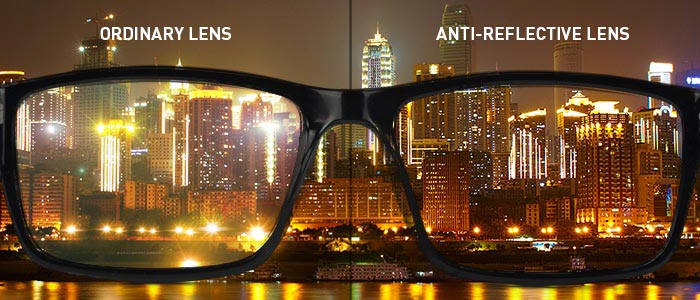
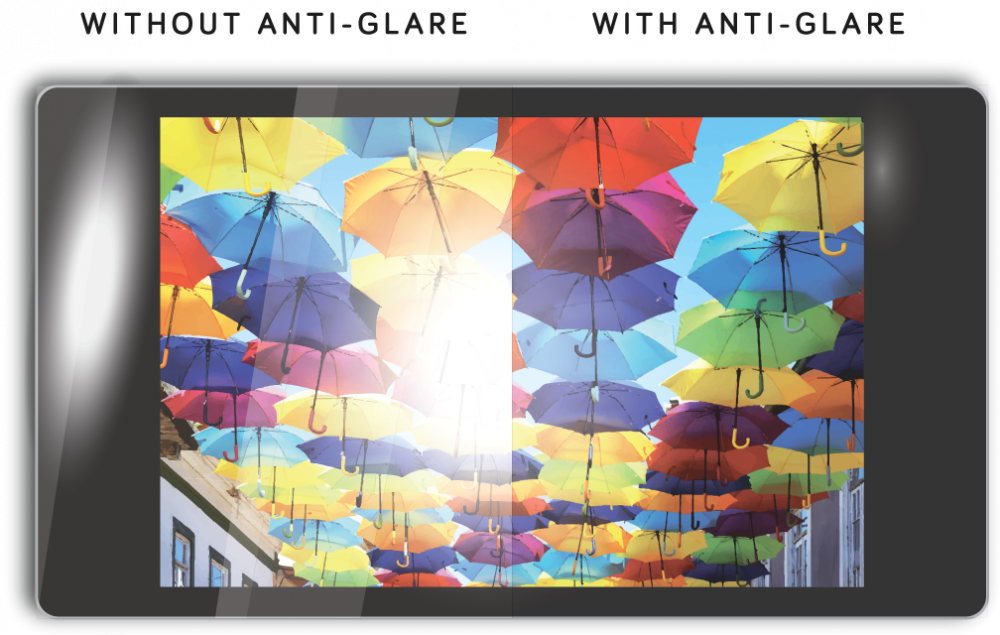

# 显示屏减反射与防眩光处理对比

!!! abstract "快速结论"
    本指南解释了减反射与反光，相关的设计差异以及工程师在选择显示解决方案时应该验证的点。

## 核心要点

- 系统了解显示屏减反射与防眩光处理对比，包括关键原理、优缺点、应用场景和工程选型要点。
- 根据下文比较相关技术、应用条件和设计取舍。
- 最终选型前，应确认光学、电气、结构、环境与量产要求。

## 表面处理方法

### 减反射

**在盖板玻璃中的AR (反光) 技术的作用和优势**

**抗反射技术的作用**

减反射 (AR) 技术主要通过减少盖板玻璃表面的光反射，从而提高光传输和显示性能。AR技术的主要作用包括：

减少反射：在标准玻璃或显示盖板玻璃中，incident light 反射于表面上，导致光损失和闪，这对视觉质量产生负面影响。AR技术将多层薄膜应用于盖玻玻璃表面，显著降低反射并增加光传输。

提高对比度：通过减少反射，在强烈的照明条件下显示器的对比率得到了很大的改善。

减少光：AR技术可以降低表面光效应，特别是在直接阳光或强烈照明的环境中，提高用户视觉舒适度并减少眼睛疲劳。

提高颜色精度：通过减少不必要的反射光，屏幕显示出更现实的颜色，更高的颜色准确性，显著改善图像质量。

<figure markdown="span" class="displaywiki-figure">
  [{ width="760" loading="lazy" }](anti-reflective-vs-anti-glare-anti-reflective-vs-anti-glare-display-treatments-diagram-1.png){ .displaywiki-image-link title="查看原图" }
</figure>

<figure markdown="span" class="displaywiki-figure">
  [{ width="760" loading="lazy" }](anti-reflective-vs-anti-glare-the-advantages-of-ar-anti-reflective-technology.jpeg){ .displaywiki-image-link title="查看原图" }
  <figcaption>抗反射技术的优势</figcaption>
</figure>

在盖板玻璃中应用AR技术不仅提高了显示性能，还提供了几个优势：

增强用户体验：AR技术在各种照明条件下显著提高了屏幕的可见性，使用户能够清楚地看到屏幕内容，而不会受到反射或光的影响，从而改善了整体用户体现。

节能效率：提高光传输意味着屏幕可以以更少的能量实现相同的亮度，延长电池寿命，这对于智能手机和平板电脑等便携设备尤其重要。

提高产品竞争力：在高度竞争的显示设备市场中，采用AR技术的产品提供了优越的显示性能，增强了市场竞争能力和用户满意度。

延长设备寿命：AR涂层还作为保护层，减少屏幕的外部环境损坏，从而延长装置的使用寿命。

<figure markdown="span" class="displaywiki-figure">
  [{ width="760" loading="lazy" }](anti-reflective-vs-anti-glare-processes-and-techniques-for-implementing-ar-anti-reflective-technolog.jpeg){ .displaywiki-image-link title="查看原图" }
  <figcaption>实施AR (减反射) 技术的过程和技术</figcaption>
</figure>

实现AR涂层涉及各种工艺和技术，主要包括：

多层薄膜设计：AR涂料通常由多层光学薄膜组成，每个层都有精确计算和设计的厚度和材料选择以实现最佳反射性能。常见的材料包括二氧化碳 (SiO2)，酸化物 (Al2O3)，氧化物 (ZnO) 等。

真空沉积技术：在真空环境中，用于将原子或分子形式的薄膜材料沉积在玻璃或塑料基板表面上。这些薄膜堆叠在一起形成所需的反光涂层。

喷技术：喷是一种常见的薄膜沉积方法，其中高能量颗粒轰炸目标材料，导致目标原子脱落并沉积在基板表面上，形成薄膜。喷可以通过精确的厚度控制实现高质量，均的涂层。

纳米印记技术：纳米打印技术可以在基板表面创建微型或纳米尺寸结构，改变光传播路径以实现反射效应。纳米印刷技术具有高精度和效率，使其适合大规模生产。

离子束辅助沉积：这种技术将离子梁与物理蒸汽沉积相结合，提高薄膜的密度和粘合性，并增强涂层的光学和机械性能。

<figure markdown="span" class="displaywiki-figure">
  [{ width="760" loading="lazy" }](anti-reflective-vs-anti-glare-ar-cover-lens-with-higher-transmittance-red-curve-lower-reflectance-bl.jpeg){ .displaywiki-image-link title="查看原图" }
  <figcaption>具有更高传输率 (红色曲线)，较低反射率 (蓝色曲線) 的AR盖板</figcaption>
</figure>

## 结论

在盖板玻璃中应用AR (减反射) 技术可以显著降低光反射，提高显示性能并改善用户体验。通过多层薄膜设计，真空沉积，喷，纳米打印和其他技术，可以实现高质量的反光涂料。这不仅增强了产品市场竞争力，还提供了能源效率和保护等多种好处。随着不断的技术进步，AR涂料的性能和应用领域将进一步扩大，使更多显示设备获得更好的视觉体验。

### AG：防眩光

**AG (反光) 技术的作用**

防光 (AG) 技术旨在分散撞击盖板玻璃表面的光，降低反射光强度，从而尽量减少闪。这导致在各种照明条件下更容易看到的显示器，包括明亮的阳光。 AG 技术的主要作用包括：

减少光：AG技术会散射到表面的光，从而显著降低可能引起光的明亮反射。这使得屏幕更舒适可观看并减轻眼力疲劳，特别是在光明环境中。

提高可读性：通过减少闪光，AG涂层改善了屏幕的可读度。这对于户外或在照明良好的室内空间使用的设备来说尤其重要，其中反射可以掩盖显示器上的内容。

改善视觉舒适性：AG技术通过减少可分散用户注意力并导致眼睛疲劳的恶劣反射和亮点来创造更舒适的视觉体验。

维护图像质量：与其他减少光的方法不同，AG涂层旨在保持显示图像的质量和清晰度。这确保用户获得反光效益和高质量的视觉。

<figure markdown="span" class="displaywiki-figure">
  [{ width="760" loading="lazy" }](anti-reflective-vs-anti-glare-the-advantages-of-ag-anti-glare-technology.png){ .displaywiki-image-link title="查看原图" }
  <figcaption>AG (反光) 技术的优势</figcaption>
</figure>

<figure markdown="span" class="displaywiki-figure">
  [{ width="760" loading="lazy" }](anti-reflective-vs-anti-glare-the-advantages-of-ag-anti-glare-technology-2.png){ .displaywiki-image-link title="查看原图" }
  <figcaption>AG (反光) 技术的优势</figcaption>
</figure>

采用AG技术在盖板玻璃中提供了几个优势，这些优势有助于提高用户体验和设备性能：

增强用户体验：AG涂层通过在各种照明条件下更容易看到屏幕来显著改善用户体现。用户可以舒适地阅读和与设备互动，而不会受到分散反射的影响。

提高生产力：对于幕广泛使用的专业环境，如办公室或设计工作室，AG技术可以通过减少眼睛疲劳和疲劳来提高生产率，使用户能够更舒适地工作长时间。

使用多功能性：具有AG涂层的设备是多功能性的，可以在更广泛的环境中使用。无论是在室内还是户外，在明亮或淡的照明下，这些设备都保持良好的性能，提供清晰和可读的显示屏。

保护效益：AG涂层还提供了显示表面的保护水平，有助于防止每天使用的划痕和其他损害。这延长了设备的寿命并保持了其外观。

实施AG (反光) 技术的过程和技术

实施AG涂层涉及各种工艺和技术。主要方法包括：

蚀刻：用于制造反光表面的一种常见方法是化学或机械蚀刻。化学蚀刻使用酸或其他化学物质来实现这种纹理，而机械蚀刻则采用磨砂材料。

涂层：另一种方法是将薄薄的反光涂层涂在玻璃表面上。这可以通过喷涂层，浸泡涂层或滚滚涂层等技术进行。涂层通常由散射光的材料组成，从而减少闪光。

在玻璃表面产生微结构，使接入的光散射。这可以通过砂等过程或使用专业的抹膜应用到表面来完成。

纳米打印图形：这种先进的技术包括在玻璃表面上打印纳米尺度图案。这些图案有效分散光，同时保持玻璃的光学清晰度。

结合技术：在某些情况下，可以使用上述技术的组合来达到所需水平的反光性能。例如，表面可能被蚀刻以创建基本纹理，然后涂上抗光材料以进一步减少闪光。

实施AG (防光) 技术的关键步骤

表面准备：第一步是选择合适的玻璃或塑料基板，并准备表面。这包括清洁基板以消除任何可能影响防处理质量的尘埃，油或污染物。

纹理或涂层应用：根据选择的方法，下一步是将纹理或者涂层应用于。这可能包括喷表面以创建纹理图案，或使用喷雾，浸泡或滚滚技术涂层。

固化和硬化：在涂料被应用后，材料需要固化并硬化。这可能涉及热处理，紫外线硬化或化学反应，具体取决于使用的涂料整理。

质量控制和测试：在使用抗光处理后，表面经过严格的质量监控和测验。包括检查均性，粘合性，耐久性以及减少光的有效性。光学性能如清晰度和颜色精确性也进行测试，以确保它们符合所需标准。

最终检查和包装：最后一个步骤是彻底的检查，以确保没有缺陷。

## 结论

AG (防光) 技术在提高显示器的可用性和视觉舒适性方面起着关键作用。通过分散光线和减少反射，AG涂层使屏幕在各种照明条件下更容易看到，提高可读性并降低眼力疲劳。 AG技术的实施涉及几种复杂的过程，包括蚀刻，涂层和纳米印记图形，每个过程都有助于创造一个有效的反光表面。随着其众多优势，包括增强用户体验，提高生产力和保护效益，AG技术是现代显示设备的重要特征，确保它们在各种环境中表现良好并保持高质量的视觉。随着技术的不断进步，用于AG涂料的技术和材料将进一步改进，提供更好的性能和更广泛的应用。

## 相关阅读

- [显示屏盖板材料、厚度与表面处理](cover-lens-materials-treatments.md)
- [盖板防指纹与抗菌表面处理](anti-fingerprint-antibacterial.md)
- [显示产品盖板定制指南](cover-lens-customization.md)

!!! info "没有找到您需要的内容？"
    如果您需要更多产品、资源或技术支持，欢迎联系我们的团队：

    [**:material-archive-arrow-down: 知识库**](../../knowledge/tags.md){ .md-button .md-button--primary }
    [**:material-magnify: 产品与解决方案**](https://www.chinasunyee.com){ .md-button }
    [**:material-email: 联系技术支持**](mailto:info@chinasunyee.com){ .md-button }
