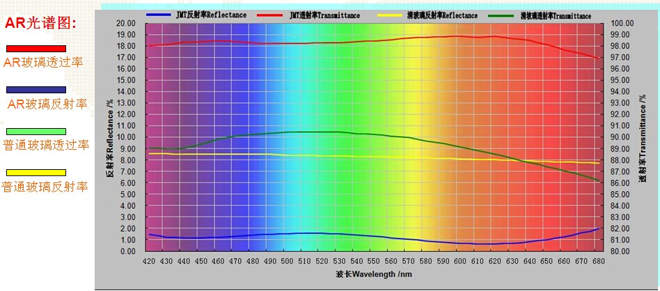
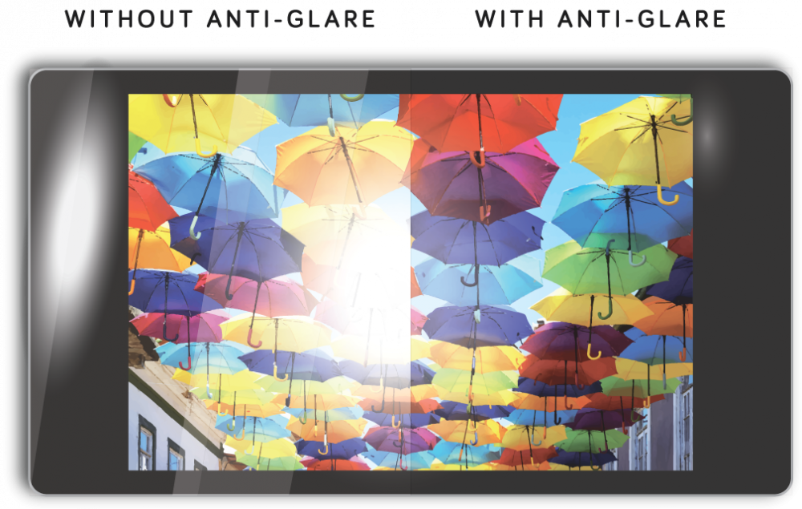
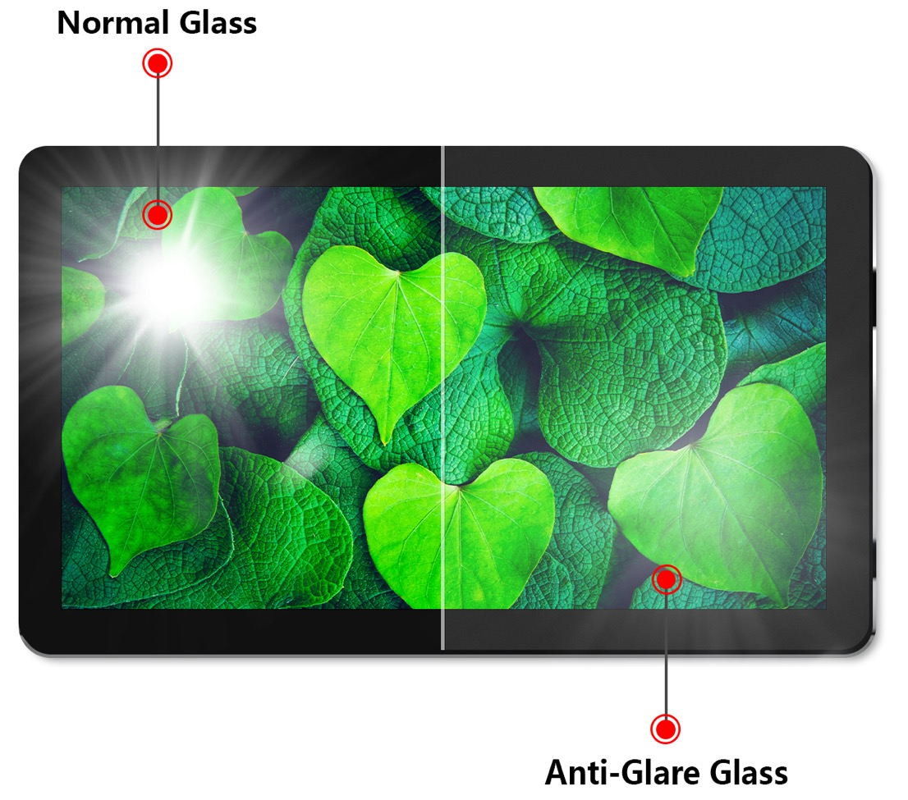

# 显示屏减反射与防眩光处理对比

!!! abstract "快速结论"
    AR（Anti-Reflection，减反射）与 AG（Anti-Glare，防眩）经常被混用，但机制完全不同：AR 通过多层薄膜干涉把反射率本身降下来，AG 通过表面微结构把集中的镜面反射打散成漫反射。前者让画面更通透，后者让光斑不再刺眼。两者可以叠加，是强光环境下最常见的一组组合。

## 核心要点

- 一句话区分：AR 是"让光别反射"，AG 是"让反射别聚成光斑"。
- AR 的核心指标是反射率与透光率：未镀膜玻璃透光约 91%、单面反射约 4%；AR 镀膜后可提升到约 98% 透光、0.5% 反射。
- AG 的核心指标是雾度与光泽度：它不降低反射总量，而是改变反射的分布形态。
- AG 会带来轻微的清晰度损失，AR 不会；两者组合使用可兼顾通透度与舒适度。

## 1. AR 与 AG 的根本区别

在标准玻璃或显示盖板玻璃中，入射光会在表面发生反射，造成光损失与眩光，直接影响视觉质量。解决这个问题有两条完全不同的路径：

| 维度 | AR（减反射） | AG（防眩） |
|---|---|---|
| 作用机制 | 多层薄膜干涉，降低反射率 | 表面微结构散射，把镜面反射变为漫反射 |
| 对反射总量的影响 | 显著降低 | 基本不变，只是重新分布 |
| 对透光率的影响 | 提升 | 略有下降（存在散射损失） |
| 对清晰度的影响 | 提升 | 略有下降 |
| 主要改善 | 画面通透度、对比度、色彩准确度 | 强光下的可读性与视觉舒适度 |
| 典型工艺 | 真空沉积、溅射、纳米压印 | 蚀刻、涂布、纳米压印 |

## 2. AR 减反射

### 2.1 作用

AR 技术主要通过减少盖板玻璃表面的光反射，提高光透过率与显示性能，主要作用包括：

- **减少反射**：入射光在玻璃表面反射会造成光损失与眩光，AR 通过多层薄膜把反射显著降低，同时提升透光。
- **提高对比度**：在强照明条件下，减少反射可直接改善显示对比度。
- **减轻眩光与视疲劳**：尤其在直射阳光或强照明环境中，降低表面反射可提升视觉舒适度。
- **提高色彩准确度**：减少杂散反射光后，屏幕呈现的颜色更真实、更接近设计值。

<figure markdown="span" class="displaywiki-figure">
  [{ width="760" loading="lazy" }](anti-reflective-vs-anti-glare-the-advantages-of-ar-anti-reflective-technology.jpeg){ .displaywiki-image-link title="查看原图" }
  <figcaption>AR 作用的直观对照：左半为普通镜片，城市灯光在镜面上形成明显反射；右半为减反射镜片，反射几乎消失，景物通透清晰。AR 镀膜对显示屏的作用与此相同。</figcaption>
</figure>

<figure markdown="span" class="displaywiki-figure">
  [{ width="760" loading="lazy" }](anti-reflective-vs-anti-glare-anti-reflective-vs-anti-glare-display-treatments-diagram-1.png){ .displaywiki-image-link title="查看原图" }
  <figcaption>AR 玻璃的实际效果：左侧未做 AR 处理，屏幕表面反射明显、画面对比度被削弱；右侧为减反射玻璃，反射显著降低，同一画面的色彩与层次都更清晰。</figcaption>
</figure>

在盖板玻璃中应用 AR 技术，除了提升显示性能，还带来几项收益：

- **增强体验**：在各种照明条件下都能清晰看到屏幕内容，不受反射干扰。
- **提升能效**：透光率提高意味着达到同等亮度所需的功耗更低，对便携设备尤其重要。
- **提升竞争力**：在竞争激烈的显示设备市场中形成性能差异。
- **延长寿命**：AR 涂层同时可作为保护层，减少外部环境对屏幕的损伤。

### 2.2 实测数据

AR 镀膜的效果可以用两个数字概括：透光率的提升与反射率的下降。

<figure markdown="span" class="displaywiki-figure">
  [{ width="760" loading="lazy" }](anti-reflective-vs-anti-glare-processes-and-techniques-for-implementing-ar-anti-reflective-technolog.jpeg){ .displaywiki-image-link title="查看原图" }
  <figcaption>AR 镀膜的透光与反射对比：未镀膜玻璃透光率约 91%、单面反射 4% 加 4%（两面），吸收损失小于 1%；优奕视界的 A/R 镀膜玻璃透光率提升到 98%、单面反射降至 0.5% 加 0.5%。</figcaption>
</figure>

<figure markdown="span" class="displaywiki-figure">
  [{ width="760" loading="lazy" }](anti-reflective-vs-anti-glare-ar-cover-lens-with-higher-transmittance-red-curve-lower-reflectance-bl.jpeg){ .displaywiki-image-link title="查看原图" }
  <figcaption>AR 盖板的光谱曲线：横轴为 420~680 nm 可见光波长。AR 玻璃的透过率（红）稳定在约 97~98%，反射率（深蓝）压到约 1~2%；而普通玻璃的透过率（绿）约 87~89%、反射率（黄）约 8~9%。AR 在整个可见光波段都保持了低反射，因此不会引入明显色偏。</figcaption>
</figure>

### 2.3 工艺与技术

实现 AR 涂层涉及多种工艺，主要包括：

- **多层薄膜设计**：AR 涂层通常由多层光学薄膜组成，每层的厚度与材料都经过精确计算以实现最佳减反效果。常用材料包括二氧化硅（SiO₂）、氧化铝（Al₂O₃）、氧化锌（ZnO）等。
- **真空沉积**：在真空环境中把薄膜材料以原子或分子形式沉积到玻璃或塑料基板表面，多层堆叠形成减反射涂层。
- **溅射**：一种常见的薄膜沉积方法，用高能粒子轰击靶材，使靶材原子脱落并沉积在基板上形成薄膜，可通过精确的厚度控制获得高质量、均匀的涂层。
- **纳米压印**：在基板表面构建微米或纳米级结构，改变光传播路径以实现减反效果，精度与效率高，适合大规模生产。
- **离子束辅助沉积**：把离子束与物理气相沉积结合，提高薄膜的致密度与结合力，增强涂层的光学与机械性能。

## 3. AG 防眩

### 3.1 作用

AG 技术旨在分散撞击盖板玻璃表面的光，降低反射光强度，从而减少眩光，让显示器在各种照明条件下都更容易看清，包括明亮的阳光下。主要作用包括：

- **减少眩光**：把表面光线散射开，显著降低形成刺眼光斑的镜面反射，在明亮环境中减轻视疲劳。
- **提高可读性**：通过消除眩光改善屏幕可读性，对户外或照明良好的室内空间尤为重要。
- **改善视觉舒适度**：减少分散注意力的刺眼反射与亮点。
- **保持图像质量**：与单纯降低亮度的方式不同，AG 涂层在减小眩光的同时尽量保持显示内容的质量与清晰度。

<figure markdown="span" class="displaywiki-figure">
  [{ width="760" loading="lazy" }](anti-reflective-vs-anti-glare-the-advantages-of-ag-anti-glare-technology.png){ .displaywiki-image-link title="查看原图" }
  <figcaption>AG 处理的效果对比：左侧未做 AG 处理，强光在屏幕表面形成大片白色眩光，画面内容被完全掩盖；右侧为 AG 处理后的屏幕，眩光被散射消除，画面内容清晰可见。</figcaption>
</figure>

<figure markdown="span" class="displaywiki-figure">
  [{ width="760" loading="lazy" }](anti-reflective-vs-anti-glare-the-advantages-of-ag-anti-glare-technology-2.png){ .displaywiki-image-link title="查看原图" }
  <figcaption>普通玻璃与 AG 玻璃的对比：左侧普通玻璃在点光源下形成明显的星芒状眩光；右侧 AG 玻璃把反射打散，画面整体均匀、没有刺眼光斑。</figcaption>
</figure>

采用 AG 技术的优势包括：

- **增强体验**：在各种照明条件下都更易看清屏幕，用户可以舒适阅读与操作。
- **提高效率**：在办公室、设计工作室等长时间用屏的专业环境中，降低视疲劳有助于保持工作效率。
- **适应性广**：无论室内还是户外、明亮还是昏暗照明，都能保持清晰可读的显示效果。
- **保护作用**：AG 涂层同时为显示表面提供一定保护，减少日常划痕与损伤。

### 3.2 工艺与技术

实施 AG 涂层的主要方法包括：

- **蚀刻**：常用的防眩表面制造方法。化学蚀刻使用酸或其他化学试剂形成纹理，机械蚀刻则采用磨砂材料。
- **涂布**：在玻璃表面涂布薄层防眩涂料，可通过喷涂、浸涂或辊涂等工艺实现。涂料通常由散射光的材料构成，从而减少眩光。
- **表面微结构**：在玻璃表面生成微结构使入射光散射，可通过喷砂等工艺或贴附专业膜层实现。
- **纳米压印**：在玻璃表面印制纳米级图案，有效分散光线同时保持玻璃的光学清晰度。
- **组合工艺**：在实际生产中常组合多种方法，例如先蚀刻形成基础纹理，再涂布防眩材料进一步降低眩光。

### 3.3 实施关键步骤

1. **表面准备**：选择合适的玻璃或塑料基板并清洁表面，去除可能影响处理质量的尘埃、油污与污染物。
2. **纹理或涂层施加**：根据选定方法在表面形成纹理或涂层，可能包括喷砂生成纹理，或采用喷涂、浸涂、辊涂等涂布方式。
3. **固化与硬化**：涂层施加后需要固化与硬化，方式包括热处理、紫外固化或化学反应，取决于涂料类型。
4. **质量控制与测试**：对处理后的表面进行严格监测与检测，包括均匀性、结合力、耐久性与防眩有效性；同时测试清晰度与色彩准确度等光学性能。
5. **最终检查与包装**：进行彻底检查，确保没有缺陷后进入包装。

## 4. 组合使用

AG 与 AR 并不互斥，实际户外方案常把两者结合：先用 AR 镀膜把表面反射率降下来，再用 AG 处理把残余反射散射开。这样既减少了进入眼睛的干扰光总量，又避免了残余反射形成局部亮斑，是强光环境下兼顾通透度与舒适度的常见做法。

需要留意的是，AG 带来的散射损失与雾度会略微降低画面的锐利感，因此在以画质为第一优先的场景（如专业监看、设计审图）中，通常更倾向于单独使用 AR。

## 5. 选型要点

- **先判断要解决什么问题**：在意画面通透度与色彩准确度选 AR；在意强光下是否刺眼、能否看清内容选 AG。
- **核对量化指标**：AR 看反射率与透光率（及全波段曲线）；AG 看雾度与光泽度，并要求提供实测数据而非仅定性描述。
- **评估清晰度代价**：AG 会引入雾度，高分辨率或精细文字场景需确认雾度是否可接受。
- **确认耐磨与寿命**：镀膜与微结构都会随摩擦衰减，需明确测试方法与寿命预期。
- **考虑与其他处理的叠加**：AR、AG 与 AF（防指纹）可组合，但工序顺序与相互影响需与供应商确认。
- **结合整体方案**：表面处理只能改善反射，若环境光极强，仍需与透光方式（如半反半透）或亮度方案配合。

## 6. FAQ

??? question "Q1：AR 和 AG 到底有什么区别？"
    最简明的区分是：AR 让光"少反射"，通过多层薄膜干涉降低反射率；AG 让反射"别聚成光斑"，通过表面微结构把镜面反射打散成漫反射。结果是 AR 提升通透度与色彩准确度，AG 提升强光下的可读性与舒适度，后者会带来轻微的清晰度损失。

??? question "Q2：AR 和 AG 能同时做吗？"
    可以，而且在户外方案中很常见。通常先用 AR 镀膜降低表面反射率，再用 AG 把残余反射散射开，兼顾干扰光总量与局部亮斑两个问题。但工序顺序、膜层附着力与最终雾度需要与供应商确认。

??? question "Q3：AR 镀膜为什么能降低反射？"
    依靠多层薄膜的干涉效应。每一层薄膜的厚度与折射率都经过设计，使不同界面反射出来的光在相位上相互抵消，从而把反射率压到很低。因此 AR 对波长是有选择性的，优秀的镀膜在 420~680 nm 整个可见光范围内都能保持低反射。

??? question "Q4：AG 会不会让画面变糊？"
    会有一定影响。AG 通过散射光来实现防眩，散射同时会降低画面的锐利感，表现为雾度上升。雾度越高，防眩效果越强、清晰度损失越大。选择时应在防眩需求与清晰度要求之间取平衡，并要求提供雾度数据。

??? question "Q5：AR 镀膜一般能把反射降到多少？"
    以常见数据为参考：未镀膜玻璃透光率约 91%、单面反射约 4%；AR 镀膜玻璃透光率可提升至约 98%、单面反射降至 0.5%。全波段曲线上，AR 玻璃的反射率通常维持在 1~2% 区间，而普通玻璃在 8~9%。

??? question "Q6：AG 的颗粒或纹理大小怎么选？"
    原则是"够用即可"。纹理越粗，防眩效果越强但雾度越高、清晰度损失越大；纹理越细，画面更清晰但防眩能力有限。选择时应基于实际环境照度与观看距离，优先查看供应商提供的雾度与光泽度实测值，而不是只看颗粒尺寸。

## 相关阅读

- [显示屏盖板材料、厚度与表面处理](cover-lens-materials-treatments.md)
- [盖板防指纹与抗菌表面处理](anti-fingerprint-antibacterial.md)
- [显示产品盖板定制指南](cover-lens-customization.md)

## 参考数据来源

本文涉及的标准、规格与应用资料：

- [康宁 Gorilla Glass 产品手册](https://www.corning.com/microsite/csm/gorillaglass/PI_Glass/)
- [TFT LCD 模组规格书示例（7 英寸 WVGA）](../../../assets/datasheet/display/ALL-UE070WV-RB40-A092A.pdf)

!!! info "没有找到您需要的内容？"
    如果您需要更多产品、资源或技术支持，欢迎联系我们的团队：

    [**:material-archive-arrow-down: 知识库**](../../knowledge/tags.md){ .md-button .md-button--primary }
    [**:material-magnify: 产品与解决方案**](https://www.chinasunyee.com){ .md-button }
    [**:material-email: 联系技术支持**](mailto:info@chinasunyee.com){ .md-button }
