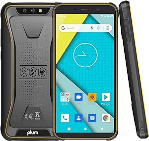
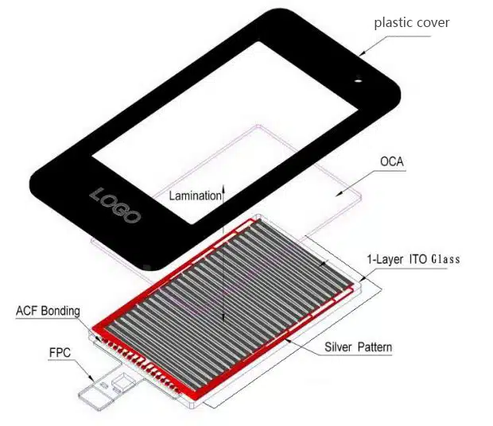

# 电容触摸屏分类

!!! abstract "快速结论"
    本指南解释了电容式触摸面板结构,相关的设计权衡以及工程师在选择显示解决方案时应验证的点.

## 核心要点

- 系统了解GF、GFF、GG 与 PG 电容触摸结构，包括关键原理、优缺点、应用场景和工程选型要点。
- 根据下文比较相关技术、应用条件和设计取舍。
- 最终选型前，应确认光学、电气、结构、环境与量产要求。

电容式触摸屏的原理是,当手指接触到金属层时,由于人体的电场,用户和触 touch screen 的表面之间形成了连接电容器. 对于高频电流,电容器是直接的导体,所以手指从接触点吸入少量的电流.通过检测电路来检测这种小变化的电流感觉到手指的位置.

投射式电容式触摸屏 (PCAP) 采用多层的ITO层来形成矩阵分布.X轴和Y轴交叉分布被用来作为电容性矩阵.当手指碰到屏幕时,通过扫描X和Y軸可以检测到触摸位置上的电容性的变化. 根据这个架构,投射式电容可以实现多触摸操作.

<figure markdown="span" class="displaywiki-figure">
  [{ width="760" loading="lazy" }](capacitive-touch-structures-self-capacitance.png){ .displaywiki-image-link title="查看原图" }
</figure>

## 原理分类

投影电容式触摸屏根据原理分为两种模式:自电容和互电容。

**自电容:**

<figure markdown="span" class="displaywiki-figure">
  [{ width="760" loading="lazy" }](capacitive-touch-structures-self-capacitance.jpeg){ .displaywiki-image-link title="查看原图" }
</figure>

1.测量信号线本身的容量
2.优点:简单,慢
3.缺点:非真实的多点,易受干扰

**互电容:**

<figure markdown="span" class="displaywiki-figure">
  [{ width="760" loading="lazy" }](capacitive-touch-structures-mutual-capacitance.jpeg){ .displaywiki-image-link title="查看原图" }
  <figcaption>互电容</figcaption>
</figure>

1. 垂直交叉的两个信号之间的电容
2.优势:更多的实质性点,速度快
3.缺点:复杂,高功耗,高成本

## 结构分类

电容式触摸屏有四个结构,即G+F,P+G,G+G和G+ F+F结构。

### G+F结构电容式触摸屏

结构:盖板玻璃+传感器Sensor.

<figure markdown="span" class="displaywiki-figure">
  [{ width="760" loading="lazy" }](capacitive-touch-structures-structure-cover-glass-film-sensor.png){ .displaywiki-image-link title="查看原图" }
  <figcaption>结构:盖板玻璃+膜传感器</figcaption>
</figure>

功能:使用单层膜传感器,传感机模式根据不同的触摸控制IC具有三角形,多边形等. 在优化触摸软件后,它实现了虚拟的两点手势触摸效果.

**G+F结构电容式触摸屏的优势**

- 低成本

- 厚度可以变得更薄,透光性更好

**G+F结构电容式触摸屏的缺点**

- 只有单点触摸,触摸精度差,无法实现手势操作和更多功能.

**G+F结构触摸屏的应用**

<figure markdown="span" class="displaywiki-figure">
  [{ width="760" loading="lazy" }](capacitive-touch-structures-application-of-g-f-structure-touch-screen.png){ .displaywiki-image-link title="查看原图" }
</figure>

<figure markdown="span" class="displaywiki-figure">
  [{ width="760" loading="lazy" }](capacitive-touch-structures-g-f-f-structure-capacitive-touch-screen.png){ .displaywiki-image-link title="查看原图" }
  <figcaption>G+F结构触摸屏的应用</figcaption>
</figure>

### G+F+F结构电容式触摸屏
<figure markdown="span" class="displaywiki-figure">
  [{ width="760" loading="lazy" }](capacitive-touch-structures-the-advantages-of-g-f-f-structure-capacitive-touch-screen.png){ .displaywiki-image-link title="查看原图" }
  <figcaption>G+F+F结构电容式触摸屏结构</figcaption>
</figure>

**G+F+F 结构电容式触摸屏的优势**

- 真正的多点操作,素养手势触摸和唤醒等复杂任务.具有GFF结构的触摸屏是最广泛使用的触控屏结构

- 由于双层传感器膜的互电容结构,精度很高,手写效果很好,它支持真实多触摸,高抗干扰 (EMI/EMC/ESD...) 和大尺寸触摸.

**G+F+F结构电容式触摸屏的缺点**

- 由于使用多层薄膜材料,光传输率较G/G结构低5%.

- 比GF触摸屏相对较高的价格

**G+F+F结构触摸屏的应用**

<figure markdown="span" class="displaywiki-figure">
  [{ width="760" loading="lazy" }](capacitive-touch-structures-g-g-structure-capacitive-touch-screen.png){ .displaywiki-image-link title="查看原图" }
</figure>

<figure markdown="span" class="displaywiki-figure">
  [{ width="760" loading="lazy" }](capacitive-touch-structures-g-g-structure-capacitive-touch-screen-2.png){ .displaywiki-image-link title="查看原图" }
  <figcaption>G+F+F 电容式触摸屏应用</figcaption>
</figure>

### G+G 结构电容式触摸屏

<figure markdown="span" class="displaywiki-figure">
  [{ width="760" loading="lazy" }](capacitive-touch-structures-the-advantages-of-g-g-structure-capacitive-touch-screen.png){ .displaywiki-image-link title="查看原图" }
  <figcaption>G+G电容式触摸屏的结构</figcaption>
</figure>

G+G是玻璃盖和单层玻璃基板触摸传感器的结构.玻璃作为传感器基板,具有高强度和良好的耐热性.

**G+G结构电容式触摸屏的优势**

- 具有双层触摸传感器,高精度,良好的光传输和良好的手写效果的互动电容式触摸结构.
- 多点触摸
- 可靠性和使用寿命长.

**G+G结构电容式触摸屏的缺点**

- 传感器玻璃在撞击后容易损坏

- 它比GFF触摸屏更重,不适合移动应用.

**G+G结构触摸屏的应用**

<figure markdown="span" class="displaywiki-figure">
  [{ width="760" loading="lazy" }](capacitive-touch-structures-application-of-g-g-structure-touch-screen.jpeg){ .displaywiki-image-link title="查看原图" }
</figure>

<figure markdown="span" class="displaywiki-figure">
  [{ width="760" loading="lazy" }](capacitive-touch-structures-p-g-structure-capacitive-touch-screen.png){ .displaywiki-image-link title="查看原图" }
  <figcaption>G+G结构电容式触摸屏</figcaption>
</figure>

### P+G 结构电容式触摸屏

类似于G+G的结构,只需用塑料盖板取代盖板玻璃

<figure markdown="span" class="displaywiki-figure">
  [{ width="760" loading="lazy" }](capacitive-touch-structures-the-advantages-of-p-g-structure-capacitive-touch-screen.png){ .displaywiki-image-link title="查看原图" }
  <figcaption>P+G电容式触摸屏的结构</figcaption>
</figure>

**P+G结构电容式触摸屏的优势**

- 成本优势

P+G结构电容式触摸屏的缺点

- 塑料盖板的强度低，不耐刮耐磨，手指体验感一般

**P+G结构触摸屏的应用**

<figure markdown="span" class="displaywiki-figure">
  [{ width="760" loading="lazy" }](capacitive-touch-structures-application-of-p-g-structure-touch-screen.png){ .displaywiki-image-link title="查看原图" }
  <figcaption>P+G结构触摸屏的应用</figcaption>
</figure>

如果您的成本要求不高,并且您的产品低于10英寸的tft显示器产品,[优奕视界](https://www.chinasunyee.com)建议您选择G+F+F触摸结构,性能优异和相对薄尺寸.

如果您的产品超过10英寸的tft显示产品,则建议使用G+G触摸效果.

G+F产品的触摸精度很差,除非你的人与计算机互动接口非常简单且易于触摸,否则它们的性能将是不满意的.

P+G结构的主要问题是塑料盖板的耐磨性和强度很差,由于成本低,它仅在特殊的使用条件下用于取代 G+G.

如果您对触摸屏和液晶显示屏有需求,请联系[优奕视界](https://www.chinasunyee.com),根据您的使用情况和要求,我们将提供最佳解决方案.

## 相关阅读

- [电容式与电阻式触摸屏对比](touch-panel-types.md)
- [显示屏框贴与全贴合对比](air-vs-optical-bonding.md)
- [手套触控、防水触控与抗干扰设计](glove-waterproof-touch.md)
