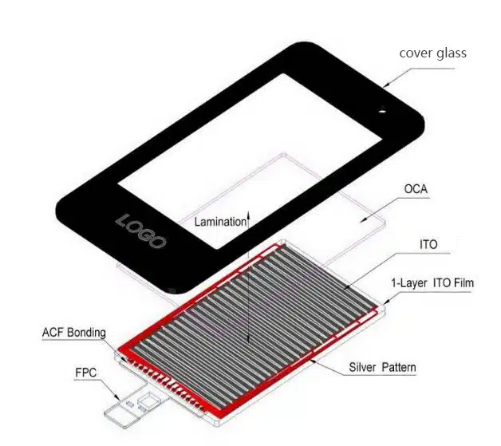
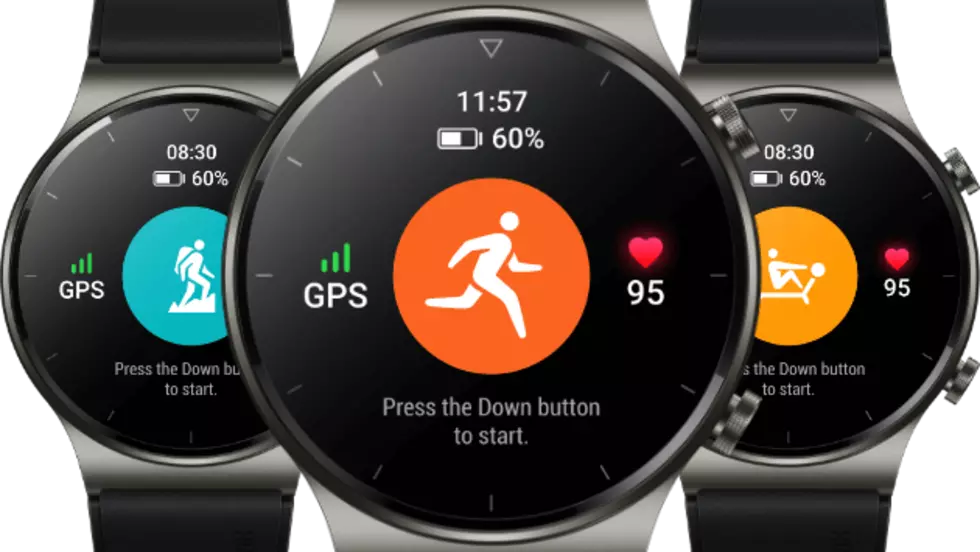
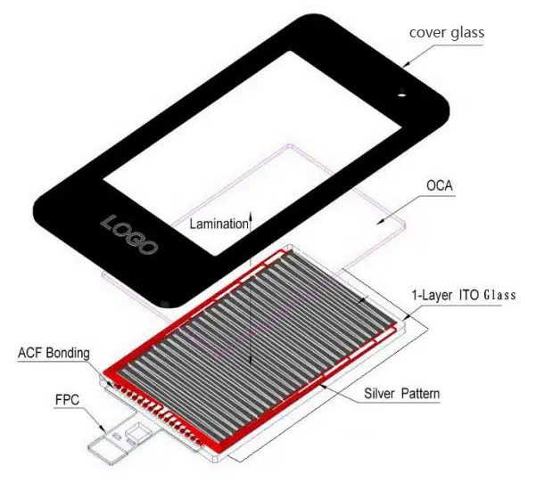
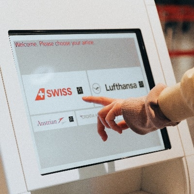

# 电容触摸屏分类

!!! abstract "快速结论"
    本指南介绍电容式触摸面板的常见结构、相关的设计权衡，以及工程师在选择显示解决方案时应验证的要点。

## 核心要点

- 系统了解GF、GFF、GG 与 PG 电容触摸结构，包括关键原理、优缺点、应用场景和工程选型要点。
- 根据下文比较相关技术、应用条件和设计取舍。
- 最终选型前，应确认光学、电气、结构、环境与量产要求。

电容式触摸屏的原理是：当手指接触到金属层时，由于人体电场的作用，用户与触摸屏表面之间形成一个耦合电容。对于高频电流而言，电容器相当于导体，手指会从接触点吸走少量电流。检测电路通过检测这一微小的电流变化，即可定位手指的位置。

投射式电容式触摸屏（PCAP）采用多层 ITO 层形成矩阵分布，X 轴与 Y 轴交叉构成电容矩阵。当手指触碰屏幕时，通过扫描 X 轴和 Y 轴即可检测到触摸位置上的电容变化。基于这一架构，投射式电容屏可以实现多点触控。

<figure markdown="span" class="displaywiki-figure">
  [{ width="760" loading="lazy" }](capacitive-touch-structures-self-capacitance.png){ .displaywiki-image-link title="查看原图" }
</figure>

## 原理分类

投射式电容式触摸屏根据原理分为两种模式：自电容和互电容。

**自电容：**

<figure markdown="span" class="displaywiki-figure">
  [{ width="760" loading="lazy" }](capacitive-touch-structures-self-capacitance.jpeg){ .displaywiki-image-link title="查看原图" }
</figure>

1. 测量信号线本身的电容。
2. 优点：实现简单。
3. 缺点：扫描较慢，非真实多点，易受干扰。

**互电容：**

<figure markdown="span" class="displaywiki-figure">
  [{ width="760" loading="lazy" }](capacitive-touch-structures-mutual-capacitance.jpeg){ .displaywiki-image-link title="查看原图" }
  <figcaption>互电容</figcaption>
</figure>

1. 垂直交叉的两个信号线之间的电容。
2. 优势：支持真实多点，速度快。
3. 缺点：结构复杂，功耗和成本较高。

## 结构分类

电容式触摸屏有四种结构：G+F、P+G、G+G 和 G+F+F。

### G+F结构电容式触摸屏

结构：盖板玻璃 + 膜传感器（Sensor）。

<figure markdown="span" class="displaywiki-figure">
  [{ width="760" loading="lazy" }](capacitive-touch-structures-structure-cover-glass-film-sensor.png){ .displaywiki-image-link title="查看原图" }
  <figcaption>结构：盖板玻璃+膜传感器</figcaption>
</figure>

功能：使用单层膜传感器，传感器图案随触摸控制 IC 的不同呈三角形、多边形等排布。在优化触摸软件后，可实现虚拟的两点手势触摸效果。

**G+F结构电容式触摸屏的优势**

- 低成本。
- 厚度可以做得更薄，透光性更好。

**G+F结构电容式触摸屏的缺点**

- 只有单点触摸，触摸精度差，无法实现手势操作和更多功能。

**G+F结构触摸屏的应用**

<figure markdown="span" class="displaywiki-figure">
  [{ width="760" loading="lazy" }](capacitive-touch-structures-application-of-g-f-structure-touch-screen.png){ .displaywiki-image-link title="查看原图" }
</figure>

<figure markdown="span" class="displaywiki-figure">
  [{ width="760" loading="lazy" }](capacitive-touch-structures-application-of-g-f-structure-touch-screen-2.png){ .displaywiki-image-link title="查看原图" }
  <figcaption>G+F结构触摸屏的应用</figcaption>
</figure>

### G+F+F结构电容式触摸屏

<figure markdown="span" class="displaywiki-figure">
  [{ width="760" loading="lazy" }](capacitive-touch-structures-g-f-f-structure-capacitive-touch-screen.png){ .displaywiki-image-link title="查看原图" }
  <figcaption>G+F+F结构电容式触摸屏结构</figcaption>
</figure>

**G+F+F 结构电容式触摸屏的优势**

- 支持真实多点操作、手势触摸和唤醒等复杂功能。GFF 结构触摸屏是目前使用最广泛的触控屏结构。
- 采用双层传感器膜的互电容结构，精度很高，手写效果好；支持真实多点触控，抗干扰能力强（EMI/EMC/ESD），并可支持大尺寸触摸。

**G+F+F结构电容式触摸屏的缺点**

- 由于使用多层薄膜材料，透光率较 G+G 结构低 5%。
- 价格比 GF 触摸屏相对较高。

**G+F+F结构触摸屏的应用**

<figure markdown="span" class="displaywiki-figure">
  [{ width="760" loading="lazy" }](capacitive-touch-structures-application-of-g-f-f-structure-touch-screen.png){ .displaywiki-image-link title="查看原图" }
</figure>

<figure markdown="span" class="displaywiki-figure">
  [{ width="760" loading="lazy" }](capacitive-touch-structures-application-of-g-f-f-structure-touch-screen-2.png){ .displaywiki-image-link title="查看原图" }
  <figcaption>G+F+F 电容式触摸屏应用</figcaption>
</figure>

### G+G 结构电容式触摸屏

<figure markdown="span" class="displaywiki-figure">
  [{ width="760" loading="lazy" }](capacitive-touch-structures-g-g-structure-capacitive-touch-screen.png){ .displaywiki-image-link title="查看原图" }
  <figcaption>G+G电容式触摸屏的结构</figcaption>
</figure>

G+G 是玻璃盖板 + 单层玻璃基板触摸传感器的结构。玻璃作为传感器基板，具有高强度和良好的耐热性。

**G+G结构电容式触摸屏的优势**

- 具有双层触摸传感器，精度高，透光性好，手写效果好。
- 支持多点触控。
- 可靠性高，使用寿命长。

**G+G结构电容式触摸屏的缺点**

- 传感器玻璃在撞击后容易损坏。
- 比 GFF 触摸屏更重，不适合移动应用。

**G+G结构触摸屏的应用**

<figure markdown="span" class="displaywiki-figure">
  [{ width="760" loading="lazy" }](capacitive-touch-structures-application-of-g-g-structure-touch-screen.jpeg){ .displaywiki-image-link title="查看原图" }
</figure>

<figure markdown="span" class="displaywiki-figure">
  [{ width="760" loading="lazy" }](capacitive-touch-structures-application-of-g-g-structure-touch-screen-2.png){ .displaywiki-image-link title="查看原图" }
  <figcaption>G+G结构电容式触摸屏</figcaption>
</figure>

### P+G 结构电容式触摸屏

结构与 G+G 类似，只需用塑料盖板取代盖板玻璃。

<figure markdown="span" class="displaywiki-figure">
  [{ width="760" loading="lazy" }](capacitive-touch-structures-p-g-structure-capacitive-touch-screen.png){ .displaywiki-image-link title="查看原图" }
  <figcaption>P+G电容式触摸屏的结构</figcaption>
</figure>

**P+G结构电容式触摸屏的优势**

- 成本优势明显。

**P+G结构电容式触摸屏的缺点**

- 塑料盖板的强度低，不耐刮耐磨，手指触感一般。

**P+G结构触摸屏的应用**

<figure markdown="span" class="displaywiki-figure">
  [{ width="760" loading="lazy" }](capacitive-touch-structures-application-of-p-g-structure-touch-screen.png){ .displaywiki-image-link title="查看原图" }
  <figcaption>P+G结构触摸屏的应用</figcaption>
</figure>

如果您的成本要求不高，并且您的产品是 10 英寸以下的 TFT 显示产品，[优奕视界](https://www.chinasunyee.com)建议您选择 G+F+F 触摸结构，性能优异且尺寸相对轻薄。

如果您的产品是 10 英寸以上的 TFT 显示产品，则建议使用 G+G 触摸结构。

G+F 产品的触摸精度较差，除非人机交互接口非常简单且易于触摸，否则其性能将难以令人满意。

P+G 结构的主要问题是塑料盖板的耐磨性和强度较差；由于成本低，它仅在特殊的使用条件下用于取代 G+G。

如果您对触摸屏和液晶显示屏有需求，请联系[优奕视界](https://www.chinasunyee.com)，我们将根据您的使用情况和要求，提供最佳解决方案。

## 结语

电容触摸结构没有"最好"，只有"最合适"。选型先看三件事：尺寸（10 英寸是 GFF 与 GG 的分水岭）、交互需求（是否需要真实多点/手写）、环境（是否抗刮抗摔抗干扰）。GFF 是当前出货量最大的结构，性价比最优；GG 适合工控、车规、医疗等高可靠场景；GF 几乎已被 GFF 取代；PG 只在成本极端敏感且触摸要求很低的场景下保留。把结构、IC、盖板一并对齐，才能避免量产时才暴露的体验问题。

## 常见问题

??? question "Q1：GF、GFF、GG、PG 四个结构怎么区分？"
    看传感器和盖板的材质与层数。G+F = 盖板玻璃 + 单层膜传感器；G+F+F = 盖板玻璃 + 双层膜传感器（互电容，当前主流）；G+G = 盖板玻璃 + 玻璃基板传感器；P+G = 塑料盖板 + 玻璃基板传感器。命名规则是"盖板材质 + 传感器材质/层数"。

??? question "Q2：GFF 和 GG 哪个更好？"
    看场景。GFF 轻薄、透光率略低 5%、成本低，是消费电子首选；GG 透光好、强度高、寿命长，适合工控、车规、医疗。两者都支持真实多点，差异在结构强度、透光率和成本。10 英寸以下是 GFF 主场，10 英寸以上多选 GG。

??? question "Q3：GF 结构现在还用吗？"
    越来越少。GF 是单层膜传感器，只能做单点或伪两点，无法支持手写与多点手势；除极低成本、对交互要求极弱的场景外，已基本被 GFF 取代。新项目若不是成本极端敏感，不建议再选 GF。

??? question "Q4：自电容和互电容有什么本质区别？"
    自电容测每条信号线对地的电容变化，互电容测垂直交叉两条线之间的电容变化。自电容实现简单但不支持真实多点（容易出现"鬼点"），互电容是当前主流多点触摸的物理基础。手机、车机、医疗等人机交互场景用的几乎都是互电容。

??? question "Q5：触摸屏和显示屏怎么贴合？"
    框贴（Air Bonding）靠双面胶把触摸屏和显示屏四周粘住，中间有空气层，成本低、可返工，但抗反射差、易起雾；全贴合（Optical Bonding）用 OCR / OCA / LOCA 胶填充缝隙，抗反射、抗冲击、防起雾，光学效果最好，但不可返工且成本高。是否贴合、选哪种胶，取决于光学要求与环境可靠性要求。

## 相关阅读

- [电容式与电阻式触摸屏对比](touch-panel-types.md)
- [显示屏框贴与全贴合对比](air-vs-optical-bonding.md)
- [手套触控、防水触控与抗干扰设计](glove-waterproof-touch.md)

!!! info "没有找到您需要的内容？"
    如果您需要更多产品、资源或技术支持，欢迎联系我们的团队：

    [**:material-archive-arrow-down: 知识库**](../../knowledge/tags.md){ .md-button .md-button--primary }
    [**:material-magnify: 产品与解决方案**](https://www.chinasunyee.com){ .md-button }
    [**:material-email: 联系技术支持**](mailto:info@chinasunyee.com){ .md-button }
