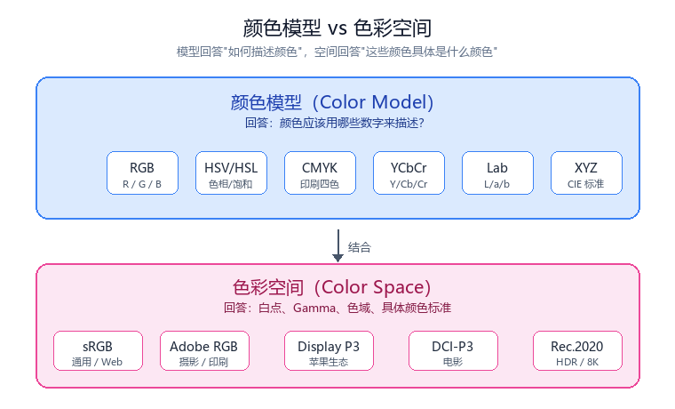
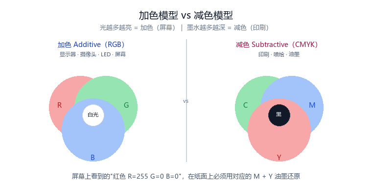
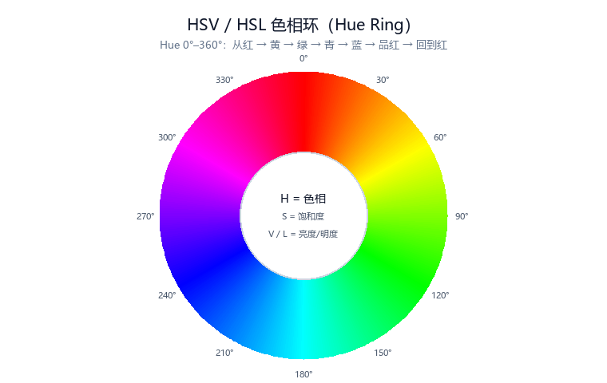
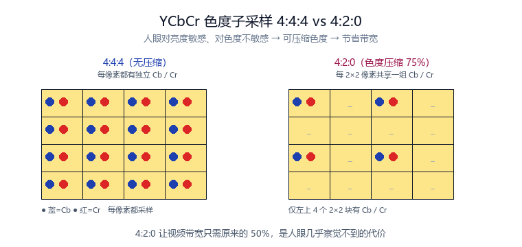
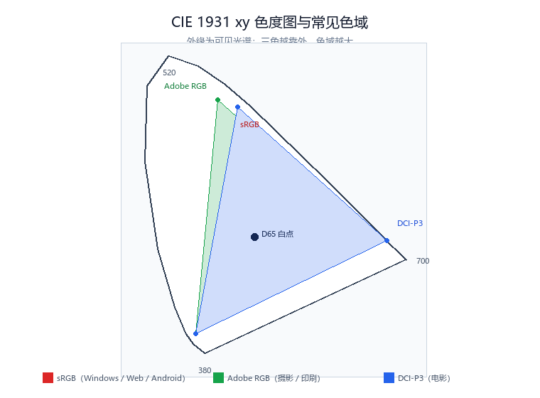

# 图像格式入门：什么是颜色模型和色彩空间

!!! abstract "快速结论"
    颜色模型（Color Model）决定"如何描述颜色"，色彩空间（Color Space）决定"这些数字具体代表哪种颜色"。二者是两层不同的问题：模型给出数字编码方式（RGB、HSV、YCbCr……），空间在此之上定义白点、Gamma、色域边界（sRGB、Adobe RGB、DCI-P3……）。只有同时确定模型和空间，同一组 RGB 数值才能在不同设备上还原出相同的颜色。

## 核心要点

- 现实世界的颜色本质是波长，人眼用三种视锥细胞采样，因此"红绿蓝三原色"足以合成绝大多数颜色。
- 颜色模型只规定"用哪些数字表示颜色"，解决的是编码问题，不保证颜色一致。
- 色彩空间在模型之上补充白点、Gamma 与色域，解决的是"这些数字到底是什么颜色"。
- 工程中最常见的组合是：模型选 RGB 或 YCbCr，空间选 sRGB / DCI-P3 等；摄像头与 ISP 链路会在两者间反复转换。

当我们打开一张图片，或查看摄像头输出的 RGB 图像时，经常会看到下面这些名词：

- RGB
- HSV
- YUV
- Lab
- sRGB
- Adobe RGB
- Display P3

很多初学者会疑惑：

- RGB 是颜色模型还是色彩空间？
- sRGB 和 RGB 到底有什么区别？
- 为什么同一张图片，在不同显示器上颜色会不一样？

实际上，这几个概念经常被混用，但它们承担的职责完全不同。一句话先记住：

**颜色模型决定"如何描述颜色"，色彩空间决定"这些颜色具体是什么颜色"。**

<figure markdown="span" class="displaywiki-figure">
  [{ width="760" loading="lazy" }](color-model-vs-color-space-cover.png){ .displaywiki-image-link title="查看原图" }
  <figcaption>颜色模型负责"描述"，色彩空间负责"解释"</figcaption>
</figure>

## 一、颜色到底是什么

现实世界中的颜色，本质上是不同波长的光。当光照射到物体表面时，一部分波长被吸收，一部分被反射。我们的眼睛接收到这些反射光，大脑便产生了颜色的感觉。

人眼中有三种不同类型的视锥细胞，分别对不同波长最敏感：

- 红色（L Cone，长波敏感）
- 绿色（M Cone，中波敏感）
- 蓝色（S Cone，短波敏感）

因此，只要控制红、绿、蓝三种光的比例，就能模拟出绝大多数颜色。这就是 RGB 三原色理论的基础。

## 二、为什么需要颜色模型

计算机并不能理解"红一点""蓝一点"这样的描述，它只能理解数字。

因此需要一种统一的方法，把颜色转换成数字。例如：

```
红色：R = 255  G = 0    B = 0
```

或者：

```
黄色：H = 60°  S = 100%  V = 100%
```

这些不同的表示方式，就是颜色模型（Color Model）。颜色模型回答的是：**颜色应该用哪些数字来描述？**

## 三、常见的颜色模型

不同场景需要不同的颜色表示方式，因此出现了多种颜色模型。

| 颜色模型 | 组成 | 主要应用 |
|---|---|---|
| RGB | 红、绿、蓝 | 摄像头、显示器、图像处理 |
| CMYK | 青、品红、黄、黑 | 印刷 |
| HSV | 色相、饱和度、亮度 | UI、调色软件 |
| HSL | 色相、饱和度、明度 | Web 前端 |
| YCbCr（YUV） | 亮度、色度 | 视频编码 |
| Lab | 明度、颜色通道 | 色彩测量、工业视觉 |
| XYZ | 国际标准颜色模型 | 色彩科学 |

需要注意的是：它们描述的是同一种颜色，只是表达方式不同。就像同一个位置可以用经纬度表示，也可以用门牌号表示。

### RGB：最常见的颜色模型

RGB 是计算机世界最常见的颜色模型，属于**加色模型**（Additive Color）：光越多，颜色越亮。

所以显示器、手机屏幕、摄像头、LED，几乎全部采用 RGB 工作。

### CMYK：打印机使用的颜色模型

显示器能够发光，而纸张不能。因此打印机采用另一种方式——**减色模型**（Subtractive Color），使用四种墨水：

- C（青，Cyan）
- M（品红，Magenta）
- Y（黄，Yellow）
- K（黑，Key/Black）

墨水越多，颜色越深。所以：

- RGB 用于显示
- CMYK 用于印刷

<figure markdown="span" class="displaywiki-figure">
  [{ width="760" loading="lazy" }](color-model-vs-color-space-add-sub.png){ .displaywiki-image-link title="查看原图" }
  <figcaption>加色（RGB）光越多越亮，减色（CMYK）墨越多越深</figcaption>
</figure>

### HSV：更符合人的思维

RGB 适合计算机，但不适合人。例如，我们更容易说"颜色再偏蓝一点"，而不是"把 R 减少 18，把 G 减少 32"。

因此诞生了 HSV，它包含三个参数：

- Hue（色相）
- Saturation（饱和度）
- Value（亮度）

例如：

```
黄色：H = 60°  S = 100%  V = 100%
```

所以，大多数图片编辑软件都会使用 HSV 来调色。

### HSL：更关注颜色的明暗变化

HSL 与 HSV 非常相似，包含：

- H（Hue，色相）
- S（Saturation，饱和度）
- L（Lightness，明度）

其中最大的区别在于第三个参数：HSV 使用的是 Value（亮度），HSL 使用的是 Lightness（明度）。HSL 在调整颜色深浅时更加自然，因此很多设计软件和 Web 前端都采用 HSL。例如 CSS：

```
color: hsl(200, 80%, 50%);
```

特点：

- 更适合颜色设计
- 调整颜色层次更加自然
- 在网页设计中应用广泛

典型应用：

- CSS
- UI 设计
- 图标设计
- 前端开发

<figure markdown="span" class="displaywiki-figure">
  [{ width="760" loading="lazy" }](color-model-vs-color-space-hsv-ring.png){ .displaywiki-image-link title="查看原图" }
  <figcaption>Hue 0°–360° 构成色相环，S 与 V/L 决定这个圆上的颜色浓淡</figcaption>
</figure>

### YCbCr（YUV）：视频世界的主角

很多人以为视频也是 RGB。实际上，大多数视频都采用 YCbCr（通常习惯称为 YUV）。它将颜色拆分为：

- Y：亮度（Luma）
- Cb：蓝色色度
- Cr：红色色度

这样做的好处是：

- 人眼对亮度更敏感
- 对色度不那么敏感

因此可以降低色度分辨率，实现更高的压缩效率，例如 4:2:2、4:2:0。这就是视频压缩能够节省大量带宽的重要原因。

特点：

- 压缩效率高
- 非常适合视频编码
- 能够兼顾画质和带宽

典型应用：

- 摄像头
- H.264
- H.265
- AV1
- HDMI
- USB Camera

<figure markdown="span" class="displaywiki-figure">
  [{ width="760" loading="lazy" }](color-model-vs-color-space-ycbcr-420.png){ .displaywiki-image-link title="查看原图" }
  <figcaption>4:2:0 让多个像素共享一组色度，带宽减半而肉眼几乎无感</figcaption>
</figure>

### Lab：最接近人眼感知的颜色模型

Lab 颜色模型由三部分组成：

- L：亮度（Lightness）
- a：绿色 ↔ 红色
- b：蓝色 ↔ 黄色

Lab 最大的优势是：**颜色之间的距离，更符合人眼的真实感受。**

例如，两个颜色在 RGB 中数值相差很小，在人眼看来可能差别很大。而在 Lab 中，颜色距离（ΔE）基本能够反映人眼看到的差异。因此工业视觉、色差检测、印刷校准大量采用 Lab。

特点：

- 最符合人眼视觉
- 色差计算准确
- 不依赖具体设备

典型应用：

- 色差仪
- 工业检测
- 印刷
- AI 视觉

### XYZ：所有颜色模型的基础

XYZ 是国际照明委员会（CIE）提出的标准颜色模型。它并不是为了方便人使用，而是为了建立统一的颜色参考标准。很多颜色空间实际上都是由 XYZ 推导出来的。因此，XYZ 更像颜色科学中的"中间语言"。

特点：

- 国际标准颜色模型
- 是各种色彩空间转换的基础
- 很少直接用于图片存储

典型应用：

- 色彩科学
- ICC 色彩管理
- 色彩空间转换
- 显示器校准

## 四、颜色模型并不能决定颜色

这里是很多人最容易误解的地方。

假设有两个显示器，都显示：

```
R = 255  G = 0  B = 0
```

结果却可能不同：

- 一块屏幕偏橙
- 一块屏幕偏鲜艳
- 一块屏幕偏暗

为什么？因为 RGB 只告诉设备"红色通道输出最大"，却没有告诉设备**"这个红色到底是哪一种红"**。

因此，仅有颜色模型是不够的，还需要一种标准。这就是——色彩空间（Color Space）。

## 五、什么是色彩空间

色彩空间可以理解成"颜色模型的标准说明书"。它不仅规定红色在哪里、绿色在哪里、蓝色在哪里，还规定：

- 白点（White Point）
- Gamma 曲线
- 可以表示的颜色范围（色域，Gamut）

因此可以这样理解：

```
RGB
├── sRGB
├── Adobe RGB
├── Display P3
├── DCI-P3
└── Rec.2020
```

可以看到：它们都属于 RGB 模型，但颜色范围完全不同。

<figure markdown="span" class="displaywiki-figure">
  [{ width="760" loading="lazy" }](color-model-vs-color-space-cie1931.png){ .displaywiki-image-link title="查看原图" }
  <figcaption>CIE 1931 xy 色度图上，色域就是各个三角形覆盖的面积</figcaption>
</figure>

## 六、常见色彩空间

| 色彩空间 | 特点 | 应用 |
|---|---|---|
| sRGB | 最通用 | Windows、网页、Android |
| Adobe RGB | 色域更广 | 摄影、印刷 |
| Display P3 | 苹果生态 | iPhone、Mac、iPad |
| Rec.2020 | 超广色域 | HDR、4K、8K |
| ProPhoto RGB | 极宽色域 | 专业摄影 |

简单来说：色域越大，能够表示的颜色越丰富。

## 七、颜色模型与色彩空间是什么关系

很多人容易混淆这两个概念。可以用一个简单的比喻理解——假设要描述一个城市的位置：

- **颜色模型**就像经纬度坐标系统，它告诉你**如何表示位置**。
- **色彩空间**就像世界地图，它告诉你**每一个坐标到底对应哪里**。

所以二者缺一不可。

## 八、摄像头中的颜色模型与色彩空间

在摄像头与显示链路中，可以看到：

- RGB、YCbCr 属于颜色模型
- sRGB、Display P3 属于色彩空间

ISP（图像信号处理器）会在图像处理过程中完成这些转换，最终保证显示器能够尽可能准确地还原真实颜色。

对嵌入式显示项目而言，这意味着：如果摄像头输出 YCbCr 4:2:0，而显示屏按 RGB 驱动，中间必然经过一次色彩空间与模型的转换；转换矩阵、白点是否匹配，直接决定最终画面是否偏色。

## 小结：一张表看懂两者区别

| 对比项 | 颜色模型（Color Model） | 色彩空间（Color Space） |
|---|---|---|
| 作用 | 描述颜色的方法 | 定义颜色的标准 |
| 回答的问题 | 如何表示颜色？ | 这些数字代表什么颜色？ |
| 是否定义色域 | 否 | 是 |
| 是否定义白点 | 否 | 是 |
| 是否定义 Gamma | 否 | 是 |
| 常见例子 | RGB、HSV、CMYK、Lab、YCbCr | sRGB、Adobe RGB、Display P3、Rec.2020 |

一句话总结：**颜色模型决定如何"记录颜色"，色彩空间决定如何"解释颜色"。** 两者结合，才能保证同一张图片在不同设备上尽可能保持一致的色彩表现。

## 相关阅读

- [如何读懂显示屏规格参数](display-specifications.md)
- [显示接口详解：MCU、RGB 并行、LVDS、MIPI、SPI、UART 等](display-interface-guide.md)
- [显示屏术语表](display-glossary.md)

## 参考数据来源

本文涉及的标准、规格与技术资料：

- [CIE 1931 色彩空间（国际照明委员会）](https://cie.co.at/)
- [W3C CSS Color Module Level 4（sRGB / Display-P3 定义）](https://www.w3.org/TR/css-color-4/)
- [ITU-R BT.2020 超高清电视参数标准](https://www.itu.int/rec/R-REC-BT.2020)


!!! info "没有找到您需要的内容？"
    如果您需要更多产品、资源或技术支持，欢迎联系我们的团队：

    [**:material-archive-arrow-down: 知识库**](../../knowledge/tags.md){ .md-button .md-button--primary }
    [**:material-magnify: 产品与解决方案**](https://www.chinasunyee.com){ .md-button }
    [**:material-email: 联系技术支持**](mailto:info@chinasunyee.com){ .md-button }