# 显示产品盖板定制指南

!!! abstract "快速结论"
    本指南解释了定制显示屏盖板，相关的设计差异和工程师在选择显示屏解决方案时应该验证的点。

## 核心要点

- 系统了解显示产品盖板定制指南，包括关键原理、优缺点、应用场景和工程选型要点。
- 根据下文比较相关技术、应用条件和设计取舍。
- 最终选型前，应确认光学、电气、结构、环境与量产要求。

封面镜子定制

适合您不同产品的解决方案

在VIEWE，我们提供了定制的Coverlens解决方案。这些解决方案提高您产品的质量和可用性。

<figure markdown="span" class="displaywiki-figure">
  [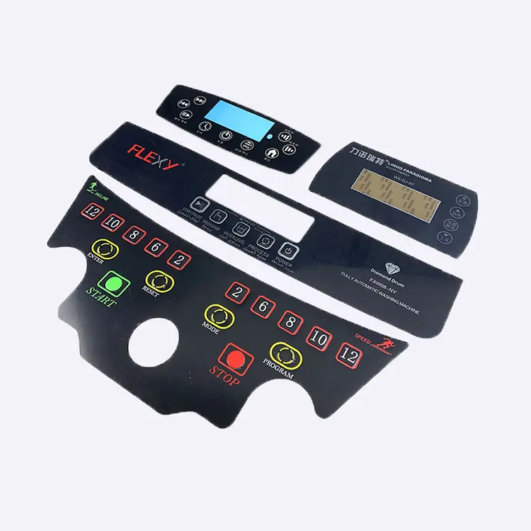{ width="760" loading="lazy" }](cover-lens-customization-coverlens-solutions-for-your-different-products-need.png){ .displaywiki-image-link title="查看原图" }
  <figcaption>适合您不同产品的解决方案</figcaption>
</figure>

<figure markdown="span" class="displaywiki-figure">
  [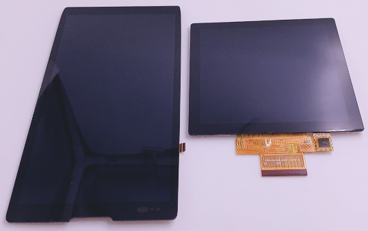{ width="760" loading="lazy" }](cover-lens-customization-coverlens-solutions-for-your-different-products-need-2.png){ .displaywiki-image-link title="查看原图" }
  <figcaption>适合您不同产品的解决方案</figcaption>
</figure>

<figure markdown="span" class="displaywiki-figure">
  [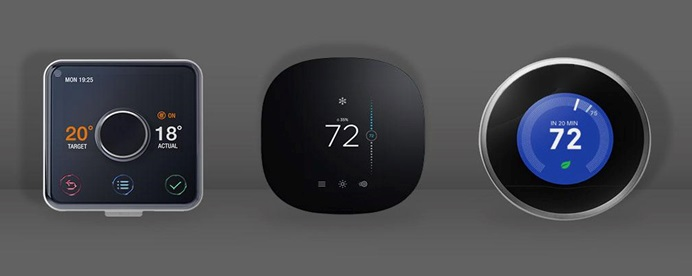{ width="760" loading="lazy" }](cover-lens-customization-coverlens-solutions-for-your-different-products-need.jpeg){ .displaywiki-image-link title="查看原图" }
  <figcaption>适合您不同产品的解决方案</figcaption>
</figure>

<figure markdown="span" class="displaywiki-figure">
  [{ width="760" loading="lazy" }](cover-lens-customization-cover-lens-customization-for-display-products-diagram-4.png){ .displaywiki-image-link title="查看原图" }
</figure>

盖板是用户界面中最直接可见的部分。它必须随着时间的推移保持其外观，无论操作环境如何对它，这可能包括雨或海水，阳光，清洁化学品，工业油，厨房脂或家用灰尘。

为了为客户提供个性化的支持，VIEWE作为展示专家一直在研究最新的设计趋势和制造过程。我们还与供应合作伙伴沟通，了解他们的当前能力以及他们正在开发的新创新和技术。

切割和定制形状

许多已经过验证的技术可以非常有效地使您的Coverlens脱而出，提供更高精度和更细的表面成品，

<figure markdown="span" class="displaywiki-figure">
  [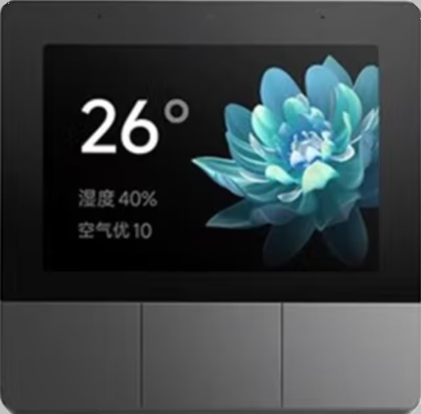{ width="760" loading="lazy" }](cover-lens-customization-cut-outs-custom-shapes.png){ .displaywiki-image-link title="查看原图" }
  <figcaption>切割和定制形状</figcaption>
</figure>

<figure markdown="span" class="displaywiki-figure">
  [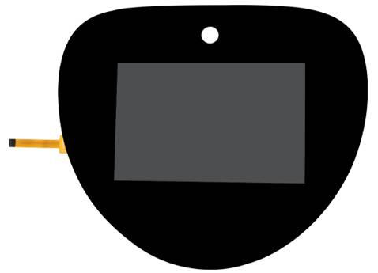{ width="760" loading="lazy" }](cover-lens-customization-cut-outs-custom-shapes-2.png){ .displaywiki-image-link title="查看原图" }
  <figcaption>切割和定制形状</figcaption>
</figure>

<figure markdown="span" class="displaywiki-figure">
  [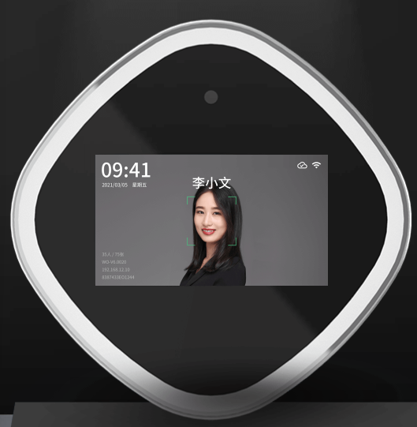{ width="760" loading="lazy" }](cover-lens-customization-cut-outs-custom-shapes-3.png){ .displaywiki-image-link title="查看原图" }
  <figcaption>切割和定制形状</figcaption>
</figure>

<figure markdown="span" class="displaywiki-figure">
  [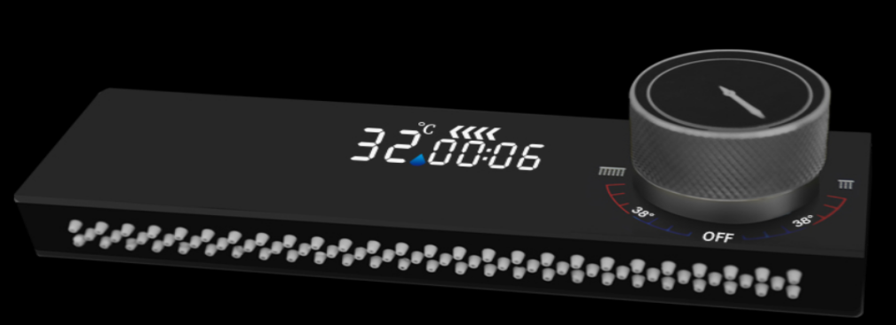{ width="760" loading="lazy" }](cover-lens-customization-cover-lens-customization-for-display-products-diagram-8.png){ .displaywiki-image-link title="查看原图" }
</figure>

<figure markdown="span" class="displaywiki-figure">
  [{ width="760" loading="lazy" }](cover-lens-customization-cover-lens-customization-for-display-products-diagram-9.png){ .displaywiki-image-link title="查看原图" }
</figure>

<figure markdown="span" class="displaywiki-figure">
  [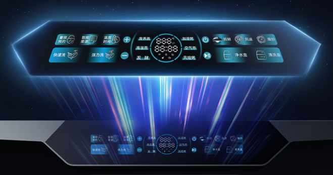{ width="760" loading="lazy" }](cover-lens-customization-any-cover-glass-shape-can-be-achieved-to-match-your-housing.png){ .displaywiki-image-link title="查看原图" }
  <figcaption>• 任何盖面玻璃形状都可以达到适合您的住房</figcaption>
</figure>

我们可以提供自定义的形状，以匹配住房设计的轮，以及摄像头，传感器和机械表盘和按。

• 任何盖面玻璃形状都可以达到适合您的住房

• 周边设备的孔

• 用超大尺寸的盖面玻璃扩展触摸或打印区域

标志和图标打印

创造性地显示盖板玻璃是让您的HMI脱而出的一种负担得起的方式。

<figure markdown="span" class="displaywiki-figure">
  [{ width="760" loading="lazy" }](cover-lens-customization-creatively-displaying-cover-glass-is-an-affordable-way-to-make-your-hm.png){ .displaywiki-image-link title="查看原图" }
  <figcaption>创造性地显示盖面玻璃是让您的HMI脱而出的一种负担得起的方式</figcaption>
</figure>

<figure markdown="span" class="displaywiki-figure">
  [{ width="760" loading="lazy" }](cover-lens-customization-brand-identity-with-full-color-logo-printing.png){ .displaywiki-image-link title="查看原图" }
  <figcaption>• 全彩标志打印的品牌身份</figcaption>
</figure>

<figure markdown="span" class="displaywiki-figure">
  [{ width="760" loading="lazy" }](cover-lens-customization-brand-identity-with-full-color-logo-printing-2.png){ .displaywiki-image-link title="查看原图" }
  <figcaption>• 全彩标志打印的品牌身份</figcaption>
</figure>

从公司标志到功能图标，任何东西都可以打印在你的盖面玻璃上。

• 全彩标志打印的品牌身份

• 可见或隐藏的图标，直到点亮

•可负担得起的解决方案，以实现最大影响

隐藏的标志或图标可以用于在盖板表面创造想象力的效果。

<figure markdown="span" class="displaywiki-figure">
  [{ width="760" loading="lazy" }](cover-lens-customization-hidden-logo-or-icons-can-be-used-to-create-imaginative-effects-on-the.png){ .displaywiki-image-link title="查看原图" }
  <figcaption>隐藏的标志或图标可以用于在盖板表面创造想象力的效果</figcaption>
</figure>

<figure markdown="span" class="displaywiki-figure">
  [{ width="760" loading="lazy" }](cover-lens-customization-stylish-appearance.png){ .displaywiki-image-link title="查看原图" }
  <figcaption>• 时尚的外观</figcaption>
</figure>

<figure markdown="span" class="displaywiki-figure">
  [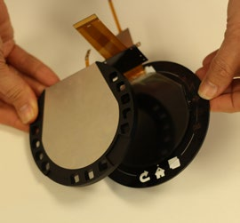{ width="760" loading="lazy" }](cover-lens-customization-stylish-appearance-2.png){ .displaywiki-image-link title="查看原图" }
  <figcaption>• 时尚的外观</figcaption>
</figure>

任何形状的显示屏可以通过在盖后放置不同颜色的LED点亮，并且只会启动，显示图标，当相关功能被激活时。例如，电池指标可以在电池低的时候点亮。

• 时尚的外观

• 简单的用户界面 - 只显示使用中的图标

• 可以使用不同颜色的LED来区分功能

玻璃替代品

高透明度的聚乙烯甲基酸盐 (PMMA) 和高透明性的聚碳酸 (PC) 都是设计玻璃覆盖器时需要考虑的替代品，这使得它们视觉上与玻璃相似，但具有更轻和更强大的优势。

<figure markdown="span" class="displaywiki-figure">
  [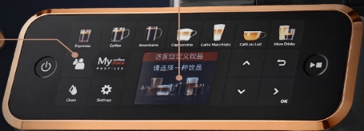{ width="760" loading="lazy" }](cover-lens-customization-lightweight-glass-alternative.png){ .displaywiki-image-link title="查看原图" }
  <figcaption>•轻量级玻璃替代品</figcaption>
</figure>

<figure markdown="span" class="displaywiki-figure">
  [{ width="760" loading="lazy" }](cover-lens-customization-lightweight-glass-alternative-2.png){ .displaywiki-image-link title="查看原图" }
  <figcaption>•轻量级玻璃替代品</figcaption>
</figure>

<figure markdown="span" class="displaywiki-figure">
  [{ width="760" loading="lazy" }](cover-lens-customization-lightweight-glass-alternative-3.png){ .displaywiki-image-link title="查看原图" }
  <figcaption>•轻量级玻璃替代品</figcaption>
</figure>

这种盖面材料具有出色的冲击阻力，与玻璃不同，不会破碎。

•轻量级玻璃替代品

•非常耐冲击，不会破碎

•与玻璃相比的透明度

抗菌保护

触摸屏在我们日常生活中越来越常见，

<figure markdown="span" class="displaywiki-figure">
  [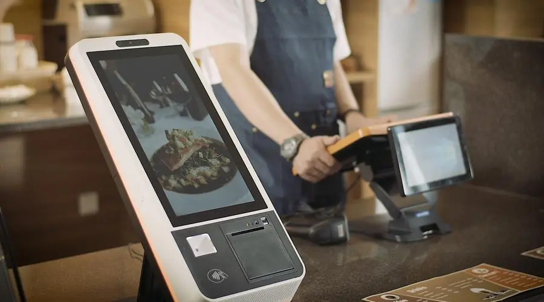{ width="760" loading="lazy" }](cover-lens-customization-available-as-screen-protector-of-built-into-glass-at-manufacture.png){ .displaywiki-image-link title="查看原图" }
  <figcaption>• 可作为制造时内置玻璃的屏幕保护器</figcaption>
</figure>

<figure markdown="span" class="displaywiki-figure">
  [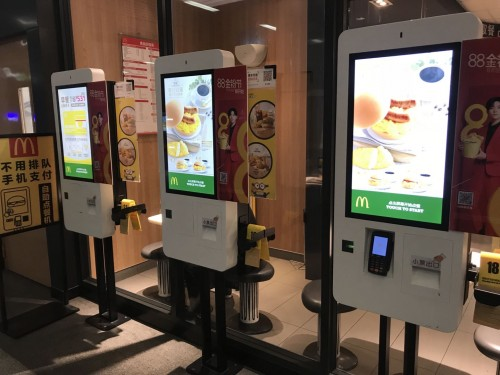{ width="760" loading="lazy" }](cover-lens-customization-available-as-screen-protector-of-built-into-glass-at-manufacture-2.png){ .displaywiki-image-link title="查看原图" }
  <figcaption>• 可作为制造时内置玻璃的屏幕保护器</figcaption>
</figure>

<figure markdown="span" class="displaywiki-figure">
  [{ width="760" loading="lazy" }](cover-lens-customization-available-as-screen-protector-of-built-into-glass-at-manufacture-3.png){ .displaywiki-image-link title="查看原图" }
  <figcaption>• 可作为制造时内置玻璃的屏幕保护器</figcaption>
</figure>

VIEWECARE健康显示：抗菌剂和手保护系列具有99%的广泛范围的细菌杀伤率，

• 可作为制造时内置玻璃的屏幕保护器

• 对PCAP或触摸屏功能没有影响

• 产品使用寿命

彩色玻璃

当显示器不活跃时，涂仍然是隐藏可见区域的有效和经济高效方法。

<figure markdown="span" class="displaywiki-figure">
  [{ width="760" loading="lazy" }](cover-lens-customization-all-white-all-black.png){ .displaywiki-image-link title="查看原图" }
  <figcaption>全白/全黑</figcaption>
</figure>

<figure markdown="span" class="displaywiki-figure">
  [{ width="760" loading="lazy" }](cover-lens-customization-all-white-all-black.jpeg){ .displaywiki-image-link title="查看原图" }
  <figcaption>全白/全黑</figcaption>
</figure>

<figure markdown="span" class="displaywiki-figure">
  [{ width="760" loading="lazy" }](cover-lens-customization-all-white-all-black-2.jpeg){ .displaywiki-image-link title="查看原图" }
  <figcaption>全白/全黑</figcaption>
</figure>

<figure markdown="span" class="displaywiki-figure">
  [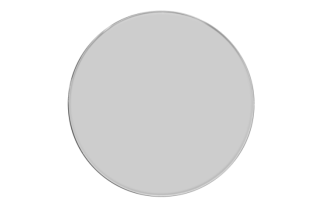{ width="760" loading="lazy" }](cover-lens-customization-all-white-all-black-2.png){ .displaywiki-image-link title="查看原图" }
  <figcaption>全白/全黑</figcaption>
</figure>

<figure markdown="span" class="displaywiki-figure">
  [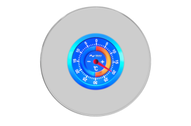{ width="760" loading="lazy" }](cover-lens-customization-all-white-all-black-3.png){ .displaywiki-image-link title="查看原图" }
  <figcaption>全白/全黑</figcaption>
</figure>

<figure markdown="span" class="displaywiki-figure">
  [{ width="760" loading="lazy" }](cover-lens-customization-all-white-all-black-4.png){ .displaywiki-image-link title="查看原图" }
  <figcaption>全白/全黑</figcaption>
</figure>

<figure markdown="span" class="displaywiki-figure">
  [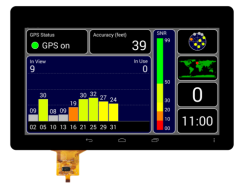{ width="760" loading="lazy" }](cover-lens-customization-all-white-all-black-5.png){ .displaywiki-image-link title="查看原图" }
  <figcaption>全白/全黑</figcaption>
</figure>

它有效地提供了完全黑色的效果和非常时尚的外观，从高端音频到家电和智能家居设备。

• 屏幕在关闭时看起来完全黑色

• 提供任何设备的优雅，现代化外观

超大尺寸的遮盖板玻璃

封面尺寸和形状可定制。

<figure markdown="span" class="displaywiki-figure">
  [{ width="760" loading="lazy" }](cover-lens-customization-cover-size-and-shape-can-be-customized.jpeg){ .displaywiki-image-link title="查看原图" }
  <figcaption>封面尺寸和形状可定制</figcaption>
</figure>

<figure markdown="span" class="displaywiki-figure">
  [{ width="760" loading="lazy" }](cover-lens-customization-cover-size-and-shape-can-be-customized.png){ .displaywiki-image-link title="查看原图" }
  <figcaption>封面尺寸和形状可定制</figcaption>
</figure>

<figure markdown="span" class="displaywiki-figure">
  [{ width="760" loading="lazy" }](cover-lens-customization-cover-size-and-shape-can-be-customized-2.png){ .displaywiki-image-link title="查看原图" }
  <figcaption>封面尺寸和形状可定制</figcaption>
</figure>

<figure markdown="span" class="displaywiki-figure">
  [{ width="760" loading="lazy" }](cover-lens-customization-cover-size-and-shape-can-be-customized-3.png){ .displaywiki-image-link title="查看原图" }
  <figcaption>封面尺寸和形状可定制</figcaption>
</figure>

<figure markdown="span" class="displaywiki-figure">
  [{ width="760" loading="lazy" }](cover-lens-customization-cover-lens-customization-for-display-products-diagram-34.png){ .displaywiki-image-link title="查看原图" }
</figure>

扩展屏幕在显示模块边界以外的任何方向允许创建不同的形状，以集成用户界面的其他方面并创造一个整体统一，时尚的外观。

除了扩展的触摸功能外，可以添加其他功能到扩展覆盖板玻璃上，例如额外的打印和射频传感器用于销售点支付

• 扩展盖面玻璃，增加触摸功能

• 增加RF传感器等外围设备

• 印制标志的额外空间

3D/2.5D形状的覆盖板玻璃

可以实现2.5D和圆形镜头以及像状圆形显示器这样的三维形状。

<figure markdown="span" class="displaywiki-figure">
  [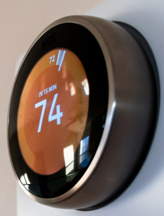{ width="760" loading="lazy" }](cover-lens-customization-they-can-be-achieved-using-glass-polycarbonate-or-acrylic-pmma.png){ .displaywiki-image-link title="查看原图" }
  <figcaption>它们可以通过玻璃，聚碳酸盐或烯基 (PMMA) 来实现</figcaption>
</figure>

显示器和遮盖镜子之间的空间充满了光学树脂，

最受欢迎的应用包括智能家居设备控制，海洋控制和摩托车集群。

•不同尺寸的覆盖板玻璃

•可用的触摸功能

•可选的玻璃或塑料表镜

光学贴合

随着越来越多的显示器在户外或高照明环境中使用，显示清晰度和视角对于设计师来说至关重要，以确保最好的观测体验。

## 相关阅读

- [显示屏盖板材料、厚度与表面处理](cover-lens-materials-treatments.md)
- [显示屏减反射与防眩光处理对比](anti-reflective-vs-anti-glare.md)
- [盖板防指纹与抗菌表面处理](anti-fingerprint-antibacterial.md)

!!! info "没有找到您需要的内容？"
    如果您需要更多产品、资源或技术支持，欢迎联系我们的团队：

    [**:material-archive-arrow-down: 知识库**](../../knowledge/tags.md){ .md-button .md-button--primary }
    [**:material-magnify: 产品与解决方案**](https://www.chinasunyee.com){ .md-button }
    [**:material-email: 联系技术支持**](mailto:info@chinasunyee.com){ .md-button }
