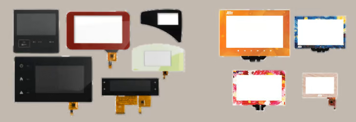

# 显示屏盖板材料、厚度与表面处理

!!! abstract "快速结论"
    本指南解释了显示屏盖板的选择，相关的设计权衡以及工程师在选择显示屏解决方案时应该验证的点。

## 核心要点

- 系统了解显示屏盖板材料、厚度与表面处理，包括关键原理、优缺点、应用场景和工程选型要点。
- 根据下文比较相关技术、应用条件和设计取舍。
- 最终选型前，应确认光学、电气、结构、环境与量产要求。

## 盖板

具有投影电容式触摸屏的模块有一个顶层，称为盖面。该部分是产品中最常用的定制组件。它是让显示屏完全改变外观的部分。以完美地与其他的产品设计相结合。

<figure markdown="span" class="displaywiki-figure">
  [{ width="760" loading="lazy" }](cover-lens-materials-treatments-cover-glass-thickness.png){ .displaywiki-image-link title="查看原图" }
  <figcaption>覆盖板玻璃厚度</figcaption>
</figure>

除了定制的颜色和形状外，我们提供不同的玻璃厚度，加固的玻璃，表面处理等。

### 覆盖板玻璃厚度

盖板玻璃的厚度取决于冲击保护要求和一般机械要求。在特定厚度系列中选择盖镜头厚度。建议厚度值为0.55mm,0.7mm1.1mm1.8mm3mm和4mm.

值得区分盖面玻璃厚度和触摸传感器的整体厚度。

如果我们有0.7mm的CG和0.55mm的传感器，与0.15mm的粘合剂，我们实际上有一个1.4mm的显示面积，所以双重CG完全改变机械。理解这一事实是从耐久性角度来看很重要的。

如果您的项目需要更厚的玻璃，请随时联系我们。我们使用触摸控制器 (Hycon,Ilitek,EETI,PenMount)，可支持高达15毫米厚的覆盖板玻璃。

### 玻璃的安全性

设计过程的第二个方面是玻璃的安全性。

化学强化玻璃

热制玻璃

两种选项都因后生产过程增加了强度 (正如名称所示化学或热处理).

当化学强化的玻璃被破碎时，它会分成长的裂，与普通玻璃不同。热温玻璃破碎后结构的外观是不同的。

### 真正的颜色

你知道我们的显示器总是放出清晰，充满活力的图像。颜色仍然很明亮和真实。我们通过选择一个超清的玻璃解决方案来实现这一效果。

这意味着该组件是完全变色的。

设计是非常简单的。我们只需要在Pantone或RAL中表示使用颜色的图纸，然后在十几个工作日内提供以丝打印工艺制成的盖板样品。

### 遮蔽镜头的治疗方法

减反射 (AR) 通过将特定厚度的涂层应用于盖镜头表面，减少显示器表面上的反射。

反光 (AG) 通过在盖镜头上创造粗的表面，从显示面上移除一个明亮的光。

防指纹 (AF) 通过使用一种减少盖镜头保留油脂的能力的处理方法来防止显示表面上的指纹和污染

### 封面镜子的特殊材料

我们还提供了特殊的镜头材料：

角落猩猩玻璃

戈里拉玻璃用于保护显示屏。它是用于触摸屏的耐磨玻璃产品。

这种整理的玻璃由化学增强的酸制成。由于生产过程中经历的离子交换过程，玻璃具有其强度。

PMMA 盖板

聚甲基烯酸 (PMMA)，也称为烯酸，烯基玻璃或普克西格لاس通常被用于盖面玻璃选项。这种盖面镜头的一种优势是，当受到外部力量的影响时，它不会破碎。另外一个优点是，它很容易做孔，切割不同的形状。

## 相关阅读

- [显示屏减反射与防眩光处理对比](anti-reflective-vs-anti-glare.md)
- [盖板防指纹与抗菌表面处理](anti-fingerprint-antibacterial.md)
- [显示产品盖板定制指南](cover-lens-customization.md)

!!! info "没有找到您需要的内容？"
    如果您需要更多产品、资源或技术支持，欢迎联系我们的团队：

    [**:material-archive-arrow-down: 知识库**](../../knowledge/tags.md){ .md-button .md-button--primary }
    [**:material-magnify: 产品与解决方案**](https://www.chinasunyee.com){ .md-button }
    [**:material-email: 联系技术支持**](mailto:info@chinasunyee.com){ .md-button }
