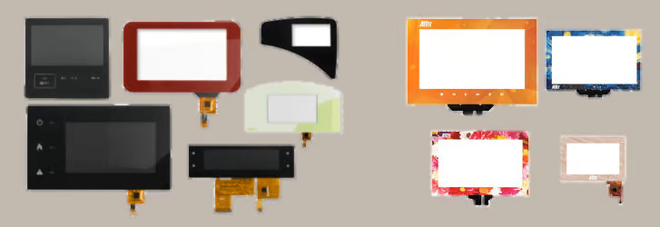

# 显示屏盖板材料、厚度与表面处理

!!! abstract "快速结论"
    盖板是产品中最常被定制、也最能改变外观的部件。选型需要依次确定四件事：厚度（取决于抗冲击与机械要求）、安全方案（化学强化或热强化）、着色与外观（丝网印刷）、表面处理（AR / AG / AF）。此外，康宁大猩猩玻璃与 PMMA 分别适用于抗刮与抗碎裂两类不同诉求。

## 核心要点

- 带投射式电容触控的模组都有一层顶盖，也就是盖板，它是整机外观差异的主要来源。
- 盖板厚度按抗冲击与机械要求从标准厚度系列中选取，常见 0.55 / 0.7 / 1.1 / 1.8 / 3 / 4 mm。
- 设计时要区分"盖板玻璃厚度"与"盖板 + 触控传感器 + 胶层的总厚度"，后者才决定整机的机械与耐久表现。
- 玻璃安全性来自后段强化工艺：化学强化与热强化碎裂形态不同，需按安全要求选择。

## 1. 盖板：产品中最常被定制的部件

具有投射式电容触摸屏的显示模组都有一个顶层，称为盖板。它是产品中被使用最频繁的定制组件，也是让显示屏外观完全改变的部分，需要与其他产品设计要素协同。

除定制的颜色与形状外，盖板还可以选择不同的玻璃厚度、强化方式与表面处理。

<figure markdown="span" class="displaywiki-figure">
  [{ width="760" loading="lazy" }](cover-lens-materials-treatments-cover-glass-thickness.png){ .displaywiki-image-link title="查看原图" }
  <figcaption>定制盖板样品：涵盖不同颜色（黑、红、黄、蓝及花纹印刷）、不同外形（含圆角与异形切割）以及不同厚度的盖板玻璃，均带 FPC 以便与触控模组集成。</figcaption>
</figure>

## 2. 盖板玻璃厚度

盖板玻璃的厚度取决于抗冲击保护要求与整体机械要求，应从标准厚度系列中选取。推荐厚度值为 **0.55 mm、0.7 mm、1.1 mm、1.8 mm、3 mm 与 4 mm**。

一个常见误区是把盖板厚度等同于显示面的总厚度。需要区分盖板玻璃厚度与触摸传感器的整体厚度：例如 0.7 mm 的盖板玻璃（CG）配 0.55 mm 的触控传感器，再加 0.15 mm 的粘合层，实际形成的显示面厚度约为 1.4 mm。也就是说，只更换更厚的盖板玻璃，就会明显改变整机的机械特性——从耐久性角度看，理解这一点非常重要。

如果项目需要更厚的玻璃，也可进一步定制。采用 Hycon、Ilitek、EETI、PenMount 等触控控制器方案，可支持最厚达 15 mm 的盖板玻璃。

## 3. 玻璃的安全性

设计过程的第二个方面是玻璃的安全性。两种常见的强化方案是：

- **化学强化玻璃**：通过离子交换过程在玻璃表面形成压应力层。
- **热强化玻璃**：通过热处理提升强度。

两者都因后段处理而增加了强度，但破碎后的形态不同：化学强化玻璃破碎时会分裂成长条状裂纹，与普通玻璃不同；热强化玻璃破碎后的结构外观也与前者有明显差异。对于有安全碎片要求的应用，需要依据实际使用环境选择对应方案。

## 4. 真实色彩与着色工艺

显示画面对清晰度与色彩表现的要求，通常通过选用超白玻璃实现，这类组件本身几乎不带色偏。需要强调的是，盖板着色与显示色彩是两件不同的事：着色决定的是盖板的外观色与油墨区字体，而不是显示画面本身的色彩还原能力。

工艺上，只需提供标注了 Pantone 或 RAL 色号的图纸，即可在十余个工作日内提供采用丝网印刷工艺制成的盖板样品。

## 5. 表面处理

盖板表面可叠加三类光学处理，作用各不相同：

- **AR（减反射）**：在盖板表面镀上特定厚度的涂层，减少显示表面的反射。
- **AG（防眩）**：在盖板表面形成细微粗糙结构，把镜面反射打散，从而消除画面上的亮斑。
- **AF（防指纹）**：通过降低盖板表面对油脂的吸附能力，减少指纹与污染物在显示表面残留。

三类处理可以组合使用，具体取舍可参阅减反射与防眩光对比、防指纹与抗菌表面处理等相关章节。

## 6. 特殊材料

除常规玻璃外，还可选择两类特殊材料：

**康宁大猩猩玻璃**

用于保护显示屏的耐磨玻璃产品。该玻璃通过化学强化工艺制成，其强度来自生产过程中的离子交换，适合对抗刮性能有较高要求的场景。

**PMMA 盖板**

PMMA（聚甲基丙烯酸甲酯）俗称亚克力、丙烯酸玻璃或有机玻璃，常被用作盖板材料。它的一个优势是受到外力时不会碎裂，另一个优势是易于开孔与切割成不同形状——适合异形结构多、对碎裂风险敏感但对表面硬度要求相对宽松的场景。

## 7. 选型要点

- **先定厚度再定结构**：按抗冲击要求从标准厚度系列选择，同时核算盖板 + 传感器 + 胶层的总厚度。
- **明确安全要求**：有碎片安全要求的场景选择化学强化或热强化玻璃，并确认其破碎形态是否满足标准。
- **按环境选表面处理**：强光环境优先 AR / AG，高频触摸优先 AF，可叠加使用。
- **区分外观与画质**：着色工艺解决的是盖板外观色，画质由玻璃基材（如超白玻璃）与显示模组决定。
- **按机械风险选材料**：抗刮优先选化学强化玻璃（如大猩猩玻璃），抗碎裂与异形加工优先考虑 PMMA。
- **确认触控兼容性**：厚盖板会削弱触控信噪比，需与触控控制器方案一并确认支持的厚度范围。

## 8. FAQ

??? question "Q1：盖板玻璃厚度该怎么选？"
    先看抗冲击要求与整机机械约束，再从标准厚度系列（0.55 / 0.7 / 1.1 / 1.8 / 3 / 4 mm）中选取。较厚盖板抗冲击更强但更重、对触控信号衰减更大；较薄盖板更轻巧但需评估跌落风险。若需要更厚规格，可通过特定触控控制器方案支持到 15 mm。

??? question "Q2：盖板厚度和触控模组总厚度是一回事吗？"
    不是。盖板玻璃厚度只是其中一层，显示面总厚度还包括触控传感器与粘合层。例如 0.7 mm 盖板 + 0.55 mm 传感器 + 0.15 mm 胶层，总厚度约 1.4 mm。设计时必须用总厚度核算机械与耐久表现，否则容易低估整机变化。

??? question "Q3：化学强化玻璃和热强化玻璃有什么区别？"
    两者都通过后段工艺提升强度，但方式不同：化学强化依靠离子交换在表面形成压应力层，破碎时分裂成长条状裂纹；热强化依靠热处理，破碎后的形态与之不同。选择时需结合安全碎片要求与使用场景判断。

??? question "Q4：AR、AG、AF 三种表面处理怎么选？"
    AR 减少反射，适合需要高通透度与低反射的场景；AG 把反射打散消除光斑，适合强光环境；AF 降低油脂吸附，适合触控频繁、易留指纹的产品。三者可以叠加，常见组合是 AG 防眩加 AF 防指纹。

??? question "Q5：康宁大猩猩玻璃和 PMMA 该怎么选？"
    看主要风险是"刮伤"还是"碎裂"。化学强化玻璃（如大猩猩玻璃）表面硬度高、抗刮能力强，但受强冲击时仍可能碎裂；PMMA 在受外力时不易碎裂且易开孔、易切割异形，适合形状复杂或跌落风险高的产品，但表面硬度与耐刮性相对较弱。

??? question "Q6：盖板颜色是怎么做上去的？"
    主要采用丝网印刷工艺。只需提供标注 Pantone 或 RAL 色号的图纸，即可制作样品，通常十余个工作日可交付。需要注意区分：着色解决的是盖板外观色与油墨区，若要保证显示画面本身的色彩还原，应选择超白玻璃等低色偏基材。

## 相关阅读

- [显示屏减反射与防眩光处理对比](anti-reflective-vs-anti-glare.md)
- [盖板防指纹与抗菌表面处理](anti-fingerprint-antibacterial.md)
- [显示产品盖板定制指南](cover-lens-customization.md)

## 参考数据来源

本文涉及的标准、规格与应用资料：

- [康宁 Gorilla Glass 产品手册](https://www.corning.com/microsite/csm/gorillaglass/PI_Glass/)
- [TFT LCD 模组规格书示例（7 英寸 WVGA）](../../../assets/datasheet/display/ALL-UE070WV-RB40-A092A.pdf)

!!! info "没有找到您需要的内容？"
    如果您需要更多产品、资源或技术支持，欢迎联系我们的团队：

    [**:material-archive-arrow-down: 知识库**](../../knowledge/tags.md){ .md-button .md-button--primary }
    [**:material-magnify: 产品与解决方案**](https://www.chinasunyee.com){ .md-button }
    [**:material-email: 联系技术支持**](mailto:info@chinasunyee.com){ .md-button }
