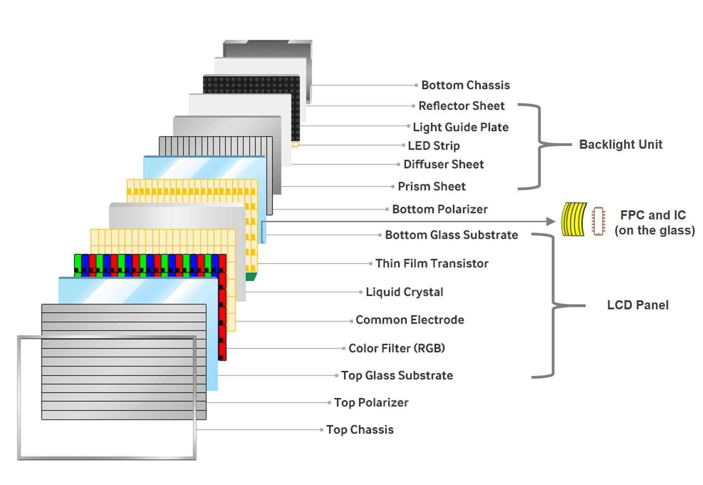
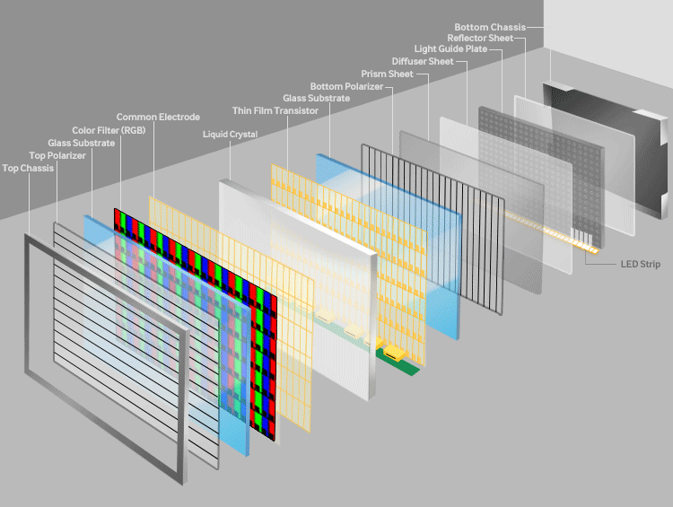
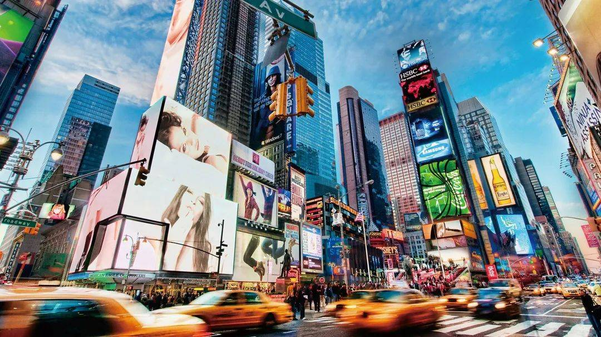
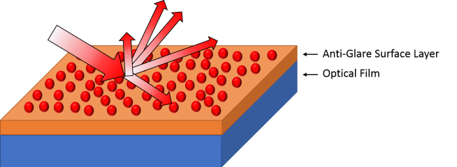

# 定制与阳光下可读显示解决方案

!!! abstract "快速结论"
    本指南解释了阳光可读显示方案,相关的设计权衡以及工程师在选择显示方案时应该验证的点.

## 核心要点

- 系统了解定制与阳光下可读显示解决方案，包括关键原理、优缺点、应用场景和工程选型要点。
- 根据下文比较相关技术、应用条件和设计取舍。
- 最终选型前，应确认光学、电气、结构、环境与量产要求。

## 显示解决方案

TFT显示器结构:

<figure markdown="span" class="displaywiki-figure">
  [{ width="760" loading="lazy" }](custom-sunlight-readable-displays-tft-display-structure.jpeg){ .displaywiki-image-link title="查看原图" }
  <figcaption>TFT显示结构</figcaption>
</figure>

<figure markdown="span" class="displaywiki-figure">
  [{ width="760" loading="lazy" }](custom-sunlight-readable-displays-customize-solution.gif){ .displaywiki-image-link title="查看原图" }
  <figcaption>定制解决方案</figcaption>
</figure>

TFT定制能力:

<figure markdown="span" class="displaywiki-figure">
  [{ width="760" loading="lazy" }](custom-sunlight-readable-displays-tft-customize-ability.png){ .displaywiki-image-link title="查看原图" }
  <figcaption>TFT 定制能力</figcaption>
</figure>

VIEWE可提供显示器定制,包括TFT面板 (尺寸,分辨率,规格...),背光 (亮度,轮尺寸...),FPC/PCB (接口,连接器,电缆......),触摸面板,覆盖板玻璃完全用于客户产品应用.

许多年来,我们帮助客户设计和执行半和完全定制的显示解决方案. 作为一个专业的显示器制造商,因此我们可以为客户提供完美的产品解决方案, 因为我们拥有显示器生产过程的知识, 我们的销售和工程团队将在整个开发过程中与客户在一起,

### 阳光可读的解决方案

#### 介绍

当显示器被带到外面时,它们通常会面临阳光或其他形式的高环境光源的亮度,反射和压倒LED后照图像.

随着液晶面板板行业的发展,防止在户外使用的显示器 (如汽车显示器,数字标志和公共亭子) 脱离阳光变得比以往任何时候都更加重要.因此发明了可读太阳光显示器.

<figure markdown="span" class="displaywiki-figure">
  [{ width="760" loading="lazy" }](custom-sunlight-readable-displays-high-brightness-for-tft-lcd.jpeg){ .displaywiki-image-link title="查看原图" }
  <figcaption>TFT LCD 的亮度</figcaption>
</figure>

一个解决方案是提高TFT LCD显示器的LED背光亮度, 平均而言,TFT LCD屏幕的亮度约为250至450Nit,但当这个亮度增加到800至1000Nit左右 (1000是最常见的) 时,设备会成为高亮的LCD和阳光可读显示器.

这是一种可负担得起的选择,可以在户外提高图像质量,包括对比率和视角等功能.

<figure markdown="span" class="displaywiki-figure">
  [{ width="760" loading="lazy" }](custom-sunlight-readable-displays-custom-and-sunlight-readable-display-solutions-diagram-5.png){ .displaywiki-image-link title="查看原图" }
</figure>

由于今天的许多TFT LCD显示器已经转向触摸屏, 电阻式触摸屏在玻璃底层上使用两个透明层,但透明层仍然可以阻止多达5%的光.

为了优化后照的高亮度,可以使用另一种整理的触摸屏:电容式触摸屏. 尽管它比电阻式触摸屏更昂贵,但这种技术对于阳光可读显示器而言比阻力更理想,因为其使用的薄膜或甚至在细胞中的技术而不是显示器玻璃上面的两个层,因此光可以更有效地传递.

高亮度液晶显示器的缺点

然而,这种方法带来了一系列潜在的问题.首先,高亮度显示器会导致更大的功耗和电池寿命缩短.为了投放更多的光线,需要更多的功率,这也可能导致设备过热,从而可以缩短电池使用寿命. 如果后照明的功率增加,LED的半衰期也可能会减少.

其次,亮度给电子设备带来了热问题:更高的亮度,更多的电力消耗和热量,这令人不安.

然后,虽然在明亮的外观灯光设置下,这些设备可以减少用户试图在屏幕上查看图像时的眼力压力,但显示器本身的亮度也会导致眼力疲劳. 许多设备允许用户调节亮度,所以这种担忧往往并不太严重.

最后,如果户外环境非常阳光明,则不能使用高亮度显示器.强烈的太阳光在屏幕上清扫,强烈反射的光将使屏幕难以清楚地看到.

#### 半反半透式 TFT LCD

最近进入太阳光可读显示类别的技术是变体TFT LCD,来自传递和反射词的组合.通过使用变体两极化器,显著的太阳能比例会从屏幕外反射,以减少冲洗. 这种光学层被称为转光器.

在反光TFT LCD显示器中,阳光可以反射于显示屏,但也可以通过TFT细胞层进行反射,并在背光前面的相对透明的后反射器反射出来,从而照亮了显示屏. 由于其传输和反射模式,这种设备对于将在户外使用的设备非常有用,但也适用于室内.

<figure markdown="span" class="displaywiki-figure">
  [{ width="760" loading="lazy" }](custom-sunlight-readable-displays-surface-treatment-ar-ag.png){ .displaywiki-image-link title="查看原图" }
  <figcaption>表面处理:AR AG</figcaption>
</figure>

虽然它大大降低了电力消耗,但反光液晶显示器比高亮度LCD昂贵得多.近年来,成本已经下降,但是反光 LCD仍然更昂贵.

#### 表面处理:AR AG

除了调整液晶显示器的内部机制外,还可以使用表面处理使设备更容易读取阳光.最常见的是减反射 (AR) 膜/玻璃和反闪光加工.

减反射侧重于沉积多个透明薄膜层.随着每一个构成电影的单个层的厚度,结构和属性,反射光波长都会改变,从而减少光线反射.

<figure markdown="span" class="displaywiki-figure">
  [{ width="760" loading="lazy" }](custom-sunlight-readable-displays-custom-and-sunlight-readable-display-solutions-diagram-7.png){ .displaywiki-image-link title="查看原图" }
</figure>

当使用反光时,反射光会被碎片化.使用粗表面而不是平滑的表面,抗光治疗可以减少反对显示器实际图像的破坏.

<figure markdown="span" class="displaywiki-figure">
  [{ width="760" loading="lazy" }](custom-sunlight-readable-displays-these-two-solutions-can-also-be-combined-which-is-greatly-useful-in-ou.png){ .displaywiki-image-link title="查看原图" }
  <figcaption>这两种解决方案也可以结合起来,这在户外显示器中非常有用</figcaption>
</figure>

详细信息请参阅表面处理解决方案

#### 光学贴合

通过将显示器的玻璃粘贴到其下面的TFT LCD面板上,光学粘结消除了传统液晶显示器使用光学级粘合剂的空气间隙.

<figure markdown="span" class="displaywiki-figure">
  [{ width="760" loading="lazy" }](custom-sunlight-readable-displays-optical-bonding.png){ .displaywiki-image-link title="查看原图" }
  <figcaption>光学贴合</figcaption>
</figure>

这种粘合剂可以减少玻璃和液晶面板之间的反射量以及外部环境光的反射.这样做有助于提供更清晰的图像,对比率增加,或最明亮的白色像素颜色与最黑暗的黑色像سل颜色的光强度差异.

<figure markdown="span" class="displaywiki-figure">
  [{ width="760" loading="lazy" }](custom-sunlight-readable-displays-custom-and-sunlight-readable-display-solutions-diagram-10.png){ .displaywiki-image-link title="查看原图" }
</figure>

通过这种对比率的改善,光学贴合解决了不可读的户外显示器的根本问题:对比度. 虽然亮度增加可以改善对比度,但通过调整对比性本身,

<figure markdown="span" class="displaywiki-figure">
  [{ width="760" loading="lazy" }](custom-sunlight-readable-displays-custom-and-sunlight-readable-display-solutions-diagram-11.png){ .displaywiki-image-link title="查看原图" }
</figure>

除了光学贴合带来的视觉显示优势外,

1. 首先是耐用性,光学贴合消除了设备内的空气间隙,并取代了硬化的粘合剂,可以作为冲击抑制剂.

2. 触摸屏具有光学贴合效益,在触摸和屏幕之间接触点的准确性.所谓的抛物线,是光的折射角度,可以使显示器上的接触点与实际点看起来不同. 当使用粘合剂时,这种折断将降低至最低,如果不是减少.

3. 光学粘合剂消除空气间隙也保护LCD免受湿度/雾化和尘埃的影响,因为玻璃层下没有任何污染的空间.这特别有助于维持LCD在运输,存储和潮湿环境中的状态.

液晶光学贴合由三个主要阶段组成:

准备阶段首先我们需要选择适当的光学清晰的粘合剂,并照顾表面消毒.

在此我们将光学清晰的粘合剂涂在整个显示表面上.

粘合和固化 触摸面板在液晶屏幕上被仔细叠加,避免任何空隙或泡.

#### 结论

通过编译各种方法来提高液晶屏幕的阳光可读性,这些设备可以在高环境照明设置中进行优化.对玻璃表面施加防涂层,对前面和后面都施加减反射涂层. 转光器也在后照的前面使用.这些功能可以导致1000Nit或更大的显示灯,而不会通过高亮度后照过太多的电力消耗和热量产生,从而使得LCD更持久,性能更好

不幸的是,在TFT LCD体中制造反射器的过程是复杂的,而转变性TFTLCD通常比正常传输性的TFT LCD高出几倍.

为了进一步改善和增强LCD的质量,使用LED和冷阴极光灯 (CCFL) 后照明.这两者都会产生明亮的显示屏,但LED可以与CCFL选项相比做出如此多的电力消耗和热量生成. 为了提高显示对比度,还采用光学贴合,从而产生更高效和更优质的阳光可读显示.

<figure markdown="span" class="displaywiki-figure">
  [{ width="760" loading="lazy" }](custom-sunlight-readable-displays-normal-tft-sun-readable-tft.png){ .displaywiki-image-link title="查看原图" }
  <figcaption>正常的TFT太阳能可读 TFT</figcaption>
</figure>

## 相关阅读

- [高可靠性显示解决方案](high-reliability-displays.md)
- [UART 智能显示屏解决方案](uart-smart-display.md)
- [IoT 与 AIoT 智能显示解决方案](iot-aiot-display.md)
