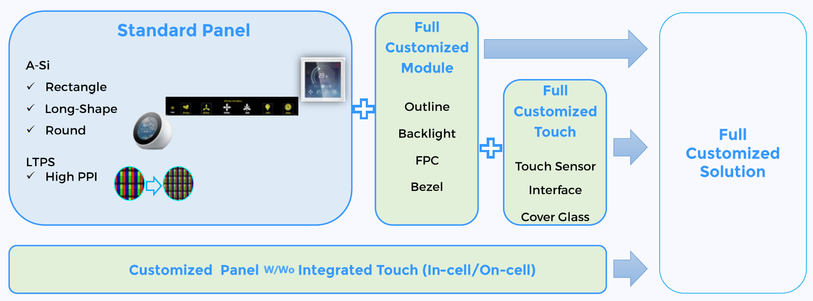
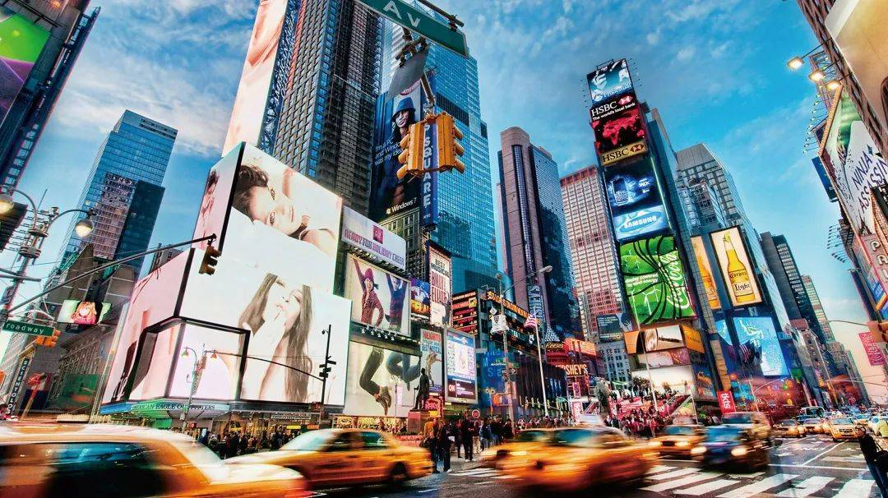
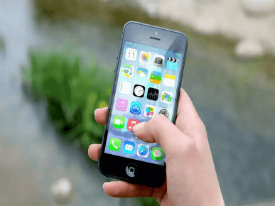
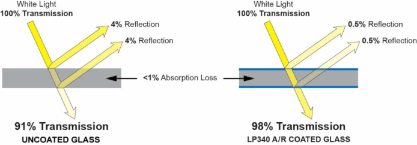
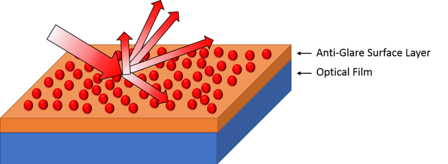
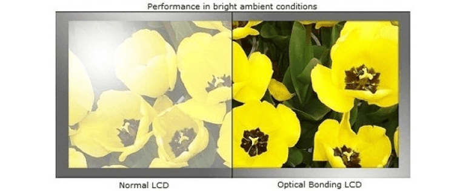

# 定制与阳光下可读显示解决方案

!!! abstract "快速结论"
    让屏幕在强光下可读，有四条技术路径：提高背光亮度、改用半反半透、做 AR/AG 表面处理、以及光学全贴合。它们分别作用于"光源、光路、表面、界面"四个位置，可以单独使用也可以组合。本文先说明 TFT LCD 可定制的层级，再逐条拆解这四类方案的效果与代价。

## 核心要点

- TFT LCD 从面板、模组到触控与盖板都可定制，阳光下可读属于"模组 + 表面"层的定制范畴。
- 高亮度背光见效快、成本低，但功耗、发热与 LED 寿命都会变差，且面对极强阳光仍会失效。
- 半反半透让阳光本身成为光源，强光下可关闭背光；代价是色深折中与更高的成本。
- AR（减反射）与 AG（防眩）作用于玻璃表面，光学贴合作用于层间界面，两者都能直接改善对比度而非单纯堆亮度。

## 1. TFT LCD 可以定制哪些层级

TFT LCD 模组本身就是多层材料的叠合体，这决定了它几乎每一层都可以按客户产品做调整。

<figure markdown="span" class="displaywiki-figure">
  [{ width="760" loading="lazy" }](custom-sunlight-readable-displays-tft-display-structure.jpeg){ .displaywiki-image-link title="查看原图" }
  <figcaption>TFT LCD 模组的层叠结构：下方为背光单元（含导光板、LED 灯条、扩散片、棱镜片、反射片等），中间为液晶面板（含上下偏光片、玻璃基板、TFT 阵列、液晶、彩色滤光片与外框），侧面引出 FPC 与驱动 IC。每一层都对应一项可定制项。</figcaption>
</figure>

优奕视界可提供的显示器定制涵盖：TFT 面板（尺寸、分辨率、规格）、背光（亮度、外形尺寸）、FPC/PCB（接口、连接器、线缆）、触摸面板与盖板玻璃。多年以来，我们帮助客户设计并执行半定制与全定制显示方案；作为专业的显示器件制造商，我们熟悉显示生产的完整流程，销售与工程团队会全程参与客户的开发过程。

<figure markdown="span" class="displaywiki-figure">
  [{ width="760" loading="lazy" }](custom-sunlight-readable-displays-tft-customize-ability.png){ .displaywiki-image-link title="查看原图" }
  <figcaption>从标准面板到全定制方案的定制路径：起点是标准面板（A-Si 的矩形 / 长条形 / 圆形，或 LTPS 的高 PPI），可叠加全定制模组（外形、背光、FPC、边框）与全定制触控（触摸传感器、接口、盖板），最终形成完整定制方案；也可以在不含触控的面板上直接集成 In-cell / On-cell 触控。</figcaption>
</figure>

<figure markdown="span" class="displaywiki-figure">
  [{ width="760" loading="lazy" }](custom-sunlight-readable-displays-customize-solution.gif){ .displaywiki-image-link title="查看原图" }
  <figcaption>模组各层均可定制：调整背光决定亮度与功耗，调整 FPC 决定接口形态，增加盖板与触控决定交互方式，这些选择共同构成最终方案。</figcaption>
</figure>

## 2. 阳光下可读要解决什么问题

显示器被带到户外后，会面对阳光或其他形式的高环境光：光线在屏幕表面形成反射、并把 LED 背光的画面"冲淡"，导致对比度骤降、图像发白。

随着显示行业的发展，防止户外使用的显示器（例如车载显示屏、数字标牌与公共自助终端）被阳光"压倒"，变得比以往更加重要。这也正是阳光下可读显示方案诞生的原因。

<figure markdown="span" class="displaywiki-figure">
  [{ width="760" loading="lazy" }](custom-sunlight-readable-displays-high-brightness-for-tft-lcd.jpeg){ .displaywiki-image-link title="查看原图" }
  <figcaption>户外数字标牌：屏幕长期处于高环境光下，环境光在表面的反射与背光亮度共同决定可读性。</figcaption>
</figure>

问题的本质可以归结为一句话：**可读性取决于画面亮度与环境光反射的比值，而不只是亮度绝对值。** 因此解决思路也分为两类——要么提高分子（亮度），要么降低分母（反射）。下面四种方案就分别落在这两端。

## 3. 方案一：高亮度背光

最直接的做法是提高 TFT LCD 的 LED 背光亮度。TFT LCD 屏幕的常规亮度约为 250 至 450 nits；当亮度提升到 800 至 1000 nits（1000 nits 最常见）时，设备即被视为高亮 LCD 与阳光可读显示器。

这是一种成本相对可控的方案，可在户外改善图像质量，包括对比度与视角等表现。

<figure markdown="span" class="displaywiki-figure">
  [{ width="760" loading="lazy" }](custom-sunlight-readable-displays-custom-and-sunlight-readable-display-solutions-diagram-5.png){ .displaywiki-image-link title="查看原图" }
  <figcaption>触控与可读性的关系：如今多数 TFT LCD 都叠加了触摸屏，而触控层本身的透过率会直接影响抵达观察者的光量——提升亮度之前，先要减少光在触控层与界面上的损耗。</figcaption>
</figure>

由于如今的 TFT LCD 大量转向触摸屏，触控方案的选型也会影响可读性。电阻式触摸屏在玻璃基板上使用两层透明导电层，这两层仍可能阻挡多达 5% 的光。为配合高亮背光，可以改用另一种触控方案——电容式触摸屏：虽然成本高于电阻式，但由于其感应结构集成在薄膜层甚至液晶盒内，而不是贴在显示玻璃上方的两层导电层，光可以更高效地透过，因此更适合阳光可读屏。

**高亮度方案的局限**

- **功耗与发热**：亮度越高，需要的功率越大，电池寿命缩短，且更容易导致设备过热。
- **LED 寿命**：背光功率持续拉高，会缩短 LED 的半衰期。
- **视觉疲劳**：虽然高亮有助于减少强光下"费力去看"的问题，但屏幕自身过亮同样会引起眼睛疲劳，多数设备需提供亮度调节。
- **存在上限**：在阳光极强的户外，高亮度方案会失效——强烈的阳光在屏幕上形成反射，反而让屏幕更难看清。

## 4. 方案二：半反半透 TFT LCD

另一条路径是把阳光从"干扰"变成"光源"。半反半透（Transflective）由 transmissive（透射）与 reflective（反射）组合而来：通过结构设计，让相当比例的阳光在屏幕内部被反射利用，而不是在表面形成干扰反射，这一光学层被称为半透半反膜（Transflector）。

在半反半透 TFT LCD 中，阳光既可以被显示屏表面反射，也可以透过液晶盒，由位于背光前的半透明反射器反射回来照亮屏幕。凭借透射与反射的双重模式，这类器件既适合户外设备，也适合室内使用。它的功耗显著低于高亮方案，但成本更高——尽管近年成本已有所下降，半反半透仍比高亮 LCD 昂贵。

<figure markdown="span" class="displaywiki-figure">
  [{ width="760" loading="lazy" }](custom-sunlight-readable-displays-surface-treatment-ar-ag.png){ .displaywiki-image-link title="查看原图" }
  <figcaption>透射型与半反半透型 TFT 在阳光下的差异：透射型完全依赖背光，阳光在表面的反射会削弱画面对比度；半反半透型在背光前增加反射器，把透过液晶的阳光反射回观察者，因此在强光下不需要把背光开到最亮。</figcaption>
</figure>

## 5. 方案三：表面处理 AR 与 AG

除了调整显示器内部机制，还可以在玻璃表面做处理，让它更容易在阳光下被读取。最常见的两类是减反射（AR，Anti-Reflection）膜／玻璃与防眩（AG，Anti-Glare）处理。

### 5.1 AR 减反射

AR 的做法是在表面沉积多层透明薄膜。每个膜层的厚度、结构与属性都会改变被反射的光波长，通过层间干涉抵消反射，从而减少进入眼睛的干扰光。

<figure markdown="span" class="displaywiki-figure">
  [{ width="760" loading="lazy" }](custom-sunlight-readable-displays-custom-and-sunlight-readable-display-solutions-diagram-7.png){ .displaywiki-image-link title="查看原图" }
  <figcaption>AR 减反射镀膜的效果：未镀膜玻璃的透光率约 91%、单面反射约 4%；采用 A/R 镀膜后透光率提升到 98%、单面反射降至 0.5%，两者差异直接体现为强光下画面"发白"程度的差别。</figcaption>
</figure>

### 5.2 AG 防眩

AG 则走另一条路：不减少反射总量，而是让反射光"散开"。使用带有微凸颗粒的粗糙表面代替光滑表面，把原本集中的镜面反射打散为漫反射，使反射光不再形成刺眼的光斑、也不再掩盖画面本身。

<figure markdown="span" class="displaywiki-figure">
  [{ width="760" loading="lazy" }](custom-sunlight-readable-displays-these-two-solutions-can-also-be-combined-which-is-greatly-useful-in-ou.png){ .displaywiki-image-link title="查看原图" }
  <figcaption>AG 防眩结构：表面防眩层（Anti-Glare Surface Layer）上的微凸颗粒把入射光散射到多个方向，把镜面反射转化为漫反射，从而消除刺眼光斑，代价是画面清晰度会略有下降。</figcaption>
</figure>

AR 与 AG 也可以组合使用——先在表面做 AR 降低反射率，再用 AG 把残余反射打散，这在户外显示器中非常常见。关于表面处理的细节，可参阅盖板与表面处理相关章节。

## 6. 方案四：光学全贴合

光学贴合（Optical Bonding）是把盖板玻璃与下方的 TFT LCD 面板用光学级胶粘合，消除传统结构中层与层之间的空气间隙。

<figure markdown="span" class="displaywiki-figure">
  [{ width="760" loading="lazy" }](custom-sunlight-readable-displays-optical-bonding.png){ .displaywiki-image-link title="查看原图" }
  <figcaption>框贴与全贴合的结构差异：左侧未做光学贴合，面板与 LCD 之间存在空气层（Gap），光线会在多个界面反复反射；右侧全贴合用光学树脂（Resin）填满间隙，界面数量减少，反射随之降低。</figcaption>
</figure>

<figure markdown="span" class="displaywiki-figure">
  [{ width="760" loading="lazy" }](custom-sunlight-readable-displays-custom-and-sunlight-readable-display-solutions-diagram-10.png){ .displaywiki-image-link title="查看原图" }
  <figcaption>光学贴合对反射路径的影响：未贴合时阳光在空气界面产生多次反射与散射，形成明显的杂散光；贴合后光线经树脂直接进入，界面反射大幅减少，图像的对比度则相应提高。</figcaption>
</figure>

这种胶层能减少玻璃与液晶面板之间、以及外部环境光带来的反射，从而带来更清晰的图像与更高的对比度——即最亮的白与最暗的黑之间的光强差异被拉大。

<figure markdown="span" class="displaywiki-figure">
  [{ width="760" loading="lazy" }](custom-sunlight-readable-displays-custom-and-sunlight-readable-display-solutions-diagram-11.png){ .displaywiki-image-link title="查看原图" }
  <figcaption>明亮环境下的表现对比：左侧为普通 LCD，画面被环境光反射冲淡、整体发白；右侧为光学全贴合 LCD，同一画面色彩更饱和、对比度更高。</figcaption>
</figure>

通过这种对比度改善，光学贴合正面解决了户外显示器不可读的根本问题——对比度。虽然提高亮度也能改善对比，但那是通过抬升整体光强实现的；光学贴合则是直接削减干扰光，效率更高。

**除了画质，光学贴合还带来三项附加收益**

1. **耐用性**：消除设备内部的空气间隙并替代硬化粘合剂，胶层可起到冲击缓冲作用。
2. **触控精度**：空气层会引起光线折射，使观察到的触点位置与实际触点产生偏差；使用光学胶后这种折射被降到最低，触控定位更准确。
3. **防护性**：消除空气间隙后，玻璃层下没有可容纳污染物的空间，可保护 LCD 免受水汽、雾化与灰尘影响，尤其有助于在运输、存储与潮湿环境中维持状态。

**光学贴合的工艺阶段**：首先是准备阶段，选择合适的光学透明胶并做好表面清洁；随后将光学胶涂布在整个显示表面；最后是贴合与固化，把触摸面板仔细叠合到液晶屏上，避免产生空隙或气泡。

## 7. 方案如何组合

把各种提升阳光可读性的方法组合起来，设备就能在高环境光下取得最佳效果：在玻璃表面施加防反射涂层（正面与背面都可施加减反射镀膜），并在背光前加入半透半反膜。这些措施可以在不依赖超大功率背光的前提下，实现 1000 nits 甚至更高的显示亮度，同时避免过高的功耗与发热，让 LCD 更耐用、性能更稳定。

需要注意的是，在 TFT LCD 中制造反射器的工艺相对复杂，因此半反半透 TFT LCD 的成本通常比普通透射型 TFT LCD 高出数倍，这条路径更适合确实需要强光可读且功耗敏感的产品。

在背光光源的选择上，LED 与冷阴极荧光灯（CCFL）都可以使用，两者都能提供明亮的显示效果，但 LED 在功耗与发热方面明显优于 CCFL。若再叠加光学贴合以提高对比度，就能得到更高效、更优质的阳光下可读显示方案。

<figure markdown="span" class="displaywiki-figure">
  [{ width="760" loading="lazy" }](custom-sunlight-readable-displays-normal-tft-sun-readable-tft.png){ .displaywiki-image-link title="查看原图" }
  <figcaption>组合方案的实际效果：在改进表面处理、透光方式与层间界面之后，屏幕在高环境光下仍能保持画面色彩与层次，而不是单纯靠提高亮度"顶"过去。</figcaption>
</figure>

## 8. 选型要点

- **先量化环境照度**：明确设备实际工作环境的光照水平（室内约 500 lux、户外阴影约 1 万 lux、直射阳光可达 10 万 lux），再决定方案组合。
- **优先降反射，再考虑堆亮度**：AR/AG 与光学贴合直接削减干扰光，往往比单纯提高 nits 更省功耗。
- **评估功耗与散热预算**：高亮背光会显著抬高功耗与发热，电池供电设备需谨慎。
- **确认色深要求**：半反半透会带来色深折中，对色彩有硬性要求的场景需提前评估。
- **同步确认触控方案**：电容式比电阻式更适合高亮户外屏，且需一并考虑触控层的透过率。
- **核对结构与成本**：半反半透膜与光学贴合都会影响厚度、工艺与成本，需与整机设计同步确认。

## 9. FAQ

??? question "Q1：阳光下可读有哪几种实现方式？"
    主要有四类：一是提高背光亮度（高亮 LCD）；二是改用半反半透，让阳光本身参与照明；三是在玻璃表面做 AR 减反射或 AG 防眩处理；四是光学全贴合，削减层间界面反射。四者作用于不同位置，实际方案通常是它们的组合。

??? question "Q2：把亮度提到 1000 nits 是不是就够了？"
    不一定。1000 nits 是常见的高亮门槛，常规屏幕约 250 至 450 nits，提升后确实能改善户外表现。但在极强阳光下，单纯提高亮度会遇到边际收益递减：屏幕表面的反射光同样被放大，功耗与发热却持续上升，此时需要配合表面处理或贴合方案。

??? question "Q3：高亮度方案有什么副作用？"
    主要是三点：功耗与发热显著增加，影响电池寿命并可能导致过热；背光功率长期拉高会缩短 LED 半衰期；屏幕自身过亮也会引起视觉疲劳。此外它在极强阳光环境下会失效。

??? question "Q4：AR 和 AG 有什么区别，能一起用吗？"
    AR（减反射）通过多层薄膜干涉降低反射率，让更多光透过、更少光被反射；AG（防眩）不减少反射总量，而是用微凸表面把镜面反射打散为漫反射，消除刺眼光斑。两者可以组合使用：先由 AR 降低反射，再用 AG 处理残余反射，户外显示器中很常见。

??? question "Q5：光学贴合为什么能提升对比度？"
    框贴结构在盖板与面板之间存在空气层，阳光会在多个界面反复反射，形成杂散光把画面"冲淡"。光学贴合用折射率接近玻璃的光学树脂填满间隙，减少了界面数量与反射量，因此最亮的白与最暗的黑之间的差异被拉大，对比度随之提升。

??? question "Q6：为什么电容触摸屏比电阻式更适合阳光下可读屏？"
    电阻式触摸屏在玻璃基板上需要两层透明导电层，可能阻挡多达 5% 的光；电容式把感应结构集成在薄膜层甚至液晶盒内，不需要额外贴在玻璃上方的两层导电层，光透过效率更高，因此更适合与高亮背光配合使用。

## 相关阅读

- [高可靠性显示解决方案](high-reliability-displays.md)
- [UART 智能显示屏解决方案](uart-smart-display.md)
- [IoT 与 AIoT 智能显示解决方案](iot-aiot-display.md)

## 参考数据来源

本文涉及的标准、规格与应用资料：

- [高亮户外 TFT 模组规格书（7 英寸 1024×600）](../../../assets/datasheet/UEP4S070H1024V600C-WBA.pdf)
- [TFT LCD 模组规格书示例（7 英寸 WVGA）](../../../assets/datasheet/display/ALL-UE070WV-RB40-A092A.pdf)

!!! info "没有找到您需要的内容？"
    如果您需要更多产品、资源或技术支持，欢迎联系我们的团队：

    [**:material-archive-arrow-down: 知识库**](../../knowledge/tags.md){ .md-button .md-button--primary }
    [**:material-magnify: 产品与解决方案**](https://www.chinasunyee.com){ .md-button }
    [**:material-email: 联系技术支持**](mailto:info@chinasunyee.com){ .md-button }
