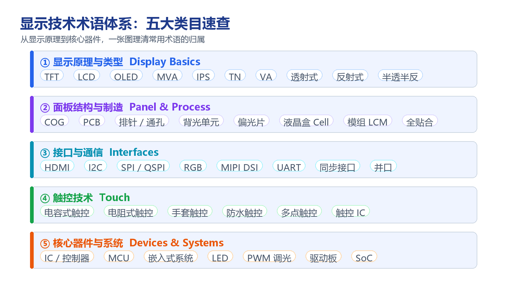

# 显示技术术语表

!!! abstract "快速结论"
    显示行业的术语混乱，主要来自三处：同一个词在不同供应商那里含义不同（如 Cell 与 LCM 的边界），中英文缩写并存（如 COG、MVA），以及机翻造成的错译（如把偏光片译成"极化剂"）。本文按显示原理、面板结构与制造、接口与通信、触控技术、核心器件五个类目，给出每个常用术语的准确定义与它在选型中的实际含义。

<figure markdown="span" class="displaywiki-figure">
  [{ width="760" loading="lazy" }](display-glossary-terminology-map.png){ .displaywiki-image-link title="查看原图" }
  <figcaption>显示技术术语体系速查：把常用术语归入显示原理、面板结构、接口、触控与核心器件五个类目，便于按场景快速检索。</figcaption>
</figure>

## 核心要点

- 显示术语分五类：显示原理与类型、面板结构与制造、接口与通信、触控技术、核心器件与系统。
- 最容易混淆的是结构层级：液晶盒（Cell）→ 模组（LCM）→ 整机，"屏"这个词在不同语境下指的不是同一个东西。
- 光学模式（透射式 / 反射式 / 半透半反）直接决定户外可读性与功耗，是选型的第一道分岔口。
- 接口与触控各有独立的权衡维度，都需要结合主控资源、引脚预算与使用环境一起评估。
- 供应商之间术语定义可能不一致，量产前应以图纸与规格书为准，而非口头约定。

## 1. 显示原理与类型

| 术语 | 含义与选型含义 |
|---|---|
| **TFT**（薄膜晶体管） | 每个像素由薄膜晶体管独立驱动的有源矩阵液晶显示器，可呈现全彩、快速动画与复杂图形，是当前主流的显示技术。 |
| **LCD**（液晶显示器） | 以液晶分子调制背光通过与否的显示器，分有源矩阵（TFT）与无源矩阵两类，可按字符、图形或像素级显示信息。 |
| **OLED**（有机发光二极管） | 采用有机发光材料自发光，不需要背光即可在多数环境下获得高可见度；对比度高、响应快，并可做成柔性形态。 |
| **MVA**（多域垂直配向） | 一种宽视角液晶模式，把单个子像素分成多个取向域来扩大可视角度，视角表现优于早期 TN，仅次于 IPS。 |
| **IPS**（平面转换） | 液晶分子在平行于基板的方向旋转，视角广、色彩一致性好，是当前主流的宽视角液晶模式。 |
| **TN**（扭曲向列） | 响应速度快、成本低，但视角与色彩偏移较明显，适合仪表、低成本与固定视角场景。 |
| **VA**（垂直配向） | 液晶分子垂直排列，对比度高、黑色更纯净，代价是视角偏色与响应时间需要权衡。 |
| **透射式**（Transmissive） | 完全依靠背光照明，亮度高、适合室内与低照度环境，但在强光直射下可读性差。 |
| **反射式**（Reflective） | 利用环境光照明，无需背光，功耗极低；强光下反而更清晰，暗光环境则不可读。 |
| **半透半反**（Transflective） | 同时具备透射与反射特性，强光与低照度条件下都能显示，是户外设备兼顾可读性与功耗的折中方案。 |

## 2. 面板结构与制造

| 术语 | 含义与选型含义 |
|---|---|
| **COG**（Chip-On-Glass，玻璃上芯片） | 驱动 IC 直接绑定在玻璃基板上，不单独制作 PCB，结构更紧凑、尺寸更小，常见于字符型与图形型单色 LCD。 |
| **PCB**（印制电路板） | 为电子元件提供机械支撑与电气连接的基板，是驱动电路与接口电路的载体。 |
| **排针与通孔**（Header / Through-hole） | 由规则小孔组成的连接器，针脚布局兼容常见开发板，便于显示模组与 Arduino 等平台快速连接与原型验证。 |
| **背光单元**（Backlight Unit） | 位于液晶盒后方的光源组件，通常由 LED 与导光板构成，直接决定透射式显示的亮度与均匀性。 |
| **偏光片**（Polarizer） | 只允许特定偏振方向光通过的光学膜，是液晶调光能够工作的前提；行业中偶见误译"极化剂"，实为同一部件。 |
| **液晶盒**（Cell） | 由两片玻璃基板、液晶层、取向层与偏光片组成的核心调制单元，**不含**驱动电路与背光。 |
| **模组**（LCM，LCD Module） | 液晶盒 + 驱动电路 + 背光 + 接口的完整组件，也就是通常口语中所说的"屏"。 |
| **全贴合**（Optical Bonding） | 用光学胶消除盖板与显示层之间的空气层，提升透光率与对比度，并显著改善强光下的可读性。 |

## 3. 接口与通信

| 术语 | 含义与选型含义 |
|---|---|
| **HDMI**（高清多媒体接口） | 以标准化数字格式传输音视频，是模拟视频接口的替代方案；HDMI TFT 模组只需一根标准 HDMI 线即可连接，无需额外协议转换。 |
| **I2C**（I 平方 C） | 仅需两根 I/O 线即可由 MCU 控制外设，适合对简单性与低制造成本要求高于速度的场景，可同时节省开发时间与 I/O 资源。 |
| **SPI 与 QSPI** | SPI 为串行接口，数据逐位连续传输，占用引脚少；QSPI（Quad SPI）为四线 SPI，在同样引脚预算下提供更高吞吐。 |
| **RGB** | 并行接口，按时钟逐像素传输，适合中小尺寸与刷新率要求不高的场景，引脚数量较多。 |
| **MIPI DSI** | 移动产业处理器接口定义的显示串行接口，采用高速差分信号，适合高分辨率与高刷新率应用。 |
| **UART** | 通用异步收发接口，串口智能屏常用，接线简单、开发门槛低，但带宽有限、传输距离受限。 |
| **同步接口**（Synchronous） | 每一位发送数据都有配对的接收位，需要更多引脚，换来确定的时序关系。 |
| **并口**（Parallel） | 多位数据同时传输，速度高但引脚多、布线复杂，常见于老式 MCU 接口。 |

## 4. 触控技术

| 术语 | 含义与选型含义 |
|---|---|
| **电容式触控** | 通过手指与传感器之间的电容耦合定位，灵敏度高、支持多点，但厚手套或其他绝缘物会隔断耦合，导致无响应。 |
| **电阻式触控** | 依靠面板上层受压后与下层接触导通来定位，可用厚手套或普通笔尖操作，代价是透光率与寿命较低。 |
| **手套触控** | 通过提高信噪比、调整算法阈值，或采用含导电纤维的手套，让用户戴手套也能操作电容屏。 |
| **防水触控** | 通过疏水涂层减少水滴残留，并用多频信号与算法区分"水滴覆盖"与"真实触摸"，抑制误触。 |
| **多点触控** | 支持同时识别多个触点，是缩放、旋转等手势操作的基础，对触控 IC 的扫描与算力有更高要求。 |
| **触控 IC** | 负责扫描电极、计算坐标并输出触摸事件的芯片，其信噪比与算法直接决定触控体验与抗干扰能力。 |

## 5. 核心器件与系统

| 术语 | 含义与选型含义 |
|---|---|
| **IC**（集成电路） | 也称芯片或控制器，负责实现显示屏的驱动与功能，可以理解为显示屏的大脑。 |
| **MCU**（微控制器单元） | 应用系统的主控计算机，负责把命令下发给各个电子组件，是嵌入式设备的运算与控制核心。 |
| **嵌入式系统** | 通常在计算资源、功耗、带宽、物理尺寸与成本上受限的专用计算系统，例如微波炉、空调与电视中的控制器。 |
| **LED**（发光二极管） | 半导体光源，既可用作状态指示灯，也是背光与调光的核心器件。 |
| **PWM 调光** | 用脉冲宽度调制控制背光 LED 的明暗，占空比决定平均亮度；频率过低时可能产生可见频闪。 |
| **驱动板**（Driver Board） | 把输入信号转换为面板所需时序与电压的电路板，是显示模组中信号链的关键一环。 |
| **SoC**（片上系统） | 把处理器、内存接口与多种外设集成在单颗芯片上的方案，例如常见的 ESP32 系列。 |

## 6. 用术语做选型时的注意点

- **先确认"屏"指哪一级**：Cell、LCM、模组、整机的边界不同，对应的接口、报价与责任范围也不同，询价时应明确到具体层级。
- **先定光学模式再看其他参数**：透射式、反射式与半透半反决定户外可读性与功耗上限，这一步选错，后续参数优化难以弥补。
- **接口要与主控资源匹配**：I2C 与 SPI 节省引脚但带宽有限，RGB 与 MIPI DSI 带宽充足却更占引脚与 PCB 层数。
- **触控与显示分开评估**：触控 IC、盖板结构与贴合方式都会影响最终体验，不能只看面板本身的规格。
- **术语定义以书面为准**：不同供应商对 COG、LCM 等词的使用习惯可能不同，量产前应以图纸与规格书为准，而非口头约定。

## 7. FAQ

??? question "Q1：Cell、LCM 与模组有什么区别？"
    Cell 是液晶盒，只包含两片玻璃基板、液晶层、取向层与偏光片，是显示的核心调制单元；LCM 是 LCD Module，在 Cell 的基础上加上驱动电路、背光与接口；模组是更宽泛的说法，通常还包含盖板、触控与结构件。询价时说清层级，可以避免接口与责任范围的误解。

??? question "Q2：透射式、反射式与半透半反该怎么选？"
    看使用环境的光照条件。以室内或低照度为主、追求高亮度与色彩，选透射式；以强光户外为主、且对功耗敏感，选反射式；既要在阳光下可读、又要在夜间或暗光下可用，选半透半反。半透半反通常亮度与色彩表现会有折中，需要接受一定的代价。

??? question "Q3：IPS、VA、MVA 与 TN 这些液晶模式差别在哪？"
    主要是视角、对比度与响应速度的取舍。TN 响应快、成本低但视角窄；VA 对比度高、黑色更纯但视角偏色明显；MVA 是 VA 的宽视角改进版；IPS 视角最广、色彩一致性最好，是三者的综合优选，成本相对更高。

??? question "Q4：I2C、SPI、RGB 与 MIPI DSI 接口怎么选？"
    先看主控可用引脚与带宽需求。I2C 最省线但速度最低，适合小尺寸字符与低刷新图形；SPI 兼顾引脚与速度，QSPI 进一步提升吞吐；RGB 为并行接口，适合中小尺寸与中等刷新率；MIPI DSI 采用高速差分，适合高分辨率与高刷新率，但对主控与 PCB 设计要求最高。

??? question "Q5：电容式与电阻式触控怎么选？"
    看操作方式与使用环境。电容式透光率高、支持多点与手势，适合消费与工业中需要流畅交互的场景，但戴厚手套或屏幕有水时识别会受影响；电阻式可用手套、指甲或笔尖操作，环境适应性强，代价是透光率与寿命较低，且通常不支持多点。

??? question "Q6：为什么不同厂家的术语含义会不一样？"
    显示行业长期中英文缩写并存，部分术语源自工艺名称（如 COG、LCM），部分源自光学或接口标准（如 MVA、MIPI DSI），加上跨语言翻译差异，容易产生歧义与错译。可靠做法是在技术协议与规格书中明确定义每个术语的边界，并以图纸为准，而不是依赖沟通中的口头共识。

## 相关阅读

- [高可靠性显示解决方案](high-reliability-displays.md)
- [科普：TFT 和 IPS 屏幕到底有什么区别？项目选型该怎么挑？](ips-vs-tn.md)
- [LCD 基础知识：液晶显示器的工作原理](lcd-basics.md)

## 参考数据来源

本文涉及的标准、规格与资料：

- [TFT LCD 模组规格书示例（7 英寸 WVGA）](../../../assets/datasheet/display/ALL-UE070WV-RB40-A092A.pdf)
- [I2C-bus specification and user manual（NXP UM10204）](https://www.nxp.com/docs/en/user-guide/UM10204.pdf)
- [MIPI DSI 规范（MIPI Alliance）](https://www.mipi.org/specifications/dsi)

!!! info "没有找到您需要的内容？"
    如果您需要更多产品、资源或技术支持，欢迎联系我们的团队：

    [**:material-archive-arrow-down: 知识库**](../../knowledge/tags.md){ .md-button .md-button--primary }
    [**:material-magnify: 产品与解决方案**](https://www.chinasunyee.com){ .md-button }
    [**:material-email: 联系技术支持**](mailto:info@chinasunyee.com){ .md-button }
