# 显示接口详解：MCU、RGB、LVDS、MIPI、SPI 等

!!! abstract "快速结论"
    本指南解释了选择显示接口，相关的设计权衡以及工程师在选择显示解决方案时应该验证的点。

## 核心要点

- 系统了解显示接口详解：MCU、RGB、LVDS、MIPI、SPI 等，包括关键原理、优缺点、应用场景和工程选型要点。
- 根据下文比较相关技术、应用条件和设计取舍。
- 最终选型前，应确认光学、电气、结构、环境与量产要求。

接口介绍

VIEWE提供了许多显示模块，包括TFT LCD,OLED等。并有很多整理的接口来将图像数据输送到显示模组中。客户可能会怀疑哪个是最好的或能满足要求。本文将讨论有关显示接口数据传输的问题。

显示和触摸

**1. 并行**

**1-1 MCU 接口 8080/6800**

<figure markdown="span" class="displaywiki-figure">
  [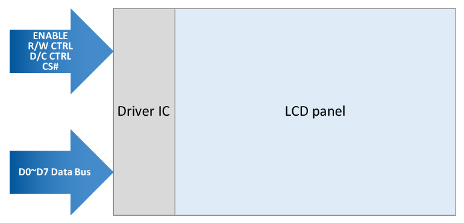{ width="760" loading="lazy" }](display-interface-guide-1-1-mcu-interface-8080-6800.jpeg){ .displaywiki-image-link title="查看原图" }
  <figcaption>1-1 MCU 接口 8080/6800</figcaption>
</figure>

显示通过数据总线根据控制总线信号发送的原始数据。通信带宽取决于在驱动 IC上运行的速度。QVGA 320×240点矩阵 LCD即，在ENABLE信号时，通信带幅将为 320 * 240 / 8位 (数据宽度) * 60 fps = 576KHz。

功能：

MCU 接口包括两个整理，6800和8080.8080比6800更受欢迎。一般情况下，MCU界限由4/8/9/16位数据 (如DB0,DB1, ,DB7；注：8bit是最受欢迎的位宽),CS (芯片选择),RS (数据寄存器或指令寄存器选择),RD (读使能),WR (写使能).

简单

缺点：需要RAM，速度有限。

用于Mono字符，图形，小型TFT (小于3.5)

<figure markdown="span" class="displaywiki-figure">
  [{ width="760" loading="lazy" }](display-interface-guide-mcu-parallel-interface.png){ .displaywiki-image-link title="查看原图" }
  <figcaption> MCU/并行接口</figcaption>
</figure>

图 1 MCU/并行接口

**1.2 并行 RGB 16/18/24位**

RGB接口是通过数据输入/输出以平行方式将驱动器时间传递到显示驱动程序IC，包括R/G/B数据，垂直同步信号 (V-SYNC，垂 vertikal synchronizing signal)，水平同步 сигнал (H-SynNC)，水平 同步信号)，数据启用 (DE, Data Enable) 信号和钟信号 PCLK (Pixel Clock). RGB666的显示接口如下：

<figure markdown="span" class="displaywiki-figure">
  [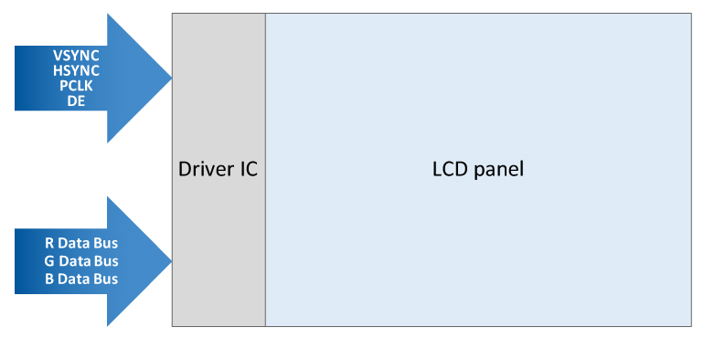{ width="760" loading="lazy" }](display-interface-guide-features.jpeg){ .displaywiki-image-link title="查看原图" }
  <figcaption>功能</figcaption>
</figure>

但是显示分辨率越来越高，即WVGA 800 * 480 (像素) * 60 fps = 23.04 MHz。

功能：

RGB接口经常用于控制大型高分辨率液晶显示器。它包括6/16/18位数据 (如R0,R1, ,G0,G1, ,B0,B1, ,),VSYNC (垂直同步),HSYNC

优点是，R,G,B数据直接在LCD上写出，没有GRAM，高速。通常用于大规模高分辨率LCD中。

缺点是控制LCD更复杂，需要比MCU接口更多的数据线程。

应用：中型TFT (3.5~8)

RGB 接口包括24位，18位，16位

<figure markdown="span" class="displaywiki-figure">
  [{ width="760" loading="lazy" }](display-interface-guide-rgb-interface.png){ .displaywiki-image-link title="查看原图" }
  <figcaption>RGB 接口</figcaption>
</figure>

图5 RGB 接口

<figure markdown="span" class="displaywiki-figure">
  [{ width="760" loading="lazy" }](display-interface-guide-examples-of-24-bit-and-18-bit-rgb-interface.png){ .displaywiki-image-link title="查看原图" }
  <figcaption>24 位和 18 位 RGB 接口的例子</figcaption>
</figure>

图6.24位和18位RGB 接口的例子

**2. 系列**

2.1 SPI (序列边界接口)

SPI是一个基于主从设备的界面，通常具有主机 (主机设备) 和一个或多个从设备 (从设备).接口上有4 个引脚。连接方法和硬件结构如下：

SCLK：所有设备所使用的同步时钟。主设备驾驶这个时钟，

这是主设备向SPI 总线上的所有从设备输送的主要数据线。只有从MOSI的选定的从设备钟数据。

导语：主进，从设备出。这是被选中的从设备向主设备驱动的主要数据线。只有被选的从设备才能驾驶这个电路。事实上，它是SPI 总线安排中唯一的电路，一个从设备可以驾驶。

CS：芯片选择。这个信号是每个从设备的唯一。当被激活时，所选的从设备必须驱动MISO。

<figure markdown="span" class="displaywiki-figure">
[SPI图案的示例] 显示接口指南示例.jpeg)
  <figcaption>[SPI方案的例子]</figcaption>
</figure>

显示数据连续传输：显示接口通信带宽，即QVGA 320 * 240 (像素) * 16位 (颜色深度) * 30 fps = 36.864 MHz。

**2.2 IIC (国际集成电路) 或另称为 I2C：**

与SPI的点到点 (或点到多点) 基础不同，I2C以数据总线的形式接口，允许连接多个主设备和多个从设备。接口方法和硬件结构如下：

<figure markdown="span" class="displaywiki-figure">
显示接口指南.jpeg) {宽="760"加载="惰"}
  <figcaption>[I2C方案]</figcaption>
</figure>

<figure markdown="span" class="displaywiki-figure">
显示式接口指导器.jpeg) { width="760" loading="lazy" }
  <figcaption>[通过模拟设备]</figcaption>
</figure>

标准模式 = 100K位/秒。
全速模式=400K位/秒。
快速模式 = 1M位/秒。
高速模式 = 3.2M位/秒。

**2.3 系列RGB 6/8位**

<figure markdown="span" class="displaywiki-figure">
  [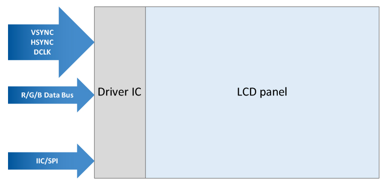{ width="760" loading="lazy" }](display-interface-guide-2-3-serial-rgb-6-8-bits.jpeg){ .displaywiki-image-link title="查看原图" }
  <figcaption>2.3 系列RGB 6/8位</figcaption>
</figure>

在 RGB 序列中传输的显示数据。显示接口通信带宽，即QVGA 320 * 240 (像素) * 3 点 * 30 fps = 6912000 Hz (DCLK).

**2.4 LVDS：低电压差异信号。它应为显示接口命名FPD-Link。**

<figure markdown="span" class="displaywiki-figure">
  [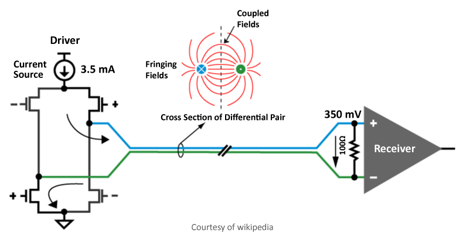{ width="760" loading="lazy" }](display-interface-guide-2-4-lvds-low-voltage-differential-signal-it-should-name-fpd-link-for-t.jpeg){ .displaywiki-image-link title="查看原图" }
  <figcaption>2.4 LVDS：低电压差异信号。它应为显示接口命名FPD-Link</figcaption>
</figure>

1994年引入的LVDS是一种技术标准，该标准规定了微型串行信号标准的电气特性，但它不是协议。许多数据通信标准和应用程序使用它，并添加在OSI模型中定义的数据链接层。LVDS在低功率下运行，并且可以使用廉价的扭曲双铜电缆以非常高速度运行。

<figure markdown="span" class="displaywiki-figure">
  [{ width="760" loading="lazy" }](display-interface-guide-features-2.jpeg){ .displaywiki-image-link title="查看原图" }
  <figcaption>功能</figcaption>
</figure>

早些时候，笔记本电脑和液晶显示器供应商通常在指他们的协议时使用LVDS而不是FPD-Link.视频显示器工程词汇中，这个术语错误地成为平板屏幕链接的同义词。

功能：

LVDS (低电压差异信号) 是一个可以在廉价的扭曲双铜线上运行非常高速度的电子数字信号标准。

最用于大型板 (>7)

<figure markdown="span" class="displaywiki-figure">
  [{ width="760" loading="lazy" }](display-interface-guide-example-of-lvds-interface.png){ .displaywiki-image-link title="查看原图" }
  <figcaption>LVDS接口的例子</figcaption>
</figure>

图7 LVDS接口的例子

**2.5 MIPI CSI/DSI：移动行业处理器界面。**

<figure markdown="span" class="displaywiki-figure">
显示器接口指南显示器视频.jpeg) {宽度="760"加载="惰" }
  <figcaption>[DSI的显示视图.]</figcaption>
</figure>

MIPI联盟旨在降低移动设备中的显示控制器的成本。它定义了一个串行巴士和主机，图像数据来源和目的地设备之间的通信协议。这是LCD和类似显示技术的预期目标。

<figure markdown="span" class="displaywiki-figure">
[系统视图dsi.jpeg]
  <figcaption>[DSI的系统视图]</figcaption>
</figure>

DSI指定高速 (例如D-PHY 2.0的4.5Gbit/s/lane) 分别信号点到点连续巴士。该巴士包括一条高速时钟车道和一个或多个数据车道。

总线上的图像数据与水平和垂直空白间隔的信号交织在一起。数据在实时中转移到显示器上，而不是被设备存储以保存显示器中的帧缓冲存储器。然而，这也意味着设备必须不断更新 (以每秒30或60个框架的速度) 或丢失图像。图像数据仅在HS模式下发送。在HS状态时，命令是在垂直空白间隔中传输。

功能：

移动工业处理器接口联盟 (MIPI)

旨在降低移动设备中的显示控制器的成本。它通常针对液晶和类似显示技术。它定义了主机 (图像数据来源) 和设备 (图片数据目的地) 之间的串行巴士和通信协议

MIPI接口越来越受欢迎。

<figure markdown="span" class="displaywiki-figure">
  [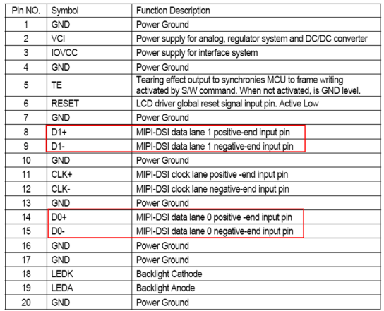{ width="760" loading="lazy" }](display-interface-guide-an-example-of-mipi-interface.png){ .displaywiki-image-link title="查看原图" }
  <figcaption>一个MIPI界面的例子</figcaption>
</figure>

图8 一个MIPI界面的例子

显示接口MCU 8080/6800的实验例：

一个液晶控制器已被逐步淘汰，客户希望有一个针到针兼容的模块取代它。 RD 业主为兼容接口设计了一个具有 MCU 的 PCB.ENABLE信号的实验结果必须至少长达9.92uS. 这意味着最大通信 BW 约为100KBPS。

<figure markdown="span" class="displaywiki-figure">
[Chanel1 E pin@9.92uS,Chanel2  CS pin]](显示接口指导-Chanel1-e-pin-9-92us-chanel2-cs-pin.jpeg){宽="760"加载="惰" }
  <figcaption>[Chanel1 E pin@9.92uS,Chanel2 CS pin]</figcaption>
</figure>

在缩短ENABLE时间为9.84uS时，我们可以看到以下几个缺陷点 (通信速度高达101KBPS).

<figure markdown="span" class="displaywiki-figure">
[Chanel1 E pin@9.84uS, Chanel2  CS pin]](显示接口指南-channel1-e-pin-9-84us-chanel2-cs-pin.jpeg){宽="760"加载="惰" }
  <figcaption>[Chanel1 E pin@9.84uS,Chanel2 CS pin]</figcaption>
</figure>

**2.6 eDP接口**

DisplayPort (DP) 是由PC和芯片制造商联盟开发的数字显示接口，并被视频电子标准协会 (VESA) 标准化。接口主要用于将视频源连接到计算机监控器等显示设备，它也可以携带音频，USB和其他形式的数据。

DisplayPort是为了取代VGA,DVI和FPD-Link而设计的。该接口通过使用既活跃或被动适配器，可以与其他接口 (如HDMI和DVI) 兼容后退。它主要用于更大的尺寸和更高分辨率的显示屏。

<figure markdown="span" class="displaywiki-figure">
  [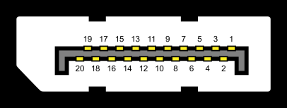{ width="760" loading="lazy" }](display-interface-guide-edp-interface.png){ .displaywiki-image-link title="查看原图" }
  <figcaption>eDP 接口</figcaption>
</figure>

<figure markdown="span" class="displaywiki-figure">
  [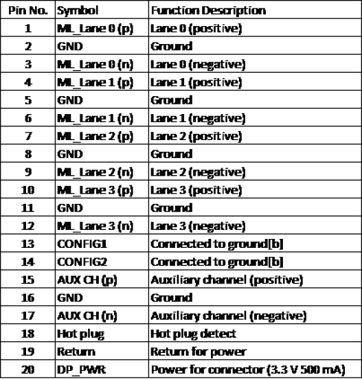{ width="760" loading="lazy" }](display-interface-guide-edp-interface-2.png){ .displaywiki-image-link title="查看原图" }
  <figcaption>eDP 接口</figcaption>
</figure>

图9eDP界面

在显示接口上进行比较：

哪个接口最好？对这个问题没有绝对答案。用户应该选择适合他们的应用程序的接口，而不是最好的。

| 显示接口 | 决议 | 速度 | 计数。 | 噪音 | 电力 | 连接距离 | 费用 |
| --- | --- | --- | --- | --- | --- | --- | --- |
| 8080/6800 MCU | 中部 | 低水平 | 更多 | 中部 | 低水平 | 短暂 | 低水平 |
| RGB 16/18/24 | 中部 | 快速 | 更多 | 最糟糕的 | 高级 | 短暂 | 低水平 |
| 专业指数 | 小型 | 低水平 | 减少 | 中部 | 低水平 | 短暂 | 低水平 |
| I2C | 小型 | 低水平 | 减少 | 中部 | 低水平 | 短暂 | 低水平 |
| 系列RGB 6/8 | 中部 | 快速 | 减少 | 最糟糕的 | 高级 | 短暂 | 低水平 |
| LVDS | 大型 | 快速 | 减少 | 最好的 | 低水平 | 长时间 | 高级 |
| 国际货币 | 大型 | 最快的 | 减少 | 最好的 | 低水平 | 短暂 | 平均水平 |
| 电子产品 | 大型 | 最快的 | 减少 | 最好的 | 低水平 | 长时间 | 高级 |

智能显示器

UART 接口

一个通用异步接收器/发射器 (UART) 是一个负责实施串行通信的电路块。本质上，UART作为平行和串行界面之间的中间人。在UART的一端是八条数据线 (加上一些控制引脚) 的总线，另一边是两个连续电缆RX和TX。

<figure markdown="span" class="displaywiki-figure">
  [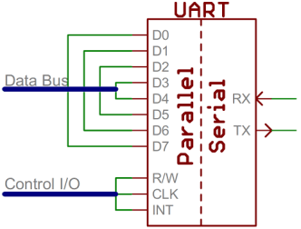{ width="760" loading="lazy" }](display-interface-guide-urat-interface.png){ .displaywiki-image-link title="查看原图" }
  <figcaption>URAT 接口</figcaption>
</figure>

图 10 URAT 接口

USB 接口

一个通用串行巴士 (USB) 是一个允许设备和个人电脑 (PC) 等主机控制器之间的通信的通用接口。它连接数字摄像头，小鼠，键盘，打印机，扫描仪，媒体设备，外部硬盘和闪存驱动器等外围设备。有四代USB规格：USB1.x,USB2.0,USB3.x和USB4。

它广泛用于电容式触摸屏连接。

<figure markdown="span" class="displaywiki-figure">
  [{ width="760" loading="lazy" }](display-interface-guide-usb-interface.png){ .displaywiki-image-link title="查看原图" }
  <figcaption>USB 接口</figcaption>
</figure>

图11 USB接口

HDMI 接口

HDMI (High-Definition Multimedia Interface) 是一种专有的音频/视频接口，用于将未压缩的视频数据和从符合HDMI的源设备 (如显示控制器) 传输到兼容的计算机监控器，视频投影机，数字电视或数字音频设备。 HDMI是数字取代模拟视频标准。

随着越来越多的颜色TFT LCD显示器，HDMI在显示行业中变得非常受欢迎。

<figure markdown="span" class="displaywiki-figure">
  [{ width="760" loading="lazy" }](display-interface-guide-with-more-and-more-popular-of-color-tft-lcd-hdmi-is-getting-popular-in.png){ .displaywiki-image-link title="查看原图" }
  <figcaption>随着越来越多的颜色TFT LCD,HDMI在显示行业中变得非常受欢迎</figcaption>
</figure>

<figure markdown="span" class="displaywiki-figure">
  [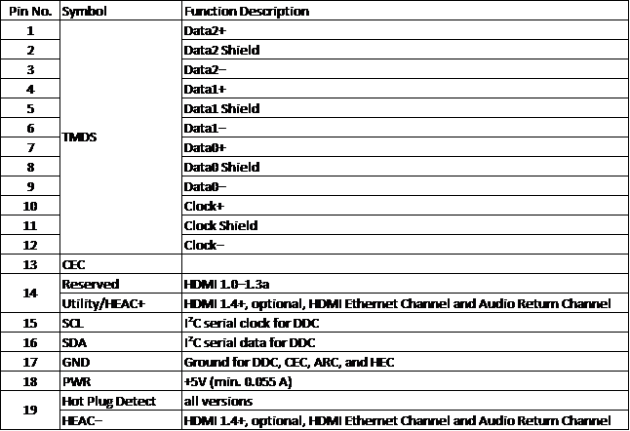{ width="760" loading="lazy" }](display-interface-guide-hdmi-interface.png){ .displaywiki-image-link title="查看原图" }
  <figcaption>HDMI 接口</figcaption>
</figure>

图12 HDMI接口

RS232 接口

RS232是用于串行通信的标准协议，它用于连接计算机和其外围设备以允许它们之间的串行数据交换。

RS232 包含以下连接：

其他整理

VSS信号地面

Vdd+5v

<figure markdown="span" class="displaywiki-figure">
  [{ width="760" loading="lazy" }](display-interface-guide-rs232-interface.png){ .displaywiki-image-link title="查看原图" }
  <figcaption>RS232 接口</figcaption>
</figure>

图 13 RS232 接口

与RS-422,RS-485和以太网等后来的接口相比，RS-232具有较低的传输速度，短的最大电缆长度，大电压摆动，大型标准连接器，没有多点能力和有限的多滴能力。在现代个人电脑中，USB已经取代了RS-232的大部分外围接口功能。很少有计算机今天配备了RS-232端口，因此必须使用外部USB-to-RS232转换器或一个或多个串行端口的内部扩展卡连接到RS-222外围设备。然而，由于其简单性和过去的无处不在，RS-232接口仍然在工业机器，网络设备和科学仪器中使用，其中短距离，点到点，低速度有线数据连接完全足够。

卡通公交接口

CAN (Controller Area Network) 是一个功能丰富的汽车巴士标准。它旨在允许网络上的ECU (电子控制单元) 相互通信而不需要主机，与RS485接口不同，它基本上必须有一个主机 (Master) 为控制端；但CAN提供了更好的和灵活的通信应用程序，这不需要主机控制。

RS485 系统拓

<figure markdown="span" class="displaywiki-figure">
  [{ width="760" loading="lazy" }](display-interface-guide-can-bus-system-topology.jpeg){ .displaywiki-image-link title="查看原图" }
  <figcaption>CAN 公交车系统拓</figcaption>
</figure>

<figure markdown="span" class="displaywiki-figure">
  [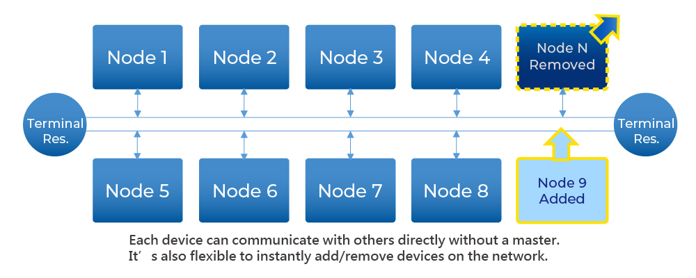{ width="760" loading="lazy" }](display-interface-guide-can-bus-system-topology-2.jpeg){ .displaywiki-image-link title="查看原图" }
  <figcaption>CAN 公交车系统拓</figcaption>
</figure>

CAN是一个基于信息导向协议的广播通信机制。根据信息内容，它使用消息识别器 (每个识别符在整个网络中都是独一无二的) 来定义传输消息的优先顺序，而不是分配特定站点地址 (Node ID).

因此，CAN具有良好的灵活调整功能，并且可以在软件和硬件中进行调整的情况下添加节点到现有网络。此外，消息传输不基于特殊整理的节点，这增加了升级网络的便利性。

由于CAN 总线的应用能够完全满足数据通信的可靠性和实时需求，因此CAN公交车应用已扩大到工业，医疗和其他用途。

热点数据 (子区块):

<figure markdown="span" class="displaywiki-figure">
  [{ width="760" loading="lazy" }](display-interface-guide-history.jpeg){ .displaywiki-image-link title="查看原图" }
  <figcaption>历史</figcaption>
</figure>

在1986年美国密歇根州底特律举行的国际汽车工程师协会 (SAE) 会议上正式宣布了CAN.第一台CAN控制器由英特尔和菲利普斯生产，1987年发布。世界上第一辆装备了基于CAN的多线系统是1991年推出的奔W140。

博什已经发布了几种版本的CAN规范。CAN 2.0于1991年发布。该规范分为两个部分；A部分 (CAN2.0A) 适用于使用11位识别码的标准格式，B部分 (can2.0B)则适用于采用29位标识符的扩展格式。

1993年，国际标准化组织 (ISO) 发布了CAN标准ISO11898.后来，CAN准则被重新编译成两个部分：ISO11 898-1覆盖数据链接层；ISO 11898-2覆盖高速CAN 总线的物理层。以后宣布了ISO11898-3，并涵盖低速CAN巴士物理层和 CAN巴士故障耐受性规范。物理层标准 ISO11898-2和ISO11 898-3不包括在BOSCH CAN2.0规范中。它们可以单独购买ISO。

2012年，BOSCH宣布CAN_FD 1.0，也就是可变数据速率CAN.该规范采用不同的架构，允许在仲裁后切换到更快的比特速度并传输不同的数据长度。 CAN FD与现有的CAN 2.0网络兼容，因此新的CAN FD设备可以在同一控制网络上与现有CAN设备共存。

在1996年之后，美国销售的所有汽车和轻型卡车都必须符合OBD-II标准 (上船诊断).在欧盟，2001年后出售的汽油汽车以及2004年后销售的柴油汽車必须遵守EOBD标准 (欧洲上船检测). 2008年，所有在美国销售的车辆都必须作为其信号协议之一实施CAN。

<figure markdown="span" class="displaywiki-figure">
  [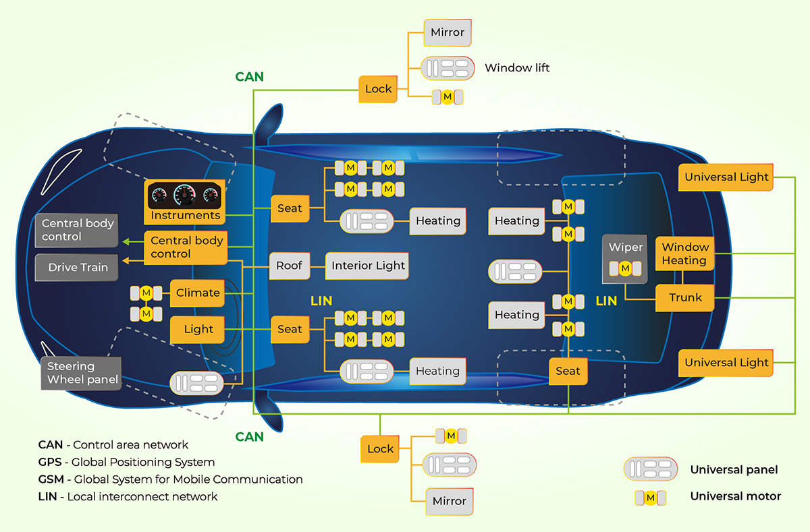{ width="760" loading="lazy" }](display-interface-guide-feature.jpeg){ .displaywiki-image-link title="查看原图" }
  <figcaption>功能</figcaption>
</figure>

硬件特性：

所有节点都通过两个线程连接在一起。这两条线程形成了一个扭曲的对，并且具有120Ω的特征阻力。

当CAN总线传输一个主导 (0)信号时，它将CAN_H终端提升到高水平，并把 CAN_L拉到低水平。当递归 (1) 信号传输时，Cann_H或Can_L终端将不会被驱动。主导信号CAN _ H和 CAN_ L具有2V的名义差压。

物理层的信号外观：

<figure markdown="span" class="displaywiki-figure">
  [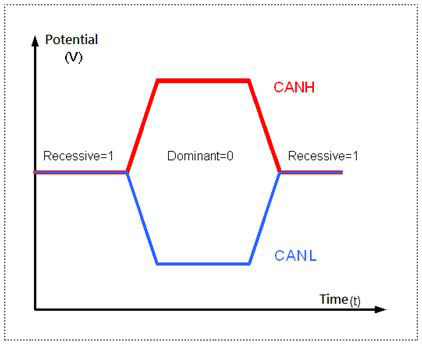{ width="760" loading="lazy" }](display-interface-guide-realistic-measurement-on-wl0f00039000qgaaasb00-can-h-can-l.jpeg){ .displaywiki-image-link title="查看原图" }
  <figcaption>基于 WL0F00039000QGAAASB00 CAN_H/CAN_L的现实测量</figcaption>
</figure>

<figure markdown="span" class="displaywiki-figure">
  [{ width="760" loading="lazy" }](display-interface-guide-firmware-features.jpeg){ .displaywiki-image-link title="查看原图" }
  <figcaption>固件功能</figcaption>
</figure>

每个节点都可以同时发送和接收信息。一个消息或框架主要包含一个识别代码 (ID)，该代码表示信息的优先级，高达八个数据字节。CRC,ACK和其他框架部分也是消息的一部分。

如果一个节点传输主导 (0) 位，而另一个节目传输衰退 (1) 位的话，那么巴士上存在冲突，最终结果是主导位"获胜".这意味着在更高的优先信息中没有延迟。具有较低优先级的节点信息在主导位末端自动传输，并在6个钟位后尝试再传输。这使得CAN成为即时优先级通信系统。

逻辑0或1的确切电压取决于所使用的物理层，但CAN的基本原则要求每个节点监控CAN网络上的数据，包括发送节点本身。如果所有的节点同时传输逻辑1，所有节点都会看到这个逻辑1信号，包括发送节点和接收节点。当一个或多个发送节点传输逻辑0信号，但一个或更多的发送结点传递逻辑1信号时，所有节点，包括传输Logic1信号的节点也会看到逻辑 0信号。当一个节点传输了一个逻辑1信号，但看到一个逻辑0信号时，它会意识到线上存在争端并登录。通过这个过程，任何传输逻辑 1的节点都会登录或丢失仲裁，当其他节点发送逻辑0. 输掉仲裁的节点将稍后重新添加信息到队列中，而CAN框架的位流将持续无故障，直到只有一个发送节点。这意味着传输第一个逻辑1的节目会输出仲裁。由于所有节点在启动CAN框架时都会传输一个11位 (或CAN 2.0B中的29位) 的识别代码，因此具有最低的识别码的发送节点起初有更多的0号。该节点赢得了仲裁并拥有最高优先级。

CAN2.0A/B 数据格式：

<figure markdown="span" class="displaywiki-figure">
  [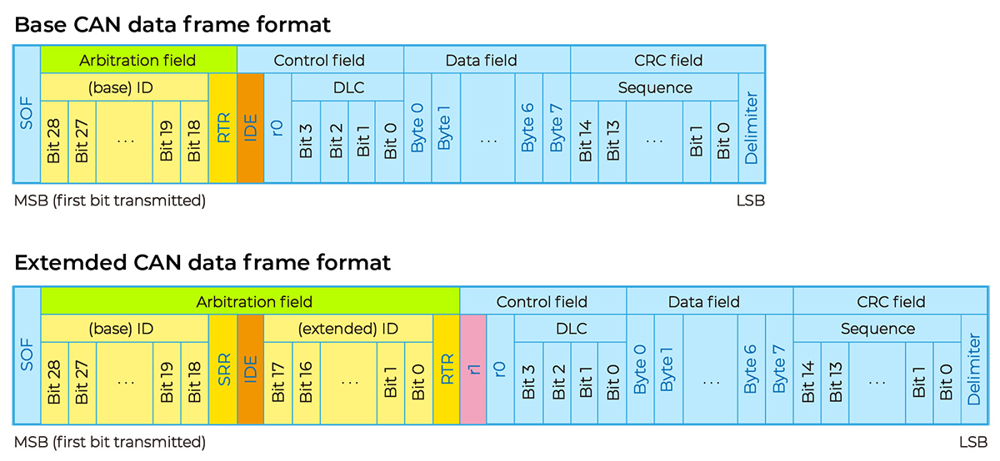{ width="760" loading="lazy" }](display-interface-guide-can-bus-traffic-data-looks.jpeg){ .displaywiki-image-link title="查看原图" }
  <figcaption>CAN 总线交通数据显示</figcaption>
</figure>

<figure markdown="span" class="displaywiki-figure">
  [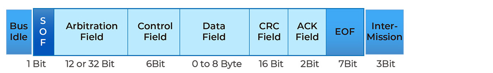{ width="760" loading="lazy" }](display-interface-guide-data-sequences-in-payload.jpeg){ .displaywiki-image-link title="查看原图" }
  <figcaption>在有效载荷中的数据序列</figcaption>
</figure>

<figure markdown="span" class="displaywiki-figure">
  [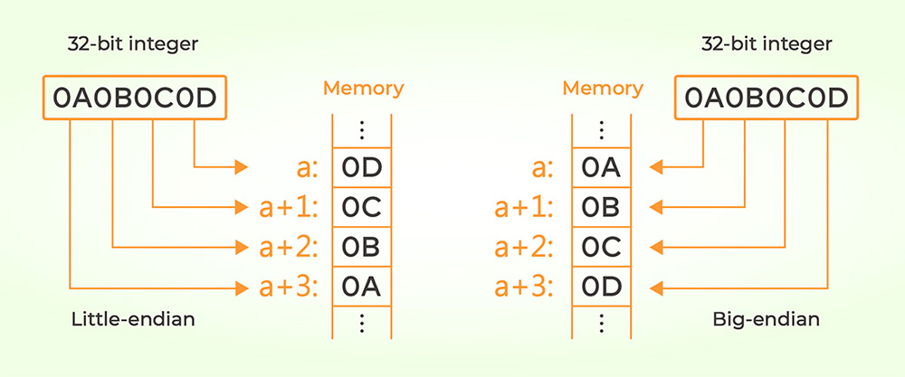{ width="760" loading="lazy" }](display-interface-guide-conclusions.jpeg){ .displaywiki-image-link title="查看原图" }
  <figcaption>结论</figcaption>
</figure>

根据CAN 总线的功能，我们得到了5种优势。

<figure markdown="span" class="displaywiki-figure">
  [{ width="760" loading="lazy" }](display-interface-guide-5-benefits-we-ve-got-base-on-can-bus-features.jpeg){ .displaywiki-image-link title="查看原图" }
  <figcaption>基于CAN 总线的5个优势</figcaption>
</figure>

低成本：ECU (电子控制单位) 通过单个CAN接口进行通信，CAN巴士可降低问题，轻量和低成本。

集中化：CAN公交系统允许在所有ECU中进行中央错误诊断 (例如OBD-II) 和配置。

强：系统物理层对子系统和EMC (电磁兼容性) 的故障具有强度。

效率：CAN消息是优先级的，并通过ID使用位式仲裁，以确保最高优先级ID不被中断。

灵活：每个ECU包含一个芯片，可以接收所有传输的信息，决定相关性并相应行动 - 这使得更容易进行修改和添加额外的节点

一些应用例：

汽车 (汽车仪器，ABS,OBD-II等).

交通系统 (铁路车辆，飞机，海洋等).

移动机械 (堆/叉车，建筑，农业等).

工业机器控制系统 (工业自动化，信息管理等).

家庭和建筑自动化 (HVAC，电梯等).

医疗设备和实验室自动化。

限制：

可以开放，有11位的CANID与4位函数代码和7位节点 ID.所以唯一的地址可用于127个节点在总线上。

在J1939中，有8位设备地址，最大等于255个节点ID.地址255用于广播和254为网络管理。所以唯一的地址可用于总线上的253个节點。

通信带宽较低，速度高于传输距离。

RS485 接口

RS485/Modbus是行业中受欢迎的通信接口，在市场上容易获得合理价格的各种RS485设备。线路结构很简单，只要两个电缆 (RS485_A/RS4 85_B) 可以通信，通讯接口通常在操作系统上以"序列端口"的形式呈现，每个平台都有相应的开发函数库。此外，Modbus协议很容易理解，所以我们将其作为实验和解释的例子。

….

互联网接口

电源

其他整理

其他地方

经验

整理C

…

通知议定书

摩德布斯

■Modbus协议

摩德布斯协议实际上是一个数据格式。它基本定义了主设备-从设备架构的通信内容。由于它只是数据结构的定义，它可以通过各种物理接口进行通信，如RS232,RS422,RS485甚至网络。

由于在互联网上已经有许多教学和解释文件，因此Modbus不会在这里详细描述。

■概念模型

Modbus将数据传输视为"注册"访问。每个设备必须定义其自己的注册整理和地址用于外部参考。所谓的数据传送到设备是写给指定注册表，读取数据是阅读指定注冊表，这是简单而清晰的。此外，每个地址登记册存储的值为16位。

■功能代码

根据数据的特征，Modbus定义了几种阅读和写作方法，这些方法由消息中的函数代码指定。

<figure markdown="span" class="displaywiki-figure">
  [{ width="760" loading="lazy" }](display-interface-guide-table-5-1-modbus-function-codes.jpeg){ .displaywiki-image-link title="查看原图" }
  <figcaption>5-1表Modbus功能代码</figcaption>
</figure>

对于智能显示器控制程序，最常用的是06：写单注册表 (写16位值) 和阅读持有注册记录 (阅读多个注册的值).

■CRC

最后两个字节似乎最神秘的部分实际上并不困难。它只是一个CRC (循环冗余检查) 确保通信数据。我们不一定要深入研究它的原理 (但事实上，它只是一个表格查找和位操作，最后得到了16位检查代码)，只要我们明白如何使用它。

控制智能显示器对象

如前所述，每个Modbus都需要定义注册表的整理和地址。

■登记分类

智能显示器注册表可以大致分为三个类别：

**1.) 设备信息 (例如版本，设备名称等)。**
使用04：阅读输入注册表。这些数据只会在固件更新时进行更改，通常是刚连接时，以获得设备特征参数。

**2.) 物体属性 (例如整理，位置等)**
使用03：阅读持有注册表/16：写多次注册书。这些数据影响对象的外观，通常不会在设计阶段发生变化。为了改变内容，必须暂时关闭智能显示器才能更新。

**3.) 对象值 (对象所代表的价值，如RPM，或关闭，百分比等，从对象到对象不同)**
这是操作中的主要变更项。每个元素使用16位值，所以它设置为06: Write Single Register。

以下是这些注册表的组织列表：

## 相关阅读

- [PCB 结构与制造流程](pcb-construction-process.md)
- [PCB 类型与材料选择](pcb-types-materials.md)
- [PCB 设计、制造与互连方式选择](pcb-design-interconnections.md)

!!! info "没有找到您需要的内容？"
    如果您需要更多产品、资源或技术支持，欢迎联系我们的团队：

    [**:material-archive-arrow-down: 知识库**](../../knowledge/tags.md){ .md-button .md-button--primary }
    [**:material-magnify: 产品与解决方案**](https://www.chinasunyee.com){ .md-button }
    [**:material-email: 联系技术支持**](mailto:info@chinasunyee.com){ .md-button }
