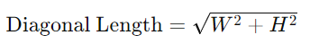
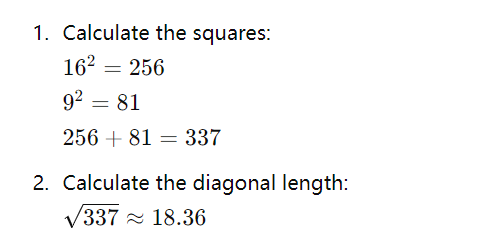
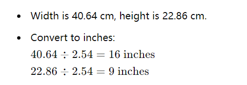
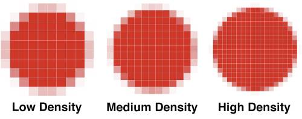
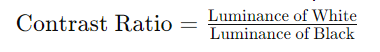
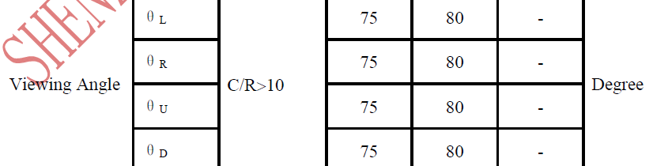

# 如何读懂显示屏规格参数

!!! abstract "快速结论"
    本指南解释了显示规格,相关的设计权衡以及在选择显示解决方案时工程师应该验证的点.

## 核心要点

- 系统了解如何读懂显示屏规格参数，包括关键原理、优缺点、应用场景和工程选型要点。
- 根据下文比较相关技术、应用条件和设计取舍。
- 最终选型前，应确认光学、电气、结构、环境与量产要求。

## 标签:

### 显示尺寸

显示屏的尺寸通常是通过其直角长度测量,通常以英寸表达.

如何计算屏幕大小

测量宽度和高度:阅读显示模块数据表或使用测量工具 (如规则或测量带) 来测量显示屏面积 (AA区域),广度 (W) 和高度 (H),以英寸或厘米.

计算对角长度:使用皮塔哥尔士定理来计算对方长度.

详细的步骤

测量宽度和高度:

宽度 (W):显示屏水平长度.

高度 (H):显示屏垂直长度.

计算对角长度:

<figure markdown="span" class="displaywiki-figure">
  [{ width="760" loading="lazy" }](display-specifications-use-the-formula.png){ .displaywiki-image-link title="查看原图" }
  <figcaption>使用公式</figcaption>
</figure>

举例

假设显示屏宽度为16英寸,高度是9英寸.

<figure markdown="span" class="displaywiki-figure">
  [{ width="760" loading="lazy" }](display-specifications-therefore-the-diagonal-length-of-the-display-screen-is-approximately-1.png){ .displaywiki-image-link title="查看原图" }
  <figcaption>因此,显示屏的直角长度大约为18.36英寸</figcaption>
</figure>

转换问题

如果宽度和高度是以厘米衡量的,你可以首先将它们转换为英寸 (1英寸=2.54厘米),然后进行计算.例如:

<figure markdown="span" class="displaywiki-figure">
  [{ width="760" loading="lazy" }](display-specifications-then-use-the-same-method-as-above-to-calculate-the-diagonal-length.png){ .displaywiki-image-link title="查看原图" }
  <figcaption>然后,使用上述方法来计算对角的长度</figcaption>
</figure>

其他考虑因素

视角比例:不同的显示器有不同的视角比率 (如16:9,4:3).

实际测量:有些显示器的边框厚.在测量时,请确保只测量可见屏幕面积.

通过遵循这些步骤,你可以准确计算显示屏的尺寸.

### 液晶分辨率

液晶显示器的本地分辨率是什么?

为了了解液晶显示器的本地分辨率,更好了解LCD显示器技术,特别是TFT LCD制造过程.首先,我们需要理解像素是什么.

像素是什么?

像素,也称为图片元素,一个像素是数字显示设备上可显示和表示的数码图像或图形最小单元.

液晶显示器不像CRT显示器一样运行,它将电子发射到玻璃屏幕上.LCD显示器有个别的像素排列在矩形网格中.每个像素都有RGB(红色,绿色,蓝色) 的子像素,可以启动或关闭.当所有像素的子像 Pixel被关掉时,它会出现黑色. 当所有小像素都上100%时,它会显得白色.通过调整红色,绿色和蓝色光的单个水平,可实现数百万种颜色组合

<figure markdown="span" class="displaywiki-figure">
  [{ width="760" loading="lazy" }](display-specifications-lcd-pixel-with-rgb-sub-pixels.png){ .displaywiki-image-link title="查看原图" }
  <figcaption>有RGB子像素的LCD像素</figcaption>
</figure>

图.1 有RGB子像素的液晶像素

液晶屏幕的像素由后台电路和电极制成.每个子像素包含一个TFT (薄膜变压器) 元素. 这些结构是通过将各种材料 (金属和) 沉积在玻璃基板上形成的,这些材料将成为整个显示器堆的一部分.

摄像头的画素是原生分辨率.实际上,所有平板显示器 (LCD,OLED,Plasma等) 都具有原生 分辨率,与CRT显示器不同

高清电视拥有1280×720=921,600像素;高清电视具有1920x1080=2,073,600像سل;8K电视具有7,680×4,320=33,177,600像xel. 8K中的K代表Kilo (1000),这意味着电视已经达到约8,000个像素的水平分辨率.

窗体底端

### PPI:每英寸的像素

PPI是Pixels Per Inch的缩写.它是一种测量单位,用于量化一个平方英寸表面上发现的像素数量.

也就是说,想象一个平方英寸是分裂和组织在一个电网的细胞.每个电网中的细胞都有一个像素.

也被称为像素,告诉你PPI.

<figure markdown="span" class="displaywiki-figure">
  [{ width="760" loading="lazy" }](display-specifications-also-known-as-pixels-tells-you-the-ppi.jpeg){ .displaywiki-image-link title="查看原图" }
  <figcaption>也被称为像素,告诉你PPI</figcaption>
</figure>

<figure markdown="span" class="displaywiki-figure">
  [{ width="760" loading="lazy" }](display-specifications-also-known-as-pixels-tells-you-the-ppi-2.jpeg){ .displaywiki-image-link title="查看原图" }
  <figcaption>也被称为像素,告诉你PPI</figcaption>
</figure>

通常,Pixels Per Inch值用于测量显示器的像素密度,例如您在计算机或笔记本电脑上,电视屏幕上,智能手机和任何显示设备上的监视器.

有三个步骤来计算屏幕的PPI.

步骤一:找到屏幕的视角

计算PPI的第一个步骤是测量屏幕面积在英寸中.大多数显示器,屏幕,监视器和电视都以其面积测量进行销售,该测量应在屏幕或其文档上标记.

第二步:找到方形像素

鉴于屏幕的分辨率,你可以使用皮塔哥拉定理找到沿线的像素数量.

<figure markdown="span" class="displaywiki-figure">
  [{ width="760" loading="lazy" }](display-specifications-step-two-find-the-diagonal-pixels.jpeg){ .displaywiki-image-link title="查看原图" }
  <figcaption>第二步:找到方形像素</figcaption>
</figure>

换句话说,直角像素 dp等于像素 w平方宽度的平方根加上像素 h平方高度.

像素宽度等于屏幕分辨率的第一部分,而高度是第二.例如,1920×1080屏幕的像素寬度为1920,高度为1080.

第三步:使用PPI公式

鉴于在像素和英寸中对角的测量,使用以下公式来计算PPI.

 PPI = dp/英寸

因此,屏幕像素密度在每英寸的像素中等于直角dp沿线的像سل以直角分为英寸.

视网膜是什么?

网膜是果商标的品牌名称,它指具有像素密度的显示屏,使得每个像素可以被人眼睛察觉到.

实际密度取决于您的眼睛通常距离屏幕多远,但在从12英寸处观看时,PPI为300通常是足够密度.

### 亮度

显示屏亮度,也称为光度,指显示屏所发射的光量.它通常以每平方米 (cd/m2) 的灯塔测量,也被称为"nits". 较高的亮度水平使屏幕在明亮环境中更可见,并提高了整体视觉体验,特别是在环境中的高照明条件下.

关键点

亮度:每单位面积的显示表面发出的光强度.

测量单位:每平方米 (cd/m2) 的或.

典型值:常见显示器的亮度范围在200至500 cd/m2之间,较高亮度的显示器可达到1000 cd/ m2或以上.

显示亮度的重要性

可见性:高亮度提高在明亮的环境中可见性,例如户外或照明良好的房间.

图像质量:正确的亮度水平有助于更好的图片质量,提高对比度和颜色精度.

用户舒适:适当的亮度设置会减少眼睛疲劳,特别是在长时间使用时.

显示亮度的测试方法

测试显示器亮度涉及使用专业工具和程序来测量屏幕的亮度.以下是常用的方法和工具:

测量亮度的工具

亮度计 (Light Meter):专门用于测量显示器的亮度的设备.例如TOPCON BM-7

在黑暗的房间中测试亮度的程序

准备显示器:

确保显示器设置为工厂默认设置或标准化测试设置.

至少30分钟加热显示器,以达到稳定的操作温度.

设置测量设备:

定位光度计或光谱射程仪垂直于显示表面,通常是设备制造商建议的距离.

确保设备以测量区域为中心,通常是屏幕的中心,以保证均性.

进行测量:

在屏幕上显示一个全屏白色图像.可使用校准软件或通过加载白色测试模式进行此操作.

在屏幕的不同点 (例如中心,角落和边缘) 进行多次测量以评估均度和平均亮度.

计算和记录:

记录每一个测量点的亮度读数.

如果测量多个点,计算平均亮度.

记录屏幕上的任何显著变化,以评估亮度均性.

亮度测试标准

遵守特定标准确保了亮度测量的一致性和准确性.

VESA FPDM (平板显示测量) 标准:为测量各种显示特性,包括亮度提供指南.

ISO 9241-307:人类与系统互动的工程学标准,规定电子视觉显示器的测试方法.

IEC 61966-2-1:多媒体系统和设备的颜色测量和管理标准,包括显示亮度.

## 结论

了解和准确测量显示器亮度对于评估显示表现,确保最佳可见性和提高用户舒适性至关重要.通过使用适当的工具和遵守标准化程序,可以实现可靠和一致的亮度测量.

### 亮度均性

亮度均性是显示屏不同区域的亮度一致性的衡量仪.高亮度统一性意味着屏幕上的亮度变化最小,提供更均的视觉体验.

计算光线均度的步骤

测量亮度:

测量屏幕上几个固定点的亮度 (亮度).这些点通常包括中心,四个角落和额外重要的中间位置.常见的测量网格是3x3 (九点) 或5x5 (二十五点).

记录亮度值:

记录每个测量点的亮度值,通常是每平方米 (cd/m2) 的光.

确定最大和最小亮度:

<figure markdown="span" class="displaywiki-figure">
  [{ width="760" loading="lazy" }](display-specifications-calculate-luminance-uniformity.png){ .displaywiki-image-link title="查看原图" }
  <figcaption>计算光线均度</figcaption>
</figure>

使用以下公式计算光率均度:

<figure markdown="span" class="displaywiki-figure">
  [{ width="760" loading="lazy" }](display-specifications-use-the-following-formula-to-calculate-luminance-uniformity.png){ .displaywiki-image-link title="查看原图" }
  <figcaption>使用以下公式计算光率均度</figcaption>
</figure>

这一值表示最暗点与最明亮点的比例,以百分比表达.

举例

假设显示屏上九个点 (3x3格式) 的亮度值被测量如下 (cd/m2):

<figure markdown="span" class="displaywiki-figure">
  [{ width="760" loading="lazy" }](display-specifications-from-these-measurements.png){ .displaywiki-image-link title="查看原图" }
  <figcaption>根据这些测量</figcaption>
</figure>

<figure markdown="span" class="displaywiki-figure">
  [{ width="760" loading="lazy" }](display-specifications-importance-of-high-luminance-uniformity.png){ .displaywiki-image-link title="查看原图" }
  <figcaption>高亮度均的重要性</figcaption>
</figure>

视觉舒适:具有高均度的显示器提供一致的亮度,减少眼睛疲劳.

颜色准确性:对于需要精确的颜色表示,如图形设计和视频编辑等应用来说至关重要.

专业应用:在医疗成像和航空航天等领域,高亮度均性确保显示精确性和可靠性.

## 结论

亮度均性是显示性能的关键指标.通过测量和计算屏幕上的不同点的亮度,可以评估整个显示器的亮点均度. 高亮度均性确保了更好的用户体验和视觉质量,这对于专业应用尤为重要.

### CR:对比比例

对比比率是显示屏的关键规格,表明屏幕可以产生最明亮的白色和最黑暗的黑色之间的区别.它是决定显示屏质量的重要因素,影响了清晰度,深度和整体视觉体验.

定义

反对比率是指显示器能产生的最明亮的颜色 (白色) 与最黑暗的顏色 (黑色) 的亮度比例.它通常以1000:1,3000:1等格式表达.

计算

为计算对比率,测量白色和黑色水平的亮度 (亮度) 值,然后确定这两个值之间的比例.例如:

<figure markdown="span" class="displaywiki-figure">
  [{ width="760" loading="lazy" }](display-specifications-importance-of-contrast-ratio.png){ .displaywiki-image-link title="查看原图" }
  <figcaption>对比比例的重要性</figcaption>
</figure>

图像质量:较高的对比率表明图片中最明亮和最黑暗的部分之间的差异更大,从而产生了更生动,更清晰,更真实的图像.

颜色深度:高对比率有助于更好的颜色 深度和更丰富的细节,特别是在黑暗场景.

眼睛舒适:具有更好的对比率的显示屏可以减少眼睛的疲劳,因为它们能够更清楚地区分不同的视觉元素.

不同显示器的典型对比率

TN (Twisted Nematic) 面板:通常具有较低的对比率,通常在1000:1左右.

IPS (飞机中转换) 面板:一般提供更好的对比率,通常在1000:1至1500:1.

VA (垂直调整) 面板:以较高的对比率而闻名,通常从3000:1到6000:1.

OLED (Organic Light Emitting Diode) 面板:提供极高的对比率,通常被认为是无限的,因为它们可以完全关闭单个像素,实现真正的黑色.

实际考虑

观看环境:在明亮的房间中,由于周围的光反射,感觉对比率可能较低.相反,在黑暗的房子里,显示的对比比率更明显.

内容整理:高对比率对于媒体消费,游戏和视觉忠诚度至关重要的任何应用都特别重要.

测量标准:请注意,制造商可能会使用不同的标准和方法来测量对比率,特别是动态对比比率.

## 结论

对于显示质量来说,对比率是关键的因素,它会影响屏幕在明亮和黑暗场景中能否复制细节.理解对比度比率有助于选择适合特定需求的显示器,从而确保最好的视觉体验.

### 颜色Gamut

当评估TFT (薄膜晶体管) 显示器的颜色性能时,颜色范围是一个关键的指标.颜色范围内代表一个显示器可以复制的色彩范围.NTSC (国家电视系统委员会) 的颜色域是评估显示器颜色覆盖度的一个常用的标准.

NTSC颜色Gamut的定义

NTSC 颜色范围指1953年国家电视系统委员会为模拟电视广播定义的颜色标准. 尽管NTSC标准不再广泛应用于现代数字显示技术,但NTSc颜色范围仍然是评估显示颜色性能的参考标准.

代表着颜色的木覆盖

颜色范围覆盖率通常以NTSC颜色域的百分比表达.例如,具有72%的NTSc颜色幅度覆盖的显示屏意味着显示屏可以复制72% NTSC标准颜色谱.

计算NTSC颜色光覆盖率

为了计算显示器在NTSC单元中的颜色范围,需要使用染色图来比较显示器的颜色域和 NTSC色域.步骤如下:

测量显示器的颜色范围:使用颜色分析仪或光谱射线计来测量屏幕的颜值范围.

绘制染色图:将显示器的颜色范围和NTSC颜色范围内都绘制在CIE 1931染色率图上.

计算覆盖率:比较显示器的颜色范围和NTSC颜色域以计算百分比覆盖度.

颜色光覆盖的常见价值

标准显示器:通常覆盖约72%的NTSC颜色范围.这些显示器适合一般使用,如办公工作和日常家庭娱乐.

高端显示器:通常覆盖NTSC颜色范围的85%或更多,使它们适合需要更好的颜色性能的应用程序,如摄影,视频编辑和专业设计.

专业显示器:一些专业的显示器甚至可以覆盖100%或更多的NTSC颜色范围,提供出色的颜色精度和丰富的色彩复制.

与其他颜色游戏标准的比较

除了NTSC色域外,还有其他常见的色域标准,如sRGB,Adobe RGB和DCI-P3.每个色域规范涵盖不同的颜色范围,适用于不同应用:

sRGB:适合互联网和一般消费电子设备.

Adobe RGB:用于专业摄影和打印,覆盖更多的绿色和蓝色.

DCI-P3:用于电影和高动态射程 (HDR) 内容,覆盖更多的红色和绿色.

## 结论

通过了解NTSC的颜色范围,用户可以评估显示器复制颜色的能力,并选择符合其特定需求的显示器. 高 NTSC 颜色范围表示显示器可以复制更广泛的颜色,提供更丰富和更准确的视觉体验.

### 视角

显示屏的视角指一个屏幕可以以可接受的视觉性能观看的最大角度.在更宽的角度上,显示器的颜色和对比可能会变化,使图像出现扭曲或冲洗. 了解视角至关重要,以便在不同的视角中选择可见性和颜色精度的显示器.

定义

视角:可以在没有显著降低图像质量的情况下查看显示器的角度,包括颜色精度和对比.详细信息请参阅VIEWE显示数据表.

视角的重要性

用户体验:一个更广泛的视角确保显示器从各种位置看起来很好,增强了用户体验,特别是用于共享视觉.

应用适用性:不同应用程序需要不同的视角.例如,专业图形设计的显示器需要宽的视角,而基本办公监控则可能不需要.

显示技术比较:了解不同显示技术的视角有助于选择适合特定需求的设备.

视角的测量

视角通常是从屏幕中心的度量.它们通常以两个值表示水平和垂直视角.

水平视角:屏幕中心左边和右边的角度,图像质量仍然是可接受的.

垂直视角:在屏幕中心以上和下面的角度,图像质量仍然是可接受的.

视角规格

制造商通常将视角指定为此表

<figure markdown="span" class="displaywiki-figure">
  [{ width="760" loading="lazy" }](display-specifications-factors-affecting-viewing-angle.png){ .displaywiki-image-link title="查看原图" }
  <figcaption>影响视角的因素</figcaption>
</figure>

显示技术:OLED>MVA>IPS>>TN

后照明和极化器:后照的质量以及显示屏中使用的极化仪整理也影响了视角.

实际考虑

环境:在公共或共享环境中使用的显示器,例如会议室中的电视和监视器,具有广的视角,可以容纳多位观众.

目的:对于需要高颜色精度的任务,如图片和视频编辑,具有广的视角显示器是必不可少的,以确保不同视角位置的颜色一致.

成本:具有更好的视角的显示器,特别是IPS和OLED,通常比具有TN面板的显示屏更昂贵.

## 结论

视角是显示性能的一个关键方面,影响到屏幕可以从不同位置看得多好.了解视角规格有助于用户选择适合其需求的显示器,以确保在各种设置中获得最佳观测体验.

## 相关阅读

- [LCD 基础知识：液晶显示器的工作原理](lcd-basics.md)
- [TFT LCD 基础知识：结构、原理与优势](tft-lcd-basics.md)
- [TFT LCD 模组的组成与结构](tft-lcd-module.md)
