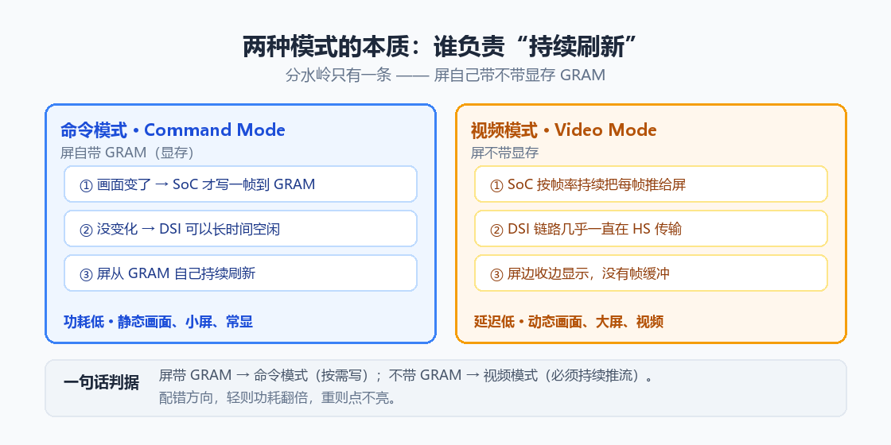
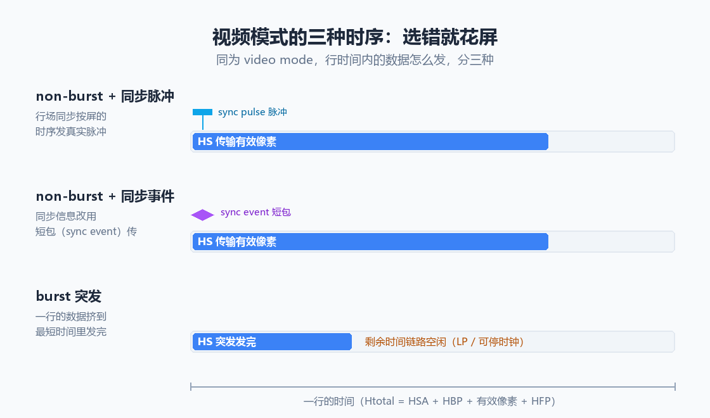
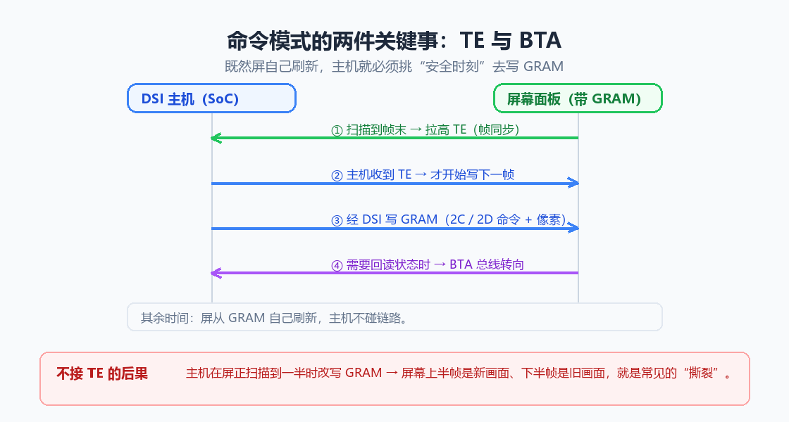
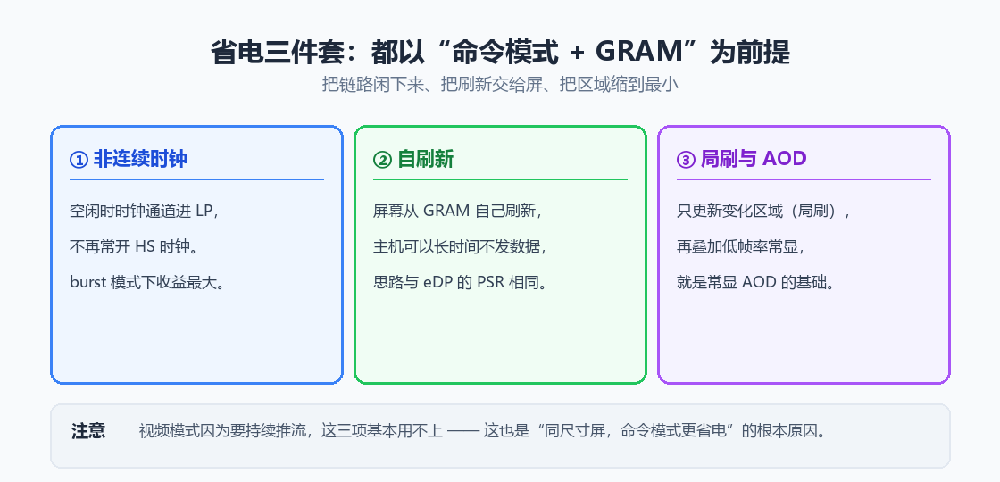
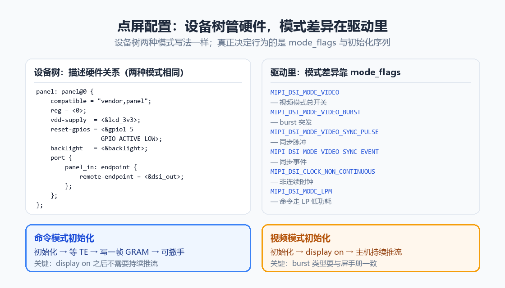
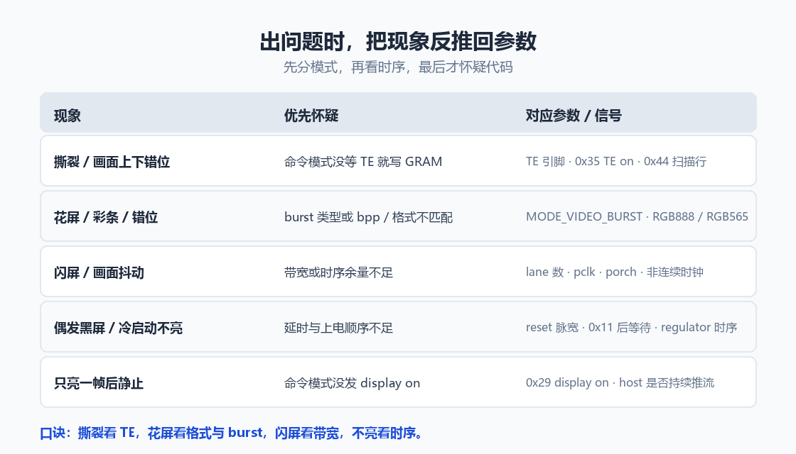

# DSI 视频模式与命令模式：从 GRAM、TE 到点屏配置

!!! abstract "快速结论"
    显示侧的 MIPI DSI 有两条工作路径：屏幕自己带显存（GRAM）的，可以"按需写"（命令模式）；不带显存的，必须"持续推"（视频模式）。这一个差别向外扩散，决定了初始化序列、撕裂现象、功耗上限和排查路径。

    - 分水岭只有一条：屏带不带 GRAM。带 → 命令模式；不带 → 视频模式。
    - 同是视频模式，行时间内怎么发数据分三种：non-burst 同步脉冲、non-burst 同步事件、burst 突发。选错就花屏。
    - 命令模式的两个关键词是 TE（撕裂信号）和 BTA（总线转向）：前者决定"什么时候可以写显存"，后者决定"什么时候能从屏读回数据"。
    - 非连续时钟、自刷新、局部刷新与 AOD 这三项省电手段，都以命令模式加 GRAM 为前提，视频模式基本用不上。
    - 设备树两种模式写法一样，真正区分行为的是驱动里的 mode flags 与初始化序列。

显示侧的 DSI 除了把像素推给屏幕，还有一条更容易被忽略的分支：屏幕到底自己刷不刷新。带显存的屏可以按需写，不带显存的屏必须持续推。就这一个差别，派生出 video mode 与 command mode 两种工作方式，也决定了初始化序列怎么写、画面为什么会撕裂、功耗能压到多低、出问题该从哪里查。这一篇把两者的机制、时序、配置和排障一次讲清。

## 01 本质区别：谁负责"持续刷新"

液晶和 OLED 的像素都不会自己一直亮着，必须有谁按帧率不断把内容重新写回去。DSI 的两种模式，差别就在于这件事由谁来做。

<figure markdown="span" class="displaywiki-figure">
  [{ width="760" loading="lazy" }](dsi-video-mode-vs-command-mode-fig1-gram.png){ .displaywiki-image-link title="查看原图" }
  <figcaption>图 1 · 两种模式的本质：屏自带 GRAM 时主机可以按需写，不带显存时主机必须持续推流</figcaption>
</figure>

**命令模式（Command Mode）** 适用于自带显存（GRAM）的屏。主机把一帧画面写进屏的 GRAM 之后就可以撒手，面板自己的显示控制器会持续从 GRAM 循环扫描刷新，只在画面真的变化时才需要再写一次。主机甚至可以长时间不碰链路，这就是它能做到极低功耗的原因。

**视频模式（Video Mode）** 适用于不带显存的屏。主机必须像放视频一样，按固定帧率把每一帧像素实时推过去，面板边收边显示。链路一停，屏上就没有内容了。

需要澄清一句：这两种模式没有谁更先进的问题，它们是屏幕的物理结构决定的。屏厂做了带 GRAM 的屏，你就只能按命令模式用；做了不带 GRAM 的屏，就只能按视频模式用。同一块屏若两种都支持，才有选择余地。

由此可以推出三个直觉结论。命令模式省电，因为链路能长时间空闲；视频模式的刷新节奏完全由主机掌控，延迟稳定；命令模式的瞬时数据率通常更高（要把一帧挤到很短的时间写完），对峰值带宽更敏感。

## 02 视频模式：三种时序，选错就花屏

即便确定了是 video mode，行时间内怎么组织数据还有三种做法，DSI 规范里分别叫非突发同步脉冲、非突发同步事件和突发模式。

<figure markdown="span" class="displaywiki-figure">
  [{ width="760" loading="lazy" }](dsi-video-mode-vs-command-mode-fig2-video-timing.png){ .displaywiki-image-link title="查看原图" }
  <figcaption>图 2 · 视频模式的三种时序：三者的有效像素都要在一行时间内送完，burst 只是把它挤到前段，留出空闲</figcaption>
</figure>

**non-burst + 同步脉冲（Non-Burst Mode with Sync Pulses）** 最接近传统并口 RGB 屏：除了用 HS 传输有效像素，还额外发送与面板行场同步对齐的同步脉冲。时序最好理解，但脉冲要占时间。

**non-burst + 同步事件（Non-Burst Mode with Sync Events）** 把同步信息改成用短包（sync event）来传，不再发真实脉冲。省掉了脉冲开销，代价是要求面板能正确解析短包。

**burst 突发（Burst Mode）** 把一行的像素压缩到尽可能短的时间内一次发完，随即回到 LP 空闲，等到下一行再发。HS 传输时间最短、空闲窗口最多，所以最省电；但瞬时数据率也最高，对物理层的峰值带宽与信号完整性要求最严。

三种做法有一个共同约束：一行时间内必须把这一行的有效像素全部送到。burst 并没有打破这个约束，它只是把传输挤到行时间的前段。

这里也是花屏的高发区。burst 与 non-burst 选错时，面板会按错误的节奏解析像素流，常见表现就是花屏、彩条、画面错位。**唯一的判据是屏手册**：手册写 video mode, burst 就配 burst，写 non-burst, sync pulse 就配同步脉冲，不能凭感觉挑。

顺带一提，burst 模式因为空闲窗口最多，时钟通道有机会在空闲时停下来，这是它与非连续时钟搭配能显著省电的原因，第 04 节会展开。

## 03 命令模式：GRAM、TE 信号与总线转向

命令模式的数据流方向完全不同：主机不再是"推流"，而是"读写屏内部的寄存器与显存"，所以要用 DCS（显示命令集）命令来操作。

写显存用的是 DCS 0x2C（write_memory_start）与 0x2D（write_memory_continue），后面跟着像素数据。真正需要动脑筋的是写入时机。

<figure markdown="span" class="displaywiki-figure">
  [{ width="760" loading="lazy" }](dsi-video-mode-vs-command-mode-fig3-te-bta.png){ .displaywiki-image-link title="查看原图" }
  <figcaption>图 3 · 命令模式的两件关键事：面板用 TE 告诉主机可以安全写显存，需要回读时用 BTA 把总线掉头</figcaption>
</figure>

面板正在扫描到某一行时，如果主机恰好改写了那一行对应的 GRAM 区域，屏幕上就会上半个画面是新内容、下半个画面是旧内容，这就是**撕裂（tearing）**。

**TE（Tearing Effect）信号**就是为解决撕裂而生。面板在扫到帧末或指定扫描行时给出一个同步信号，主机收到之后再写下一帧。它有两种形态：

- **独立 TE 引脚**：面板拉一根 TE 线到 SoC 的 GPIO。这是最常见、也最好调试的做法。
- **DSI 内 TE**：用 DCS 0x35（set_tear_on）打开 TE 上报，通过短包形式的 TE trigger 送到主机，还可以配合 0x44（set_tear_scanline）指定触发的扫描行。省一根线，但调试时看不见摸不着。

另一件常被忽略的是 **BTA（Bus Turnaround，总线转向）**。DSI 在物理上是半双工的：同一组数据通道，同一时刻只能一个方向有效。主机想从面板读回状态（或读 TE 触发）时，需要先通过 LP 序列把总线掉头交给面板。BTA 会引入额外延迟，读的内容越多、打断越频繁，延迟越明显。这就是命令模式里"读操作要谨慎"的原因。

至于命令是走 LP 低功耗模式还是 HS 高速模式发，由驱动的 mode flag（MIPI_DSI_MODE_LPM）决定，见第 05 节。

## 04 省电三件套：非连续时钟、自刷新、局刷与 AOD

命令模式之所以能省电，靠的是三项可以叠加的手段。

<figure markdown="span" class="displaywiki-figure">
  [{ width="760" loading="lazy" }](dsi-video-mode-vs-command-mode-fig4-power.png){ .displaywiki-image-link title="查看原图" }
  <figcaption>图 4 · 省电三件套：都以命令模式加 GRAM 为前提，视频模式要持续推流，这三项基本用不上</figcaption>
</figure>

**非连续时钟（non-continuous clock）** 指的是没有 HS 传输时，时钟通道回到 LP，不再常开高速时钟。DSI 规范里对应 CLOCK_NON_CONTINUOUS 这个开关。它和 burst 模式是天然搭档：空闲窗口越多，省下的时钟功耗越多。

**自刷新** 在命令模式下是天然的：屏自己从 GRAM 循环刷新，主机可以长时间不发数据。DSI 侧没有像 eDP 那样统一命名的 PSR 机制，但思路完全一致，所以工程师圈里常直接把它叫成 PSR。

**局刷与 AOD** 更进一步。用 DCS 0x30（partial area）配合 0x12（partial mode on）可以让面板只更新一块指定区域，其余区域保持不动；再叠加低帧率与低亮度常显，就是 AOD（always-on display）的技术基础。智能手表、电子价签、待机面板这类产品最吃这一套。

反过来说，视频模式因为要持续推流，这三项都用不上。这就是"同尺寸屏幕，命令模式更省电"的根本原因。如果你的场景是静态界面加电池供电，选一块带 GRAM、支持命令模式的屏，收益会非常直接。

## 05 点屏配置：设备树 mode flags 与初始化序列

到了配置层面，两种模式的差别比想象中更小。

<figure markdown="span" class="displaywiki-figure">
  [{ width="760" loading="lazy" }](dsi-video-mode-vs-command-mode-fig5-config.png){ .displaywiki-image-link title="查看原图" }
  <figcaption>图 5 · 点屏配置：设备树两种模式写法一样，真正区分行为的是驱动里的 mode flags 与初始化序列</figcaption>
</figure>

**设备树描述的是硬件关系，两种模式写法一样**：compatible、reg、供电（vdd-supply）、复位（reset-gpios）、背光（backlight）、以及把面板接到 DSI 主机上的 port / endpoint 连接；DSI 主机侧再标注数据通道数（data-lanes）与链路频率。设备树不负责区分模式。

**真正区分模式的是驱动里的 mode flags**。Linux 的 DRM 框架把视频模式的三种时序、时钟策略、命令通道策略都做成了开关：

| mode flag | 作用 |
| --------- | ---- |
| MIPI_DSI_MODE_VIDEO | 视频模式总开关 |
| MIPI_DSI_MODE_VIDEO_BURST | 采用 burst 突发时序 |
| MIPI_DSI_MODE_VIDEO_SYNC_PULSE | 采用同步脉冲时序 |
| MIPI_DSI_MODE_VIDEO_SYNC_EVENT | 采用同步事件时序 |
| MIPI_DSI_CLOCK_NON_CONTINUOUS | 空闲时停用高速时钟 |
| MIPI_DSI_MODE_LPM | 命令走 LP 低功耗通道 |

老一些的设备树绑定会把这几项以 dsi,flags / dsi,format / dsi,lanes 的形式直接写在节点上，新一些的驱动则大多写在面板驱动结构体的 mipi_dsi_device 里。写法不同，含义一样。

**初始化序列的差别才是实打实的**：

- **命令模式**：发完初始化（0x11 sleep out、等待 120ms、0x29 display on）之后，写一帧到 GRAM 就可以撒手；需要更新画面时再写。如果要防撕裂，初始化里还要先打开 TE（0x35）。整条序列里没有"持续推流"这一步。
- **视频模式**：发完初始化与 display on 之后，主机必须持续推流，一旦停流屏上就没有内容。而且 burst 类型必须与屏手册一致，只支持同步脉冲的屏被你配成 burst，就会花屏甚至不亮。

这里有个高频坑：把命令模式的屏按视频模式配，或者反过来。probe 往往能通过，甚至能亮那么一下，但画面、功耗、稳定性都不对，很容易被误判成硬件问题。

## 06 出问题时，把现象反推回参数

前面几节讲的是正向配置，排障时更需要的是反向推理：先看现象，再定位到该怀疑的参数。

<figure markdown="span" class="displaywiki-figure">
  [{ width="760" loading="lazy" }](dsi-video-mode-vs-command-mode-fig6-symptoms.png){ .displaywiki-image-link title="查看原图" }
  <figcaption>图 6 · 现象反推参数：先分模式，再看时序，最后才怀疑代码</figcaption>
</figure>

| 现象 | 优先怀疑 | 对应参数 / 信号 |
| --------- | ---- | ---- |
| 撕裂、画面上下错位 | 命令模式没等 TE 就写 GRAM | TE 引脚、0x35 TE on、0x44 扫描行 |
| 花屏、彩条、错位 | burst 类型或 bpp、格式不匹配 | MODE_VIDEO_BURST、RGB888 / RGB565、DSI 速率 |
| 闪屏、画面抖动 | 带宽或时序余量不足 | lane 数、pclk、porch、非连续时钟 |
| 偶发黑屏、冷启动不亮 | 延时与上电顺序不足 | reset 脉宽、0x11 后等待、regulator 时序 |
| 只亮一帧后静止 | 命令模式没发 display on | 0x29 display on、host 是否持续推流 |

口诀可以简化成四句：撕裂看 TE，花屏看格式与 burst，闪屏看带宽，不亮看时序。

需要提醒的是，先分模式这一步不能省。同样一个"花屏"，在视频模式里大概率是 burst 或格式问题，在命令模式里则更可能是写 GRAM 的时机或数据格式问题。模式判错，后面越查越远。

## 07 结语

视频模式与命令模式，本质上是屏幕有没有显存这一个结构差异，向外长出的两套工作方式。视频模式把刷新责任留在主机，换来稳定的延迟与简单的时序；命令模式把刷新交给屏，换来极低的功耗和撕裂防护的额外课题。理解了 GRAM、TE、BTA 这几个概念，再回头看设备树里的 mode flags 与初始化序列，那些曾经"照着抄但不知道为什么"的配置项就都有了出处。

如果你手上正好有一块 MIPI 屏要调，建议的顺序是：先确认屏手册写的是哪种模式、哪种时序，再对齐驱动配置，最后才用示波器和日志去查具体信号。方向对了，排查就只是时间问题。

## 08 常见问题

??? question "Q1：我的屏到底该用 video mode 还是 command mode？"
    先看屏有没有 GRAM。手册写明带 GRAM 或标注支持命令模式的，优先命令模式，省电且能做局刷；不带 GRAM 的只能走视频模式。如果同一块屏两种都支持，那就按场景选：静态界面、待机常显选命令模式，持续动态画面选视频模式。

??? question "Q2：屏是视频模式，我却按命令模式配了会怎样？"
    probe 往往能通过，甚至能亮一下，但主机不会持续推流，屏上就只出现一帧或者刷新异常。反过来，命令模式的屏被按视频模式配，会多出大量不必要的持续流量，功耗上升，撕裂风险也更高。所以模式必须与屏手册严格一致，不能靠试。

??? question "Q3：burst 和 non-burst 怎么选？sync pulse 与 sync event 差在哪？"
    以屏手册为准，这是唯一可靠的判据。non-burst 加同步脉冲用真实脉冲对齐行场时序；non-burst 加同步事件改用短包传同步信息；burst 把一行挤到最短时间发完，最省电，但对瞬时带宽与信号完整性要求最高。选错最常见的表现就是花屏与画面错位。

??? question "Q4：命令模式一定要接 TE 吗？"
    不接也能正常显示，但画面变化时会出现撕裂。TE 的作用是把"可以安全写显存"的时刻告诉主机。静态画面为主、或者能接受偶发撕裂的低成本方案可以不接；一旦涉及动画、滚动、视频预览，强烈建议接上，独立 TE 引脚和 DSI 内 TE 触发都可以。

??? question "Q5：同一块屏，为什么别人点得亮、我点不亮？"
    绝大多数情况问题不在屏，而在模式与时序没对齐：burst 类型配错、lane 数不足、DSI 链路速率不够、初始化序列里的延时被删掉、reset 极性与上电顺序不符。建议先把模式与手册对齐，再逐项核对时序参数与每一步的延时，最后才怀疑屏本身。

??? question "Q6：命令模式是不是一定比视频模式省电？"
    在静态或低变化场景下通常是的，因为它能把链路长时间置于空闲。但如果画面持续全屏变化，命令模式也得不停地写 GRAM，优势会明显缩小。所以省电与否要看画面变化率，不能只看模式名字。

👉 **[探索 优奕视界 MIPI DSI 显示屏](https://www.chinasunyee.com/yjxspdrcmzc.htm)**

## 相关阅读

- [MIPI 接口详解：DSI、CSI-2 与 D-PHY 图解](mipi-interface-basics.md)
- [LCD 屏参详解：把点屏参数讲成能看见的样子](lcd-panel-timing-parameters.md)
- [显示接口详解：MCU、RGB 并行、LVDS、MIPI、SPI、UART 等](display-interface-guide.md)

## 参考数据来源

本文涉及的标准、规格与资料：

- [MIPI DSI 规范（MIPI Alliance）](https://www.mipi.org/specifications/dsi)
- [MIPI D-PHY 规范（MIPI Alliance）](https://www.mipi.org/specifications/d-phy)
- [Linux 内核 DRM MIPI DSI mode flags 定义](https://elixir.bootlin.com/linux/latest/source/include/drm/drm_mipi_dsi.h)

!!! info "没有找到您需要的内容？"
    如果您需要更多产品、资源或技术支持，欢迎联系我们的团队：

    [**:material-archive-arrow-down: 知识库**](../../knowledge/tags.md){ .md-button .md-button--primary }
    [**:material-magnify: 产品与解决方案**](https://www.chinasunyee.com){ .md-button }
    [**:material-email: 联系技术支持**](mailto:info@chinasunyee.com){ .md-button }
