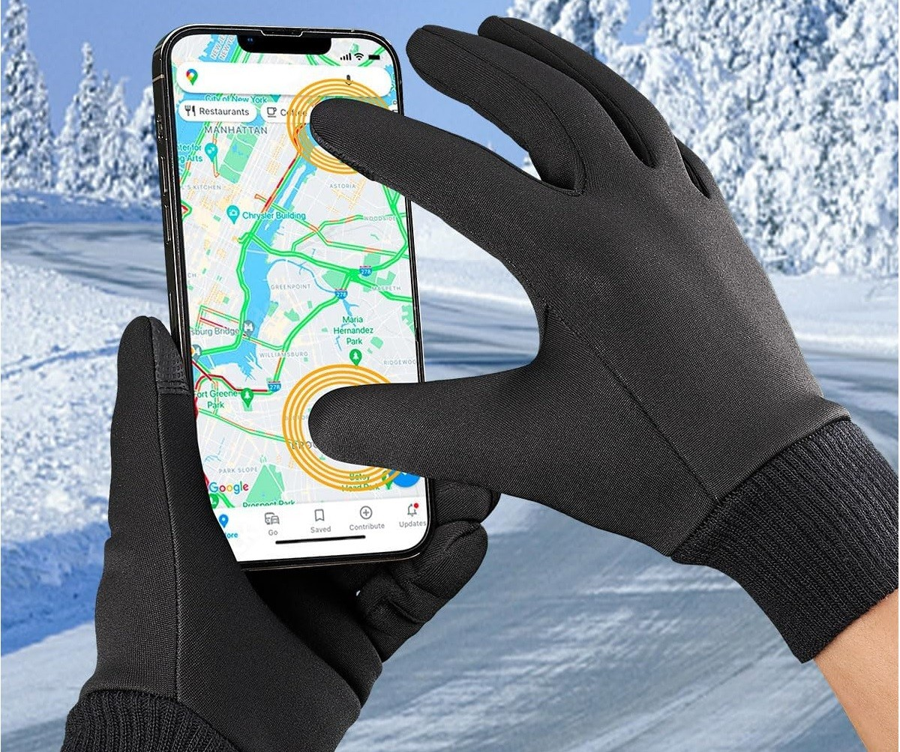
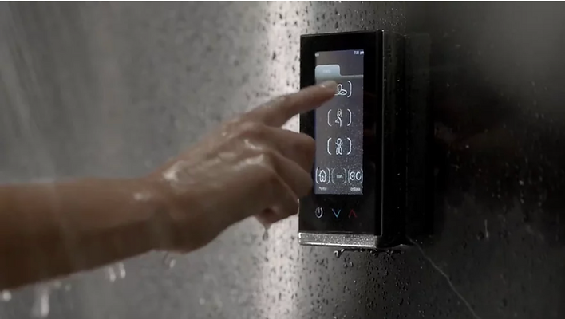

# 手套触控、防水触控与抗干扰设计

!!! abstract "快速结论"
    在工业、医疗与户外场景中，触控屏面对的不是干净的手指，而是手套、湿手、水滴与电磁噪声。手套触控要解决"信号太弱"，防水触控要解决"分不清是手还是水"，抗干扰设计要解决"噪声盖过信号"。三者都靠硬件与算法配合，核心指标是信噪比。

## 核心要点

- 手套触控的本质是提升信噪比：增强传感器灵敏度、调整算法阈值，并配合高导电手套材料。
- 防水触控的关键是区分水滴与真实触摸：疏水涂层减少残留，多频信号处理与算法负责判别。
- 高抗干扰设计由三层构成——屏蔽与接地（硬件）、滤波与自适应（算法）、密封与材料（结构）。
- 三项能力可以叠加，但需在灵敏度与抗误触之间取得平衡，避免顾此失彼。

## 1. 手套触控

### 1.1 作用

手套触控技术的目标是让用户在戴手套时仍能顺畅操作触摸屏设备，核心是提高触控屏识别与响应手套所产生触摸信号的能力。主要作用包括：

- **提高便利性**：在寒冷天气或特殊工作环境中，用户无需脱下手套即可操作触摸屏。
- **提高效率**：医疗、制造与建筑等必须戴手套的行业中，减少脱戴手套的环节可显著提升作业效率。
- **确保安全**：在某些工作环境中手套是必要的防护装备，支持手套触控意味着不必为操作设备而牺牲防护。

### 1.2 应用场景

<figure markdown="span" class="displaywiki-figure">
  [{ width="760" loading="lazy" }](glove-waterproof-touch-application-scenarios-of-glove-touch-technology.jpeg){ .displaywiki-image-link title="查看原图" }
  <figcaption>寒冷环境：冬季或户外低温条件下，用户可以戴着保暖手套直接操作手机、平板与其他触控设备。</figcaption>
</figure>

<figure markdown="span" class="displaywiki-figure">
  [{ width="760" loading="lazy" }](glove-waterproof-touch-implementation-methods-of-glove-touch-technology.jpeg){ .displaywiki-image-link title="查看原图" }
  <figcaption>医疗场景：医护人员戴一次性医用手套操作监护仪等设备，无需摘除手套即可完成交互，降低交叉感染风险。</figcaption>
</figure>

- **制造业与工业**：工人在操作控制面板与机器界面时需要佩戴防护手套。
- **户外活动**：滑雪、骑行与登山等活动中，用户可戴着手套使用 GPS 设备、智能手表与码表。
- **紧急服务**：警察、消防员与急救人员在工作中常需佩戴手套，手套触控使其能正常使用通信与导航设备。

### 1.3 实施方法

手套触控技术涉及硬件与软件两方面，主要方法包括：

- **增强电容传感器**：现代触摸屏多采用电容传感器，通过提高其灵敏度，使传感器可以检测到手套带来的微弱信号。
- **调整触摸算法**：优化触控算法，使其能够识别并处理手套触摸信号。
- **使用高导电材料**：在手套中引入高导电材料，更有效地传递手指的电信号，使触摸屏可以识别手套接触。
- **电容补偿技术**：通过补偿调整电容值，以适应不同手套的厚度与材质，保证手套触控的灵敏度与准确度。

### 1.4 关键步骤

1. **优化传感器设计**：选择并优化电容式触摸传感器，使其对微弱的手套信号更敏感，可能涉及传感器材料与结构的改进。
2. **调整软件算法**：开发并调整触摸算法，使其既能识别手套触摸，又不影响正常的裸指操作。
3. **选择合适的手套材料**：在手套设计中选用高导电材料，保证足够的信号传递。
4. **测试与校准**：在各种环境与使用条件下测试校准，确保手套触控稳定工作。
5. **用户反馈与改进**：基于实际使用反馈持续优化，提升可靠性与体验。

## 2. 防水触控

### 2.1 作用

防水触控技术旨在让触摸屏在用户手指湿润时仍能正常工作。传统触摸屏在有水或高湿条件下往往难以准确响应，防水触控通过改进传感器与算法来精确识别潮湿条件下的触摸信号。主要作用包括：

- **提高设备可用性**：确保设备在各类潮湿环境中都能正常使用，不受手指湿度影响。
- **提高使用体验**：在厨房、雨中或运动出汗等场景下保持稳定操作。
- **提高耐用性**：减少误操作与湿度引起的损坏，延长使用寿命。

### 2.2 应用场景

<figure markdown="span" class="displaywiki-figure">
  [{ width="760" loading="lazy" }](glove-waterproof-touch-application-scenarios-of-waterproof-touch-technology.jpeg){ .displaywiki-image-link title="查看原图" }
  <figcaption>户外环境：设备表面布满雨水或凝露时，防水触控仍需分辨真实触摸与水滴，避免误触发。</figcaption>
</figure>

<figure markdown="span" class="displaywiki-figure">
  [{ width="760" loading="lazy" }](glove-waterproof-touch-implementation-methods-of-waterproof-touch-technology.png){ .displaywiki-image-link title="查看原图" }
  <figcaption>潮湿场景：浴室、淋浴间或洗手后，用户以湿手直接操作触控面板，这是防水触控最典型的挑战环境。</figcaption>
</figure>

- **厨房与浴室**：智能冰箱、平板与智能镜子等设备常需以湿手操作。
- **户外活动**：下雨或潮湿环境中使用手机、智能手表与导航设备。
- **健身房**：运动出汗时操作健身设备或触控界面。
- **医疗环境**：医护人员洗手后或手术过程中便捷地操作触控设备。
- **日常生活**：清洁、洗衣等涉水活动后正常使用智能设备。

### 2.3 实施方法

防水触控技术结合硬件与软件改进，主要方法包括：

- **增强电容传感器**：改进电容传感器设计，使其能更好地区分湿手触摸信号与单纯的水滴，提高灵敏度与精度。
- **优化触摸算法**：开发算法识别并处理潮湿条件下的触摸信号。算法必须能区分正常触摸、湿手触摸与水滴干扰，以保证操作准确。
- **表面涂层技术**：在触摸屏表面应用疏水涂层，使水滴更易滑落，减少残留与干扰。
- **多频信号处理**：采用多频信号处理技术分析不同频率的触摸信号，增强湿度条件下的信号识别能力。
- **材料选择与改进**：选用在潮湿环境中导电性与抗干扰能力更好的材料，保证稳定性与精度。

### 2.4 关键步骤

1. **优化传感器设计**：选择并优化电容式触摸传感器，使其对潮湿触摸信号更敏感。
2. **调整软件算法**：开发并调整触摸算法，识别湿式触摸同时不影响常规操作。
3. **表面涂层应用**：在触控表面施加疏水涂层，减少水滴干扰并提升响应一致性。
4. **测试与校准**：在各种环境与使用条件下测试校准，确保稳定运行。
5. **用户反馈与改进**：依据实际使用中暴露的问题持续优化。

## 3. 高可靠性与高抗干扰设计

### 3.1 关键指标

具有高可靠性与高抗干扰能力的触摸屏需要在复杂环境中稳定运行，同时保持精确的触摸响应。关键指标包括：

- **触摸精度**：即使在存在干扰的情况下，也应保持较高的定位精度。
- **响应速度**：触摸屏需在毫秒级响应，这是体验的基础。
- **抗干扰能力**：在电磁干扰（EMI）、静电放电（ESD）与其他环境因素下保持稳定运行。
- **耐用性**：包括抗刮擦、抗冲击、耐高低温以及耐水耐尘。
- **灵敏度**：能够检测轻微触摸，尤其当用户戴手套或手指湿润时。
- **功耗**：移动设备要求在高性能的同时保持低能耗。

<figure markdown="span" class="displaywiki-figure">
  [{ width="760" loading="lazy" }](glove-waterproof-touch-application-scenarios.png){ .displaywiki-image-link title="查看原图" }
  <figcaption>高可靠性与高抗干扰触控的示意：设备需要在潮湿、粉尘与电磁噪声并存的环境中保持稳定响应，这是工业、户外与特种应用的共同要求。</figcaption>
</figure>

### 3.2 应用场景

- **工业控制**：自动生产线与机械控制面板，需在强电磁干扰、粉尘与高温下稳定运行。
- **医疗设备**：手术控制面板与床边监护设备，需在消毒剂与湿气条件下保持高精度与可靠性。
- **户外设备**：户外广告机、自助服务亭与导航设备，需防水、防尘、抗紫外线。
- **军事设备**：战场通信装置与指挥控制系统，对高抗干扰与可靠性要求极高。
- **汽车系统**：导航与娱乐系统需在振动、温度变化与电磁干扰下稳定运行。
- **金融终端**：ATM、POS 等终端在频繁使用与严格安全要求下需保持高可靠性。

!!! warning "量产注意"
    在量产或恶劣工况（高低温、湿热、振动、ESD）下，应核对触控方案的实测曲线与规格边界；超出范围后误触率、灵敏度一致性与寿命都会明显劣化，且此类问题往往在批次间被放大。

### 3.3 实施方法

**硬件层面**

- **屏幕材料选择**：使用高强度玻璃与减反射涂层等耐久、抗干扰的材料，提升耐用性。
- **触摸传感器优化**：采用高精度电容式触摸技术与多层结构设计，减少电磁干扰的影响。
- **屏蔽设计**：在触控设计中加入屏蔽层，阻止外部电磁干扰进入触摸电路。
- **防静电设计**：采用抗静电材料与结构设计，防止静电放电造成损坏。
- **表面涂层**：施加疏水与疏油涂层，改善潮湿环境下的响应，并减少粉尘与油污对触控的影响。
- **防水防尘**：通过密封设计与保护涂层达到 IP65 或更高防护等级，适应户外与恶劣环境。

**软件层面**

- **算法优化**：开发先进的触摸算法增强信号处理能力，准确识别触摸信号，减少误触。
- **抗干扰处理**：在触控信号处理链路中加入滤波，滤除环境噪声与干扰信号。
- **自适应触控**：根据环境变化自动调整灵敏度与响应速度，保证不同条件下的稳定表现。
- **多点触控处理**：优化多点算法，保证同时多指操作的精度与流畅性。
- **电源管理**：通过智能休眠与唤醒机制优化触控模块功耗，延长便携设备续航。

## 4. 选型要点

- **明确实际使用条件**：先确定是手套、湿手、水滴还是电磁噪声中的哪几项，再针对性选择方案。
- **平衡灵敏度与误触**：提高灵敏度以支持手套触控，同时会增大误触风险，需在现场条件下实测确认。
- **确认手套类型与厚度**：不同材质（导电纤维、皮革、乳胶）对手套触控效果影响很大，应指定具体手套做测试。
- **评估防水方式**：疏水涂层只能减少残留，真正的防水能力来自密封结构，需确认整机 IP 等级而非仅屏体指标。
- **核对电磁环境**：涉及电机、变频器或大功率无线设备的场景，应要求提供 EMI 与 ESD 测试结论。
- **确认低温表现**：低温下液晶响应变慢，触控与显示需一并评估，必要时考虑加热方案。

## 5. FAQ

??? question "Q1：戴手套触控为什么手机没反应？"
    电容触控依赖手指与传感器之间形成的电容耦合。普通手套是绝缘的，隔断了这条耦合路径，信号太弱就无法被识别。解决办法有两个方向：一是让传感器与算法能识别更弱的信号（提高信噪比），二是让手套具备一定导电性（如加入导电纤维）。

??? question "Q2：手套触控是怎么实现的？"
    通常靠硬件与算法配合：硬件上提高电容传感器灵敏度、优化电极结构；算法上调整触摸阈值与识别逻辑，把符合手套特征的弱信号保留下来，同时过滤噪声。此外，电容补偿技术可针对不同厚度与材质的手套做适配。

??? question "Q3：屏幕上有水会误触，怎么解决？"
    分两步：一是减少残留，通过疏水涂层让水滴快速滑落；二是加强判别，用多频信号处理与算法区分"水滴覆盖"与"真实触摸"的特征差异，并对判定为水滴的信号做抑制。两者结合才能在雨天或湿手场景下保持可用。

??? question "Q4：手套触控和防水触控能同时做吗？"
    可以，但需要仔细调参。两者都要求提高对微弱信号的识别能力，叠加后会显著增加误触风险，因此需要在目标手套与目标湿度条件下做联合测试。实际项目中通常先确定优先级最高的场景，再逐步放宽另一项指标。

??? question "Q5：为什么水滴会造成误触？"
    水滴具有较高的介电常数，落在电容屏表面时会改变局部电场分布，产生与手指电容变化相似的信号，因此被误判为触摸。这也是防水触控必须依靠算法而不仅是防水结构的原因——水被挡住了，但识别问题依然存在。

??? question "Q6：工控场景的触控抗干扰要注意什么？"
    重点在三方面：一是屏蔽与接地，防止外部电磁干扰进入触摸电路；二是软件滤波，剔除与真实触摸特征不符的信号；三是结构与材料，包括防静电设计与密封防护。此外还需在真实工况（含电机、变频器等干扰源）下测试，而非只在实验室环境验证。

## 相关阅读

- [电容式与电阻式触摸屏对比](touch-panel-types.md)
- [GF、GFF、GG 与 PG 电容触摸结构](capacitive-touch-structures.md)
- [显示屏框贴与全贴合对比](air-vs-optical-bonding.md)

## 参考数据来源

本文涉及的标准、规格与应用资料：

- [TFT LCD 模组规格书示例（7 英寸 WVGA）](../../../assets/datasheet/display/ALL-UE070WV-RB40-A092A.pdf)
- [IPC-A-610 电子组件的可接受性](https://shop.ipc.org/ipc-a-610)

!!! info "没有找到您需要的内容？"
    如果您需要更多产品、资源或技术支持，欢迎联系我们的团队：

    [**:material-archive-arrow-down: 知识库**](../../knowledge/tags.md){ .md-button .md-button--primary }
    [**:material-magnify: 产品与解决方案**](https://www.chinasunyee.com){ .md-button }
    [**:material-email: 联系技术支持**](mailto:info@chinasunyee.com){ .md-button }
