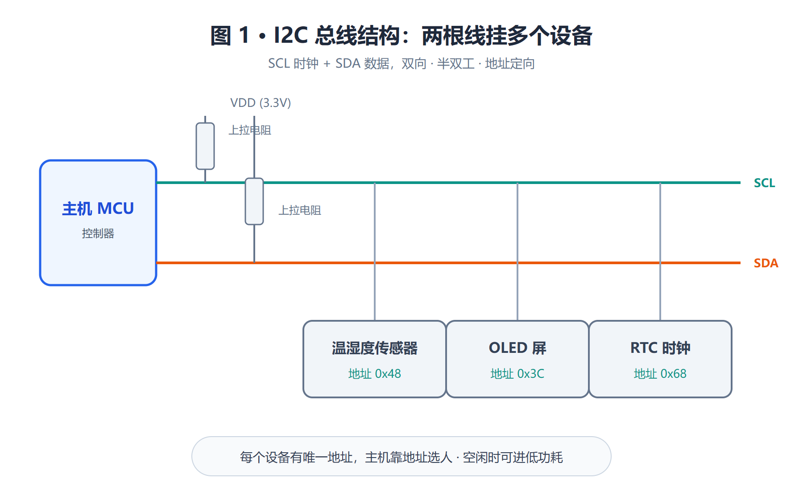
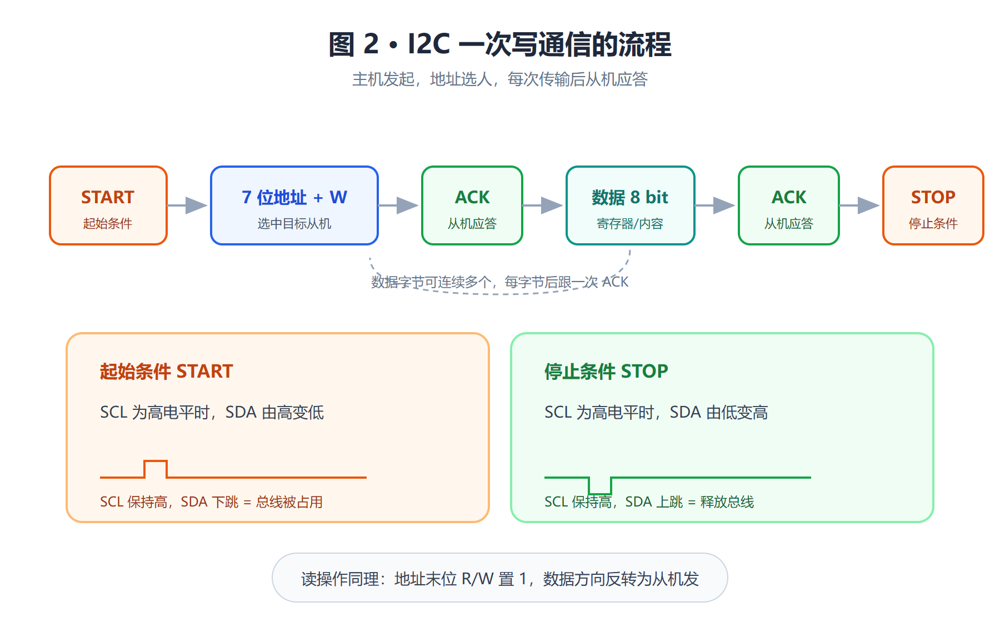
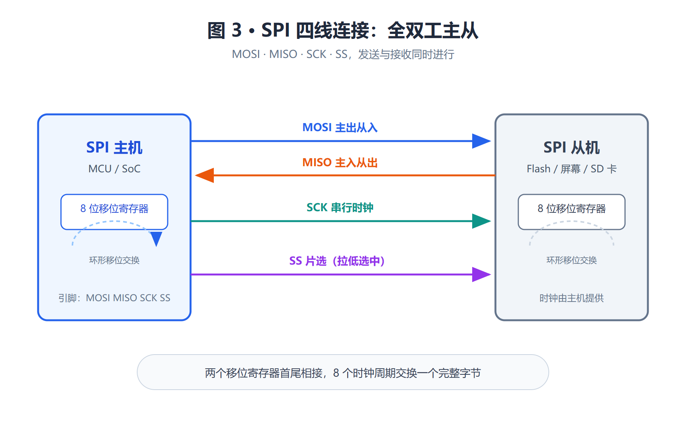
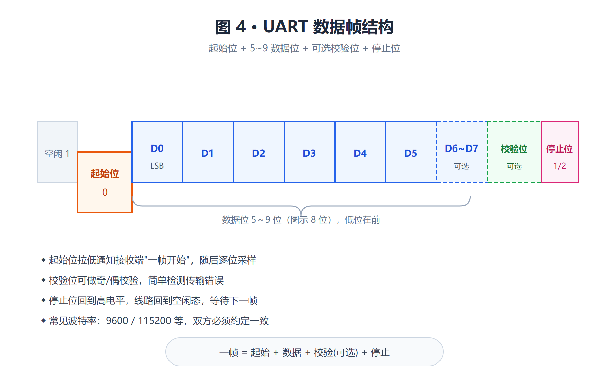
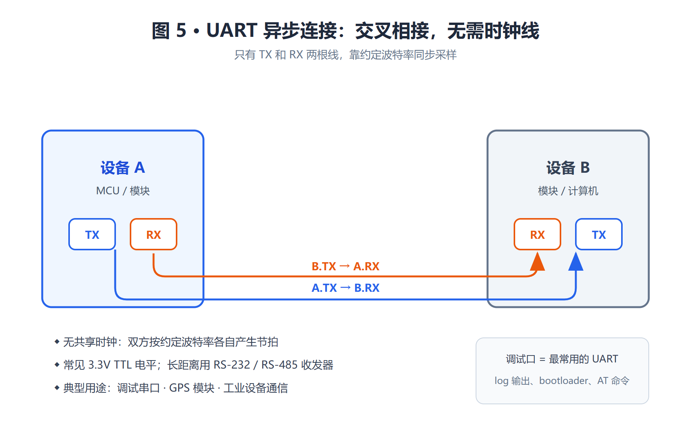
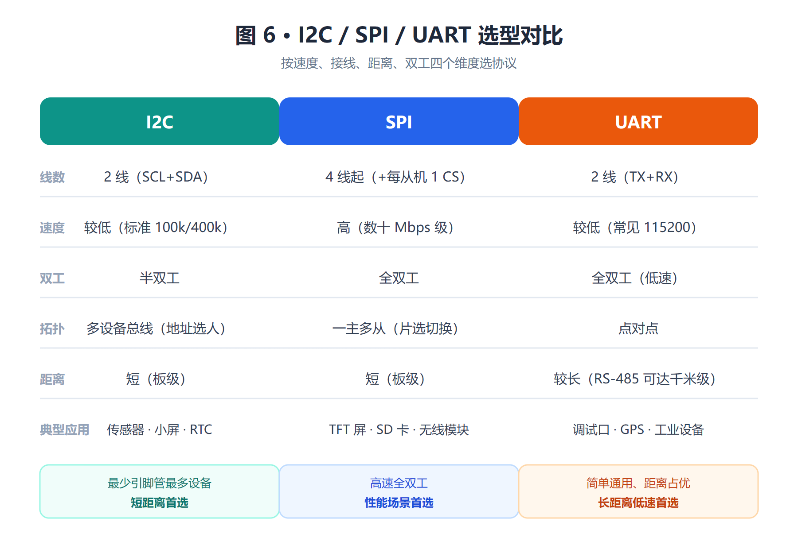

# 图解 I2C、SPI、UART 的通信过程与选型对比

!!! abstract "快速结论"
    I2C 用两根线管理多个从设备，适合短距离低速场景；SPI 高速全双工，适合 TFT 屏、SD 卡等快传输需求；UART 两线异步、距离较远，适合调试口与模块间通信。文末附四维选型对比。

I2C、SPI 和 UART 是电子嵌入式设备中最常用的通信协议。本文剖析这三种协议，让大家清楚、直观地了解它们的功能、优点和局限性。

## I2C 协议

I2C 是一种串行通信协议，通常用于连接低速设备，如传感器、存储器和其他外设。它使用两根线（SCL 和 SDA）来实现双向通信，具有地址定向性和主从模式。

<figure markdown="span" class="displaywiki-figure">
  [{ width="760" loading="lazy" }](i2c-spi-uart-protocols-fig1-i2c-bus.png){ .displaywiki-image-link title="查看原图" }
  <figcaption>图 1 · I2C 总线结构：SCL / SDA 两线 + 上拉电阻 + 多个从设备各挂唯一地址</figcaption>
</figure>

<figure markdown="span" class="displaywiki-figure">
  [{ width="760" loading="lazy" }](i2c-spi-uart-protocols-fig2-i2c-frame.png){ .displaywiki-image-link title="查看原图" }
  <figcaption>图 2 · I2C 一次完整通信：START → 地址+W → ACK → 数据 → ACK → STOP</figcaption>
</figure>

**优点：**

- 多设备支持：I2C 支持多个设备连接到同一总线上，每个设备都有唯一的地址。
- 简单：I2C 协议相对简单，易于实现和调试。
- 低功耗：在空闲状态时，I2C 总线上的器件可以进入低功耗模式，节省能量。

**缺点：**

- 速度较慢：I2C 通信速度较低，适用于低速设备。
- 受限制：I2C 的总线长度和设备数量受到限制，过长的总线可能导致通信问题。
- 冲突：当多个设备尝试同时发送数据时，可能会发生冲突，需要额外的冲突检测和处理机制。

**应用案例：**

就其应用而言，I2C 在需要简单且经济的通信环境中表现出色。它尤其擅长在**小型传感器、LCD 屏幕和 RTC（实时时钟）模块**中使用。此外，I2C 由于其在紧凑电路中的效率，在温度控制设备、电池管理系统和 LED 控制器中很有用。但是，在需要快速或长距离数据传输的项目中，最好选择其他协议。

## SPI 协议

SPI（串行外设接口）以其**高速度**而著称，使其成为快速通信的首选。与 I2C 不同，SPI 使用四线工作：MISO（主输入从输出）、MOSI（主输出从输入）、SCK（串行时钟）和 SS（从选择），允许全双工通信（发送和同时接收）。尽管简单且速度快，但 SPI 比 I2C 需要更多的引脚，这可能是电路设计中需要考虑的一个因素。

<figure markdown="span" class="displaywiki-figure">
  [{ width="760" loading="lazy" }](i2c-spi-uart-protocols-fig3-spi-wiring.png){ .displaywiki-image-link title="查看原图" }
  <figcaption>图 3 · SPI 四线全双工：MOSI / MISO / SCK / SS 方向标注，两侧移位寄存器环形交换数据</figcaption>
</figure>

**优点：**

- 高速：SPI 通信速度较快，适用于对速度要求较高的应用。
- 全双工：SPI 支持全双工通信，可以同时进行数据发送和接收。
- 简单：SPI 的通信协议相对简单，适用于快速开发和实现。

**缺点：**

- 连线复杂：SPI 需要多根线进行连接，可能会增加硬件设计的复杂性。
- 长距离传输受限：SPI 的传输距离受到限制，过长的线路可能导致信号衰减和干扰。
- 主从模式限制：SPI 通常采用主从模式，主设备数量受限，不适用于多主设备场景。

**应用案例：**

SPI 非常适合需要**快速可靠的数据传输**的情况，例如 TFT 显示器、SD 存储卡和无线通信模块。然而，在具有许多从站的复杂系统中，其有效性会降低。

## UART 协议

UART（通用异步接收器/发送器）是一种串行通信协议，因其**多功能性和简单性**而被广泛使用。与 I2C 和 SPI 不同，UART 只需要两条线即可运行：TX（发送）和 RX（接收）。该协议允许异步通信，也就是说发送器和接收器之间无需共享时钟。数据被组织成数据包，每个数据包包含一个起始位、5 到 9 个数据位、一个可选的奇偶校验位和一个或两个停止位。

<figure markdown="span" class="displaywiki-figure">
  [{ width="760" loading="lazy" }](i2c-spi-uart-protocols-fig4-uart-frame.png){ .displaywiki-image-link title="查看原图" }
  <figcaption>图 4 · UART 数据帧结构：起始位 + 数据位 + 可选校验位 + 停止位，逐位标注</figcaption>
</figure>

<figure markdown="span" class="displaywiki-figure">
  [{ width="760" loading="lazy" }](i2c-spi-uart-protocols-fig5-uart-link.png){ .displaywiki-image-link title="查看原图" }
  <figcaption>图 5 · UART 异步交叉连接：TX→RX 交叉走线，无时钟线，靠双方约定的波特率同步</figcaption>
</figure>

**优点：**

- 简单：UART 通信协议相对简单，易于实现和调试。
- 适用性广泛：UART 被广泛应用于各种设备之间的通信，具有较好的兼容性。
- 距离：UART 通信距离较远，适用于需要长距离传输的场景。

**缺点：**

- 速度较低：UART 通信速度相对较低，不适用于对速度要求较高的应用。
- 双工：UART 通信是双工的，可以进行低速双工传输数据，进行数据的发送和接收。
- 不可靠：由于 UART 是异步通信，可能会受到噪声和干扰的影响，导致数据传输不可靠。

**应用案例：**

- **微控制器和外设之间的连接**：用于简单直接的数据交换。
- **GPS 模块和与计算机的串行接口**：用于可靠、低复杂性的通信。
- **工业机器**：UART 通常用于工业设备中以实现稳定的通信。
- **使用 RS 标准（例如 RS-232、RS-485）**：这些标准支持更长距离的 UART 通信，并提供使用适当的收发器创建多从属网络的可能性，从而增加 UART 应用的灵活性和广度。

## 为项目选择合适的协议

<figure markdown="span" class="displaywiki-figure">
  [{ width="760" loading="lazy" }](i2c-spi-uart-protocols-fig6-protocol-compare.png){ .displaywiki-image-link title="查看原图" }
  <figcaption>图 6 · 三协议选型对比：线数 / 速度 / 双工 / 拓扑 / 距离 / 典型应用 六维对照</figcaption>
</figure>

- **通信速度**：SPI 提供高速度，UART 提供高灵活性，I2C 适用于速度要求较低、接线简单的配置。
- **电路设计**：I2C 可实现多个设备的高效空间管理，SPI 可实现大型设计中的性能，而 UART 可实现简单性和多功能性。
- **距离和通信环境**：UART 在长距离上具有稳定性，而 I2C 更适合短距离。
- **双工要求**：SPI 和 UART 提供全双工功能，而 I2C 仅限于半双工。

## 结论

**I2C** 因其简单性和用最少的引脚管理多个从设备的能力而脱颖而出，使其成为短距离配置的理想选择。

**SPI** 具有高速和全双工模式，非常适合在空间不是主要问题的系统中进行快速高效的数据传输。

**UART** 功能强大，在长距离通信和速度要求较低的配置中表现出色。

!!! info "没有找到您需要的内容？"
    如果您需要更多产品、资源或技术支持，欢迎联系我们的团队：

    [**:material-archive-arrow-down: 知识库**](../../knowledge/tags.md){ .md-button .md-button--primary }
    [**:material-magnify: 产品与解决方案**](https://www.chinasunyee.com){ .md-button }
    [**:material-email: 联系技术支持**](mailto:info@chinasunyee.com){ .md-button }
