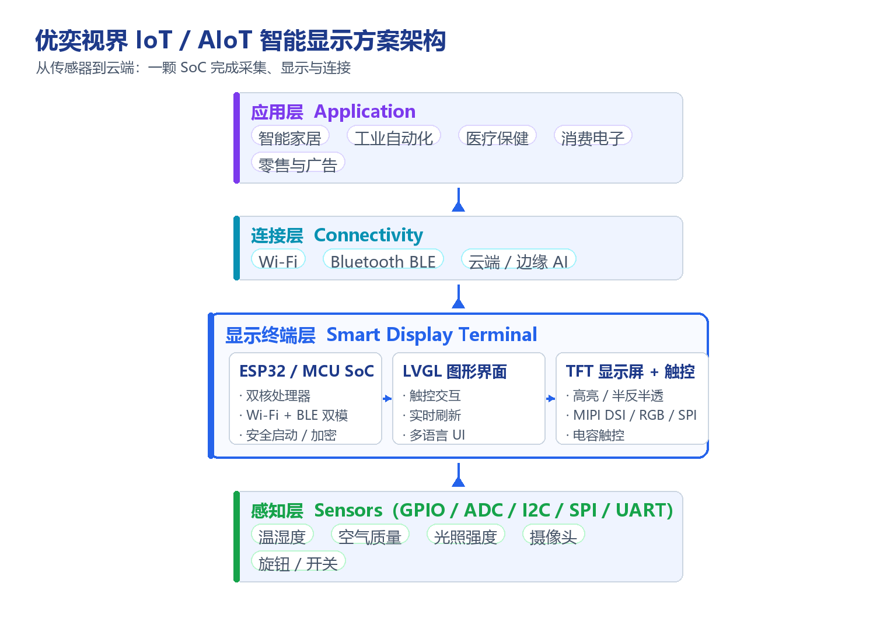

# IoT 与 AIoT 智能显示解决方案

!!! abstract "快速结论"
    优奕视界 IoT 智能系列以 ESP32 或同等 MCU 为基础，是一颗高度集成的 Wi-Fi + Bluetooth 双模 SoC，把传感器采集、图形界面显示与网络连接放在同一颗芯片上。凭借性能、功耗与外设接口的平衡，它已成为各类智能屏设备的主流选择。本文给出方案架构、适用行业、优势与完整的开发验证流程。

## 核心要点

- 方案核心是一颗双模 SoC：同时提供 Wi-Fi 与 Bluetooth 连接能力，并驱动 TFT 显示屏与触控交互。
- 高集成度简化了系统设计：采集、显示、连接由单芯片完成，减少外围器件并降低整机成本。
- 丰富的外设接口（GPIO、ADC、DAC、I2C、SPI、UART）便于接入各类传感器与执行器。
- 硬件加密、安全启动与闪存加密构成基础安全能力，是物联网设备接入云端的前提。

## 1. 方案概述

由 ESP32 或同等 MCU 开发的优奕视界 IoT 智能系列，是一颗高度集成的 Wi-Fi 和 Bluetooth 双模 SoC（片上系统），面向物联网（IoT）与人工智能物联网（AIoT）应用。凭借较强的性能、低功耗与丰富的外设接口，该系列智能显示器已成为各类智能屏应用的热门选择。

方案的价值在于把传统上分散的三件事收敛到一颗芯片上：

- **采集**：通过 GPIO、ADC、I2C、SPI、UART 等接口读取传感器数据。
- **显示**：驱动 TFT 显示屏与触控，运行图形界面并实时刷新。
- **连接**：通过 Wi-Fi 或蓝牙与云端、手机或其他设备通信。

## 2. 方案架构

下图给出从感知层到应用层的完整链路：

<figure markdown="span" class="displaywiki-figure">
  [{ width="760" loading="lazy" }](iot-aiot-display-architecture.png){ .displaywiki-image-link title="查看原图" }
  <figcaption>IoT / AIoT 智能显示方案架构：感知层通过 GPIO / ADC / I2C / SPI / UART 接入温湿度、空气质量、光照、摄像头与旋钮等传感与输入器件；显示终端层由 ESP32 / MCU SoC、LVGL 图形界面与 TFT 显示屏 + 触控构成；连接层提供 Wi-Fi、蓝牙 BLE 与云端 / 边缘 AI 能力；应用层覆盖智能家居、工业自动化、医疗保健、消费电子与零售广告。</figcaption>
</figure>

## 3. 主要应用行业

**1. 智能家居**

在智能家居领域，直观且可交互的显示接口对监控与控制家庭自动化系统至关重要。优奕视界智能显示器可以显示各类传感器（温度、湿度、空气质量等）的实时数据，并允许用户通过触摸屏或语音指令控制灯光、恒温器与安防系统等设备。

**2. 工业自动化**

工业环境需要稳定可靠的系统来监控机械与流程。优奕视界 IoT 智能显示器可用于显示传感器数据、设备状态与运行参数，其连接能力支持与其他工业系统实时通信，并具备远程监测能力。

**3. 医疗保健**

在医疗应用中，设备可呈现患者生命体征、医疗记录与治疗时间表等关键信息。显示器可集成到医疗设备中，让医护人员即时获取重要数据，从而提升护理质量与运营效率。

**4. 消费电子**

智能手表、健身追踪器与其他可穿戴设备受益于紧凑高效的 MCU/SoC：可显示实时健康指标、通知与交互界面，而低功耗特性保证了电池续航，这对便携设备至关重要。

**5. 零售与广告**

在零售与广告领域，动态交互式显示屏可以提升客户参与度并提供个性化购物体验。设备可依据客户偏好与行为展示定制化的促销内容、产品信息与广播信息。

## 4. 方案优势

1. **高集成性**：集成 Wi-Fi、蓝牙与双核处理能力，为连接与计算提供完整方案，简化设计流程并降低系统总成本。
2. **低功耗**：以节能为设计重点，支持多种低功耗模式，对电池驱动设备尤为关键，可在不频繁充电的前提下延长运行时间。
3. **多功能连接**：内置 Wi-Fi 与蓝牙，可无缝接入各类物联网设备与网络。
4. **丰富的边缘接口**：支持 GPIO、ADC、DAC、I2C、SPI、UART 等外设接口，便于集成传感器、显示器与其他组件，适应不同应用。
5. **实时处理**：双核处理器配合 FreeRTOS 等实时操作系统，可高效处理复杂任务与实时数据。
6. **安全功能**：包含硬件加密、安全启动与闪存加密，保护数据并确保通信安全，帮助设备和网络抵御潜在威胁。
7. **成本效益**：以有竞争力的价格提供高性能方案，是开发智能屏设备的经济选择。
8. **成熟的社区与生态**：拥有活跃的开发者社区，提供完善的文档、库与开发工具，加速开发与问题排查，缩短产品上市周期。
9. **人工智能能力**：可承担语音识别、图像处理等基础 AI 任务。本地推理相比纯云端方案可提升响应性能并降低延迟，尤其适合 AIoT 应用。

## 5. 设计与测试流程

设计与测试 IoT / AIoT 智能显示方案需要系统化方法，以确保软硬件有效集成并完成功能验证。

### 5.1 设计过程

**1）需求分析**

- 用户需求：识别应用场景（如智能家居、工业自动化等），收集功能、性能与接口的具体要求。
- 技术要求：定义硬件规格、通信协议、功耗与安全性等系统指标。

**2）概念设计**

- 系统架构：绘制系统架构图，定义智能显示器与主板、传感器、接口模块之间的连接关系。
- 功能模块：划分数据采集、数据处理、用户界面与通信等模块。

**3）硬件设计**

- 原理图设计：使用 EDA 工具绘制原理图，确定电子组件之间的连接关系。
- 电路设计：依据原理图设计 PCB 布局，关注信号完整性、电源分配与热管理。
- 器件选型：选择符合要求的显示屏、传感器、存储与电源管理模块。

**4）软件设计**

- 操作系统：选型并配置合适的实时操作系统（如 FreeRTOS）。
- 驱动开发：为外设编写驱动，覆盖 UART、I2C、SPI 等接口。
- 应用开发：设计用户界面，开发数据处理与通信模块，实现具体应用功能。
- 安全设计：集成数据加密、身份验证与安全通信等能力。

**5）原型制作**

- 硬件原型：制作原型硬件并进行初步测试，验证硬件设计的正确性与性能。
- 软件原型：将软件部署到硬件原型上，进行初始功能测试。

### 5.2 测试过程

**1）单元测试**：分别测试单个硬件组件（显示屏、传感器、接口模块）的功能与性能；用模拟器或实际硬件对软件模块做单元测试，验证各模块独立的功能与稳定性。

**2）集成测试**：整合全部硬件组件，验证系统总体功能与性能，确保各部件协同工作；在实际硬件上运行完整软件系统，验证模块间的交互与数据流。

**3）系统测试**

- 功能测试：全面验证系统功能是否符合用户要求与技术规格。
- 性能测试：在不同负载下测试响应时间、数据吞吐量与功耗。
- 可靠性测试：进行长时间运行测试，验证稳定性与可靠性。
- 兼容性测试：验证与其他设备、系统的兼容性，确保在不同环境中正常运行。

**4）用户体验测试**：邀请目标用户进行体验测试，收集反馈并评估界面可用性与系统实用性，据此改进与优化。

**5）安全测试**

- 漏洞扫描：使用安全工具检测系统中的漏洞与弱点。
- 渗透测试：模拟攻击者行为，评估系统的防御能力。
- 安全审计：审查代码与系统配置，确保符合安全标准与最佳实践。

**6）验收测试**：进行最终验证，确认所有功能与性能指标符合设计要求；准备测试报告与用户手册，记录测试结果并提供操作指南。

### 5.3 部署与维护

- **部署**：现场安装设备并完成调试，确保系统正常运行；为用户提供操作培训。
- **维护**：提供远程技术支持，定期进行系统检查与维护，及时更新软件版本与安全补丁；快速响应并解决故障，尽量减少停机时间。

按照上述流程推进，可以确保智能显示方案具备预期的质量与可靠性，满足各类应用场景的需求。

## 6. 选型要点

- **确认连接需求**：需要 Wi-Fi 与蓝牙同时工作的场景，优先选择双模 SoC；仅需有线通信时可考虑更低成本方案。
- **核对显示规格**：明确分辨率、刷新率与接口类型（RGB、SPI、MIPI DSI 等），确认 SoC 的显示驱动能力与之匹配。
- **评估外设资源**：按传感器与执行器数量核算 GPIO、ADC、I2C、SPI、UART 的占用，预留调试与扩展余量。
- **核算功耗预算**：电池供电设备需评估各低功耗模式的唤醒时间与平均功耗。
- **确认安全要求**：涉及数据上云的场景，应确认安全启动、闪存加密与安全通信能力是否满足要求。
- **评估 AI 算力**：若需本地语音或图像处理，应提前确认算力、内存与模型体积是否匹配。

## 7. FAQ

??? question "Q1：IoT 智能显示方案适合哪些应用场景？"
    典型场景包括智能家居中控与面板、工业 HMI 与设备状态显示、医疗设备的患者信息终端、可穿戴设备，以及零售与广告中的交互式显示屏。判断标准是：需要同时具备本地显示交互与网络连接能力，且对功耗、体积或成本有明确约束。

??? question "Q2：为什么选用 ESP32 这类 SoC，而不是 MCU 加独立 Wi-Fi 模组？"
    高集成是核心原因。ESP32 这类双模 SoC 把处理、Wi-Fi、蓝牙与显示驱动集成在一颗芯片上，减少了外围器件数量与 PCB 面积，降低了系统成本与设计复杂度，同时避免了 MCU 与独立通信模组之间的接口与协同问题。

??? question "Q3：边缘 AI 和云端 AI 该如何分工？"
    实时性要求高、数据敏感或网络不稳定的任务适合放在本地（如唤醒词识别、简单图像判断）；需要大模型、复杂推理或跨设备数据聚合的任务适合放在云端。本地推理可显著降低延迟，云端则提供更强的算力与更完整的数据视图。

??? question "Q4：如何保证 IoT 显示设备的通信安全？"
    基础能力包括硬件加密、安全启动与闪存加密：安全启动确保固件未被篡改，闪存加密保护存储中的敏感数据，硬件加密加速安全通信。在此之上，还应在应用层做好身份验证、数据加密与固件更新签名校验，并在开发阶段完成漏洞扫描与渗透测试。

??? question "Q5：低功耗主要体现在哪些方面？"
    一是 SoC 本身支持多种低功耗模式，可在无任务时进入休眠并按事件唤醒；二是集成度高，减少了外围器件带来的静态功耗；三是显示侧可结合高亮或半反半透方案降低背光功耗。对电池设备而言，需综合核算平均功耗与唤醒时间。

??? question "Q6：开发这类方案需要关注哪些接口资源？"
    采集侧常用 I2C、SPI、ADC 与 GPIO 接入温湿度、空气质量、光照与旋钮等器件；显示侧根据分辨率与刷新率选择 RGB、SPI 或 MIPI DSI；通信侧则依赖 SoC 内置的 Wi-Fi 与蓝牙。设计时应统计各接口的占用数量并预留调试口与扩展余量。

## 相关阅读

- [定制与阳光下可读显示解决方案](custom-sunlight-readable-displays.md)
- [高可靠性显示解决方案](high-reliability-displays.md)
- [UART 智能显示屏解决方案](uart-smart-display.md)

## 参考数据来源

本文涉及的标准、规格与应用资料：

- [ESP32-P4 芯片数据手册（中文）](../../../assets/datasheet/chip/esp32-p4_datasheet_cn.pdf)
- [ESP32-C6 芯片数据手册（中文）](../../../assets/datasheet/chip/esp32-c6_datasheet_cn.pdf)

!!! info "没有找到您需要的内容？"
    如果您需要更多产品、资源或技术支持，欢迎联系我们的团队：

    [**:material-archive-arrow-down: 知识库**](../../knowledge/tags.md){ .md-button .md-button--primary }
    [**:material-magnify: 产品与解决方案**](https://www.chinasunyee.com){ .md-button }
    [**:material-email: 联系技术支持**](mailto:info@chinasunyee.com){ .md-button }
