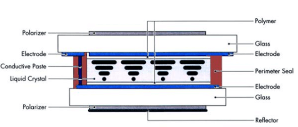
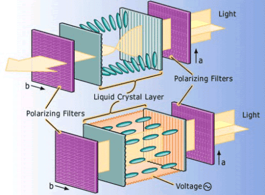

# LCD 基础知识：液晶显示器的工作原理

!!! abstract "快速结论"
    本指南解释了液晶显示器的工作原理，相关的设计权衡以及在选择显示解决方案时工程师应验证的点。

## 核心要点

- 系统了解LCD 基础知识：液晶显示器的工作原理，包括关键原理、优缺点、应用场景和工程选型要点。
- 根据下文比较相关技术、应用条件和设计取舍。
- 最终选型前，应确认光学、电气、结构、环境与量产要求。

## 液晶仪器

液晶显示器 (LCD) 是一个平板屏幕技术，通常用于电视和计算机显示器。它也用于笔记本电脑，平板电脑和智能手机等移动设备的屏幕中。

液晶显示器不仅看起来与大型CRT (Cathode Ray Tube) 显示器不同，而且它们的操作方式也显著不同。而不是向玻璃屏幕发射电子，LCD具有背光灯，为在矩形网格中排列的单个像素提供光源。每个像素都有RGB (红色，绿色和蓝色) 的子像素，可启动或关闭。当所有像素的子像 Pixel被关闭时，它会出现黑色。

当所有小像素都上100%时，它会显得白色。通过调整红色，绿色和蓝色的单个水平，可以获得数百万种颜色组合。

液晶显示器的结构

一个液晶屏幕包括一个薄层的液晶材料，在玻璃基板上的两个电极之间插入，每个侧都有两种极化器。极化仪是一种光学过器，可以让特定极化的光波通过，同时阻止其他极化物的光波。电极需要透明，所以最受欢迎的材料是ITO (Indium Tin Oxide).

由于LCD本身不能发出光线，通常在LCD屏幕后面放置后照明，以便在黑暗环境中看到。后照的光源可以是LED (光排放二极管) 或CCFL (冷天体光灯).LED后照亮最受欢迎。当然，如果你喜欢有彩色显示屏，你可以把一层颜色过器变成一个液晶面板。

### 优势

<figure markdown="span" class="displaywiki-figure">
  [{ width="760" loading="lazy" }](lcd-basics-lcd-display-structure.png){ .displaywiki-image-link title="查看原图" }
  <figcaption>液晶显示器结构</figcaption>
</figure>

- 图1液晶显示器结构

- 液晶显示器是如何工作的？

在大量生产的第一种液晶面板技术被称为TN (Twisted Nematic).LCD背后的原则是，当电场不应用于液晶分子时，液晶细胞中的分子会扭转90度。当来自环境光或后照的光通过第一个极化器时，光会被液晶分子层抛光和扭曲。当它到达第二个极化仪时，它就会被阻止。观众看到显示屏是黑色的。

- 当一个电场被应用到液晶分子上时，它们是未扭曲的。当极光达到液晶颗粒层时，光线直接通过而不会扭曲。当它达到第二个极化器时，它也会经过，观众看到显示屏很明亮。

- 由于LCD技术使用电场而不是电流 (电子通过)，因此它的功耗较低。

<figure markdown="span" class="displaywiki-figure">
  [{ width="760" loading="lazy" }](lcd-basics-how-lcds-work.png){ .displaywiki-image-link title="查看原图" }
  <figcaption>液晶显示器的工作原理</figcaption>
</figure>

- 图2 液晶显示器的工作原理

- 液晶显示器的基本原理

- 上面推出的最基本的LCD被称为被动矩阵LCD，主要可以在低端或简单应用中找到，如计算器，公用电表，早期数字钟表，警钟等。动态矩阵液晶显示器有很多局限性，比如狭窄的视角，缓慢的响应速度，淡，

为了改善缺点，科学家和工程师开发了主动矩阵LCD技术。最广泛使用的是TFT (薄膜晶体管) LCD技术。基于TFT LCD，开发了更现代化的LCD科技。最知名的是IPS (In Plane Switching) LCD. 它具有超宽的视角，优质的图像质量，快速响应，极大的对比度，减少燃烧缺陷等。

- 在LCD显示器，LCD电视，iPhone,Pad等中使用了IPS液晶显示器。三星甚至彻底改变了LED后照明以QLED (量子点) 来关闭LED在不需要光的地方产生更深的黑色。

<figure markdown="span" class="displaywiki-figure">
  [{ width="760" loading="lazy" }](lcd-basics-active-tft-color-display.png){ .displaywiki-image-link title="查看原图" }
  <figcaption>活跃的TFT颜色显示器</figcaption>
</figure>

- 图3 活跃的TFT颜色显示器

- 不同整理的LCD

- 按驱动模式进行分类：

被动和活跃矩阵显示器：被动矩阵整理的液晶显示器采用简单的电网，以便可以为液晶屏上的特定像素提供充电。一个玻璃层提供列，而另一个则通过使用清晰的导体材料 (如印 ?? - 锡氧化物) 来设计的行列。动态矩阵系统具有重大缺点，特别是响应时间是缓慢和不准确的电压控制。显示器的响应时主要指显示器更新图像的能力。

- 主动矩阵整理的LCD主要依赖于TFT (薄膜晶体管).这些晶体波器是小型交换晶体体管以及电容器，它们在玻璃基板上放置在矩阵内。当正确的行被激活时，一个电荷可以传输到准确的柱子下来，以便能够解决特定的像素，因为列交叉的所有额外的行都是关闭的，

- 按液晶模式分类：

扭曲的纳米显示器 (TN):TN (Twisted Nematic) 液晶显示器生产最频繁，可以在各行业使用不同整理的显示器。这些显示器最常被玩家使用，因为它们便宜且与其他显示器相比具有快速响应时间。这些显示器的主要缺点在于它们的质量低，以及部分对比率，视角和颜色复制。但这些设备足够用于日常操作。 STN/CSTN/FSTN/DSTN是TN整理。

- 在飞机中交换显示器 (IPS):IPS显示器被认为是最好的LCD，因为它们提供了良好的图像质量，更高的视角，充满色彩精度和差异。这些显示器主要由图形设计师使用，在一些其他应用中，LCD需要最大的潜在标准来复制图像和颜色。

- 垂直调整面板 (VA/MVA)：在扭曲的内马和平面切换面板技术中，垂直排行面板在中心任何地方落下。这些面板具有最好的视角以及与TN整理显示器相比更高质量的颜色复制功能。这些面板的响应时间很低，但它们更合理，适合日常使用。

- 该面板的结构与扭曲的形显示器相比产生更深的黑色以及更好的颜色。这些显示器与其他显示器相比较昂贵，而且响应时间缓慢和更新率低。

- 高级边缘场交换 (AFFS): AFFS液晶显示器与IPS显示器相比提供了最佳性能和广泛的颜色复制。通常，这种显示器在高度先进的环境中使用，

- 根据照明方法分类：

- 液晶显示器 (LCD) 在各种行业的电子设备中广泛使用。它们通常根据其光传输模式分为三种显示整理。主要的区别在于它们如何使用光来照亮显示屏中的像素。

- 传输：透射式显示器依赖于背光可见。对于此类显示器，从后面的显示玻璃发出的光必须通过LCD向前来照亮像素。传输LCD适合低光环境中，因为它们依赖背光是可见的。这些显示器也用于高分辨率的图像，视频和高质量的应用，这就是为什么你通常会发现具有透射式显示模式的TFT显示器。

- 反射：反射显示器依赖于明亮的环境光线来可见。在此类显示器内没有后照源；相反，光来自周围的环境中反射，使得像素可以看到。

- 变体：变体显示器结合后照和环境光反射以照亮像素，从而产生具有透射特性和反射性的显示屏。

<figure markdown="span" class="displaywiki-figure">
  [{ width="760" loading="lazy" }](lcd-basics-advantages.png){ .displaywiki-image-link title="查看原图" }
  <figcaption>优势</figcaption>
</figure>

<figure markdown="span" class="displaywiki-figure">
  [{ width="760" loading="lazy" }](lcd-basics-advantages-2.png){ .displaywiki-image-link title="查看原图" }
  <figcaption>优势</figcaption>
</figure>

- 液晶技术具有轻微，薄薄的低功耗优势，这使得墙壁电视，笔记本电脑，智能手机和板块成为可能。在进步过程中，它消除了许多显示技术的竞争。我们不再看到CRT监视器在我们的办公桌上，但任何技术都有其局限性。

- 液晶技术的响应时间很慢，特别是在低温下，视角有限，后照明是必要的。专注于LCD缺点，OLED (Organic Light Emitting Diodes) 技术被开发出来。一些高端电视和手机开始使用AMOLED

## 相关阅读

- [TFT LCD 基础知识：结构、原理与优势](tft-lcd-basics.md)
- [TFT LCD 模组的组成与结构](tft-lcd-module.md)
- [如何读懂显示屏规格参数](display-specifications.md)

!!! info "没有找到您需要的内容？"
    如果您需要更多产品、资源或技术支持，欢迎联系我们的团队：

    [**:material-archive-arrow-down: 知识库**](../../knowledge/tags.md){ .md-button .md-button--primary }
    [**:material-magnify: 产品与解决方案**](https://www.chinasunyee.com){ .md-button }
    [**:material-email: 联系技术支持**](mailto:info@chinasunyee.com){ .md-button }
