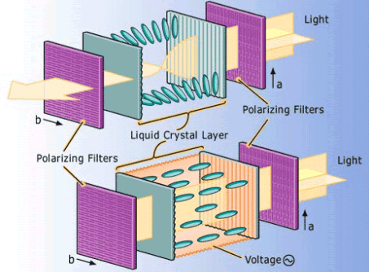
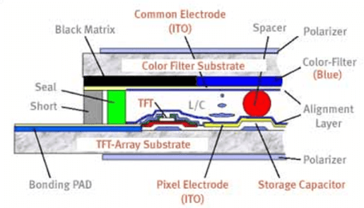
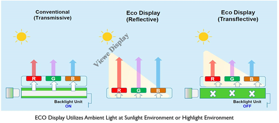

# LCD 基础知识：液晶显示器的工作原理

!!! abstract "快速结论"
    LCD 本身不发光，它是一块电控光阀：两片透振方向互相垂直的偏光片夹住一层液晶，靠电场改变液晶分子的排列来控制每个像素的明暗。理解三个层次就能完成大部分选型，即**驱动方式**（无源矩阵 / 有源矩阵）、**液晶模式**（TN / IPS / VA / AFFS）与**透光方式**（透射 / 反射 / 半透半反）。

## 核心要点

- **成像机制**：两片正交偏光片加一层电场控扭转的液晶，共同决定每个像素的明暗；颜色靠滤色片实现。
- **驱动方式**：无源矩阵结构简单，适合计算器、仪表等低端用途；有源矩阵（TFT）为每个像素配一个开关晶体管，是当今主流。
- **液晶模式**：TN 快而便宜，IPS 视角与色彩最好，VA 对比度最高，AFFS 定位高端。
- **透光方式**：透射式适合室内，反射式适合强光户外，半透半反兼顾两者，是户外工控选型的关键分叉点。

## 1. 液晶显示器是什么

液晶显示器（LCD，Liquid Crystal Display）是一种平板显示技术，早期主要用于电视与台式显示器，如今也广泛出现在笔记本电脑、平板和智能手机上。

它与 CRT（Cathode Ray Tube，阴极射线管）显示器的差别不只是外观。CRT 靠电子束轰击荧光粉发光；LCD 不发射电子，而是用一片背光做光源，再通过排列成矩形网格的像素去控制这些光的通断。

每个像素由 R、G、B 三个子像素组成，各自都可以开启或关闭。三个子像素全部关闭时，该像素呈黑色；全部开到最大时呈白色。调节三者的强度比例，就能组合出上百万种颜色。

## 2. 液晶屏的结构

一块液晶屏的核心，是一层很薄的液晶材料，夹在上下两片玻璃基板上的电极之间。玻璃外侧各贴一片偏光片，共同构成一组偏光片对。

偏光片是一种光学滤光片，只让特定偏振方向的光波通过，同时阻挡其他偏振方向的光。

电极必须透光，因此最常用的材料是 ITO（Indium Tin Oxide，铟锡氧化物）。

由于液晶本身不发光，屏后通常要放一片背光，才能在暗环境下看清画面。背光光源可以用 LED 或 CCFL（Cold Cathode Fluorescent Lamp，冷阴极荧光灯），目前 LED 背光已占据绝对主流。

如果需要彩色显示，还要在液晶盒上再叠一层滤色片。

<figure markdown="span" class="displaywiki-figure">
  [{ width="760" loading="lazy" }](lcd-basics-lcd-display-structure.png){ .displaywiki-image-link title="查看原图" }
  <figcaption>图 1 LCD 面板剖面结构：液晶层夹在上下玻璃基板之间，两侧各有一片偏光片</figcaption>
</figure>

## 3. 液晶屏如何工作

最早大规模量产的液晶面板技术是 TN（Twisted Nematic，扭曲向列）。它的原理可以概括成一句话：**用电场控制液晶分子是否扭转偏振光**。

上下两片偏光片的透振方向互相垂直。不加电压时，液晶分子自上而下自然扭转 90 度，穿过第一片偏光片的线偏振光会被同步扭转 90 度，其偏振方向正好与第二片偏光片的透振方向一致，光顺利透过，像素呈亮态。

加上电压后，液晶分子沿电场方向直立起来，不再扭转偏振光。光到达第二片偏光片时，偏振方向与其垂直，被完全阻挡，像素转为暗态。

这就是电控光阀的工作方式：**电压改变液晶分子的排列，排列决定光的通断，光的通断决定像素的明暗。**

另外，LCD 由电场驱动而非电流驱动，没有电子穿过材料，因此功耗很低。

<figure markdown="span" class="displaywiki-figure">
  [{ width="760" loading="lazy" }](lcd-basics-how-lcds-work.png){ .displaywiki-image-link title="查看原图" }
  <figcaption>图 2 TN 液晶的电控光阀原理：无电压时液晶分子扭转偏振光，加电压后分子直立阻断光线</figcaption>
</figure>

## 4. 无源矩阵与有源矩阵

上面这套最基本的结构被称为**无源矩阵**（也称被动矩阵）LCD，常见于低端或简单应用，例如计算器、电表、早期数字钟和报警器。

无源矩阵的局限很明显：视角窄、响应慢、对比度低。

为改进这些缺点，工程师开发出**有源矩阵**技术，其中应用最广的是 TFT（Thin Film Transistor，薄膜晶体管）LCD。

在 TFT LCD 的基础上，又发展出更现代的液晶技术，最知名的是 IPS（In-Plane Switching，面内切换）：视角超宽、图像质量好、响应快、对比度高，并且不易出现烧屏。

LCD 显示器、LCD 电视、iPhone、iPad 都在使用 IPS 液晶屏。三星还用 QLED（量子点）改造 LED 背光，在不需要发光的区域关断背光，以获得更深的黑色。

<figure markdown="span" class="displaywiki-figure">
  [{ width="760" loading="lazy" }](lcd-basics-active-tft-color-display.png){ .displaywiki-image-link title="查看原图" }
  <figcaption>图 3 TFT 彩色液晶面板结构：每个像素配一个薄膜晶体管与存储电容，上方叠滤色片</figcaption>
</figure>

## 5. LCD 的分类

### 5.1 按驱动方式：无源矩阵与有源矩阵

**无源矩阵**使用简单的电极网格寻址。一层玻璃提供列电极，另一层用透明导体（如 ITO）制作行电极，通过行列交叉处的电压为液晶充电。它的缺点是响应慢、电压控制不精确，容易出现交叉串扰。

**有源矩阵**为每个像素配一个 TFT 开关和一颗存储电容，它们按矩阵排布在玻璃基板上。当某一行被选中时，电荷可以沿对应的列传输到指定像素，其余各行保持关闭。每个像素因此被独立、稳定地控制，这也是 TFT LCD 能够做出高分辨率、高对比度画面的根本原因。

### 5.2 按液晶模式：TN、IPS、VA、AFFS

**TN（Twisted Nematic，扭曲向列）**：产量最大、成本最低，响应速度快，是游戏玩家的常见选择。主要缺点是画质一般，对比度、视角和色彩还原都较弱，但满足日常使用没有问题。STN、CSTN、FSTN、DSTN 都归属于 TN 类。

**IPS（In-Plane Switching，面内切换）**：综合画质最好的一类，视角宽、色彩准确，图形设计与色彩敏感场景常用。为达到较高色准，往往需要更强的背光，成本也更高。

**VA / MVA（Vertical Alignment，垂直配向）**：定位介于 TN 与 IPS 之间。对比度高、黑色更深、色彩还原优于 TN，视角也比 TN 好，但响应时间较慢、刷新率偏低，价格通常低于 IPS。

**AFFS（Advanced Fringe Field Switching，高级边缘场切换）**：在视角与色彩还原上优于 IPS，多用于要求较高的场合。

### 5.3 按透光方式：透射、反射与半透半反

LCD 按如何照亮像素分为三种，它们的差异在强光与弱光环境下最直观：

<figure markdown="span" class="displaywiki-figure">
  [{ width="760" loading="lazy" }](lcd-basics-advantages.png){ .displaywiki-image-link title="查看原图" }
  <figcaption>图 4 强光环境下透射式、反射式与半透半反的显示差异</figcaption>
</figure>

<figure markdown="span" class="displaywiki-figure">
  [{ width="760" loading="lazy" }](lcd-basics-advantages-2.png){ .displaywiki-image-link title="查看原图" }
  <figcaption>图 5 弱光环境下透射式、反射式与半透半反的显示差异</figcaption>
</figure>

**透射式（Transmissive）**：完全依赖背光。背光从屏后射出，穿过液晶层照亮像素。适合弱光或室内环境，也适合高分辨率图像、视频等高画质应用，市面上的 TFT 显示器大多是透射式。

**反射式（Reflective）**：不设背光，靠环境光反射成像。环境光越强，画面越清晰；但暗环境下无法阅读。

**半透半反（Transflective）**：兼顾两者，既透背光又反射环境光。室内用背光，强光下靠环境光，是户外工控与手持设备常用的方案。

## 6. 优势与局限

LCD 的三大优势是轻、薄、低功耗，它们让壁挂电视、笔记本电脑、智能手机和平板成为可能，也让 LCD 在演进过程中淘汰了多数竞争技术，CRT 显示器基本从办公桌上消失。

但任何技术都有边界。LCD 的响应时间偏慢，低温下尤其明显；视角有限；且必须依赖背光。

为突破这些限制，OLED（Organic Light Emitting Diode，有机发光二极管）技术被开发出来，高端电视和手机已开始采用 AMOLED。

!!! warning "量产注意"
    在量产或恶劣工况（高低温、湿热、振动、ESD）下，注意相关参数的 datasheet 曲线，超出范围会显著降低寿命。

## 7. 选型要点

把上面三层关系串起来，选型可以按这个顺序推进：

1. **先定透光方式**：室内固定场景选透射式；强光户外选反射式或半透半反。这一步对可视性影响最大，也最容易被忽略。
2. **再定液晶模式**：追求响应速度与成本选 TN；追求视角与色彩选 IPS；追求对比度与黑色纯度选 VA；高端方案看 AFFS。
3. **确认驱动方式**：分辨率高、画质要求高就必须采用有源矩阵（TFT）；只有字符型、低分辨率、极低成本场景才考虑无源矩阵。
4. **最后核对工况**：低温响应、背光寿命、湿热与振动条件，都要回到具体型号的 datasheet 曲线确认。

## 8. FAQ

??? question "Q1：LCD 和 OLED 该怎么选？"
    LCD 靠背光加液晶光阀成像，OLED 则靠像素自发光。LCD 的寿命更长、成本更低、大尺寸更容易实现，也不存在烧屏问题；OLED 对比度更高、视角更宽、可做柔性形态。工业场景长期显示固定画面时优先 LCD，追求极致黑色或柔性形态时再考虑 OLED。

??? question "Q2：TN、IPS、VA 三种液晶模式该怎么选？"
    TN 响应最快、成本最低，但视角窄、色彩一般，适合低成本与竞技游戏场景；IPS 视角最宽、色彩最准，适合多人观看或需要准确判色的场合；VA 对比度最高、黑色最深，但响应偏慢，适合看重静态画质与黑色的应用。户外或工业显示还需结合透光方式一并判断。

??? question "Q3：为什么 LCD 必须配背光，反射式屏却不用？"
    液晶只改变光的偏振态，本身并不发光。透射式靠背光提供光源，因此在暗环境下才能看清；反射式靠环境光反射成像，不需要背光，但暗环境下无法阅读。半透半反则把两者兼顾起来。

??? question "Q4：半透半反屏为什么更适合户外？"
    半透半反既透背光又反射环境光。室外强光下以环境光为主，环境越亮画面反而越清晰；夜间或室内再打开背光补光。它结合了透射式与反射式各自的优点，是户外工控与手持设备的常见选择。

??? question "Q5：TFT 和 LCD 是什么关系？"
    TFT 是 LCD 的一种驱动方式。LCD 是大类，TFT 指用薄膜晶体管为每个像素做独立开关，属于有源矩阵；与之相对的是一次一行扫描的无源矩阵 LCD。可以说 TFT LCD 就是有源矩阵液晶显示器。

??? question "Q6：LCD 在低温下为什么响应变慢？"
    液晶的黏度随温度下降而升高，分子转动变慢，灰阶切换时间随之变长，严重时会出现拖影。低温环境应用需要查看具体型号 datasheet 的低温响应曲线，必要时加装加热膜。

## 相关阅读

- [TFT LCD 基础知识：结构、原理与优势](tft-lcd-basics.md)
- [TFT LCD 模组的组成与结构](tft-lcd-module.md)
- [如何读懂显示屏规格参数](display-specifications.md)

## 参考数据来源

本文涉及的标准、规格与应用资料：

- [TFT LCD 驱动 IC 数据手册：ST7701S](../../../assets/datasheet/display/ST7701S.pdf)
- [TFT LCD 模组规格书示例（7 英寸 WVGA）](../../../assets/datasheet/display/ALL-UE070WV-RB40-A092A.pdf)

!!! info "没有找到您需要的内容？"
    如果您需要更多产品、资源或技术支持，欢迎联系我们的团队：

    [**:material-archive-arrow-down: 知识库**](../../knowledge/tags.md){ .md-button .md-button--primary }
    [**:material-magnify: 产品与解决方案**](https://www.chinasunyee.com){ .md-button }
    [**:material-email: 联系技术支持**](mailto:info@chinasunyee.com){ .md-button }
