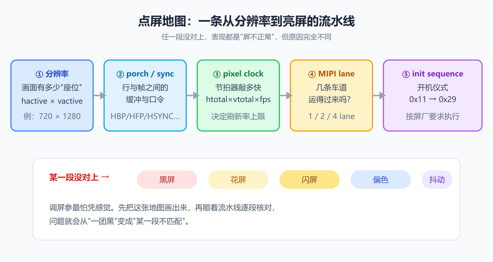
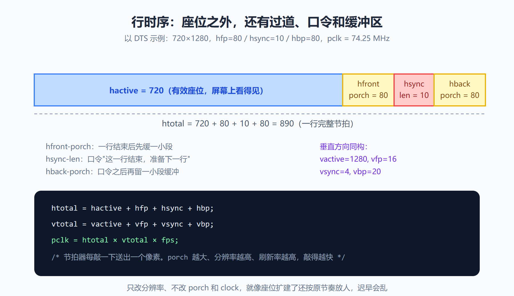
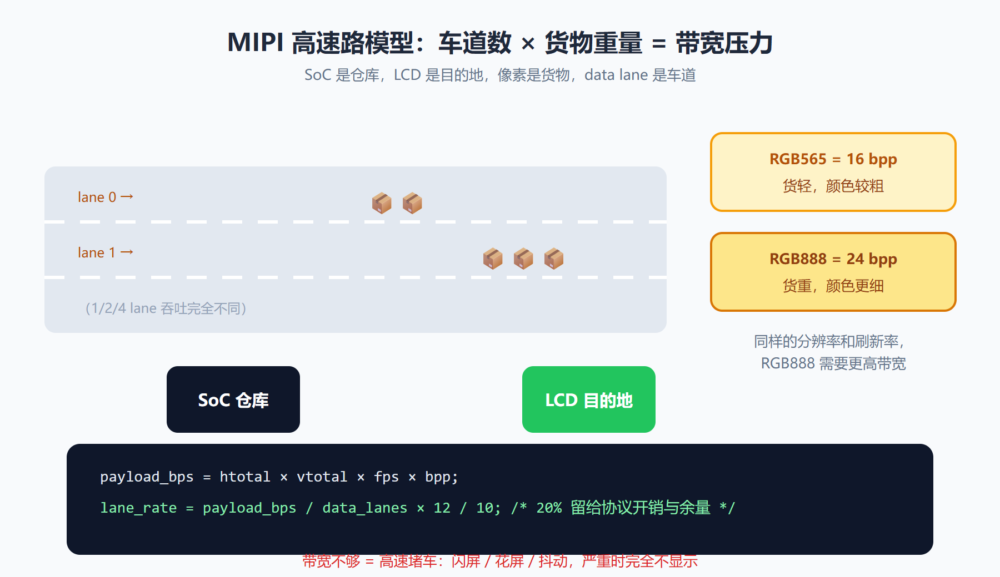
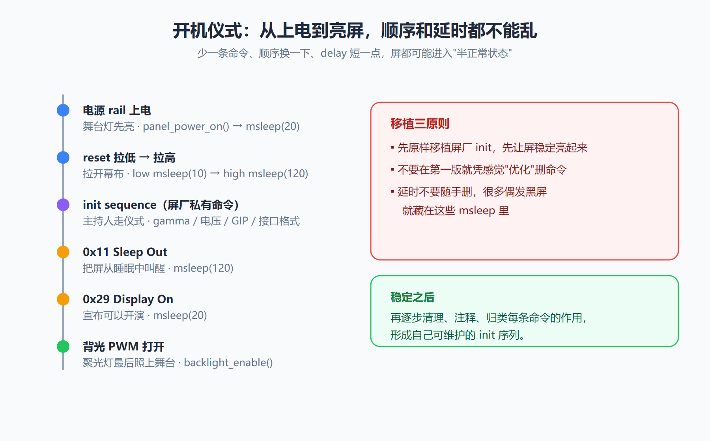
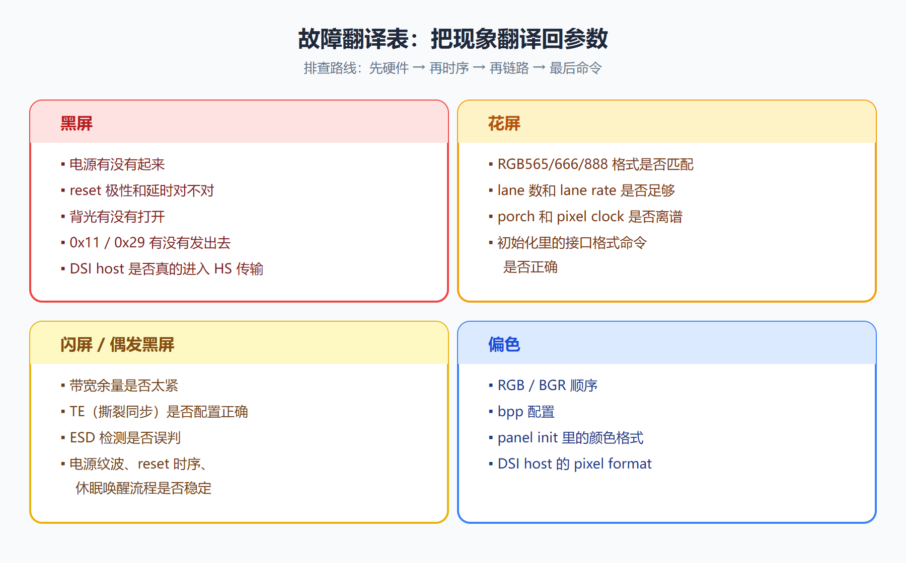
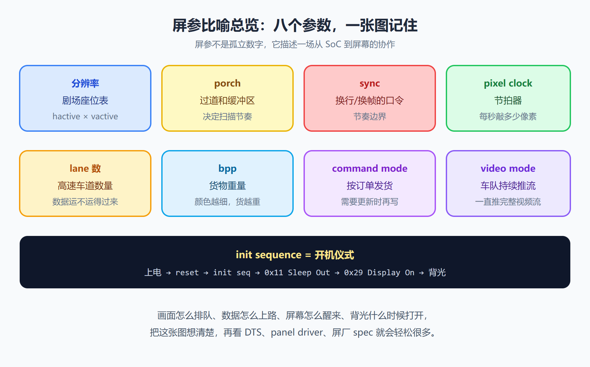

# LCD 屏参详解：把点屏参数讲成能看见的样子

!!! abstract "快速结论"
    屏参不是孤立数字：分辨率是座位表，porch 是过道，pixel clock 是节拍器，lane 是车道，bpp 是货物重量，init sequence 是开机仪式。掌握 htotal/vtotal/pclk/lane_rate 四个估算公式，再把故障现象翻译回参数，点屏调试就不是玄学。

很多人第一次看 LCD 屏参，感觉像在读一张陌生菜单：`hactive`、`vfront-porch`、`hsync-len`、`clock-frequency`、`lane-rate`、`bpp`、`init sequence`……每个词都认识一点，但放在一起就有点晕。

其实屏参没有那么玄。你可以把一块 MIPI LCD 想成一个剧场：像素是座位，时序是观众进场节奏，MIPI lane 是运送画面的高速车道，初始化命令是开演前的仪式。只要这个画面立起来，很多参数就不再是冷冰冰的字段了。

## 一、先把屏参看成一张点屏地图

一块屏能不能正常显示，不只是"分辨率对不对"。真正的点屏过程像一条流水线：

- 先决定这块屏有多少像素，也就是画面有多少"座位"。
- 再决定每行、每帧之间留多少缓冲时间，也就是 porch 和 sync。
- 然后算画面要以多快的节奏送出去，也就是 pixel clock 和刷新率。
- 接着看 MIPI DSI 有几条 data lane，能不能把这些像素按时送到屏上。
- 最后按屏厂要求发送初始化命令，让屏从休眠状态进入显示状态。

如果其中一段没对上，表现出来可能都是"屏不正常"：黑屏、花屏、闪屏、偏色、抖动、唤醒失败。但背后的原因可能完全不同。所以调屏参最怕凭感觉，最好先把地图画出来。

<figure markdown="span" class="displaywiki-figure">
  [{ width="760" loading="lazy" }](lcd-panel-timing-parameters-fig1-roadmap.png){ .displaywiki-image-link title="查看原图" }
  <figcaption>图 1 · 点屏五步流水线：分辨率 → porch/sync → pixel clock → lane 数 → init sequence，任一段错位都会表现为"屏不正常"</figcaption>
</figure>

## 二、分辨率像座位表，porch 像过道和缓冲区

先说最容易理解的分辨率。比如一块 720x1280 的屏，可以想成一个大剧场：每一行有 720 个座位，一共有 1280 行。`hactive` 就是每行真正能坐人的座位数，`vactive` 就是一共有多少排。

但剧场不可能只有座位。座位前后要有过道，换场时要有缓冲，工作人员还要知道什么时候开始下一排、什么时候进入下一幕。LCD 也是一样，active 区之外还有几段看不见但很重要的时间：

- `hfront-porch`：一行有效像素结束后，先缓一小段。
- `hsync-len`：告诉屏幕"这一行结束了，可以准备下一行"。
- `hback-porch`：同步信号之后，再留一小段缓冲。
- `vfront-porch`、`vsync-len`、`vback-porch`：同样的逻辑，只是从"换行"变成"换帧"。

所以，porch 不是多余字段。它更像画面扫描时的呼吸空间。留少了，屏幕节奏太赶；留错了，画面可能偏移、抖动、闪烁。

一个最常用的估算是：

```c
/* active 是座位，porch/sync 是过道和口令 */
htotal = hactive + hfront_porch + hsync_len + hback_porch;
vtotal = vactive + vfront_porch + vsync_len + vback_porch;
pclk_hz = htotal * vtotal * fps; /* 节拍器每秒要敲多少下 */
```

`pixel clock` 可以想成节拍器。它每敲一下，就送出一个像素节拍。分辨率越高、porch 越大、刷新率越高，这个节拍器就要敲得越快。

<figure markdown="span" class="displaywiki-figure">
  [{ width="760" loading="lazy" }](lcd-panel-timing-parameters-fig2-timing.png){ .displaywiki-image-link title="查看原图" }
  <figcaption>图 2 · 行场时序结构：hactive + hfront-porch + hsync-len + hback-porch = htotal（以 720x1280@60Hz 为例，pclk ≈ 74 MHz）</figcaption>
</figure>

在 DTS 或 DRM mode 里，字段通常会长这样：

```dts
/* 这些字段要成组看，不要只盯 hactive/vactive */
panel_timing {
    clock-frequency = <74250000>; /* 像素节拍，单位通常是 Hz */
    hactive = <720>;
    vactive = <1280>;
    hfront-porch = <80>;
    hsync-len = <10>;
    hback-porch = <80>;
    vfront-porch = <16>;
    vsync-len = <4>;
    vback-porch = <20>;
};
```

如果只改分辨率，不改 porch 和 clock，就像把剧场座位扩建了，却还按原来的入场节奏放人，迟早会乱。

## 三、MIPI lane 像高速车道，bpp 像货物重量

MIPI DSI 可以想成一条从 SoC 到屏幕的高速路。SoC 是仓库，LCD 是目的地，像素数据是一箱箱货物，data lane 就是车道。

这里有几个参数特别关键：

- `lane数`：有几条车道。1 lane、2 lane、4 lane 的吞吐能力完全不同。
- `lane rate`：每条车道跑多快。
- `bpp`：每个像素有多重。RGB565 是 16bpp，RGB888 是 24bpp。
- `command mode`：像按订单发货，需要更新时再发。
- `video mode`：像车队不停往前跑，一直推完整视频流。

RGB888 比 RGB565 颜色更细，但每个像素也更"重"。同样分辨率和刷新率下，RGB888 需要更高带宽。你可以粗略这样估：

```c
/* 像素越多、颜色越重、刷新越快，高速路压力越大 */
pixel_rate = htotal * vtotal * fps;
payload_bps = pixel_rate * bits_per_pixel;
lane_rate = payload_bps / data_lanes;
lane_rate = lane_rate * 12 / 10; /* 给协议开销和余量留空间 */
```

如果带宽不够，就像高速堵车。轻一点是闪屏、花屏、偶发抖动；严重时就是完全不显示。尤其是 4 lane 屏被配成 2 lane、RGB888 被误配成 RGB565、video mode 的 burst/non-burst 选错，都可能让你看到很迷惑的现象。

还有一个很实用的判断：低刷新率能亮，60Hz 花屏；静态画面还行，动态画面闪；低分辨率调试图能显示，真实 UI 不稳定。这类问题很多时候不是初始化命令，而是链路吞吐和时序余量。

<figure markdown="span" class="displaywiki-figure">
  [{ width="760" loading="lazy" }](lcd-panel-timing-parameters-fig3-bandwidth.png){ .displaywiki-image-link title="查看原图" }
  <figcaption>图 3 · MIPI 高速路模型：lane 数是车道、bpp 是货物重量，附 payload_bps 与 lane_rate 估算公式</figcaption>
</figure>

## 四、初始化命令像开机仪式，顺序错了就不开演

屏幕不是一上电就能显示。它更像一场演出，开场前要按顺序做准备：

- 电源 rail 上来，像舞台灯先亮。
- reset 拉低再拉高，像拉开幕布。
- 发送 init sequence，像主持人按流程走仪式。
- `0x11 Sleep Out`，像把屏幕从睡眠中叫醒。
- `0x29 Display On`，像宣布可以正式开演。
- 背光 PWM 打开，像聚光灯照到舞台上。

<figure markdown="span" class="displaywiki-figure">
  [{ width="760" loading="lazy" }](lcd-panel-timing-parameters-fig4-init.png){ .displaywiki-image-link title="查看原图" }
  <figcaption>图 4 · 点屏开机仪式：上电 → reset → init sequence → Sleep Out → Display On → 背光，每步都有对应的延时要求</figcaption>
</figure>

真实驱动里，常见流程大概是这样：

```c
/* 延时不要随手删，很多偶发黑屏就藏在这里 */
panel_power_on();
msleep(20);

panel_reset_low();
msleep(10);
panel_reset_high();
msleep(120);

mipi_dsi_dcs_write_seq(dsi, 0x11); /* Sleep Out：叫醒屏幕 */
msleep(120);

/* 这里通常还有屏厂私有 gamma、电压、GIP、接口格式命令 */
mipi_dsi_dcs_write_seq(dsi, 0x29); /* Display On：允许显示 */
msleep(20);

backlight_enable(); /* 最后再打开聚光灯 */
```

很多屏厂给的 init code 看起来像一大串十六进制命令，很难读。但移植时不要急着"优化"。有些命令控制 gamma，有些控制电源电压，有些控制扫描方向，有些控制 MIPI 接口格式。少一条、顺序变一下、delay 短一点，都可能让屏进入一个半正常状态。

工程上最稳的做法是：先原样移植屏厂初始化流程，让屏稳定亮起来；再逐步清理和注释。不要在第一版就凭感觉删命令。

## 五、出问题时，把现象翻译回参数

调屏最怕的一句话是："这个屏不亮，是不是驱动有问题？"这句话太大了。更好的方式是把现象翻译成可能的参数范围。

**黑屏** 先看：

- 电源有没有起来。
- reset 极性和延时对不对。
- 背光有没有打开。
- `0x11`、`0x29` 有没有发出去。
- DSI host 是否真的进入 HS 传输。

**花屏** 先看：

- RGB565/RGB666/RGB888 是否匹配。
- lane 数和 lane rate 是否足够。
- porch 和 pixel clock 是否离谱。
- 初始化里的接口格式命令是否正确。

**闪屏或偶发黑屏** 先看：

- 带宽余量是否太紧。
- TE 是否配置正确。
- ESD 检测是否误判。
- 电源纹波、reset 时序、休眠唤醒流程是否稳定。

**偏色** 先看：

- RGB/BGR 顺序。
- bpp 配置。
- panel init 里的颜色格式。
- DSI host 的 pixel format。

你会发现，点屏排查不是玄学。它更像顺着一条路线找断点：先硬件，再时序，再链路，最后命令。顺序对了，问题就会从"一团黑"变成"某一段不匹配"。

<figure markdown="span" class="displaywiki-figure">
  [{ width="760" loading="lazy" }](lcd-panel-timing-parameters-fig5-debug.png){ .displaywiki-image-link title="查看原图" }
  <figcaption>图 5 · 故障现象翻译表：黑屏 / 花屏 / 闪屏 / 偏色 四类现象各自对应的参数排查方向</figcaption>
</figure>

## 六、记住这几个形象比喻，屏参就不难背

最后把几个关键参数再收一下：

- 分辨率：剧场座位表，决定有多少有效像素。
- porch：座位外的过道和缓冲区，决定扫描节奏是否舒服。
- sync：换行、换帧的口令，告诉屏幕节奏边界。
- pixel clock：节拍器，每秒敲多少像素节拍。
- lane 数：高速车道数量，决定数据能不能运得过来。
- bpp：每个像素的货物重量，颜色越细，货越重。
- command/video mode：一个按订单刷新，一个持续推视频流。
- init sequence：开机仪式，顺序和延时都很重要。

所以 LCD 屏参不是一堆孤立数字，它描述的是一场从 SoC 到屏幕的协作：画面怎么排队、数据怎么上路、屏幕怎么醒来、背光什么时候打开。

把这张图想清楚，再看 DTS、panel driver、屏厂 spec，就会轻松很多。

<figure markdown="span" class="displaywiki-figure">
  [{ width="760" loading="lazy" }](lcd-panel-timing-parameters-fig6-metaphors.png){ .displaywiki-image-link title="查看原图" }
  <figcaption>图 6 · 八个屏参一张图记住：座位表 / 过道 / 口令 / 节拍器 / 车道 / 货重 / 两种模式 / 开机仪式</figcaption>
</figure>

## 七、结语

屏参不是孤立数字。一块 LCD 能不能稳定显示，是 SoC、屏驱动、链路物理层和初始化时序四个环节的协作：画面按节拍器节拍发出、走 lane 高速路送到屏、屏按开机仪式唤醒、porch 给扫描留呼吸空间。下次看到 DTS、panel driver 或屏厂 spec 里那一长串数字时，别再头大——把它们想成剧场、车道、节拍器，参数就有了画面。

## 八、常见问题

??? question "Q1：htotal 和 pclk 怎么算？"
    `htotal = hactive + hfront_porch + hsync_len + hback_porch`；`vtotal = vactive + vfront_porch + vsync_len + vback_porch`；`pclk_hz = htotal × vtotal × fps`。以 720×1280@60Hz 为例，`pclk ≈ 74 MHz`。pclk 是节拍器，敲错了节奏画面就乱。

??? question "Q2：RGB565 和 RGB888 在屏参上有什么区别？"
    颜色精度不同——RGB565 是 16bpp，RGB888 是 24bpp。同样分辨率与刷新率下，RGB888 的 payload 带宽比 RGB565 高 50%。如果 lane 数与 lane_rate 不够、或 host 端 pixel format 配置错，就会出现闪屏、花屏、颜色断层的现象。

??? question "Q3：video mode 和 command mode 怎么选？"
    video mode 持续推流，延迟低，适合动态画面（视频播放、车机、HMI）；command mode 按订单刷新，功耗低，适合静态或低刷新率屏（电子书、抄表、智能家居面板）。很多屏同时支持两种，可通过 DSI 命令切换。

??? question "Q4：init sequence 的延时能省吗？"
    不要。Sleep Out (0x11)、Display On (0x29)、reset 拉低/拉高之间的延时是屏厂按面板特性标的，删掉或缩短容易出现半亮、闪屏、ESD 误判等"灵异"现象。第一版驱动应该原样移植屏厂 init code，亮起来后再逐步清理与注释。

??? question "Q5：屏黑屏怎么快速定位？"
    按"硬件 → 时序 → 链路 → 命令"四步查：① 电源/reset/背光/0x11 0x29 是否到位；② porch 和 pixel clock 是否离谱；③ lane 数与 bpp 是否匹配，DSI host 是否真的进入 HS 传输；④ init 命令是否完整、顺序是否对。这四步过一遍，多数黑屏都能定位到具体一段。

!!! info "没有找到您需要的内容？"
    如果您需要更多产品、资源或技术支持，欢迎联系我们的团队：

    [**:material-archive-arrow-down: 知识库**](../../knowledge/tags.md){ .md-button .md-button--primary }
    [**:material-magnify: 产品与解决方案**](https://www.chinasunyee.com){ .md-button }
    [**:material-email: 联系技术支持**](mailto:info@chinasunyee.com){ .md-button }
