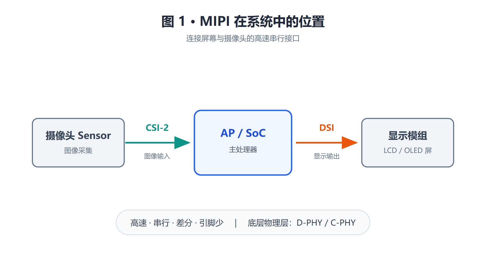
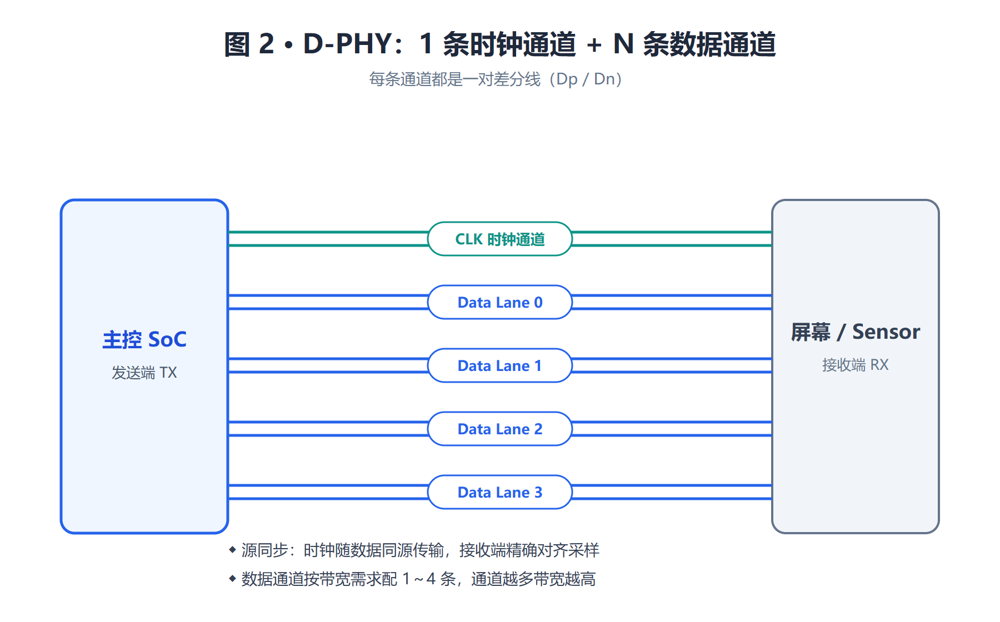
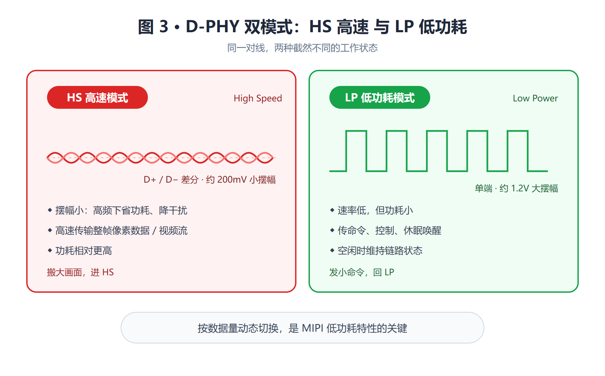
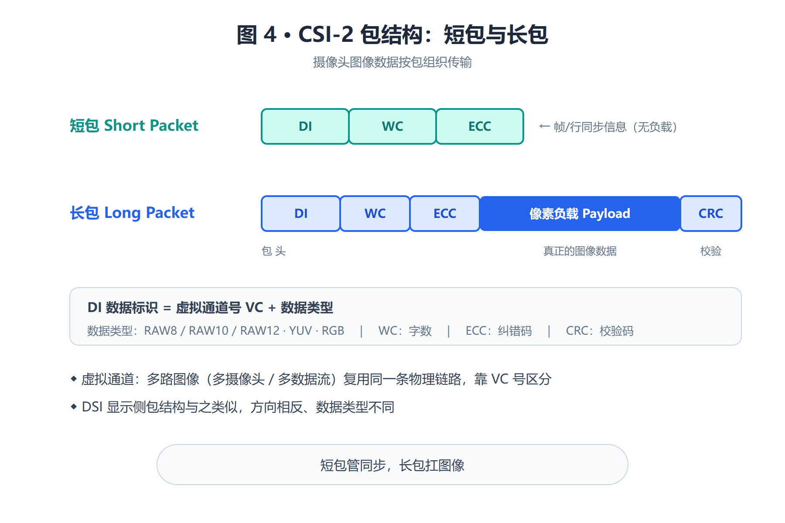
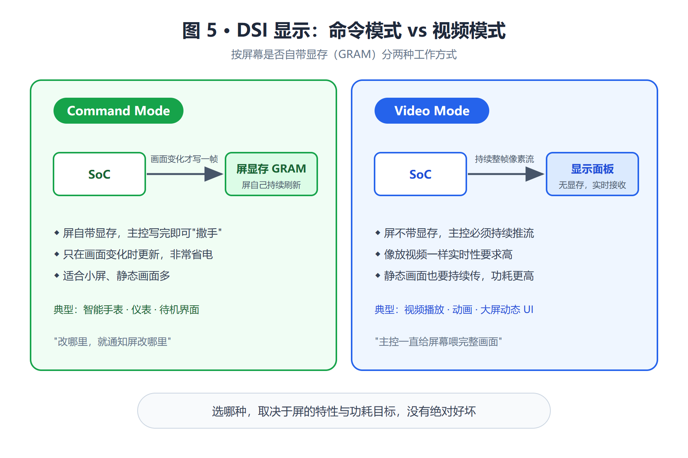
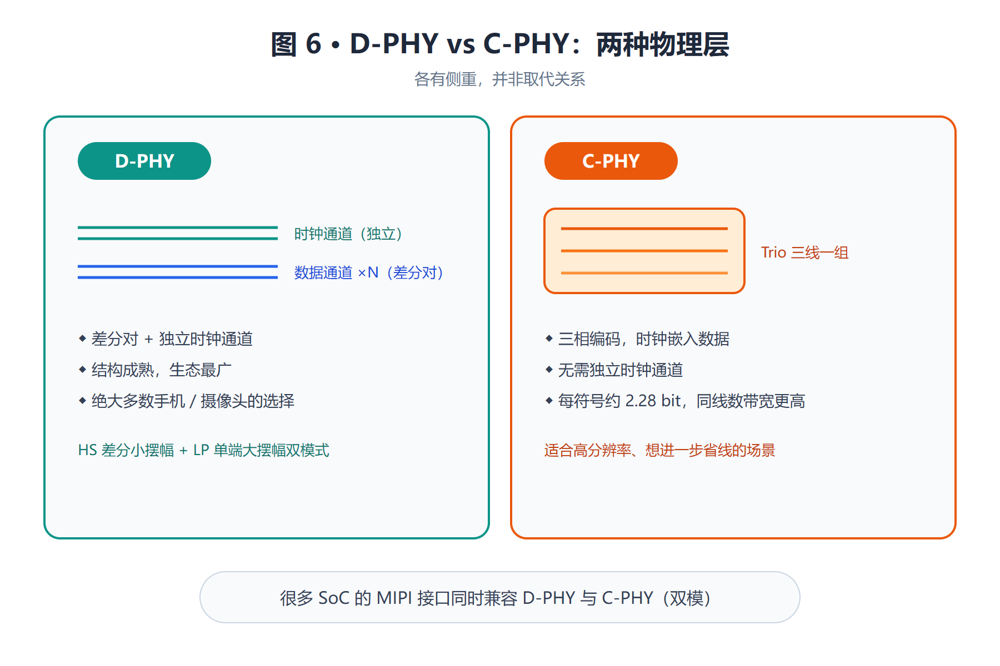

# MIPI 接口详解：DSI、CSI-2 与 D-PHY 图解

!!! abstract "快速结论"
    MIPI 用极少的差分引脚跑出惊人的带宽，是手机、平板、车机、POS 等带屏带摄像头设备的高速链路标准。本文聚焦最常用的 DSI 与 CSI-2，把 D-PHY 通道、HS/LP 双模式、包结构与 C-PHY 一次讲清。

手机、平板、车机、POS 等带屏幕和摄像头的设备，处理器和屏和摄像头之间那条高速链路，几乎都是 MIPI。它用极少的引脚跑出惊人的带宽，把高清画面和图像数据在芯片之间飞速搬运。这一期，我们聚焦最常用的 MIPI DSI 与 CSI-2，把 D-PHY 通道、HS/LP 双模式、包结构与 C-PHY 一次讲清。

## 01 MIPI 是什么：连接屏与摄像头的高速接口

MIPI 是 MIPI 联盟（Mobile Industry Processor Interface Alliance）制定的一系列接口规范，最初为手机而生，如今广泛用于各类带屏带摄像头的嵌入式设备。其中工程师最常打交道的两个是：DSI（Display Serial Interface，显示串行接口）和 CSI-2（Camera Serial Interface，摄像头串行接口）。

<figure markdown="span" class="displaywiki-figure">
  [{ width="760" loading="lazy" }](mipi-interface-basics-fig1-mipi-system.png){ .displaywiki-image-link title="查看原图" }
  <figcaption>图 1 · MIPI 在系统中的位置：摄像头经 CSI-2 接入 SoC，SoC 经 DSI 驱动显示屏模组</figcaption>
</figure>

简单说，处理器（AP/SoC）通过 DSI 把画面推给显示屏，通过 CSI-2 把摄像头采集的图像读进来。这两条接口的共同特点是：高速、串行、差分、引脚少。它们底层大多跑在同一套物理层上——D-PHY（或更高效的 C-PHY）。理解了底层 PHY 和上层包结构，就理解了 MIPI 的精髓。

## 02 D-PHY：时钟通道 + 数据通道

D-PHY 是 MIPI 应用最广的物理层。它的结构很清晰：由一条时钟通道（Clock Lane）和若干条数据通道（Data Lane）组成。

<figure markdown="span" class="displaywiki-figure">
  [{ width="760" loading="lazy" }](mipi-interface-basics-fig2-dphy-lanes.png){ .displaywiki-image-link title="查看原图" }
  <figcaption>图 2 · D-PHY 结构：1 条时钟通道 + 最多 4 条数据通道，每条通道都是一对差分线</figcaption>
</figure>

每条通道都是一对差分线。数据通道可以按带宽需求灵活配置 1 到 4 条（甚至更多），通道越多带宽越高；而专门的那条时钟通道，则为所有数据通道提供统一的同步时钟——这种"时钟随数据同源传输"的方式叫源同步，让接收端能精确地对齐采样。少量的差分线就能堆出很高的吞吐，这正是 MIPI 能在寸土寸金的手机里搬运 4K 画面的底气。

## 03 HS 与 LP：一对线两种模式

D-PHY 有个很巧妙的设计：同一对线可以在两种截然不同的模式间切换，兼顾高速与省电。

<figure markdown="span" class="displaywiki-figure">
  [{ width="760" loading="lazy" }](mipi-interface-basics-fig3-hs-lp.png){ .displaywiki-image-link title="查看原图" }
  <figcaption>图 3 · HS 与 LP 双模式对比：200mV 差分小摆幅高速传输 vs 1.2V 单端大摆幅低功耗传输</figcaption>
</figure>

高速模式（HS）用差分、小摆幅（约 200mV）的信号，以极高速率猛传像素数据——摆幅小是为了在高频下省功耗、降干扰。低功耗模式（LP）则切换成单端、大摆幅（约 1.2V）的慢速信号，用来传输命令、控制以及在空闲时维持链路——速率低但更省电。传输大块数据时进 HS，间隙和控制时回 LP，一对线就把"快"和"省"两件事都办了。这种动态切换，是 MIPI 低功耗特性的关键。

## 04 CSI-2 包结构：短包与长包

摄像头这一侧的 CSI-2，是基于数据包来组织传输的。它把数据分成两类包：

<figure markdown="span" class="displaywiki-figure">
  [{ width="760" loading="lazy" }](mipi-interface-basics-fig4-csi2-packets.png){ .displaywiki-image-link title="查看原图" }
  <figcaption>图 4 · CSI-2 包结构：短包传同步信息，长包由 DI / WC / ECC 包头 + 像素负载 + CRC 组成</figcaption>
</figure>

短包用来传同步类信息，如帧开始/结束、行开始/结束等，结构简单。长包则承载真正的像素数据：包头里有数据标识 DI（含虚拟通道号和数据类型，如 RAW8/10/12、YUV、RGB）、字数 WC 和纠错码 ECC，中间是像素负载，末尾用 CRC 校验。其中"虚拟通道"是个很实用的概念——它让多路图像（比如多个摄像头或多种数据流）能复用同一条物理链路，靠虚拟通道号区分。DSI 显示侧的包结构与之类似，只是方向相反、数据类型不同。

## 05 DSI 显示：命令模式与视频模式

显示侧的 DSI，除了传像素，还能用 DCS（显示命令集）命令去控制屏幕。按屏幕是否自带显存，DSI 工作在两种模式：

<figure markdown="span" class="displaywiki-figure">
  [{ width="760" loading="lazy" }](mipi-interface-basics-fig5-command-video.png){ .displaywiki-image-link title="查看原图" }
  <figcaption>图 5 · 命令模式 vs 视频模式：带 GRAM 的屏"变化才写"，不带显存的屏需要持续推流</figcaption>
</figure>

命令模式（Command Mode）适用于自带显存（GRAM）的屏：处理器把一帧画面写进屏的显存后就可以"撒手"，屏自己负责持续刷新，只在画面变化时才更新——非常省电，适合小屏和静态画面较多的场景（如智能手表、待机界面）。视频模式（Video Mode）则适用于不带显存的屏：处理器必须像放视频一样，持续不断地把每一帧像素流推给屏，实时性要求高，适合大屏和动态视频。选哪种模式，主要取决于屏的特性与功耗目标。

## 06 D-PHY vs C-PHY：两种物理层

除了主流的 D-PHY，MIPI 还有一种更高效的物理层 C-PHY，两者各有侧重：

<figure markdown="span" class="displaywiki-figure">
  [{ width="760" loading="lazy" }](mipi-interface-basics-fig6-dphy-cphy.png){ .displaywiki-image-link title="查看原图" }
  <figcaption>图 6 · D-PHY vs C-PHY：差分对 + 独立时钟 vs Trio 三线组、时钟嵌入数据、每符号约 2.28 bit</figcaption>
</figure>

D-PHY 用差分对加独立时钟通道，结构成熟、生态最广，是绝大多数手机和摄像头的选择。C-PHY 则把三根线编成一组（Trio），用三相编码把时钟嵌进数据里、不再需要单独的时钟通道，每个符号能携带约 2.28 个比特——这意味着在同样的线数下，C-PHY 能跑出更高的带宽，适合高分辨率、想进一步省线的场景。两者并非取代关系，很多 SoC 的 MIPI 接口同时兼容 D-PHY 和 C-PHY。

## 07 设计要点

MIPI 是高速差分接口，板级设计和走线相当讲究，几个关键点列在下面：

| 设计要点      | 说明                                                |
| --------- | ------------------------------------------------- |
| 差分阻抗      | D-PHY 各通道按差分阻抗（常 100Ω）设计，对内等长、紧耦合；C-PHY 三线组按规范控阻抗 |
| 长度匹配      | 数据通道与时钟通道之间、通道对内严格等长，控制 skew，否则高速下采样出错            |
| 走线尽量短     | MIPI 速率极高，走线要短、少过孔、避免直角与残桩；屏/摄像头排线也影响信号质量         |
| 通道数与速率    | 按分辨率/帧率估算所需带宽，选够用的数据通道数与每通道速率，留裕量                 |
| HS/LP 与终端 | 注意 HS 模式的终端匹配与共模电平；LP 走线同样需保持完整性                  |
| ESD 与排线   | 屏/摄像头接口加 ESD 防护；FPC 排线选低损耗、阻抗受控类型                 |
| 初始化时序     | DSI/CSI 上电与初始化序列（命令、时序）需严格按屏/Sensor 手册，否则点不亮或出不了图 |

## 08 结语

用几对差分线、一套巧妙的 HS/LP 双模式，MIPI 把高清画面和图像数据在芯片之间搬得又快又省。DSI 让处理器优雅地驱动屏幕，CSI-2 让摄像头的每一帧顺畅地流进系统，而 D-PHY/C-PHY 则在底层默默扛起带宽。对做带屏、带摄像头产品（从手机到车机，再到智能门口机）的工程师而言，读懂 MIPI 的通道结构、双模式、包格式与走线要点，就是让屏幕亮起来、让画面清晰起来的必修课。

## 09 常见问题

??? question "Q1：DSI 和 CSI-2 是同一套接口吗？"
    不是。DSI（Display Serial Interface）负责把画面从 SoC 推给屏幕，CSI-2（Camera Serial Interface）负责把摄像头采集的图像读进 SoC。两者方向相反、应用场景不同，但底层大多共用同一套物理层——D-PHY（或更高速的 C-PHY）。

??? question "Q2：HS 模式和 LP 模式可以同时存在吗？"
    可以。同一对 D-PHY 数据线有两种状态：HS（High-Speed）模式负责大批量像素传输，速率可达 Gbps 级；LP（Low-Power）模式用于控制命令、休眠唤醒与状态轮询，速率低、功耗低。两者通过 LP 序列触发切换。

??? question "Q3：D-PHY 和 C-PHY 能互相替代吗？"
    不是替代关系。D-PHY 用差分对 + 独立时钟通道，生态成熟、兼容性最广；C-PHY 把三根线编成一组（Trio），用三相编码把时钟嵌入数据，每符号约 2.28 bit，在同线数下能跑出更高带宽，适合高分辨率省线场景。多数 SoC 的 MIPI 接口同时兼容两者。

??? question "Q4：DSI 应该选 Command Mode 还是 Video Mode？"
    看场景。Command Mode 按订单刷新，功耗低、适合静态或低刷新率屏（电子书、智能家居面板、抄表）；Video Mode 持续推视频流，延迟低、适合动态画面（手机、车机、HMI）。很多屏同时支持两种模式，通过 DSI 命令切换。

??? question "Q5：MIPI 板级设计最容易踩哪些坑？"
    主要四点：① 差分阻抗未控 100Ω，导致信号完整性劣化；② 数据/时钟通道不等长，skew 失控，高速下采样出错；③ 走线过长、过多过孔、直角残桩，FPC 排线未控阻抗；④ 初始化序列顺序错或延时不足，引起花屏/横纹/不亮。ESD 防护与 FPC 选型也是常被忽略的细节。

!!! info "没有找到您需要的内容？"
    如果您需要更多产品、资源或技术支持，欢迎联系我们的团队：

    [**:material-archive-arrow-down: 知识库**](../../knowledge/tags.md){ .md-button .md-button--primary }
    [**:material-magnify: 产品与解决方案**](https://www.chinasunyee.com){ .md-button }
    [**:material-email: 联系技术支持**](mailto:info@chinasunyee.com){ .md-button }
