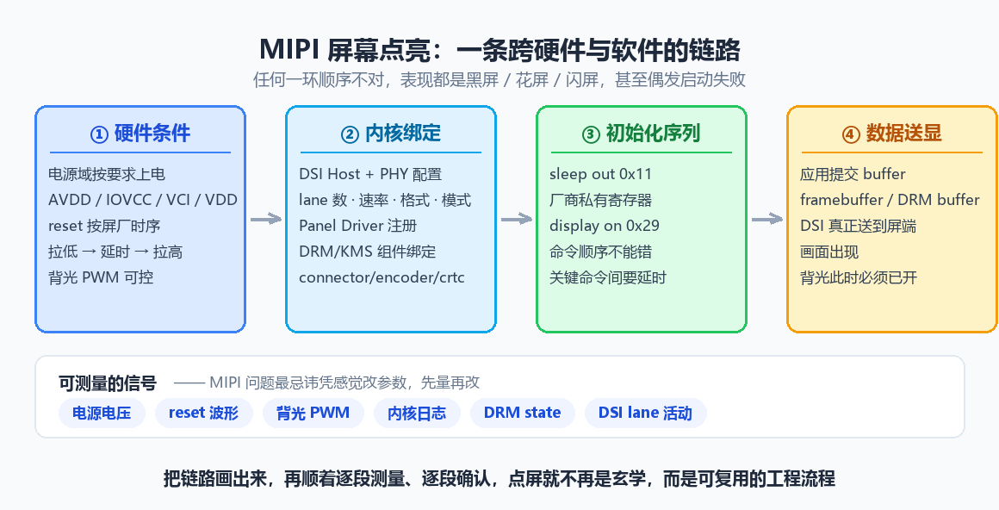
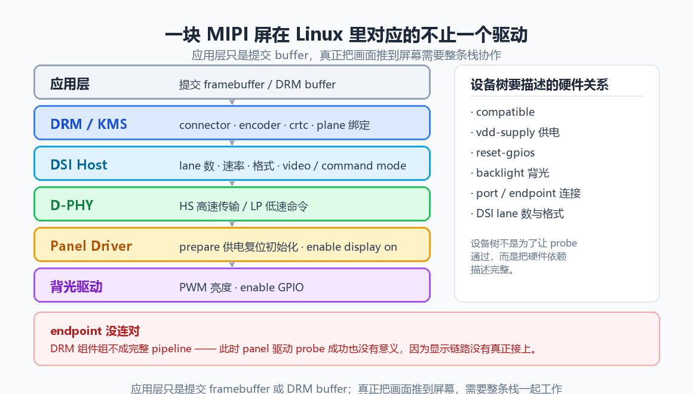
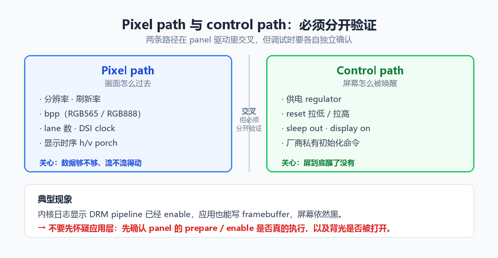
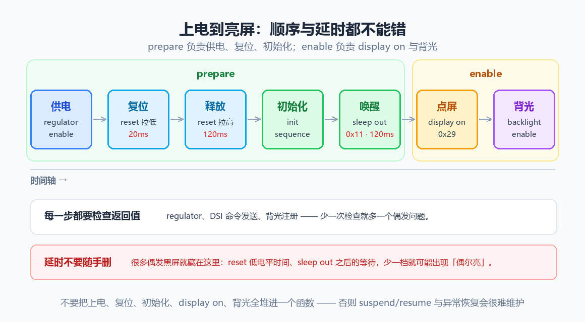
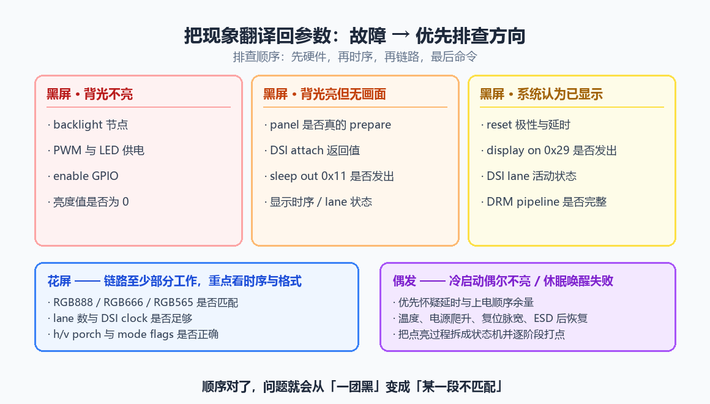
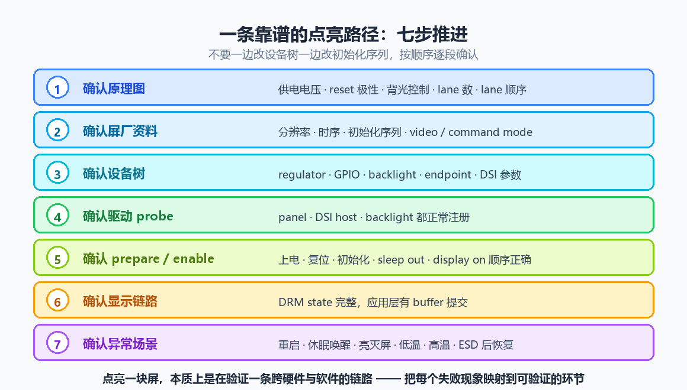

<script type="application/ld+json">
{
  "@context": "https://schema.org",
  "@type": "FAQPage",
  "mainEntity": [
    {
      "@type": "Question",
      "name": "屏幕完全不亮，第一步应该查什么？",
      "acceptedAnswer": {
        "@type": "Answer",
        "text": "先把黑屏分成三类，别急着翻驱动。第一类背光不亮，查 backlight 节点、PWM 与 LED 供电、enable GPIO、亮度值是否为 0；第二类背光亮但没有画面，查 panel 是否真的 prepare、DSI attach 返回值、sleep out 是否发出、显示时序与 lane 状态；第三类是系统认为已经显示但屏无响应，查 reset 极性与延时、display on 是否发出、DSI lane 活动状态和 DRM pipeline 是否完整。"
      }
    },
    {
      "@type": "Question",
      "name": "panel 驱动 probe 成功，是不是就说明驱动没问题？",
      "acceptedAnswer": {
        "@type": "Answer",
        "text": "不是。probe 成功只说明设备树与驱动注册没有冲突，链路有没有真正接上要另说。最典型的是 endpoint 没连对：DRM 组件组不成完整 pipeline，panel 驱动照样 probe 成功，但显示链路其实没接上。判断依据要看 DRM state 是否完整，以及 prepare、enable 是否真的被执行。"
      }
    },
    {
      "@type": "Question",
      "name": "初始化序列照抄屏厂的参考代码，为什么还是点不亮？",
      "acceptedAnswer": {
        "@type": "Answer",
        "text": "屏厂序列常来自参考平台，直接移植要核对三点。命令格式是否匹配当前驱动框架，例如 DCS command、generic write、long packet；关键命令之间是否需要延时，尤其是 reset、sleep out、display on；这块屏是 video mode 还是 command mode，要不要 burst、sync pulse、non-continuous clock。三点里错一个，就可能是偶尔亮、亮一下又灭，或者背光亮但无画面。"
      }
    },
    {
      "@type": "Question",
      "name": "出现花屏说明什么，优先查哪里？",
      "acceptedAnswer": {
        "@type": "Answer",
        "text": "花屏通常比黑屏更有价值，因为它说明链路至少部分工作了。重点看像素格式是否匹配（RGB888 / RGB666 / RGB565）、lane 数与 DSI clock 是否足够、屏幕 mode flags 以及 h/v porch 参数。RGB888 配成 RGB666、lane 数从 4 改成 2 却没调 clock、video burst mode 配错，都是常见原因。"
      }
    },
    {
      "@type": "Question",
      "name": "内核日志显示 DRM pipeline 已 enable，应用也能写 framebuffer，屏还是黑的，该怀疑应用层吗？",
      "acceptedAnswer": {
        "@type": "Answer",
        "text": "不该先怀疑应用层。这时应该先确认 panel 的 prepare、enable 是否真的执行，以及背光是否被打开。pixel path 通了不代表 control path 通了，屏可能根本没被唤醒，或者只是背光没开。把两条路径分开验证，比在应用层反复加日志有效得多。"
      }
    },
    {
      "@type": "Question",
      "name": "冷启动偶尔不亮、休眠唤醒偶发失败，该怎么定位？",
      "acceptedAnswer": {
        "@type": "Answer",
        "text": "优先怀疑时序余量与上电顺序。检查 reset 脉宽、sleep out 之后的等待、regulator 的上升时间，还要考虑温度、电源爬升、复位脉宽和 ESD 后恢复这些变量。务实做法是把点亮过程拆成状态机并在每个关键阶段打点，先确认卡在哪一段，再用示波器抓电源和 reset 波形，判断是硬件条件没满足还是软件命令没发到位。"
      }
    }
  ]
}
</script>
# MIPI 屏幕点亮全流程：从供电、复位到 DRM 送显的排查链路

!!! abstract "快速结论"
    点屏不是写对一个函数，而是把一条跨硬件与软件的链路逐段验证。任何一段顺序不对，表现都是黑屏、花屏或闪屏。

    - 链路分四段：硬件条件 → 内核绑定 → 初始化序列 → 数据送显。排查要顺着走，不要跳段猜代码。
    - pixel path 管画面怎么过去，control path 管屏怎么被唤醒，两者必须分开验证。
    - 背光亮但无画面，问题多半在初始化序列与 DSI 参数；背光不亮，先去查 PWM 与 enable GPIO。
    - probe 成功不等于链路通：endpoint 没连对时，DRM 组件组不成完整 pipeline，驱动照样 probe 成功。
    - reset 低电平时间、sleep out 后的等待、lane 数与 mode flags，是量产偶发黑屏的四大高发区。

很多屏幕点不亮的问题，最后都不是"驱动没写对"这么简单。MIPI 屏幕的点亮链路横跨电源、复位、背光、DSI Host、PHY、Panel 初始化序列、DRM/KMS 显示框架和应用层送显路径。任何一个环节顺序不对，都可能表现为黑屏、花屏、闪屏，甚至偶发启动失败。

工程上更可靠的做法，是把"点亮屏幕"拆成一条可验证的链路：先确认硬件条件，再确认内核绑定，再确认初始化序列，最后确认显示数据真的走到了屏端。

## 01 点屏不是一次函数调用：先把链路拆成四段

MIPI DSI 屏和 RGB、LVDS 屏最大的差别，是它不是把像素时钟和数据线推出去就结束。DSI 屏通常要先靠命令序列进入工作状态，然后才接收视频流或命令刷屏。也就是说，屏幕真正亮起来之前，至少要完成下面几类事情。

<figure markdown="span" class="displaywiki-figure">
  [{ width="760" loading="lazy" }](mipi-panel-bringup-fig1-chain.png){ .displaywiki-image-link title="查看原图" }
  <figcaption>图 1 · 点亮链路的四段：硬件条件 → 内核绑定 → 初始化序列 → 数据送显，每一环失败都表现为黑屏、花屏或闪屏</figcaption>
</figure>

- **硬件条件**：电源域按要求上电，包括 AVDD、IOVCC、VCI、VDD 等具体命名；reset 脚按屏厂时序拉低、延时、拉高；背光 PWM 可控。
- **内核绑定**：DSI Host 与 PHY 配置 lane 数、速率、格式、模式；Panel Driver 注册；DRM/KMS 完成 connector、encoder、crtc、plane 的绑定。
- **初始化序列**：发送 sleep out、display on 以及厂商私有寄存器命令；关键命令之间的延时不能删。
- **数据送显**：应用层提交 buffer，DSI 真正把画面送到屏端，此时背光必须已打开。

很多新手调试时容易从 panel 驱动代码开始猜，真正的排查顺序应该反过来：先用万用表、示波器和日志确认链路的基础条件，再看驱动逻辑。屏幕不亮并不等于没有像素数据，也可能只是背光没开；花屏不一定是初始化命令错，也可能是 DSI bit clock 或显示时序偏差。

## 02 先看清分层：pixel path 与 control path 要分开验证

在 Linux 系统里，一块 MIPI 屏通常不会只对应一个驱动文件。应用层只是提交 framebuffer 或 DRM buffer，真正把画面推到屏幕，需要 DRM/KMS、DSI Host、D-PHY、panel driver 和背光驱动一起工作。

<figure markdown="span" class="displaywiki-figure">
  [{ width="760" loading="lazy" }](mipi-panel-bringup-fig2-driver-stack.png){ .displaywiki-image-link title="查看原图" }
  <figcaption>图 2 · 一块 MIPI 屏在 Linux 里对应的不止一个驱动，任一层没接上，画面都到不了屏</figcaption>
</figure>

**pixel path 与 control path 要分开理解**。Pixel path 负责"画面怎么过去"，关心分辨率、刷新率、bpp、lane 数、DSI clock；control path 负责"屏幕怎么被唤醒"，关心供电、reset、sleep out、display on、厂商私有初始化命令。

<figure markdown="span" class="displaywiki-figure">
  [{ width="760" loading="lazy" }](mipi-panel-bringup-fig3-two-paths.png){ .displaywiki-image-link title="查看原图" }
  <figcaption>图 3 · pixel path 管画面怎么过去，control path 管屏怎么被唤醒，两者在驱动里交叉但必须各自确认</figcaption>
</figure>

这两个路径经常交叉，但调试时必须分开验证。一个典型现象是：内核日志显示 DRM pipeline 已经 enable，应用也能写 framebuffer，但屏幕依然黑。这时不要急着怀疑应用层，应该先确认 panel 的 prepare、enable 是否真的执行，以及背光是否被打开。

**时序参数不是只给显示框架看的**。常见 panel 参数包括 hactive、vactive、hsync、hbp、hfp、vsync、vbp、vfp、refresh rate，它们最终会影响 DSI 带宽和屏幕接收时序。参数抄错后，有些屏完全不显示，有些屏会出现边缘抖动、颜色异常或偶发花屏。

一个简化的 DSI 带宽估算可以这样理解：

```c
unsigned long calc_dsi_bitrate(unsigned int htotal,
                               unsigned int vtotal,
                               unsigned int fps,
                               unsigned int bpp,
                               unsigned int lanes)
{
    unsigned long pixel_rate = htotal * vtotal * fps;  /* 计算总像素时钟 */
    unsigned long raw_rate = pixel_rate * bpp;         /* 计算未分摊的数据带宽 */

    return raw_rate / lanes;                           /* 平均到每条 lane */
}
```

实际芯片还会考虑 blanking、burst 模式、PHY 限制和厂商补偿参数，但这个估算能帮你快速判断 lane 数和速率是否离谱。

## 03 驱动实现的核心是顺序和绑定

MIPI 屏驱动最怕"看起来都写了，但执行顺序错了"。例如 regulator 没开就拉 reset，reset 后延时不够就发 DCS 命令，DSI attach 失败却没有检查返回值，背光驱动节点没绑定却误以为 panel 没点亮。

### 3.1 设备树先描述清楚硬件关系

设备树不是为了让驱动 probe 通过，而是要把硬件依赖描述完整。一个 panel 节点至少要表达 compatible、供电、reset-gpios、backlight、端口连接关系，以及 DSI Host 所需的 lane 数和格式。

```dts
panel@0 {
    compatible = "vendor,example-mipi-panel";
    reg = <0>;
    reset-gpios = <&gpio3 12 GPIO_ACTIVE_LOW>;
    backlight = <&backlight>;
    vdd-supply = <&vcc_lcd>;

    port {
        panel_in: endpoint {
            remote-endpoint = <&dsi_out>;  /* 连接到 DSI Host 输出端 */
        };
    };
};
```

如果 endpoint 没连对，DRM 组件可能无法组成完整 pipeline。此时 panel 驱动 probe 成功也没有意义，因为显示链路没有真正接上。

### 3.2 prepare 与 enable 各司其职

在 DRM panel 模型里，prepare 通常负责供电、复位、初始化命令；enable 通常负责 display on 和背光打开。不要把所有动作都堆进一个函数，否则 suspend/resume、亮灭屏和异常恢复会非常难维护。

```c
static int example_panel_prepare(struct drm_panel *panel)
{
    struct example_panel *ctx = to_example_panel(panel);

    regulator_enable(ctx->vdd);              /* 打开屏幕供电 */
    gpiod_set_value(ctx->reset, 1);          /* 进入复位状态 */
    msleep(20);                              /* 满足屏厂 reset 低电平时间 */
    gpiod_set_value(ctx->reset, 0);          /* 释放复位 */
    msleep(120);                             /* 等待屏幕内部电路稳定 */

    example_send_init_sequence(ctx);         /* 发送厂商初始化命令 */
    mipi_dsi_dcs_exit_sleep_mode(ctx->dsi);  /* 退出睡眠模式 */
    msleep(120);                             /* sleep out 后必须等待 */

    return 0;
}
```

<figure markdown="span" class="displaywiki-figure">
  [{ width="760" loading="lazy" }](mipi-panel-bringup-fig4-order.png){ .displaywiki-image-link title="查看原图" }
  <figcaption>图 4 · 上电到亮屏的顺序与延时：prepare 负责供电、复位、初始化，enable 负责 display on 与背光</figcaption>
</figure>

这段逻辑的关键不在 API 名称，而在顺序、延时和错误处理。真实项目里每一步都应该检查返回值，尤其是 regulator、DSI 命令发送和背光注册。

### 3.3 初始化序列不要盲目照抄

屏厂给的初始化序列经常来自参考平台，里面可能混入了特定 SoC、特定 PCB 或特定 gamma 参数。移植时要关注三点。

- **命令格式是否匹配当前驱动框架**，例如 DCS command、generic write、long packet。
- **关键命令之间是否需要延时**，尤其是 reset、sleep out、display on。
- **当前屏是 video mode 还是 command mode**，是否需要 burst、sync pulse、non-continuous clock。

只要其中一个细节错了，就可能出现"偶尔亮""亮一下又灭""背光亮但无画面"等现象。

## 04 调试要从可测量信号开始

MIPI 问题最忌讳凭感觉改参数。可测量的信号包括电源电压、reset 波形、背光 PWM、内核日志、DRM 状态、DSI lane 活动状态。排查时建议从低成本、高确定性的检查开始。

<figure markdown="span" class="displaywiki-figure">
  [{ width="760" loading="lazy" }](mipi-panel-bringup-fig5-debug.png){ .displaywiki-image-link title="查看原图" }
  <figcaption>图 5 · 把现象翻译回参数：黑屏分三类，花屏看时序与格式，偶发问题怀疑时序余量</figcaption>
</figure>

### 4.1 黑屏先分三类

黑屏不代表同一种故障，至少要分成三类处理。

- **背光不亮**：优先查 backlight 节点、PWM 与 LED 供电、enable GPIO、亮度值是否为 0。
- **背光亮但无画面**：优先查 panel 是否真的 prepare、DSI attach 返回值、sleep out 是否发出、显示时序与 lane 状态。
- **系统认为已显示但屏无响应**：优先查 reset 极性与延时、display on 是否发出、DSI lane 活动状态、DRM pipeline 是否完整。

常用命令可以快速确认 DRM 和日志状态：

```bash
dmesg | grep -Ei "drm|dsi|panel|backlight"  # 过滤显示相关日志
cat /sys/kernel/debug/dri/0/state            # 查看 DRM pipeline 状态
cat /sys/class/backlight/*/brightness        # 确认背光亮度值
```

如果 debugfs 没挂载，需要先挂载：

```bash
mount -t debugfs none /sys/kernel/debug     # 启用内核调试文件系统
```

### 4.2 花屏多半要回到时序和格式

花屏通常比黑屏更有价值，因为它说明链路至少部分工作了。此时重点看像素格式（RGB888 / RGB666 / RGB565 是否匹配）、lane 数与 DSI clock 是否足够、屏幕 mode flags、h/v porch 参数。

RGB888 写成 RGB666、lane 数从 4 改成 2 但 clock 没调整、video burst mode 配错，都会导致画面异常。

### 4.3 偶发问题优先怀疑时序余量

如果屏幕冷启动偶尔不亮、休眠唤醒偶发失败，优先检查延时和上电顺序。量产项目里，偶发问题往往比稳定复现的问题更危险，因为它可能和温度、电源爬升、复位脉宽、ESD 后恢复有关。

一个实用策略是把点亮过程拆成状态机，并在每个关键阶段打点：

```c
enum panel_stage {
    STAGE_POWER_ON,
    STAGE_RESET_DONE,
    STAGE_INIT_SENT,
    STAGE_SLEEP_OUT,
    STAGE_DISPLAY_ON,
};

static void panel_trace(enum panel_stage stage)
{
    pr_info("panel stage=%d\n", stage);  /* 记录屏幕点亮阶段，便于定位卡点 */
}
```

有了阶段日志，再结合示波器抓电源和 reset，就能判断问题是硬件条件没满足，还是软件命令没发到位。

## 05 一条靠谱的点亮路径

实际项目里，建议按下面的顺序推进，而不是一边改设备树一边改初始化序列。

<figure markdown="span" class="displaywiki-figure">
  [{ width="760" loading="lazy" }](mipi-panel-bringup-fig6-roadmap.png){ .displaywiki-image-link title="查看原图" }
  <figcaption>图 6 · 一条靠谱的点亮路径：七步推进，按顺序逐段确认，不要跳步</figcaption>
</figure>

1. **确认原理图**：供电电压、reset 极性、背光控制、lane 数、lane 顺序。
2. **确认屏厂资料**：分辨率、时序、初始化序列、video / command mode。
3. **确认设备树**：regulator、GPIO、backlight、endpoint、DSI 参数。
4. **确认驱动 probe**：panel、DSI host、backlight 都正常注册。
5. **确认 prepare / enable**：上电、复位、初始化、sleep out、display on 顺序正确。
6. **确认显示链路**：DRM state 完整，应用层有 buffer 提交。
7. **确认异常场景**：重启、休眠唤醒、亮灭屏、低温、高温、ESD 后恢复。

顺序对了，问题就会从"一团黑"变成"某一段不匹配"。这一步的收益往往比多改十次参数都大。

## 06 结语

点亮一块 MIPI 屏幕，本质上是在验证一条跨硬件和软件的链路。真正成熟的工程方法，不是记住某个 panel 驱动怎么写，而是能把每个失败现象映射到可验证的环节：电源、复位、背光、初始化命令、DSI 参数、DRM 绑定和应用送显。

当你能把这条链路拆开、逐段测量、逐段确认，MIPI 屏幕点亮就不再是玄学，而是一个可以稳定复用的工程流程。

## 07 常见问题

??? question "Q1：屏幕完全不亮，第一步应该查什么？"
    先把黑屏分成三类，别急着翻驱动。第一类背光不亮，查 backlight 节点、PWM 与 LED 供电、enable GPIO、亮度值是否为 0；第二类背光亮但没有画面，查 panel 是否真的 prepare、DSI attach 返回值、sleep out 是否发出、显示时序与 lane 状态；第三类是系统认为已经显示但屏无响应，查 reset 极性与延时、display on 是否发出、DSI lane 活动状态和 DRM pipeline 是否完整。

??? question "Q2：panel 驱动 probe 成功，是不是就说明驱动没问题？"
    不是。probe 成功只说明设备树与驱动注册没有冲突，链路有没有真正接上要另说。最典型的是 endpoint 没连对：DRM 组件组不成完整 pipeline，panel 驱动照样 probe 成功，但显示链路其实没接上。判断依据要看 DRM state 是否完整，以及 prepare、enable 是否真的被执行。

??? question "Q3：初始化序列照抄屏厂的参考代码，为什么还是点不亮？"
    屏厂序列常来自参考平台，直接移植要核对三点。命令格式是否匹配当前驱动框架，例如 DCS command、generic write、long packet；关键命令之间是否需要延时，尤其是 reset、sleep out、display on；这块屏是 video mode 还是 command mode，要不要 burst、sync pulse、non-continuous clock。三点里错一个，就可能是偶尔亮、亮一下又灭，或者背光亮但无画面。

??? question "Q4：出现花屏说明什么，优先查哪里？"
    花屏通常比黑屏更有价值，因为它说明链路至少部分工作了。重点看像素格式是否匹配（RGB888 / RGB666 / RGB565）、lane 数与 DSI clock 是否足够、屏幕 mode flags 以及 h/v porch 参数。RGB888 配成 RGB666、lane 数从 4 改成 2 却没调 clock、video burst mode 配错，都是常见原因。

??? question "Q5：内核日志显示 DRM pipeline 已 enable，应用也能写 framebuffer，屏还是黑的，该怀疑应用层吗？"
    不该先怀疑应用层。这时应该先确认 panel 的 prepare、enable 是否真的执行，以及背光是否被打开。pixel path 通了不代表 control path 通了，屏可能根本没被唤醒，或者只是背光没开。把两条路径分开验证，比在应用层反复加日志有效得多。

??? question "Q6：冷启动偶尔不亮、休眠唤醒偶发失败，该怎么定位？"
    优先怀疑时序余量与上电顺序。检查 reset 脉宽、sleep out 之后的等待、regulator 的上升时间，还要考虑温度、电源爬升、复位脉宽和 ESD 后恢复这些变量。务实做法是把点亮过程拆成状态机并在每个关键阶段打点，先确认卡在哪一段，再用示波器抓电源和 reset 波形，判断是硬件条件没满足还是软件命令没发到位。

👉 **[探索 优奕视界 MIPI DSI 显示屏](https://www.chinasunyee.com/yjxspdrcmzc.htm)**

## 相关阅读

- [MIPI 接口详解：DSI、CSI-2 与 D-PHY 图解](mipi-interface-basics.md)
- [DSI 视频模式与命令模式：从 GRAM、TE 到点屏配置](dsi-video-mode-vs-command-mode.md)
- [LCD 屏参详解：把点屏参数讲成能看见的样子](lcd-panel-timing-parameters.md)
- [显示接口详解：MCU、RGB 并行、LVDS、MIPI、SPI、UART 等](display-interface-guide.md)

## 参考数据来源

本文涉及的标准、规格与资料：

- [MIPI DSI 规范（MIPI Alliance）](https://www.mipi.org/specifications/dsi)
- [MIPI D-PHY 规范（MIPI Alliance）](https://www.mipi.org/specifications/d-phy)
- [Linux DRM KMS helper 文档（含 MIPI DSI 子系统）](https://docs.kernel.org/gpu/drm-kms-helpers.html)
- [Linux 内核 MIPI DSI mode flags 定义](https://elixir.bootlin.com/linux/latest/source/include/drm/drm_mipi_dsi.h)

!!! info "没有找到您需要的内容？"
    如果您需要更多产品、资源或技术支持，欢迎联系我们的团队：

    [**:material-archive-arrow-down: 知识库**](../../knowledge/tags.md){ .md-button .md-button--primary }
    [**:material-magnify: 产品与解决方案**](https://www.chinasunyee.com){ .md-button }
    [**:material-email: 联系技术支持**](mailto:info@chinasunyee.com){ .md-button }
