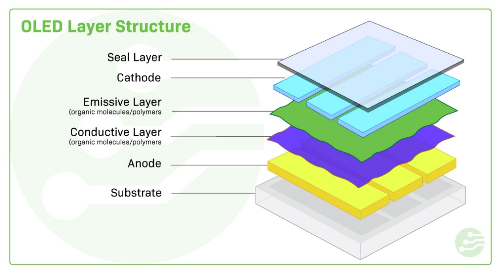
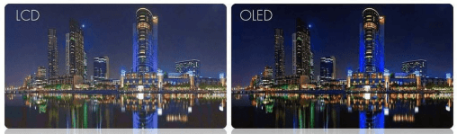
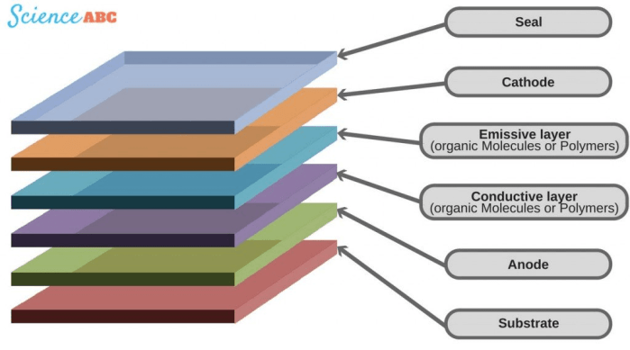

# OLED 显示结构、工作原理及与 LCD 的对比

!!! abstract "快速结论"
    本指南解释了OLED显示器的工作原理,相关的设计权衡以及在选择显示解决方案时工程师应验证的点.

## 核心要点

- 系统了解OLED 显示结构、工作原理及与 LCD 的对比，包括关键原理、优缺点、应用场景和工程选型要点。
- 根据下文比较相关技术、应用条件和设计取舍。
- 最终选型前，应确认光学、电气、结构、环境与量产要求。

## 电源:

由于其有机材料,OLED (Organic Light Emitting Diode) 显示器自发照明, 这使得电力消耗降低,对比较好,黑色更深,颜色更生动,OLED显著地薄于标准的背光LCD 模组.

### OLED 层结构

OLED显示器的主要组成部分是阴极,极,排放层和导电层.阴极和阴极位于玻璃顶板 (密封) 和玻璃底板 (基板) 之间.

<figure markdown="span" class="displaywiki-figure">
  [{ width="760" loading="lazy" }](oled-display-basics-the-oled-layer-structure.jpeg){ .displaywiki-image-link title="查看原图" }
  <figcaption>OLED 层结构</figcaption>
</figure>

OLED采用一种称为电解光的技术,该技术是材料对电流的流动发出光.当将电流应用于两个导体时,有机物质产生明亮的电解灯光. 当能量从负载的阴极层转移到阳极层时,它会刺激它们之间的有机材料,

<figure markdown="span" class="displaywiki-figure">
  [{ width="760" loading="lazy" }](oled-display-basics-electrical-current-flows-from-the-cathode-to-the-anode-through-the-org.jpeg){ .displaywiki-image-link title="查看原图" }
  <figcaption>通过有机层从阴极到极的电流流</figcaption>
</figure>

随着电力从阴极开始流向阳极,阴极获得电子,而阳极失去电子,导致从导体层中移除电子 (电子孔).

电子在发射和导电层之间的边缘遇到电子洞,导致电子重新结合并以光子的形式释放其额外能量.

### OLED与LCD

OLED与LCD相比具有更好的图像质量,对比度,视角,颜色精度,灵活性和功率效率.OLED提供了更好的颜色对比,因为它可以产生纯黑色,而不同于LCD显示器.LCD只能使用背光照明. 背景照明是放一个灯在设备后面以显示图像.由于这种背景照亮始终开启,LCD永远无法像OLED一样获得全黑色. OLED可以显示更深层次和更真实的黑色水平.

<figure markdown="span" class="displaywiki-figure">
  [{ width="760" loading="lazy" }](oled-display-basics-lcd-and-oled-comparison.png){ .displaywiki-image-link title="查看原图" }
  <figcaption>LCD 和 OLED 的比较</figcaption>
</figure>

图3 LCD 和 OLED 的比较

由于LED背光,OLED的功耗低于LCD. OLED仅在通过电流时发出光线,因此如果没有电流,绝对没有光线.OLED也可以将图片像像素的亮度变化为像素. 由于背光的限制,液晶显示器最好只能通过小区域淡屏幕.这是因为唯一可以淡图片的方式是减少背光亮度,并且不可能为每一个像素设置背光.

 OLED 的其他好处包括由于缺乏背光,更快的刷新率和更快响应时间而排放的较少蓝光.

尽管其质量更好,但OLED设备往往具有更高的价格标签.这就是为什么OLED目前仅是高端移动设备和电视的主要选择.LCD显示屏便宜,LCD电视几乎具有相同的图像质量. 在未来,OLED产品的价格可能会下降,但并没有显示出即将发生的迹象.LCD面板具有更高的最大亮度的额外优势,使其更适合明亮的空间或直接阳光的地方. OLED的另一个缺点是燃烧风险. 烧进是即使图片已被改变后,图像的影子也会永久留在屏幕上.由于该区域中的像素过度使用,使它们不像以前那么明亮.然而,仅发生在一天长达八小时观看同一频道之后. 在大多数情况下,后视图会很快消失.

值得提及的 OLED 的另一个竞争对手是QD-LED或量子点显示器.

哪些设备有OLED屏幕?

三星一直在生产OLED智能手机.三星Galaxies以其高分辨率OLED屏幕而闻名.高端的果智能 手机也有OLED显示屏.索尼,帕纳索尼和LG制造超高清 (UHD) OLED电视. LG Display是这些其他公司在设备上使用的 OLED 面板的最大制造商之一.所有这些公司也开始生产像电视这样的滚动设备.

我应该从OLED图像中预期什么?

你应该期望高颜色对比和更广泛的视角.OLED显示屏的真正黑色使其他颜色更加突出. OLED也与液晶显示器相比较在更宽的视角度失去了更少的颜色對比.LCD最好从中心看,随着角度增加而迅速失去颜色的对比. OLED技术也在快速进步.OLED现在比以前更广泛的颜色范围 (选择颜色),以及更高的HDR和更快的响应时间.

我应该买一个OLED设备吗?

是的.如果价格较高不是问题,请每次选择OLED.颜色对比度,灵活性和功率效率是LCD显示器无与伦比的.OLED具有真正的黑色,而且比其他显示器要薄得多,因为不需要背光.  OLED 的图像质量真的无与伦比.

### OLED是如何工作的?

OLED代表有机发光二极管 (OLED).它也被称为有机电解透二极码 (EL).OLED是电视,智能手机和笔记本电脑的相对新型显示器.在1987年发明后,OLED已经成为行业两大显示技术之一. 这种显示技术使用有机 (含碳) 化合物,当电流通过它时会发出光.与LCD (液晶显示器) 不一样,在白色光源之前使用RGB (红,绿,蓝) 颜色过器来产生全彩色,OLED显示器使用OLED发射器来生成自己的光.

有许多不同整理的OLED技术.最常见的 OLED整理是AMOLED或活矩阵OLED,这是OLED电视屏幕和手机的主要整理. AMOLED使用薄膜晶体管 (TFT) 作为半导体,使显示器更高效. 还有被动矩阵OLED (PMOLED),没有薄膜晶体管. PMOLED更容易制造,但不像AMOLED一样节能.还有一些PLED,它们是聚合物光发射二极管或PLED以及量子点 OLED (QD-OLED). 这些QD-OLED使用量子点,纳米晶体也发出光线,以及传统 OLED材料.

有机 OLED 有什么特点?

在这种情况下,有机指其化学定义:由碳链或环子和其他元素组成的分子.这些有机分子具有电解光,这意味着它们在应对电流时发光.

一个LED是如何工作的?

LED代表光发射二极管.这指在电流的情况下发出光的两个电极的任何系统.电极具有相反的电荷.正充电的电极被称为天极,而负充电极则是阳极. 在电极之间是有机层.因此,当电子从阴极进入安极时产生电流时,它们通过了有机材料,然后发出彩色光.

 OLED 的零部件

OLED面板由六层组成.大部分外层都是密封和底层.这些都由塑料或玻璃制成.底层是OLED的基础,密封保护了外部.在两层之间有天极和极. 在真心中,有机分子的两个层是发射层和导电层.

<figure markdown="span" class="displaywiki-figure">
  [{ width="760" loading="lazy" }](oled-display-basics-how-does-an-oled-display-work.png){ .displaywiki-image-link title="查看原图" }
  <figcaption>OLED显示器是如何工作的?</figcaption>
</figure>

OLED 像LED一样工作,但它使用有机分子而不是其他半导体来产生光.通过发射和导电层产生彩色光线,从阴极流向阳极.主要OLED材料是黄色和蓝色. 然后使用颜色过器来制作其余的颜色.

OLED的优势

OLED显示器技术具有极高的图像质量和广的视角.这就是为什么它被用于最新和最高级的果手机等高端产品中.由于OLED显示屏中的每个像素可以单独控制,OLED屏幕具有更高分辨率. 此外,OLED没有背光,因此其功耗也低于LCD.它们也是节能显示器,因为而不是一直放上背光的电源,只有在启动像素时才会发出能量. 背光限制设计师只使用平面显示屏.OLED发出了自己的光线,因此其设备可以滚动或折叠.

除此之外,OLED还比LCD更快的响应时间,使其非常适合游戏和虚拟现实.如果每天使用6小时,它们的寿命约为22年. 现在OLED的颜色范围比以前更大,以及高分辨率 (High Contrast Ratio).

OLED真的比LCD更好吗?

自古天线管 (CRT) 过时以来,LCD和OLED已成为最大的显示技术.然而,OLED与LCD相比具有更高的颜色对比度,视角,灵活性,刷新率和功耗效率. 由于LCD只能在设备背后放灯以显示图像时使用背光照明,因此它们永远无法像OLED一样获得全黑色. OLED可以显示更深层次和更真实的黑色水平. 由于背光的限制,液晶显示屏最好只能通过小区域低屏幕亮度. OLED仅在电流经过时发出光,因此如果没有电流,绝对没有光. 这是因为图像淡的唯一方法是减少后照明的亮度,并且不可能为每个像素提供后照.OLED的另一个好处是,由于没有背光,相比LCD发射的蓝色光量更少.

OLED显示器有哪些好处?

OLED显示屏的主要优势是高颜色对比,更广泛的视角和灵活性.OLED显示器的真正黑色使其他颜色更加脱而出. OLED也与LCD相比较在更宽的视角度失去了更少的颜色差别.LCD只会在前面观看时具有高颜值差异. OLED显著比其他显示器薄得多,因为它们不需要背光.背光的缺乏也允许它们在曲面上制造,因此可滚动和折叠设备成为可能.

OLED与LED有什么不同?

OLED使用有机材料发射光,而LED则使用其他复合半导体.OLED也可以自行制造设备,而 LED只能作为液晶显示器的后照.

OLED屏幕对眼睛有害吗?

OLED屏幕比LCD等其他设备更适合眼睛,因为它们发射了较少的蓝光.其他显示器的后照明发出大量的蓝色光.OLED与LCD显示器相比有很少的藍光 (34%) (65%).

## 结论

OLED的颜色对比,灵活性和功耗效率与液晶显示屏无比.OLED具有真正的黑色,并且比其他显示器薄得多,因为不需要背光.它也可以变成折叠或滚动设备,并发出比其他设备更少的蓝光.

## 相关阅读

- [IPS、TN、VA 与 FFS TFT 面板技术对比](tft-panel-technologies.md)
- [a-Si、LTPS 与 IGZO TFT 背板技术对比](tft-backplane-technologies.md)
- [透射式、反射式与半反半透式 LCD 对比](transmissive-reflective-transflective.md)
