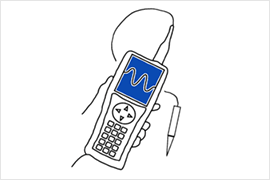
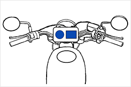

# 户外显示选型：高亮 TFT 与半反半透 TFT 对比

!!! abstract "快速结论"
    本指南解释了最佳户外使用的TFT显示器，相关的设计差异和工程师在选择显示解决方案时应该验证的点。

## 核心要点

- 系统了解户外显示选型：高亮 TFT 与半反半透 TFT 对比，包括关键原理、优缺点、应用场景和工程选型要点。
- 根据下文比较相关技术、应用条件和设计取舍。
- 最终选型前，应确认光学、电气、结构、环境与量产要求。

变体与高亮度TFT LCD，哪个适合户外应用？

高亮度TFT和外观应用的转变性TFT的比较

在户外显示器应用中，屏幕必须克服强烈的环境光干扰以确保可读性。高亮度TFT (薄膜晶体管) 和变动TFT是两个常见的解决方案。这篇文章详细比较了这些技术的亮度，对比度，电力消耗，颜色性能，视角和适合场景。

传输机型是许多电器中广泛使用的最常见的液晶技术。传输器可以在室内和黑暗情况下提供清晰的图像，但同时其显示可读性会在明亮的户外环境中变得更糟，因此需要高亮度TFT，但背光功率增加可能有点改善显示可见性，但导致提高总功耗；这可能对电池驱动的手持设备产生关键影响。

转光型是适合户外应用的液晶技术。转光式有像素分为2个区域，传输和反射区域；反射区 (反射电极) 扮演着反射来自外部的 incident light 的作用。这可以提供清晰的显示可读性以及低功耗。

1. 技术概述

**1.1 高亮度TFT**

高亮度TFT通过增加后照明的亮度和优化光学设计，提高了直接阳光下屏幕可读性。它主要依赖于强大的LED后照系统来抵制环境光。

工作原理：它使用液晶层来控制背光的传递，同时通过加剧背光系统增强显示器。

**1.2 转变性TFT**

半反半透式TFT结合传输和反射显示器的优势。它部分依赖于背光亮度，反射环境光以提高显示性能，使其特别适合自然照明环境。

工作原理：屏幕包含一个反射层，允许部分背光通过，同时反映外部环境光，从而提高了户外环境中的可见性。

2. 关键的比较指标

**2.1 亮度**

高亮度TFT:

它依赖于高功率后照系统，亮度通常超过1000 nits。

半反半透特性TFT:

亮度取决于后照和环境光的结合效应。其固有的后照亮度较低，但可以通过环境光反射增强亮度。

**2.2 对比**

高亮度TFT:

通过增强后照和液晶调整提供高对比度。

在高环境光下可能会出现光干扰。

半反半透特性TFT:

由于在明亮的条件下反射光，保持高对比度。

**2.3 电力消耗**

高亮度TFT:

需要强大的背光支持，以保持高亮度，导致更高的电力消耗。

对于连续运行，可能需要进行热处理。

半反半透特性TFT:

部分依赖于环境光，减少后照电的需求。

低功耗，使其适用于长期和节能应用。

**2.4 视角**

高亮度TFT:

在更广的视角，可能会出现轻微的亮度和颜色退化。

半反半透特性TFT:

提供一个广泛的视角，从不同的角度提供一致的视觉性能。

总结：

转光FT在视角方面具有明显的优势。

高亮度TFT在直观视觉方面优越，但从侧角来看是有限的。

3. 应用场景的比较

| 应用情况 | 高亮度TFT | 半反半透特性TFT |
| --- | --- | --- |
| 直接的阳光 | 性能不佳 | 依赖于环境光，性能良好，但可能受到光角的影响 |
| 频繁的光变 | 通过背光调整，可以快速适应变化的照明 | 在稳定的光下表现良好，需要更多的背光补偿当光变化 |
| 节能应用 | 由于强度的背光，高功耗 | 低功耗，适用于敏感能源应用 |
| 全天候户外使用 | 稳定的亮度和对比，但能源和热量挑战 | 适合阳光明的环境，在低光条件下需要后照明 |

4. 结论和建议

高亮度 TFT 适用于需要各种天气，多功能户外性能的设备，如户外广告，汽车显示屏和导航系统。这些应用需要高亮度，颜色精确性和对比度，但电力消耗和热量管理是重要的设计考虑因素。

半反半透式TFT更适合室外可穿戴设备和低功耗监控显示器等节能应用。有足够的环境光，它提供了自然的观测体验，并显著降低了电力消耗。

最终选择应基于特定的应用环境，电源预算，视觉要求和设备使用寿命考虑因素。

VIEWE的Transflective TFT功能：

在户外/明亮环境中显示可读性良好

在任何环境亮度条件下保持低功耗

室内/黑暗环境中的高图像质量与传输设备相同

室内和户外条件之间的显示性能差异较小

## 应用场景

<figure markdown="span" class="displaywiki-figure">
  [{ width="760" loading="lazy" }](outdoor-tft-selection-handheld-computing.png){ .displaywiki-image-link title="查看原图" }
  <figcaption>手动计算</figcaption>
</figure>

物流

仓库控制

库存控制

医院终端

<figure markdown="span" class="displaywiki-figure">
  [{ width="760" loading="lazy" }](outdoor-tft-selection-measurement.png){ .displaywiki-image-link title="查看原图" }
  <figcaption>测量</figcaption>
</figure>

诊断

手动测试器

现场仪器

<figure markdown="span" class="displaywiki-figure">
  [{ width="760" loading="lazy" }](outdoor-tft-selection-radio-communications.png){ .displaywiki-image-link title="查看原图" }
  <figcaption>无线电通信</figcaption>
</figure>

公共安全广播

警方广播

<figure markdown="span" class="displaywiki-figure">
  [{ width="760" loading="lazy" }](outdoor-tft-selection-construction-machine.png){ .displaywiki-image-link title="查看原图" }
  <figcaption>建筑机械</figcaption>
</figure>

土木工程

农业

GIS/GNSS

总站

<figure markdown="span" class="displaywiki-figure">
  [{ width="760" loading="lazy" }](outdoor-tft-selection-motorcycles.png){ .displaywiki-image-link title="查看原图" }
  <figcaption>摩托车</figcaption>
</figure>

电子自行车

自行车计算机

<figure markdown="span" class="displaywiki-figure">
  [{ width="760" loading="lazy" }](outdoor-tft-selection-bike-computer.png){ .displaywiki-image-link title="查看原图" }
  <figcaption>自行车计算机</figcaption>
</figure>

现货市场

户外的ATM

电动汽车充电器

燃气站

<figure markdown="span" class="displaywiki-figure">
  [{ width="760" loading="lazy" }](outdoor-tft-selection-gas-stand.png){ .displaywiki-image-link title="查看原图" }
  <figcaption>燃气站</figcaption>
</figure>

## 相关阅读

- [定制与阳光下可读显示解决方案](custom-sunlight-readable-displays.md)
- [高可靠性显示解决方案](high-reliability-displays.md)
- [UART 智能显示屏解决方案](uart-smart-display.md)

!!! info "没有找到您需要的内容？"
    如果您需要更多产品、资源或技术支持，欢迎联系我们的团队：

    [**:material-archive-arrow-down: 知识库**](../../knowledge/tags.md){ .md-button .md-button--primary }
    [**:material-magnify: 产品与解决方案**](https://www.chinasunyee.com){ .md-button }
    [**:material-email: 联系技术支持**](mailto:info@chinasunyee.com){ .md-button }
