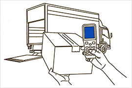
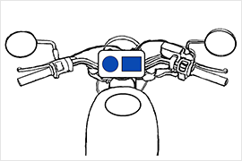
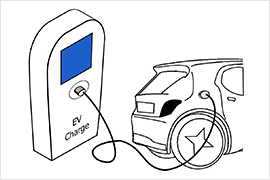

# 户外显示选型：高亮 TFT 与半反半透 TFT 对比

!!! abstract "快速结论"
    户外显示必须克服强环境光的干扰。常见方案有两个：提高背光亮度的高亮 TFT，与借助环境光的半反半透 TFT。前者亮度指标漂亮、适应快速光照变化，但功耗与发热代价明显；后者在阳光直射下靠反射工作、功耗低，但背光补偿需求与色深折中需要提前评估。本文从亮度、对比度、功耗与视角四个维度展开对比。

## 核心要点

- 透射型 LCD 在室内表现优秀，但在明亮户外可读性急剧下降，这是户外显示要解决的根本矛盾。
- 高亮 TFT 靠增强背光系统应对环境光，亮度通常超过 1000 nits，代价是功耗、发热与视角衰减。
- 半反半透 TFT 把每个像素分为透射区与反射区，反射区扮演反射入射光的角色，可在强光下低功耗工作。
- 选择依据是应用环境、电源预算、视觉要求与设备寿命四者的平衡，而不是单一的亮度数值。

## 1. 户外显示要克服什么

透射型是各类电器中应用最广泛的液晶技术，在室内和暗环境下能提供清晰图像。但它的可读性在明亮户外环境中会急剧恶化：环境光在屏幕表面的反射会盖过画面本身的亮度。

通常的应对办法是提高背光亮度。但要看到，背光功率的增加只能有限地改善可见性，同时显著抬高总功耗——对于电池驱动的手持设备，这可能是决定性的影响。

半反半透则是另一条思路：它把每个像素分为两个区域，透射区与反射区，其中反射区（反射电极）负责把来自外部的入射光反射回观察者。这样既能获得清晰的显示可读性，又能保持低功耗。

## 2. 高亮度 TFT

高亮度 TFT 通过提高背光亮度并优化光学设计，来改善直射阳光下的屏幕可读性，主要依赖高功率 LED 背光系统对抗环境光。

**工作原理**：仍然由液晶层控制背光的透过量，但通过大幅增强背光系统来提升显示亮度上限。它本质上是在"提高分子"这条路径上做文章——既然环境光反射无法避免，就把画面亮度推到远高于反射光的水平。

## 3. 半反半透 TFT

半反半透 TFT 结合了透射型与反射型的长处：一部分依赖背光亮度，一部分依靠反射环境光来提升显示性能，因此特别适合自然照明环境。

**工作原理**：屏幕内包含一个半透半反层，允许部分背光透过，同时反射外部环境光，从而提升户外环境下的可见性。与前者的关键差别在于，它同时在"提高分子"与"降低分母"两侧做功。

## 4. 关键指标对比

### 4.1 亮度

- **高亮度 TFT**：依赖高功率背光系统，亮度通常超过 1000 nits。
- **半反半透 TFT**：实际亮度取决于背光与环境光的叠加效果。其固有背光亮度较低，但可经由环境光反射得到增强。

### 4.2 对比度

- **高亮度 TFT**：通过增强背光并调整液晶提供较高对比度，但在高环境光下可能出现环境光干扰，导致对比度回落。
- **半反半透 TFT**：在明亮条件下借助反射光维持较高对比度。

### 4.3 功耗

- **高亮度 TFT**：需要强力背光维持高亮度，功耗更高；连续运行时可能需要额外的散热设计。
- **半反半透 TFT**：部分依赖环境光，降低了对背光的需求，功耗低，适合长期运行与节能场景。

### 4.4 视角

- **高亮度 TFT**：可获得较广视角，但从较大角度观看时会出现轻微的亮度与色彩衰减。
- **半反半透 TFT**：提供较宽视角，从不同角度都能获得较为一致的视觉表现。

**小结**：半反半透在视角一致性上更有优势；高亮度 TFT 在正视方向上表现更直观，但斜视时受限。

### 4.5 指标速查表

| 对比维度 | 高亮度 TFT | 半反半透 TFT |
|---|---|---|
| 亮度来源 | 高功率 LED 背光 | 背光 + 环境光反射 |
| 典型亮度 | 超过 1000 nits | 背光较低，靠环境光增强 |
| 高环境光下对比度 | 可能受环境光干扰 | 借助反射维持 |
| 功耗 | 高，连续运行需散热设计 | 低，适合节能场景 |
| 视角 | 较广，斜视有衰减 | 宽且一致性较好 |
| 成本 | 相对可控 | 更高（反射层工艺复杂） |

## 5. 应用场景适配

| 应用情况 | 高亮度 TFT | 半反半透 TFT |
|---|---|---|
| 阳光直射 | 性能不佳 | 依赖环境光，表现良好，但受光照角度影响 |
| 光照频繁变化 | 通过背光调节可快速适应 | 在稳定光照下表现好，光照变化时需更多背光补偿 |
| 节能应用 | 强力背光导致高功耗 | 低功耗，适合能源敏感场景 |
| 全天候户外 | 亮度与对比度稳定，但有功耗与散热挑战 | 适合阳光充足环境，低光条件下需开启背光 |

## 6. 优奕视界半反半透 TFT 的特点

- 在户外与明亮环境中具备良好的显示可读性。
- 在任意环境亮度条件下保持低功耗。
- 在室内与暗环境中的图像质量与透射型设备相当。
- 室内与户外两种条件下的显示性能差异较小。

## 7. 典型应用场景

半反半透与高亮方案主要服务于户外作业、现场仪器与交通工具三类场景。

**物流与仓储手持终端**

<figure markdown="span" class="displaywiki-figure">
  [{ width="760" loading="lazy" }](outdoor-tft-selection-handheld-computing.png){ .displaywiki-image-link title="查看原图" }
  <figcaption>物流与仓储：手持终端常在半户外环境使用，涉及货物扫描、仓库控制与库存管理，需要兼顾可读性与续航。</figcaption>
</figure>

**现场测量仪器**

<figure markdown="span" class="displaywiki-figure">
  [{ width="760" loading="lazy" }](outdoor-tft-selection-measurement.png){ .displaywiki-image-link title="查看原图" }
  <figcaption>现场仪器与诊断设备：手持测试器、现场仪表常在户外读数，屏幕需在多变光照下保持可读。</figcaption>
</figure>

**无线电通信终端**

<figure markdown="span" class="displaywiki-figure">
  [{ width="760" loading="lazy" }](outdoor-tft-selection-radio-communications.png){ .displaywiki-image-link title="查看原图" }
  <figcaption>公共安全与无线电通信：警方广播、现场调度等终端长期在户外使用，依赖电池供电。</figcaption>
</figure>

**建筑与工程机械**

<figure markdown="span" class="displaywiki-figure">
  [{ width="760" loading="lazy" }](outdoor-tft-selection-construction-machine.png){ .displaywiki-image-link title="查看原图" }
  <figcaption>建筑机械与土木工程：挖掘机驾驶室内的显示终端常处于逆光或强光下，同时涉及农业与 GIS/GNSS 测量等场景。</figcaption>
</figure>

**摩托车仪表**

<figure markdown="span" class="displaywiki-figure">
  [{ width="760" loading="lazy" }](outdoor-tft-selection-motorcycles.png){ .displaywiki-image-link title="查看原图" }
  <figcaption>摩托车与电动自行车仪表：骑行视角常年暴露在阳光下，显示需在强光与夜间之间保持稳定可读。</figcaption>
</figure>

**电动汽车充电桩**

<figure markdown="span" class="displaywiki-figure">
  [{ width="760" loading="lazy" }](outdoor-tft-selection-bike-computer.png){ .displaywiki-image-link title="查看原图" }
  <figcaption>电动汽车充电桩与户外自助终端：设备露天安装，需在直射阳光下长期显示交互与计费信息。</figcaption>
</figure>

**船艇驾驶台**

<figure markdown="span" class="displaywiki-figure">
  [{ width="760" loading="lazy" }](outdoor-tft-selection-gas-stand.png){ .displaywiki-image-link title="查看原图" }
  <figcaption>船艇驾驶台：户外水面环境光反射强烈，仪表与导航终端对阳光下可读性要求高。</figcaption>
</figure>

## 8. 选型要点

- **确定主要光照条件**：以直射阳光为主、且不便频繁补电的场景，优先考虑半反半透；光照条件稳定但需要高画质的场景可考虑高亮方案。
- **评估光照变化频率**：环境光频繁变化时，高亮 TFT 的背光调节响应更快；半反半透在光照突变时需要更多背光补偿。
- **核算功耗与散热**：高亮方案需预留散热设计并核算整机功耗；半反半透在强光下可降低背光功率，收益明显。
- **确认色深与画质要求**：半反半透存在色深折中，对色彩有硬性要求的应用需提前评估。
- **核对视角需求**：多人观看或安装角度受限时，视角一致性是重要指标。
- **综合四项因素定案**：最终选择应基于具体应用环境、电源预算、视觉要求与设备寿命综合判断。

## 9. FAQ

??? question "Q1：高亮 TFT 和半反半透 TFT 该怎么选？"
    看两个关键条件：环境光是否长期强烈、设备是否依赖电池。长期直射阳光且供电受限（如户外手持、可穿戴、低功耗监控）优先半反半透；需要高画质、光照条件相对可控、且能承受功耗与散热代价时（如户外广告、车载导航）选高亮 TFT。

??? question "Q2：半反半透屏在室内会不会变暗？"
    不会明显变暗。半反半透同时具备透射模式，室内或暗环境下开启背光即可，图像质量与同规格透射型设备相当。它的设计目标正是让室内外的显示性能差异尽量小，而不是牺牲室内表现去换户外可读性。

??? question "Q3：频繁进出明暗环境，哪种方案更合适？"
    需要区分情况。高亮 TFT 通过背光调节可以快速适应光照变化，切换响应更快；半反半透在光照稳定的环境中表现更好，光照频繁突变时需要更多背光补偿。若明暗切换非常频繁且供电充足，高亮方案的调节能力更占优。

??? question "Q4：高亮 TFT 的散热要怎么处理？"
    高亮背光在提升亮度的同时也带来更高功率与发热，连续运行时需要评估散热路径，必要时增加金属背板、导热材料或结构上的散热设计，否则可能影响 LED 寿命与整机可靠性。选型阶段就应把散热纳入结构预算。

??? question "Q5：半反半透的视角真的比高亮更好吗？"
    通常是的。半反半透在不同角度下能提供较为一致的视觉表现；高亮 TFT 虽然视角也较广，但从较大角度观看时会出现轻微的亮度与色彩衰减。若安装位置受限或需要多人从不同角度观看，半反半透的视角一致性更有优势。

??? question "Q6：为什么有些户外设备同时采用高亮和半反半透？"
    两者并不互斥。半反半透屏在强光下可以降低甚至关闭背光，但在夜间或弱光下仍需背光照明；把半反半透结构与较高亮度的背光组合，可以覆盖从直射阳光到夜间值守的完整光照范围，是全天候户外设备的常见做法。

## 相关阅读

- [定制与阳光下可读显示解决方案](custom-sunlight-readable-displays.md)
- [高可靠性显示解决方案](high-reliability-displays.md)
- [UART 智能显示屏解决方案](uart-smart-display.md)

## 参考数据来源

本文涉及的标准、规格与应用资料：

- [高亮户外 TFT 模组规格书（7 英寸 1024×600）](../../../assets/datasheet/UEP4S070H1024V600C-WBA.pdf)
- [TFT LCD 模组规格书示例（7 英寸 WVGA）](../../../assets/datasheet/display/ALL-UE070WV-RB40-A092A.pdf)

!!! info "没有找到您需要的内容？"
    如果您需要更多产品、资源或技术支持，欢迎联系我们的团队：

    [**:material-archive-arrow-down: 知识库**](../../knowledge/tags.md){ .md-button .md-button--primary }
    [**:material-magnify: 产品与解决方案**](https://www.chinasunyee.com){ .md-button }
    [**:material-email: 联系技术支持**](mailto:info@chinasunyee.com){ .md-button }
