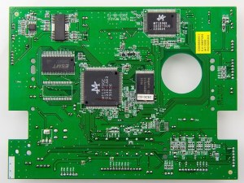
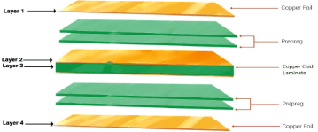
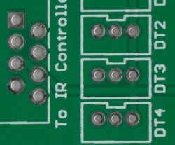
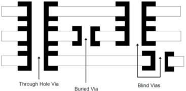

# PCB 结构与制造流程

!!! abstract "快速结论"
    本指南解释了PCB制造和制造，相关的设计差异以及工程师在选择显示解决方案时应验证的点。

## 核心要点

- 系统了解PCB 结构与制造流程，包括关键原理、优缺点、应用场景和工程选型要点。
- 根据下文比较相关技术、应用条件和设计取舍。
- 最终选型前，应确认光学、电气、结构、环境与量产要求。

## 印刷电路板

印刷电路板 (PCB) 在几乎所有整理的电子设备中使用。它们是电子元件的电连接支者。标准PCB裸体板上没有零部件，通常被称为打印有线电板 (PWB). 电缆绝缘层开始老化和破裂时，PCB的出现大大减少了线路接口和短路频繁故障。典型的PCB是绿色的，但现在还有其他颜色，如蓝色，红色等。 PCB可以根据层次，频率，基板材料等进行分类。当前的电路板主要由电路模式，基底，孔/VIA，接面具，丝屏和表面成形组成。

### 制造PCB

<figure markdown="span" class="displaywiki-figure">
  [{ width="760" loading="lazy" }](pcb-construction-process-a-standard-printed-circuit-board.jpeg){ .displaywiki-image-link title="查看原图" }
  <figcaption>标准印刷电路板</figcaption>
</figure>

基板

基板主要起支撑和绝缘线路的作用和组件，通常由电复合材料制成。基板的特性会影响PCB的性能，例如灵活的基板允许更多的设计选择。与此同时，在制造和制造成本中质量，可制造性高度依赖于基板材料。因此，选择合适的基板是制造高质量的PCB的第一步。 FR-4，由织玻璃纤维布和 epoxy树脂结合剂组成，是基板中最常见的材料。

铜叶片

在基板表面可以看到的小电路材料是铜。最初的铜层通过加热和粘合剂将在整个板上涂层，然后部分在制造过程中被蚀刻出来，其余部分成为小型网状电路。铜的厚度因重量而异，单位一般每平方英尺为10.在多层PCB中，铜也存放在钻孔墙上，因为这些洞建立了层之间的电连接。

预备

普雷格通常用于多层PCB中。它是一种用树脂浸泡的玻璃织物强化材料。作为粘性材料，可以用来结合不同的片和薄膜。

<figure markdown="span" class="displaywiki-figure">
  [{ width="760" loading="lazy" }](pcb-construction-process-a-multi-layer-printed-circuit-board.png){ .displaywiki-image-link title="查看原图" }
  <figcaption>多层印刷电路板</figcaption>
</figure>

铜涂层酸盐

在多层PCB中，一定数量的单独的 prepreg 与最外面的铜薄膜结合在一起以制成单片。

溶面膜层

接面具层指一个隔离保护层，位于铜层之上。它在防止铜线被氧化和短路方面发挥着重要作用。此外，它还可以避免组件被接到错误的地方。接面具层的颜色有多种，如绿色，红色，棕色等。

丝屏

丝屏，也称为传奇，通常以白色打印在接面具上作为参考指标。它添加了字符，数字和符号在结面膜上来标记板上的每个部件的位置。

纸板

片是电路板表面暴露的铜的一部分，该部件被接。片分为穿孔片和表面安装片。穿孔 ?? 片具有孔，主要用于接针组件如芯片；而表面挂板没有接孔，主要用于接表面挂机组件。

<figure markdown="span" class="displaywiki-figure">
  [{ width="760" loading="lazy" }](pcb-construction-process-the-pad-of-printed-circuit-board.jpeg){ .displaywiki-image-link title="查看原图" }
  <figcaption>印刷电路板的片</figcaption>
</figure>

视频 (直线互联网接入)

在多层PCB中，VIA是一种用于实现从一个层到另一层的电路连接的孔。主要有三个整理的PCBVIA，即涂层透孔 (PTH)，盲 VIA和埋葬 VIA.

虽然PTH的制造成本相对较低，但PTH有时占用更多的PCB空间。通过孔覆盖的 PCB周围的铜环称为圆圈环。在多层PCB中，它在VIA和铜痕之间建立更好的连接方面起着至关重要的作用。

高密度互连 (HDI) 等复杂的PCB通常需要盲和埋藏的VIA.盲VIA是一种电离孔，将PCB的最外层与相邻内层连接起来。它增加了PCB电路层的空间利用率，但需要更精确的定位和排列。

从外面看不见的埋葬VIA只连接到内部电路层之间。与其他埋葬 VIA不同，在装配过程中必须完成挖掘而不是等到最后。

<figure markdown="span" class="displaywiki-figure">
  [{ width="760" loading="lazy" }](pcb-construction-process-the-via-of-printed-circuit-board.jpeg){ .displaywiki-image-link title="查看原图" }
  <figcaption>印刷电路板的VIA</figcaption>
</figure>

黄金指

黄金手指是沿着电路板边缘暴露的金属片，用于建立两个电路盘之间的连接。

<figure markdown="span" class="displaywiki-figure">
  [{ width="760" loading="lazy" }](pcb-construction-process-the-finger-of-printed-circuit-board.jpeg){ .displaywiki-image-link title="查看原图" }
  <figcaption>印刷电路板的手指</figcaption>
</figure>

### PCB制造过程流动

印刷电路板 (PCB) 在几乎所有整理的电子设备中都使用。

1. 切割

切割是根据生产尺寸切割干净的铜面板成小块的过程，可在生产线上制造。为了确保安全运行和减少划痕问题，板块的角落已圆形。

2. 内层干膜接

通过自动热处理将干光阻抗膜应用到板上。PCB过程流程的这一步骤发生在没有灰尘的黄色光室，因为光阻膜对紫外线非常敏感。

3. 暴露情况

接下来，将电路打印片与板块完美地对齐，然后使用紫外线灯向打印机发送电路，根据电路印刷片硬化光敏感膜。此步骤后，电路被转移到干燥的抗光膜。值得注意的是，电路零部件不暴露，但没有电路的区域被紫外线照射，从而保持柔软。

4. 发展

在PCB流程的发展阶段，性溶液用于洗掉左不硬化的光阻剂。之后，内层图像被蓝色抵抗打印出来，这将在蚀刻阶段抵御化学溶液。

5. 雕刻

雕刻是层成像的关键阶段，使用酸溶液去除不需要的铜和概述图案。

6. 脱衣

脱皮是完全剥离暴露的干燥光阻膜，以氧化溶液保护铜表面，以揭露电路模式。

7. 内层自动光学检查 (AOI)

印刷电路板制造过程中的这一步骤将准确确认完全没有缺陷，并确保构建的电路盘具有高质量，无生产故障。 AOI的工作原理是使用高清图像摄像头快速拍摄，然后将捕获的照片与原始文件进行比较，这可以从根本上解决短路和开放电路等隐藏危险。

8. 棕色氧化物治疗

咖啡色氧化物处理的目的是通过化学处理在内部层表面形成微观粗和有机金属层，以增强层之间的粘合性并避免脱等问题。

9. 接

在实际操作中，单独的多层板和 prepreg 被压在一起形成一个多层板，具有所需的数量层和厚度。最后，铜叶片完成了PCB过程流量的堆积。铜叶片和 prepreg的组合分别位于顶部和底部，将内部层交织在一起形成堆。

在高压和温度下加工后，形成一个单层板，然后转移到冷压机。

在这个阶段，在设计过程中必须详细考虑各种因素，例如铜分布的均性，堆积的对称性，盲孔和埋洞的设计和布局。

10. 钻井

钻井有两个主要目的，一个是连接负载组件，另一个是将铜层连接起来。在这个阶段，洞里没有铜，因此电流无法通过板块流动。

11. 铜

钻孔的PCB板在沉的铜中经历了氧化降低反应，形成了一个铜层以金属化洞穴。铜沉积在原始绝缘基板表面，以获得导孔，从而实现内部层和外部层之间的电信。印刷电路板生产过程的阶段发生在一系列化学和冲洗浴室中。

12. 外层基本工艺

外层PCB过程流程的基本原理与内层相似，其中包括外层干膜接，曝光，开发，蚀刻，剥离暴露的干光阻抗薄膜，化学铜沉积和外层自动光学检查 (AOI).

外层涂层采用化学铜工艺，但强调了铜分布。整个电路板，作为电子接的天极，通过电解铜进行多个浴室产生电解。此后，外层和孔的铜层被涂装到一定厚度，以满足最终PCB板的铜厚度要求。与内层化学铜工艺不同，板块也将被浸入电解中以保护在随后的蚀刻过程中铜。

13. 外层蚀刻

在PCB流程中，有三个主要步骤。首先，所有残留物和干燥膜都被移除，但不需要的铜仍然存在。接下来，板通过化学溶液进行蚀刻，将不必要的铜和锡取消。最后，电路区域和连接得到了正确的定义。

14. 头面膜

接面具是印刷电路板生产最关键的阶段之一，主要通过屏幕打印或涂层接口罩墨水来将接器面具在板表面上涂层。通过曝光和开发，模块和孔被暴露出来，接剂面具变得硬化。最后，阳光照射的不保护和不硬化的部分将被洗掉。

15. 丝屏

这一阶段通过屏幕打印在板面上打印所需的字符或零件符号，然后将其暴露于紫外线下。

16. 表面完成

裸铜本身的化能力相当好，但长期暴露在空气中容易湿和氧化。裸铜往往存在于氧化物形式，不太可能长时间保持原始状态。因此，为了确保良好的合性和电气性能，需要对铜表面进行表面处理。最常见的表面处理是沉浸锡，无电尼克尔沉浸金 (ENIG)，沉没银，黄金涂料等。

17. 个人资料

切割PCB到所需的形状和尺寸。

18. 电气测量

模拟PCB板的状态并检查电动性能，以确定是否有开放或短路。

19. 最终QC，包装和库存

检查板的外观，尺寸，孔径，厚度，标记等，以满足客户要求。合格产品被包装成包裹，易于存储和运输。

## 相关阅读

- [PCB 类型与材料选择](pcb-types-materials.md)
- [PCB 设计、制造与互连方式选择](pcb-design-interconnections.md)
- [显示接口详解：MCU、RGB、LVDS、MIPI、SPI 等](display-interface-guide.md)

!!! info "没有找到您需要的内容？"
    如果您需要更多产品、资源或技术支持，欢迎联系我们的团队：

    [**:material-archive-arrow-down: 知识库**](../../knowledge/tags.md){ .md-button .md-button--primary }
    [**:material-magnify: 产品与解决方案**](https://www.chinasunyee.com){ .md-button }
    [**:material-email: 联系技术支持**](mailto:info@chinasunyee.com){ .md-button }
