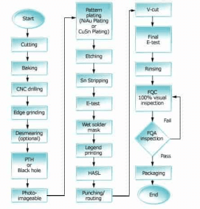

# PCB 设计、制造与互连方式选择

!!! abstract "快速结论"
    本指南解释了PCB设计和相互连接，相关的设计权衡以及工程师在选择显示解决方案时应该验证的点。

## 核心要点

- 系统了解PCB 设计、制造与互连方式选择，包括关键原理、优缺点、应用场景和工程选型要点。
- 根据下文比较相关技术、应用条件和设计取舍。
- 最终选型前，应确认光学、电气、结构、环境与量产要求。

## 电路板设计

电子工程师选择执行最终产品的功能所需的组件，然后确定电路上连接这些组件的最佳方式。
设计给制造商提供了大量的信息，包括PCB尺寸，孔大小和位置以及总体机械定义；它也可能包含参考材料整理，规格，UL要求，接面具和测试要求的说明。

CAD：使用软件创建硬件

虽然PCB设计曾经是用手动在 mylar 膜上进行的，但现在它们使用计算机辅助设计 (CAD) 软件创建。CAD软件自动确定导体的路线，减少所需的人工劳动力。大多数CAD提供商提供了可用的组件的形状和尺寸图书馆。这些形状和尺寸被称为轮。这些组件与板面接触的区域称为足迹。

选择材料

由于有各种铜厚，氧性质和玻璃织物整理，因此设计师必须定义所需的组合。一个重要考虑因素是多层PCB层的结合剂 prepreg的组成。预 (或B阶段树脂) 是用环氧浸泡后部分固化的玻璃布料。有3种基本特性：热，电和化学。

具体说明金属成品

铜作为生产中大多数PCB的导体，如果没有保护，将会化并防止部件对裸板进行适当的化。用于保护PCB暴露的铜表面，应用一个不化或缓慢化的金属。金属表面成品的价格，保质期，可靠性和装配加工不同。以下列出一些受欢迎的表面成型：

热空气接等级 (HASL):PCB被浸入融化接水浴中。

无电沉浸金 (ENIG)：这是最好的和最受欢迎的 RoHS 制成方法之一。

沉浸银子

有机结性保存剂 (OSP):OSP是一种与 RoHS 兼容的，以水为基础的有机化合物，可选择地与铜结合并提供保护铜在接过程中的有机/金属层。

无HASL：溶解浴室没有和RoHS. 它使用尼克尔修改合金来产生类似的结果。

创建堆积表

作为最后一步，设计师创建了一张堆积表格，

<figure markdown="span" class="displaywiki-figure">
  [{ width="760" loading="lazy" }](pcb-design-interconnections-generating-manufacturing-data.png){ .displaywiki-image-link title="查看原图" }
  <figcaption>产生制造数据</figcaption>
</figure>

内部或行业规范

承包商实验室 (UL) 要求

测试要求

定制规格

将设计转移到制造商

下面使用最常用的数据传输格式：

格尔伯及其衍生品，格尔贝RS-274X.

其他整理：ODB++,GenCAM和PIC-D-350.

改造工具设计

制造过程始于通过使用计算机辅助制造 (CAM) 软件的特殊程序，从设计师那里获得的电子数据的传输。CAM允许制造商执行：

制作面板和照片工具

面板化过程是多个PCB图像以最经济的方式填补整个面积的面板。辅助功能：层号码，UL符号，边界和测试优惠券，添加到面板上。然后将其转移到照片插图器：通过激光光绘制面板图像的机器。最终图像被绘制在摄影片上。

激光直接成像 (LDI) 是通过使用强大的激光来直接成形电路，将PCB设计应用或暴露在制造面板上的另一种方法。

生成钻探和路由数据

生成数控 (NC) 钻机和路由数据，以便传输到钻机部分。

编程检查和测试数据

制造商使用自动光学检查 (AOI) 来在PCB路由中找到断裂或短。制造者通过使用黄金板或CAD数据作为参考来编程 AOI内存。在不匹配的情况下，机器识别了缺陷的位置。

裸板以电气来测试，以确保遵循原始设计。

黄金板测试：这种方法主要用于没有Gerber或电子数据可用时，以生成PCB制造商使用的艺术品。传统产品通常通过孔，简单的2层，4层甚至6层板进行这样的测试。

网清单测试：这种方法可以在Gerber数据可用时使用。它是通过从提供的信息中提取所有网络 (沿着电路的点串) 进行的。在黄金板测试是比较测试时，网清单对所有点进行测试，以确保电力完整性的高度可靠性。

## 双面PCB制造

双面PCB (或2层PCB) 是印刷电路板，上面和下面都涂铜。中间有一个绝缘层。要在两侧使用电路，必须有两个边之间的正确的电路连接。这些电路之间的桥梁称为通道。通过是金属涂层的PCB板上的小孔，可以在两侧连接到电路。

<figure markdown="span" class="displaywiki-figure">
  [{ width="760" loading="lazy" }](pcb-design-interconnections-double-sided-pcb.png){ .displaywiki-image-link title="查看原图" }
  <figcaption>双面PCB</figcaption>
</figure>

图1.双面PCB

规划和预制

在制造之前，制造商检查CAD数据和其他信息 (电影，机械绘画和规格).

每个主板的板块数量

根据最经济的原因，决定面板大小。

在面板化过程中添加的功能和信息。如UL符号，测试优惠券，层号码和边界在此时被选择

层材料

钻孔大小

工具孔或目标位置

双面PCB制造过程

下一节描述生产双面板的步骤，包括接面具在裸铜上 (SMOBC)，涂层孔 (PTH) 和装饰金色的接触物以及组件传说。

准备材料

通过使用旅行者信息，包括面板的数量和尺寸以及任何特殊指示，制造商准备处理订单所需的材料。在PCB制造中，用户和PCB生产商可以选择很多材料。不同的品牌和材料具有不同的特性，不同材料也提供不同的好处，如FR4，陶基板，铁基板和基层等。

FR-4是PCB基板中广泛使用的阻燃材料之一。FR4板经济且负担得起，可以在极端温度条件下保持PCB板的稳定性和安全性。

然而，FR4不适合高频和高速PCB.此时，我们需要选择高频材料，如Rogers RO4000系列，RT5000/6000系列，Tacanics TLX系列等。在LED照明行业使用，金属或铜作为LEDPCB或PCB的基板。

切割CCL (铜涂层料)

下一步是根据要求切割板。原料PCB板相当大。有各种尺寸，如37 x 49英寸，41 x 49 英寸和43 x 49 英寸。因此，它被切成可以在机器中使用的所需尺寸。切割后获得的板块尺寸不取决于您的电路尺寸；它更大。您的PCB尺寸可能很小，因此板上的多个电路可以使工艺经济。

钻井

电路板进入一个自动钻井机器，它可以快速在板上产生洞穴。

除

随着钻井过程的改善，可以生产无孔。但大多数制造商通过除机处理钻井板。这些板通过刷子或磨砂轮进行机械移除在洞边缘的铜烧伤。除还可以消除任何指纹和氧化物，以创造一个光滑的表面。

无电铜沉积 (通过孔，PTH)

通过洞穴进行无电沉积，因为孔最初由氧组成。在Cu沉积后，面板被浸入酸滴和防溶液中以防止氧化。它有两种整理 - 平线和垂直。水平PTH用于碳沉积而垂直PTH为cu沉积。无电铜是双面PCB和多层PCB制造过程中最重要的步骤之一。

<figure markdown="span" class="displaywiki-figure">
  [{ width="760" loading="lazy" }](pcb-design-interconnections-electroless-copper-deposition-plating-through-holes-pth.png){ .displaywiki-image-link title="查看原图" }
  <figcaption>无电铜沉积 (通过孔，PTH)</figcaption>
</figure>

图2.无电铜沉积 (通过孔，PTH)

照片图像

在影像成像中，一个负面的图像电路模式被转移到PCB板上。首先，该板由光阻剂层覆盖。最常见的光阻材料是干膜涂料阻抗的紫外线 (UV) 光敏感照片聚合物。在滚子上供应，并通过热滚子拉米纳器上的加热滚筒来处理面板。一旦涂片，板块就准备好暴露于紫外线中进行电路打印。

整个过程都在一个只有黄色灯光的房间中进行。这是因为抗光膜对其他灯光敏感。具有电路设计的薄膜被应用到板上；它被应用于两侧。然后，板通过紫外线照明室。当板面暴露于紫外线时，电路部分会硬化，而过度的部分则保持不变。

模板涂料

接下来，面板被入铜层溶液中。该溶液和面板具有相反的电解电荷。这种相反的极度导致铜离子迁移到板块上未涂层的铜面积，将所需的铜厚度存储在板表面和孔中。电路模式被额外的铜覆盖，再用锡或锡/合金进行电压。

制作和雕刻

面板被放置在一个水箱或喷雾机中，以移除成像材料。阻力被剥离后，面板安装在传输喷雾切割器或批量中，一个化学切割剂 (基于氨基化合物) 将未覆盖的铜移除，但不会攻击锡或锡/鉛涂料，从而保护下面的铜。然后将或/从铜中化工剥离出来，揭示了铜电路模式。

士兵面具

绿色，白色，蓝色和其他颜色的接面具在电路上是一个薄层的聚合物，它作为两个导线之间的绝缘剂。它防止短路形成。面具被应用到整个板块上，然后是干燥的。取消超过电路的结面具。接下来，板块穿过紫外线室。除了电路之外的接被硬化，而在电路上接面具保持不变。最后，电路上的接口被清洁。

表面完成

面板上的铜可以经历氧化。它不能持续很长一段时间。因此，为了保护铜免受氧化，必须在表面上涂抹一次。您可以选择HASL,OSP,ENIG,ENEG,ENEPIG，沉浸锡，沉没银等。

黄金和涂料

然而，铜和黄金往往相互散射 (铜以更快的速度这样做)；温度增加会加速这个过程。在痕迹表面上的铜会氧化，导致接触阻力增加 (铜向黄金迁移可能会使黄金色和腐蚀). 尼克尔通常被用作屏障层，以防止黄金在轨道上迁移到铜中。 (与直接覆盖铜底部的黄金涂料相比，尼克牌屏障有助于减少毛孔数量和影响). 它作为黄金的支来增加硬度，以及为黄金和铜之间提供有效的扩散屏障层。 /金提供耐热和腐蚀性，环保稳定，可溶解的电线和耐用 (尼克尔底板增强了黄金的磨损特性)，尽管成本高于简单的接 finishes. 传统上，用于键盘接触器或边缘手指的铜轨道上应用了/黄金涂层，以提供导电性，耐腐蚀的涂层。这种方法为接提供了好处，

应用组件传说

在PCB上的标签被称为丝屏。这些可以用来标记组件并插入标志。在这个步骤中，PCB板进入一个巨大的打印机，将标签打印在板上。丝显示屏可用各种颜色，如红色，蓝色，黄色和黑色，但标准颜色是白色。

隔离或切割

一台切割机切断电路并将它们分成零件。

电气测试

为此，使用飞行探针测试。这是一个简单的测试，其中有多个探针。探针被放置在连接上，电流通过它们。它检查电路是否按预期工作或不。例如，如果两条路径之间没有连接，当探测器连接到它们时，电流不应该通过。

<figure markdown="span" class="displaywiki-figure">
  [{ width="760" loading="lazy" }](pcb-design-interconnections-double-sided-pcb-manufacturing-process.png){ .displaywiki-image-link title="查看原图" }
  <figcaption>双面PCB制造过程</figcaption>
</figure>

图3.双面PCB制造过程

## 相互连接的选择

各个元素中包装方法的选择不仅取决于系统功能，还取决於所选的组件整理以及系统运行参数，如时钟速度，电力消耗和热量管理方法，以及系统将在哪里运营的环境。

运行速度

电子系统的运行速度是设计互联网的一个非常重要的技术因素。许多数字系统在接近100MHz的速度上运行，并且已经超出了这一水平。系统速度不断增加，对包装工程师的巧妙性和用于PWB基板材料的性能提出了很大的要求。

信号传播速度与基板材料的电恒定的平方根相反比例，因此设计师需要了解他们打算使用的基板材质的光性能。芯片之间的基板上的信号传播 (所谓的飞行时间) 与连接器长度直接相比例，必须保持短暂，以确保高速运行的系统的最佳电力性能。

对于运行速度约为25MHz的系统，连接必须具有传输线特性，以最大限度地减少信号损失和扭曲。这些传输线的正确设计需要仔细计算导体和电分离尺寸及其精确制造，以确保预期的性能准确性。对于PCB来说，有两种基本的传输网整理：1) 条线，2) 微带。

电力消耗

随着芯片的时钟速度增加和每芯片门数量增长，它们的电力消耗也相应增加。一些芯片需要高达30W的功率来运行。因此，需要越来越多的终端来将电源输入并适应地面飞机的回归流。约20%至20%的芯片终端用于电力和地面连接。由于在高速系统运行中需要电气隔离信号，这个数量可能会上升到50%.

设计工程师必须在多层板 (MLB) 中提供足够的电力和地面分配平面，以确保高效，低阻力的电流流量，这可能在连接数十瓦的高速芯片并运行5V,3.3V或更低的板上很大。系统中正确的电力和地面分布对于降低高速系统中的di/dt交换干扰以及降低不必要的热度至关重要。

热管理

为了确保该系统的正常运行和长寿命，必须有效地从电源集成电路 (IC) 中移除所有供应的能量。在大型系统中，需要巨大的热处理器结构，使单个IC变微小，以空气冷却它们，一些计算机公司已经为电脑模块的液体冷却建造了巨型超层结构。尽管如此，大型系统的冷却需求使现有的冷却方法的能力受到影响。

在小型，桌面或便携式电子设备中情况并不那么严重，但仍然需要包装工程师改善热点并确保使用寿命。由于PWB是臭名昭著的电热导体，因此设计师必须仔细评估通过板进行温度条件的方法，使用热管，嵌入式金属和导层等技术。

电子干扰

随着电子设备的频率增加，许多IC，模块或组件可以作为射频信号发电器。这种电磁干扰 (EMI) 辐射可能会严重危及邻近的电子设备甚至同样的设备的其他部件的运行，导致故障，错误和错误，必须避免。有特定的EMI标准定义了这种辐射的允许水平，这些水平非常低。

包装工程师，特别是PWB设计人员必须熟悉减少或取消这种EMI辐射的方法，以确保他们的设备不会超过这种干扰的允许限制。

系统运营环境

电子产品的特定包装方法选择也取决于其最终用途和该产品设计的市场细分。包装设计师必须了解产品使用的主要驱动力。在哪里使用？例如，在汽车的罩杯下，环境条件严峻的地方，或者在办公室里，操作条件良好的吗？ IPC建立了一套按严重程度分类的设备运行条件。

费用

在任何电子系统设计中，产品成本已成为最重要的标准。在符合上述所有设计和运营条件的情况下，设计工程师必须将成本作为主导标准，并必须根据产品最佳成本/性能解决方案分析所有潜在的贸易逆转。

在电子产品的设计过程中，严格的成本交易分析的重要性得到了强调，

在产品设计过程中，注意制造和装配要求和能力可以降低装配成本高达35%,PWB成本高達25%.

## 相关阅读

- [PCB 结构与制造流程](pcb-construction-process.md)
- [PCB 类型与材料选择](pcb-types-materials.md)
- [显示接口详解：MCU、RGB、LVDS、MIPI、SPI 等](display-interface-guide.md)

!!! info "没有找到您需要的内容？"
    如果您需要更多产品、资源或技术支持，欢迎联系我们的团队：

    [**:material-archive-arrow-down: 知识库**](../../knowledge/tags.md){ .md-button .md-button--primary }
    [**:material-magnify: 产品与解决方案**](https://www.chinasunyee.com){ .md-button }
    [**:material-email: 联系技术支持**](mailto:info@chinasunyee.com){ .md-button }
