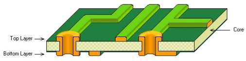
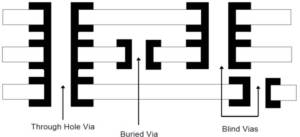
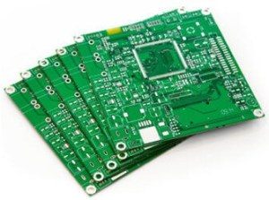
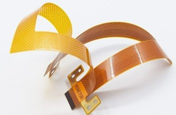
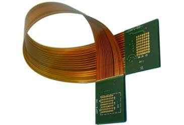
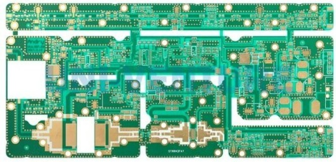
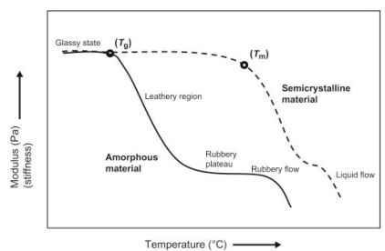

# PCB 类型与材料选择

!!! abstract "快速结论"
    本指南解释了选择PCB整理和材料，相关的设计权衡以及工程师在选择显示解决方案时应该验证的点。

## 核心要点

- 系统了解PCB 类型与材料选择，包括关键原理、优缺点、应用场景和工程选型要点。
- 根据下文比较相关技术、应用条件和设计取舍。
- 最终选型前，应确认光学、电气、结构、环境与量产要求。

## PCB整理

一般来说，印刷电路板 (PCB) 按层数量，基板整理和频率进行分类。根据材料，PCB 分为单侧 PCB，双侧 PCB 和多层 PCB. 与此同时，根据材料，PCB也可以分为硬 PCB，灵活 PCB和硬柔性 PCB.

单侧PCB

单面PCB是最简单的印刷电路板。下图显示了单边PCB的结构。蓝色，黄色和绿色层分别是基板，导体铜层和接面具。在单边PCB中，只有一个侧面的基板被涂上铜层，而这个侧面是组件电气连接的地方。单侧PCB具有成本效益和易于制造。但它对电路设计有很多限制，因为导路不能交叉或重叠。因此，目前的单边PCB仅用于电子玩具，计算器等简单电路。

<figure markdown="span" class="displaywiki-figure">
  [{ width="760" loading="lazy" }](pcb-types-materials-the-structure-of-the-single-sided-pcb.jpeg){ .displaywiki-image-link title="查看原图" }
  <figcaption>单侧PCB的结构</figcaption>
</figure>

图1：单侧PCB的结构

双侧PCB

与单侧PCB不同，双边PCB在基板的两侧都有铜层。同时，组件可以在两侧连接。通过孔和表面安装技术都广泛用于双方进行电路连接

<figure markdown="span" class="displaywiki-figure">
  [{ width="760" loading="lazy" }](pcb-types-materials-the-structure-of-the-double-sided-pcb.jpeg){ .displaywiki-image-link title="查看原图" }
  <figcaption>双面PCB的结构</figcaption>
</figure>

图2：双侧PCB的结构

双面PCB中嵌孔 (PTH) 作为桥梁。嵌洞的墙壁通常通过电解过程用铜涂层，以将一侧电路连接到另一边。由于双面PCB的电路密度增加，双边PCB适合更复杂的电线。与单侧PCB相比，它是灵活和紧的。诸如电源监测和放大器等各种应用正在使用双面 PCB.

<figure markdown="span" class="displaywiki-figure">
  [{ width="760" loading="lazy" }](pcb-types-materials-plated-through-holes-pth-on-the-double-sided-pcb.jpeg){ .displaywiki-image-link title="查看原图" }
  <figcaption>在双侧PCB上通过孔 (PTH) 涂层</figcaption>
</figure>

图3：双侧PCB上通过孔 (PTH) 涂层

多层PCB

多层PCB由两个以上的导电层组成，其中两层位于外面，其余的层被集成到隔离层中。每个2层之间是 prepreg，这是一个无电层，可以非常薄。在PCB中的层次表示独立导电铜层的数量。一般上层和下层是单侧PCB，内部层都是双面PCB.所有这些层都在高温和压力下合在一起形成一个板块。与单侧和双侧PCB相比，多层PCB适用于移动电话和笔记本电脑等高速电路，并且更灵活和紧。下面的图像是6层PCC的一个例子。

<figure markdown="span" class="displaywiki-figure">
  [{ width="760" loading="lazy" }](pcb-types-materials-the-6-layer-pcb.jpeg){ .displaywiki-image-link title="查看原图" }
  <figcaption>六层PCB</figcaption>
</figure>

图4：六层PCB

对于不同层之间的电路连接，它通常通过管道实现：通过孔 (PTH)，盲管道和埋管管道。盲管连接PCB的最外层和相邻的内部层。从外部看不见的埋伏管只是连接到内部电路层之间。

<figure markdown="span" class="displaywiki-figure">
  [{ width="760" loading="lazy" }](pcb-types-materials-the-vias.jpeg){ .displaywiki-image-link title="查看原图" }
  <figcaption>道</figcaption>
</figure>

图5：道

固体PCB

固体PCB的基板材料是玻璃纤维等固体材料，不能折叠或曲。固体 PCB可能是单侧，双侧或多层 PCB，取决于需要。主要优势包括低电子噪音和振动吸收。但一旦制造了硬 PCB，不能修改或更换。应用包括笔记本电脑，温度传感器，GPS设备等。

<figure markdown="span" class="displaywiki-figure">
  [{ width="760" loading="lazy" }](pcb-types-materials-the-rigid-pcb.jpeg){ .displaywiki-image-link title="查看原图" }
  <figcaption>坚固的PCB</figcaption>
</figure>

图6：固体PCB

灵活的PCB

与硬PCB不同，柔性PCB通常由滚动环形铜 (RA) 和弹性塑料薄膜组成。它允许电路板适应在使用过程中无法旋转或移动的形状，而不会损坏印刷电路盘上的电路。灵活的PCB节省成本和大量空间，大大降低了板块重量和应用产品的大小。换句话说，它是需要高信号痕迹密度的各种应用程序的理想选择。灵活PCB可以是单侧，双侧或多层PCB的任何一种，根据需要。灵活 PCB的应用包括复杂电子产品，有机光发射二极管 (OLED)制造，液晶制造等。

<figure markdown="span" class="displaywiki-figure">
  [{ width="760" loading="lazy" }](pcb-types-materials-flexible-pcb.jpeg){ .displaywiki-image-link title="查看原图" }
  <figcaption>灵活的PCB</figcaption>
</figure>

图7：灵活的PCB

刚挠结合 PCB

刚挠结合 PCB是刚性印制电路板和压制后的柔性印制电路板和其他工艺的组合。在刚挠结合 PCB 中，刚性电路板之间的相互连接是板的灵活性部分。因此，这种整理的板块可以折叠或连续曲，通常在制造过程中形成曲形。刚挠结合 PCB可用于具有特殊要求的产品，因为它既具备刚性区和柔性区，可以节省产品内部空间和容量，提高产品性能，例如更高的连接可靠性。然而，硬柔性PCB需要多个生产过程，导致低收益率，相对较长的生产周期和高价格。硬柔性的PCB的主要应用是在医疗，消费电子和航空航天领域。

<figure markdown="span" class="displaywiki-figure">
  [{ width="760" loading="lazy" }](pcb-types-materials-rigid-flex-pcb.jpeg){ .displaywiki-image-link title="查看原图" }
  <figcaption>刚挠结合 PCB</figcaption>
</figure>

图8：刚挠结合 PCB

高频PCB

作为一个特殊的印刷电路板，高频PCB提供500MHz到2GHz的高频范围。它提供更快的信号流速率，适合高速设计。对各种物理性能，精度和技术参数有很高的要求。首先，高频PCB的基板材料应具有耐热性，耐化学性和良好的冲击性特征。其次，板的散射因子 (Df)必须小，这主要影响信号传输质量。除此之外，板的电常量 ((Dk) 必须小且稳定，因为信号传输速率与材料的電常量的平方根相反比例。换句话说，高电常量可能会导致信号传输延迟。

高频PCB基板还应具有低吸水特性，因为高吸水量会在板块湿时导致消散因子和电常数的损失。高频PCB通常用于防碰系统 (CAS)，卫星系统，无线电系统，移动应用等。

<figure markdown="span" class="displaywiki-figure">
  [{ width="760" loading="lazy" }](pcb-types-materials-high-frequency-pcb.jpeg){ .displaywiki-image-link title="查看原图" }
  <figcaption>高频PCB</figcaption>
</figure>

图9：高频PCB

## 选择PCB材料

在设计PCB板时，设计师必须定义PCB构造所需的板材材料。因此，设计者主要考虑两个基本的热和电性特性，其次是机械性质。

PCB材料的热性能

材料的热性能决定了它能够承受极端温度，同时保持其特性。在选择PCB材料时需要考虑的热性质如下：

玻璃过渡温度 (Tg)

玻璃过渡温度 (Tg) 是指由于聚合物链开始移动，PCB材料的性能从刚性 (玻璃) 状态到变形性 (灵活性) 的变化所经历的温度范围。下图1显示了基板的融化和软化现象。在玻璃过渡温度 (Tg) 和融化温 (Tm) 之间，基板达到状状态。一旦温度低于Tg,PCB施工材料将硬化，基底的性能将恢复到原始状态。如果温度高于Tm，基板会迅速失去形状和强度，因为材料从固体转变为粘液。

<figure markdown="span" class="displaywiki-figure">
  [{ width="760" loading="lazy" }](pcb-types-materials-the-state-of-the-substrate.jpeg){ .displaywiki-image-link title="查看原图" }
  <figcaption>基板的状态</figcaption>
</figure>

图1：基板的状态

分解温度 (Td)

降解温度 (Td) 是基板发生化学分解的温度，导致基板损失至少5%的质量。值得注意的是，如果基板的温度达到或超过Td，后来的特性变化是不可逆的。因此，必须选择能够在高于Tg但低于Td的温度范围内良好工作的材料。大多数PCB材料的Td性能都高于320，因为大多数接温度在200-250°C之间是有利的。

热扩张系数 (CTE)

材料在加热时的扩张速度被称为热膨胀系数 (CTE).CTE的单位为ppm ((每百万零部件) /°C. 一般来说，电基板的CTE高于铜，这导致PCB加热后的相互连接问题。由于织玻璃限制材料在X和Y方向，即使材料的温度高于Tg,X和 Y轴沿CTE不会发生很大的变化。因此，材料将朝Z方向扩张，但沿这个轴的CTE应该尽可能低。

热导电性

热导性 (k) 被定义为PCB材料选择进行热的能力。换句话说，热导率越高，热转移就越高；热导度越低，热传输就越低。热导性的表达是：

 (Q * d) / (A * ΔT)

与铜 (386W/M°C) 的热导性相比，大多数电材料的热导率较低，从0.3到0.6W/m°C之间。这可能解释了为什么铜基层会比电基层消耗更多的热量。

电气特性

电动恒定或相对允许性 (Er或Dk)

电动恒定或相对允许性 (Er 或 Dk) 是材料的允许性与真空允许性的比率。PCB构造中的大多数材料在2.5到4.5之间。电动常量随频率而变化，通常与频率相反比例。在广泛频率范围内保持相对稳定的电恒定的材料适用于高频应用

电动损失接或散射因子 (Tan 或 Df)

电力损失是指电力材料固有的电磁能量散射。它也可以根据相应的损失数 (Tan) 来参数化，这是电力中抵抗和反应电流之间的相角。散射因子 Df 的范围从0.001到0.030.

PCB材料机械性能

电压 (Youngs) 模块或弹性模块

紧张模块是 Hooke 定律适用的压力范围内沿同一轴的压力与压力的比率。

E = 压力/压力 = (F/A) / [(L  Lo) /L]

F,A,L和Lo分别是对材料施加的力，材料的横切面积，材料最初长度以及经拉伸后的材料长度。

柔性强度

柔性强度 (也称为曲折强度或横断裂力) 是指PCB材料在中部装载或端支时产生的压力。柔性的强度单位为kg/m2或psi.

## 相关阅读

- [PCB 结构与制造流程](pcb-construction-process.md)
- [PCB 设计、制造与互连方式选择](pcb-design-interconnections.md)
- [显示接口详解：MCU、RGB、LVDS、MIPI、SPI 等](display-interface-guide.md)

!!! info "没有找到您需要的内容？"
    如果您需要更多产品、资源或技术支持，欢迎联系我们的团队：

    [**:material-archive-arrow-down: 知识库**](../../knowledge/tags.md){ .md-button .md-button--primary }
    [**:material-magnify: 产品与解决方案**](https://www.chinasunyee.com){ .md-button }
    [**:material-email: 联系技术支持**](mailto:info@chinasunyee.com){ .md-button }
