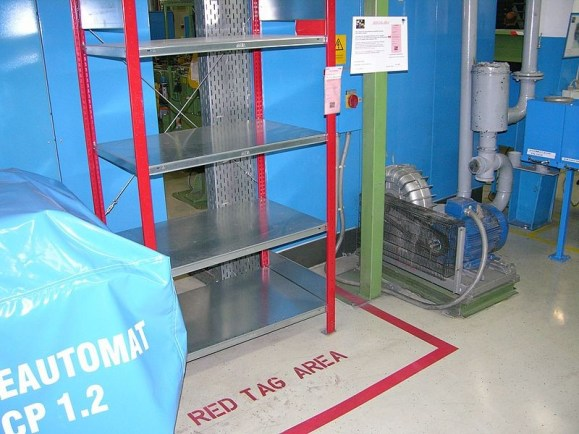
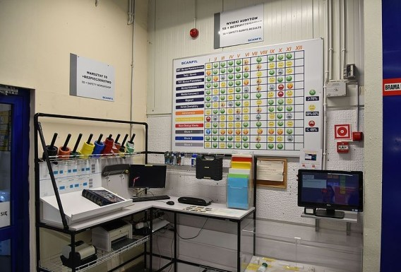
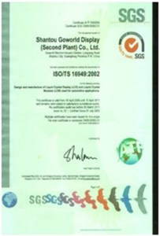
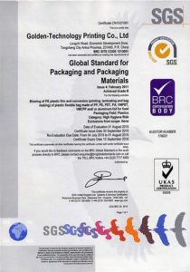
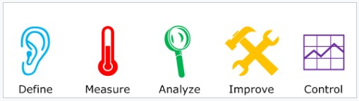
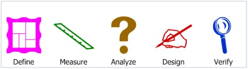

# 显示制造质量管理：5S、ISO 9001、IATF 16949、ISO 14000 与六西格玛

!!! abstract "快速结论"
    本指南解释了显示器制造质量控制,相关的设计权衡以及工程师在选择显示器解决方案时应该验证的点.

## 核心要点

- 系统了解显示制造质量管理：5S、ISO 9001、IATF 16949、ISO 14000 与六西格玛，包括关键原理、优缺点、应用场景和工程选型要点。
- 根据下文比较相关技术、应用条件和设计取舍。
- 最终选型前，应确认光学、电气、结构、环境与量产要求。

## 5S 介绍

5S是什么?

5S是一个组织空间的系统,使工作能够高效,有效和安全地进行.该系统侧重于把一切放在自己的位置上并保持工作场所的清洁度,这使人们更容易在没有浪费时间或冒险受伤的情况下完成他们的工作.

5S 翻译

在5S中涉及的五种主要做法如下:

| 日语术语 | 英文术语 | 定义 |
| --- | --- | --- |
| 整理（Seiri） | 整理 | 分类材料,只保留完成任务所需的基本项目. (此操作包括通过工作空间的所有内容来确定哪些是需要的和哪些可以删除的.所有不用于完成工作过程的东西都应该离开工作区域.) |
| 整顿（Seiton） | 整顿 | 确保所有物品都有组织性,每个物品都有指定的位置.以逻辑的方式整理工作场所留下的所有物件,使工人更容易完成任务.这通常涉及将物品放置在无需曲或做额外运动到达的地方. |
| 清扫（Seiso） | 清扫 | 积极努力保持工作场所的干净和有序,以确保有目的的工作.这意味着清洁和维护新组织的工作空间.它可能涉及清洗,粉尘等常规任务或对机器,工具和其他设备进行维护. |
| 清洁（Seiketsu） | 标准化 | 为组织和过程制定一套标准.本质上,这就是你首先采取的三个S,并制定这些任务如何和何时执行的规则. 这些标准可能涉及时间表,图表,列表等. |
| 素养（Shitsuke） | 素养 | 维持新实践和进行审计以保持纪律.这意味着过去的四个S必须随着时间推移继续下去. |

每个S代表一个五步过程的一部分,可以改善企业的整体功能.

<figure markdown="span" class="displaywiki-figure">
  [{ width="760" loading="lazy" }](quality-management-the-origins-of-5s-5s-lean-manufacturing.jpeg){ .displaywiki-image-link title="查看原图" }
  <figcaption>5S和精益制造业的起源</figcaption>
</figure>

图 1 5S

5S和精益制造业的起源

5S是丰田生产系统 (TPS) 的一部分,这是丰田汽车公司于20世纪初和中期开始的制造方法.这种系统在西方通常被称为精益制造,旨在提高产品或服务的价值给客户. 这通常通过从生产过程中找到和消除废物来实现.

精益制造涉及使用5S,kaizen,kanban, jidoka, heijunka和 poka-yoke等许多工具. 5S被认为是丰田生产系统的基本组成部分,因为直到工作场所处于干净,有组织状态,实现始终好的结果很难. 一个混乱,混杂的空间可能会导致错误,生产放缓甚至事故.

通过有系统组织的设施,一个公司增加了生产的可能性.

5S的好处

降低成本

高质量

提高生产力

增加员工满意度

更安全的工作环境

五个S是什么?

5S概念可能听起来有点抽象,但实际上,它是一个非常实用的手动工具,

5S涉及评估空间中存在的一切,消除不必要的东西,逻辑上组织事情,执行清洁任务,并保持这个循环.

让我们仔细看看5S的各个部分.

整理

5S分类的第一个步骤包括在工作场所中检查所有工具,家具,材料,设备等,以确定需要存在什么以及可以移除什么. 在此阶段提出的一些问题包括:

这个项目的目的是什么?

这是最后一次使用的?

它使用的频率是多少?

谁使用它?

它真的需要在这里吗?

这些问题有助于确定每个物品的价值.一个工作场所可能更好没有不必要的物品或很少使用的物件.这些东西可以阻碍或占用空间.

记住,在一个空间中评价物品的最好人是那些在该空间工作的人. 他们可以回答上述问题.

当一个组确定某些项目不必要时,请考虑以下选择:

交给其他部门.

回收/抛弃/销售物品

存放物品

<figure markdown="span" class="displaywiki-figure">
  [{ width="760" loading="lazy" }](quality-management-1s-a-red-tag-area-containing-items-waiting-for-removal.jpeg){ .displaywiki-image-link title="查看原图" }
  <figcaption>1S 含有待移除的物品的红色标签区域</figcaption>
</figure>

图2 1S 含有待移除的物品的红色标签区域

整顿

现在,工作组可以制定自己的排序策略.

哪些人 (或工作场所) 使用哪些东西?

什么时候使用?

最常使用的物品是哪些?

应该按整理进行分组吗?

在哪里最合乎逻辑地放置物品?

一些职位对工人来说是否比其他工作者更适合?

一些位置会减少不必要的运动吗?

需要更多的仓库容器来组织事物吗?

在这个阶段,每个人都应该确定哪些安排是最合乎逻辑的.

企业可能想停下来思考组织与更大的 Lean 努力之间的关系.

在精益制造业中,废物可以以以下形式:

缺陷

等待时间

额外的运动

剩余库存

产量过剩

额外加工

不必要的运输

未使用的才华

<figure markdown="span" class="displaywiki-figure">
  [{ width="760" loading="lazy" }](quality-management-2s-simple-floor-marking.jpeg){ .displaywiki-image-link title="查看原图" }
  <figcaption>2S 简单地板标记</figcaption>
</figure>

图3 2S 简单地板标记

清扫

每个人都认为他们知道清洁是什么,但它是最容易忽视的事情之一,特别是当工作忙碌的时候. 5S的光阶段集中在清理工作区域上,这意味着扫除,擦拭,粉尘,扫除表面,把工具和材料放在外面等.

除了基本清洁外,Shine还包括定期对设备和机械进行维护.提前规划维护意味着企业可以发现问题并防止故障.这意味着减少浪费的时间和与停工有关的利不损失.

在5S中,每个人都负责清洁工作场所,理想情况下每天. 这使得人们拥有空间,这意味着长期来说人们将更加投入到他们的工作和公司中.

<figure markdown="span" class="displaywiki-figure">
  [{ width="760" loading="lazy" }](quality-management-3s-cleanliness-point-with-cleaning-tools-and-resources.jpeg){ .displaywiki-image-link title="查看原图" }
  <figcaption>3S 使用清洁工具和资源的清洁点</figcaption>
</figure>

图4 3S 使用清洁工具和资源的清洁点

标准化

一旦5S的前三个步骤完成,事情应该看起来很好.所有额外的东西都消失了,一切都有组织,空间都清洁了,设备也在正常状态.

问题是,当5S在公司上新人时,很容易清洁和组织起来...然后慢慢让事情回归原来的样子.标准化使5S与典型的春季清理项目不同. 标准化将定期任务分配,创建时间表和发布指示,使这些活动成为常规.它为5S制定了标准的操作程序,以便秩序不会落后.

根据工作场所,每日5S检查列表或图表可能是有用的.

但随着时间的推移,任务将会变得常规, 5S 组织和清洁将成为正常工作的一部分.

素养

一旦建立了5S标准程序,企业必须继续维护这些程序并根据需要更新这些程序. 管理人员需要参与,就像工人在制造地板上,仓库或办公室一样.可持续性是为了让5S成为一个长期的计划,而不是只是一个事件或短期项目.理想情况下,5S成为组织文化的一部分. 而当5S在时间的推移下持续时,

<figure markdown="span" class="displaywiki-figure">
  [{ width="760" loading="lazy" }](quality-management-5s-resource-corner-example.jpeg){ .displaywiki-image-link title="查看原图" }
  <figcaption>5S资源角示例</figcaption>
</figure>

5. 5S资源角示例

安全 第6个S

一些公司喜欢将第六个S纳入他们的5S计划:安全.当包括安全时,系统通常被称为6S.安全步骤涉及专注于如何通过某些方式安排工作过程中的风险来消除.

这可能包括设置工作站以使它们更有机性,标记交叉路口,如叉车和步行者穿过道路的地点,并标记储备柜子清洁化学品,以便人们意识到潜在的危险. 如果工作场所的布局或人们执行的任务是危险的,那么应尽可能减少这些危险.

一些人认为安全是适当执行其他五个S的结果,因此说第六S不必要.他们认为如果工作场所正确组织和清洁并使用有用的视觉安全线索,则没有必要采取单独的安全步骤.

但是,如果企业想采取安全的方法,它应该意识到注意安全是很重要的.

## ISO9001介绍

ISO 9000质量管理系统 (QMS) 一系列标准,帮助组织确保在与产品或服务有关的法定和监管要求范围内满足客户和其他利益相关者的需求. ISO 9000涉及质量管理系统的基本原理,包括构成标准家族的七项质量控制原则.ISO 9001涉及希望达到标准的组织必须满足的要求.

第三方认证机构提供独立的确认,组织符合ISO 9001的要求.全球超过100万个组织已获得独立认证,使得ISO9001成为当今世界上最广泛使用的管理工具之一.

使用理由

在全球范围内,ISO 9001的采用可能归因于多个因素.最初,ISO9001要求旨在被采购组织使用,作为与供应商的合同安排的基础. 这有助于减少"供应商发展"的需要,通过为供应者设定基本要求来确保产品质量.

ISO 9000 系列质量管理原则

ISO 9000 系列基于七项质量管理原则 (QMP).

原则1 关注客户

组织依赖于客户,因此应了解当前和未来的客户需求,满足客户要求并努力超越客户期望.

原则2 领导

领导者建立了组织的目标和方向统一,他们应该创造并维护一个内部环境,使人们能够充分参与实现组织目标.

原则3  人员的参与

每个层面的人都是组织的核心,他们的充分参与使得他们的能力能够用于组织的利益.

原则4 过程方法

当作为一个过程管理活动和相关资源时,可更有效地实现所需的结果.

原则5 改善

改善组织的整体绩效应是该组织的永久目标.

原则6 基于证据的决策

有效的决定基于数据和信息的分析.

原则7 关系管理

组织与其外部提供商 (供应商,承包商,服务提供商) 是相互依存的,互利关系增强了双方创造价值的能力.

ISO 9001:2015的内容

ISO 9001:2015 质量管理系统 要求是每个国家的国家标准组织提供的约30页的文件.只有ISO 9001用于第三方评估目的进行直接审计.

ISO 9001:2015的内容如下:

第1节 范围

第二节:规范性引用

第三节:术语和定义

第四节:组织的背景

第五节:领导

第6节:规划

第7节:素养

第8节:运营

第9节:绩效评估

第十节:持续改进

基本上,标准的布局以基于过程的方法遵循计划,做,检查,行为循环.质量目标的目的是确定要求 (客户和组织) 的合规性,促进有效部署和改善质量管理系统.

在ISO 9001认证机构能够颁发或续签证书之前,审计师必须确信被评估的公司已经执行了第4至10节的要求. 1至3节没有直接进行审计,但由于它们提供了其他标准的背景和定义,而不是组织的定义,因此必须考虑到其内容.

该标准不再规定组织应发行和维护文档程序,但ISO 9001:2015要求组织记录其有效运作所需的其他程序. 该标准还要求组织发布并传达记录的质量政策,质量管理系统范围和质量目标.该标准不再要求合规组织发布正式的质量的手册. 2015年发布的一项新要求是组织评估风险和机会 (6.1节) 以及确定与其目的和战略方向相关的内部和外部问题 (4.1节). 组织必须证明标准要求如何得到满足,而外部审计师的作用是确定质量管理体系的有效性. 在可能非常技术领域寻求更多信息的组织经常寻求更详细的解释和实施例子.

ISO 9001 认证

国际标准化组织 (ISO) 并不是自己认证的组织.有许多认证机构存在,这些机构进行了审计,并在成功后发行了ISO 9001合规性证书.

一个申请ISO 9001认证的组织根据其网站,功能,产品,服务和流程的广泛样本进行审计.审计师向管理层提交了问题列表 (定义为不符合,观察或改善机会). 如果没有重大违规情况,认证机构会发出证书.如果发现重大违约情况,组织将向认证机关提交一个改进计划 (例如,说明问题如何解决的纠正行动报告); 一旦认证机构确信组织已经采取了足够的纠正措施,它会发出一个证书.该证书具有一定范围,并显示了证书所指的地址.

一个ISO 9001证书不是一次性授予,但必须在认证机构建议的定期间隔上更新,通常每三年一次. 一个公司要么是经过认证 (这意味着它致力于标准中描述的质量管理方法和模式),要么不是.在这方面,ISO 9001认证与基于测量的质量系统形成对比.

ISO 9001引入 审计

要注册标准,需要进行两种整理的审计:由外部认证机构 (外部审计) 进行审计和本过程中训练有素的内部人员 (内部审计). 目的是持续审查和评估,以验证该系统是否正常运行,找出它可以改善的地方,以及纠正或预防已发现的问题. 内部审计人员在通常的管理线之外进行审计是最健康的,以确保他们的判断有一定程度的独立性.

### 优势

适当的质量管理可以改善业务,通常对投资,市场份额,销售增长,销量利,竞争优势和避免诉讼产生积极影响. 根据韦德和巴恩斯的说法,ISO 9000指导方针为质量管理系统提供了一个全面的模型,可以使任何公司具有竞争力. 斯鲁夫和库尔科维奇 (2008) 发现,从保持供应基础的一部分所需的注册,更好的文档,到成本效益以及与管理层进行更好的参与和沟通等各类好处.根据ISO 2015版本的标准带来了以下好处:

- 通过评估它们的背景,组织可以确定谁受到其工作的影响和他们预期什么. 这使得明确明确的业务目标并识别新的业务机会.

- 组织可以识别和应对与其组织相关的风险.

- 通过将客户放在首位,组织可以确保他们始终满足客户需求并提高客户满意度. 这可能导致更多的重复客户,新客户和增加企业业务.

- 组织更有效地工作,因为所有过程都被协调和理解. 这增加了生产力和效率,降低了内部成本.

- 组织将满足必要的法定和监管要求.

- 组织可以扩展到新市场,因为一些行业和客户在开展业务之前需要ISO 9001.

<figure markdown="span" class="displaywiki-figure">
  [{ width="760" loading="lazy" }](quality-management-example-of-iso9001-certification.jpeg){ .displaywiki-image-link title="查看原图" }
  <figcaption>ISO9001认证的例子</figcaption>
</figure>

- 图 1 ISO9001认证的例子

## 第16949条 介绍

ISO TS 16949是一个ISO技术规范,旨在开发一个质量管理系统,以确保持续改进,强调缺陷预防和减少汽车行业供应链和生产中的变化和废物.它基于ISO 9001标准.

它由国际汽车工作组 (IATF) 和ISO的技术委员会编制.

在现有100多家汽车制造商中,大约30%的汽车厂商符合该规范的要求,

ISO/TS 16949适用于汽车相关产品的设计/开发,生产和酌情安装和维修.

这些要求将应用于整个供应链.首次鼓励车辆装配厂寻求ISO/TS 16949认证.

规格内容

标准TS16949的目的是提高系统和工艺质量,以提高客户满意度,识别生产过程和供应链中的问题和风险,消除其原因,检查并采取纠正和预防措施以确保其有效性. 标准的八个主要章节是:

1-3章:介绍和前言

第四章:质量管理体系 (一般要求,文件和记录的控制)

4.1 一般

4.2 文件要求

4.2.1 一般

4.2.2 质量手册

4.2.3 文件控制

4.2.3.1 工程规范

4.2.4 记录控制

4.2.4.1 记录保存

第5章 管理人员的责任

第6章 资源管理

第7章 产品实现

第8章 测量,分析和改进

该标准的基础是ISO 9001:2008中解决的业务流程以工艺为导向的方法.它研究了过程环境中的商业流程,其中需要通过质量管理系统识别,映射和控制的交互和接口. 此外,定义了对外部的门户 (向子供应商,客户和偏远地点).该标准区分了以客户为导向的流程,素养流程和管理流程.这种以过程为导导向的方式旨在改善整个流程的概况. 这不是一个单独的过程,而是影响企业质量表现的所有互动业务流程的结合.

标准ISO/TS 16949:2009的一个关键要求是汽车制造商除了供应商的质量管理系统外,还必须满足客户特定要求.这可能有助于许多制造者在全球范围内认可TS.

认证ISO/TS 16949

在汽车行业中,ISO/TS 16949可在整个供应链中应用.认证基于国际汽车工作组 (IATF) 颁布的认证规则. 该证书有效期为三年,必须每年 (至少) 通过IATF认可的认证机构第三方审计师进行一次认证. 根据ISO/TS 16949的认证旨在建立或强化 (潜在) 客户对 (潜) 供应商系统和流程质量的信心. 如今,没有有效证书的供应商很少有机会向一级供应国提供标准零部件,如果该OEM确实是IATF的参与成员,那么绝对不会给汽车制造商提供标准部件.

<figure markdown="span" class="displaywiki-figure">
  [{ width="760" loading="lazy" }](quality-management-iso-ts16949-certificate.jpeg){ .displaywiki-image-link title="查看原图" }
  <figcaption>ISO/TS16949证书</figcaption>
</figure>

图1 ISO/TS16949证书

## ISO 14000 介绍

ISO 14000 是一个与环境管理相关的标准,用于帮助组织 (a) 尽量减少其运作 (过程等) 对环境产生负面影响 (即对空气,水或陆地造成不利变化); (b) 遵守适用的法律,法规和其他环保要求;

ISO 14000与ISO 9000质量管理相似,因为这两者都涉及到产品的生产过程,而不是产品本身.就像ISO 9001一样,认证是由第三方组织执行的,而非由ISO直接授予. 目前的ISO 14001版本是ISO 14001: 2015.

发展ISO 14000系列

在ISO 14000家族中最重要的是ISO 14001标准,它代表了组织设计和实施有效环境管理系统 (EMS) 中使用的核心标准. 本系列的其他标准包括ISO 14004,为良好的EMS提供额外指导,以及更专业化的标准处理环境管理的具体方面. ISO 14000标准系列的主要目标是为各类企业和组织提供实用工具,以管理其环境责任.

ISO 14000 系列基于对环境监管的自愿方法.该系列包括ISO 14001标准,该标准提供了建立或改进EMS的指导方针.

标准ISO 14001

ISO 14001定义了EMS的标准.它不规定环境性能要求,而是绘制了一个公司或组织可以遵循的框架来建立一个有效的EMS. 它可被任何希望提高资源效率,减少浪费和降低成本的组织使用. 使用ISO 14001可以为公司管理层和员工以及外部利益相关者提供测量和改善环境影响的保证. ISO 14001也可与其他管理职能集成,并帮助企业实现其环境和经济目标.

ISO 14001被称为一个通用管理系统标准,这意味着它对于任何寻求更有效地改善和管理资源的组织都是相关的.

一个地点到大型多国企业

高风险企业到低风险服务机构

制造业,工艺和服务行业,包括地方政府

所有行业,包括公共和私营部门

原装制造商及其供应商

标准 ISO 14001:2015

所有标准都定期由ISO审查,以确保它们仍然符合市场要求.目前的版本是ISO 14001:2015,并且认证组织获得了三年的过渡期来适应其环境管理系统新版标准. 新版本的ISO 14001专注于改善环境性能,而不是改进管理系统本身.它还包括一些新的更新,所有这些都旨在使环境管理更全面和更适合供应链. 其中一个主要更新要求组织在整个生命周期中考虑环境影响,尽管没有必要实际完成生命周期分析.此外,高级管理层的承诺和评估合规性方法也得到加强. 另一个重大变化将ISO 14001与2015年推出的一般管理系统结构联系起来,称为高级别结构.ISO 9001和14001都使用相同的结构,使实施和审计更加统一. 新标准还要求证书持有人指定风险和机会以及如何应对它们.

基本原则和方法

标准ISO 14001的基本原则是基于已知计划-做-检查-行为 (PDCA) 周期.

<figure markdown="span" class="displaywiki-figure">
  [{ width="760" loading="lazy" }](quality-management-the-pdca-cycle.jpeg){ .displaywiki-image-link title="查看原图" }
  <figcaption>PDCA周期</figcaption>
</figure>

图1.PDCA周期

计划:确定所需的目标和流程

在实施ISO 14001之前,建议对组织的工艺和产品进行初步审查或缺口分析,以帮助确定可能与环境相互作用的现行运营的所有元素以及未来运营. 环境方面可以包括直接的,例如在制造过程中使用的,以及间接的,如原材料. 这项审查帮助组织确定其环境目标,目标和目标 (理想情况下应该是可测量的); 它有助于制定控制和管理程序和流程,并突出了任何相关的法律要求,然后可以纳入政策.

执行:实施过程

在这个阶段,组织确定所需的资源并制定负责EMS实施和控制的组织成员.这包括建立程序和流程,尽管只有一个文档程序与操作控制有关. 需要其他程序来促进更好的管理控制,例如文件控制,应对紧急情况的准备和响应以及员工的教育,以确保他们能够有效地实施必要的流程并记录结果. 组织各层面的沟通和参与,特别是高级管理层,是实施阶段的一个重要组成部分,EMS的有效性取决于所有员工积极参与.

检查:测量和监控过程,报告结果

在检查阶段,绩效监测和定期测量以确保组织实现环境目标和目标. 此外,按计划间隔进行内部审计,以确定EMS是否符合用户的期望以及是否正在适当维护和监控流程和程序.

法律:根据结果采取措施改善EMS的绩效

经过检查阶段,进行管理审查,以确保实现EMS的目标,到何程度达到这些目标,并适当地管理通信. 此外,该审查还评估了不断变化的环境,例如法律要求,以提出进一步改善系统的建议.这些建议通过持续改进纳入:计划更新或制定新计划,EMS向前迈进.

持续改进过程 (CI)

ISO 14001鼓励企业不断提高其环境绩效.除了显而易见的减少实际和可能的负面环境影响之外,这可以通过三种方式实现.

扩张:实施的EMS越来越多地覆盖商业领域.

丰富:活动,产品,工艺,排放,资源等都越来越多地由实施的EMS管理.

升级:改善了EMS的结构和组织框架,以及处理商业环境问题的知识积累.

总体而言,IC概念预计组织将逐渐从仅仅是运营的环境措施转向更具战略性的方法来应对环境挑战.

标准ISO 14001:2015的主题

在最高水平上,ISO 14001:2015涵盖了环境管理系统的以下主题:

组织的背景

领导

规划

素养

行动

绩效评估

改进

符合性评估

ISO 14001可以全部或部分用于帮助组织更好地管理其与环境的关系. 如果ISO 14001的所有要素都被纳入管理过程中,组织可以选择通过使用四个已认可的选项之一来证明它已经实现了与国际标准ISO14001完全一致或符合.

进行自决和自我声明,或

寻求对组织有兴趣的当事人,如客户,确认其合规性;或

寻求组织外部方确认其自声明,或

要求外部组织认证/注册其EMS.

益处

使用ISO 14001:2015对具有环境管理系统的组织有很多好处.

提高资源效率

减少废物

降低成本

确保正在测量环境影响

在供应链设计中获得竞争优势

增加新的商业机会

履行法律义务

增加利益相关者和客户的信任

改善整体环境影响

一贯管理环境义务

ISO 14001 认证

已经获得ISO 14001认证的组织被鼓励过渡到2015年版本.组织将有三年的过渡期来更新其环境管理系统到新标准.

为了开始使用ISO 14001:2015:

审查现有的质量管理系统要求 (ISO 9001:2015)

购买ISO 14001:2015

获得ISO 14001培训

认证ISO 14001

<figure markdown="span" class="displaywiki-figure">
  [{ width="760" loading="lazy" }](quality-management-iso14000-certificate.jpeg){ .displaywiki-image-link title="查看原图" }
  <figcaption>ISO14000证书</figcaption>
</figure>

图2 ISO14000证书

## 六西格马的介绍

六西格马 (6σ) 是一套用于过程改进的技术和工具.它由美国工程师比尔·史密斯在1986年在摩托罗拉公司工作期间引入,杰克·威尔奇于1995年将其作为通用电气公司业务战略的核心. 一个六 sigma 过程是其中 99.99966% 的所有产出部分特征的机会统计预计没有缺陷.

基因学基于希腊符号sigma或σ,一个统计术语来测量过程偏差的过程中位数或目标. 如果该过程有六个Sigma,三个以上和三个低于平均值,则缺陷率被归类为极低.

下面的正常分布图突出了六西格马模型的统计假设.标准偏差越高,发现值的扩散就越高.因此,平均距离最接近规范极限最低6σ的过程是针对六西ગ્玛的.

<figure markdown="span" class="displaywiki-figure">
  [{ width="760" loading="lazy" }](quality-management-sigma-levels.jpeg){ .displaywiki-image-link title="查看原图" }
  <figcaption>西格马级别</figcaption>
</figure>

正常分布图,这是六西格马模型统计假设的基础.在0点中,希腊文字μ (mu) 标志着平均值,水平轴显示距离与平均值的距离,以标准偏差标记并给出字母 σ (sigma). 标准偏差越大,发现值的分布就越大.对于上述绿色曲线,μ = 0 和 σ = 1. 上方和下方规范界限 (标记为USL和LSL) 与平均距离是6σ. 由于正常分布的特性,距离平均水平之遥远的值极为不太可能:大约每十亿分之一是过低的,同样是过高的. 即使平均值在未来某个时刻移向右或左1.5σ (1.5sigma转变,颜色为红和蓝),仍然存在良好的安全枕头.

西格马级别

控制图表描述了在过程中出现1.5 sigma漂移的过程,即从午夜开始向上方规范限制.控制图用于通过信号来保持6 sigma质量,以表明质量专业人员应该调查一个过程,寻找和消除特殊原因差异.

下面的表显示了长期DPMO (每百万机会的缺陷部分) 值,相应于各种短期sigma水平.

这些数据假设过程平均值将1.5sigma向关键规格极限移动.换句话说,他们假设在确定短期sigma水平的初步研究后,长期CPK值将比短期CPK价值低0.5. 现在,例如,为1sigma提供的DPMO数字假设长期过程平均值将超过规范限制的0.5sigma (Cpk = 0.17),而不是在它内的1 sigma, 请注意,缺陷百分比仅表示超过工艺平均值最接近的规格限制的缺陷.

在这里用于计算DPMO的公式是

<figure markdown="span" class="displaywiki-figure">
  [{ width="760" loading="lazy" }](quality-management-the-5-key-principles-of-six-sigma.jpeg){ .displaywiki-image-link title="查看原图" }
  <figcaption>六西格玛的五个关键原则</figcaption>
</figure>

六西格玛的概念有一个简单的目标为客户满意度 (CX) 实现业务转型提供近乎完美的商品和服务.

六西格玛的基础是五个关键原则:

专注于客户

这基于人们普遍认为,客户是国王. 首要目标是为客户带来最大的利益. 为此,企业需要了解其客户,他们的需求以及推动销售或忠诚性的原因. 这需要根据客户或市场的要求确定质量标准.

衡量价值流,找出问题

绘制一个特定过程中的步骤,确定废物区域.收集数据以发现应解决或转换的具体问题区域. 有明确的数据收集目标,包括定义要收集的数据,收集数据的原因,预期的见解,确保测量的准确性和建立标准化的数据收集系统. 确定数据是否有助于实现目标,是否需要改进数据或收集额外的信息.识别问题.问问题并找出根本原因.

摆脱垃圾

一旦发现问题,请对过程进行更改,以消除变化,从而消除缺陷. 删除该过程中不增加客户价值的活动. 如果价值流未透露问题所在,则使用工具来帮助发现异常值和问题区域. 简化功能以实现质量控制和效率. 最后,通过消除上述垃圾,该过程中的瓶被消除.

让球滚动

参与所有利益相关者.采用一个结构化的过程,你的团队为解决问题贡献和协作他们的各种专业知识.六西格马进程可以对组织产生很大的影响,因此团队必须熟练掌握使用的原则和方法. 因此,需要专门的培训和知识来降低项目或重新设计故障的风险,并确保该过程运行最佳.

确保灵活和响应的生态系统

六肖的本质是企业转型和变化.当消除一个有缺陷或不高效的过程时,它需要改变工作实践和员工方法. 相关人员和部门应能够轻松适应变化,因此为了促进这一点,应为快速无的采用设计过程. 最终,关注数据的公司定期检查底线,并在必要时调整其流程,可以获得竞争优势.

方法

六个SIGMA项目采用了Deming's PlanDoStudyAct Cycle灵感的两个项目方法.这些方法,每个阶段由五个阶段组成,被称为DMAIC和DMADV.

DMAIC用于改善现有业务流程的项目.

DMADV用于旨在创建新产品或工艺设计的项目.

鱼类

<figure markdown="span" class="displaywiki-figure">
  [{ width="760" loading="lazy" }](quality-management-the-five-steps-of-dmaic.jpeg){ .displaywiki-image-link title="查看原图" }
  <figcaption>DMAIC的五个步骤</figcaption>
</figure>

图 1 DMAIC 的五步

上述企业转型各阶段都有几个步骤:

定义

六西格马过程始于以客户为中心的方法.

步骤1:从客户的角度来定义业务问题.

第二步:设定目标.你想实现什么?

步骤3:绘制进程,向利益相关者确认您正处于正确的道路上.

测量

第二阶段集中在项目的指标和测量中使用的工具上.

步骤1:用数字或素养数据来衡量问题.

步骤2:定义性能标准.

第三步:评估要使用的测量系统.它能帮助你达到你的结果吗?

分析

第三阶段分析过程,以发现影响变量.

步骤1:确定您的过程是否高效和有效.

第二步:量化你的目标,比如减少20%的缺陷产品.

步骤3:使用历史数据识别变化.

进步

这一过程探讨了X变化如何影响Y.

步骤1:确定可能的原因.测试确定III过程中识别的X变量中的哪些影响Y.

第二步:发现变量之间的关系.

步骤3:确定过程耐受性,定义为某些变量可以具有的精确值,但仍然属于可接受的界限,例如给定的产品质量.哪些界限需要X来保持Y在规格范围内?哪些操作条件会影响结果? 通过使用强大的优化和验证集等工具来实现过程宽容.

控制

在此最后阶段,您确定前一阶段所确定的绩效目标已得到充分实现,并且预计的改进是可持续的.

步骤1:验证要使用的测量系统.

第二步:确定工艺能力.目标是否已实现?例如,能否达到20%减少缺陷产品的目标?

步骤3:一旦之前的步骤得到了满足,

DMADV或DFSS

<figure markdown="span" class="displaywiki-figure">
  [{ width="760" loading="lazy" }](quality-management-the-five-steps-of-dmadv.jpeg){ .displaywiki-image-link title="查看原图" }
  <figcaption>五个步骤:</figcaption>
</figure>

图2 DMADV的五步

DMADV项目方法称为DFSS ( Six Sigma) 五个阶段:

确定与客户需求和企业战略一致的设计目标.

测量和识别CTQ (质量关键的特征),测量产品能力,生产过程能力和风险.

分析开发和设计替代方案.

设计一个改进的替代方案,最适合每一步分析

验证设计,设置试点运行,实施生产过程并将其交给工艺所有者.

质量管理工具和方法

在DMAIC或DMADV项目的单个阶段内,Six Sigma利用了许多已建立的质量管理工具,这些工具也在Six sigma之外使用.下面表显示了主要方法的概述.

5. 为什么

统计和配件工具

变异分析

一般线性模型

安诺瓦测量仪 R&R

逆转分析

相关性

散布图

奇方体测试

轴心设计

商业过程映射/检查表

原因与影响图 (也称为鱼骨或石川图)
