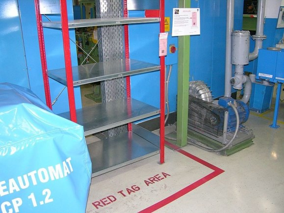
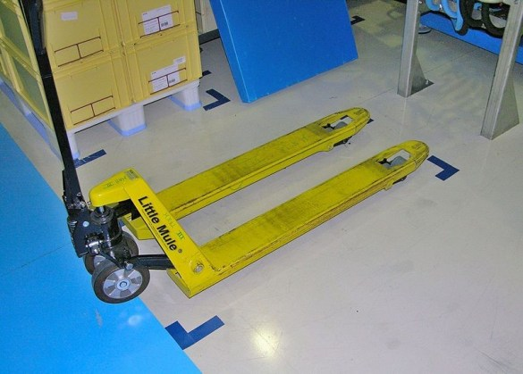
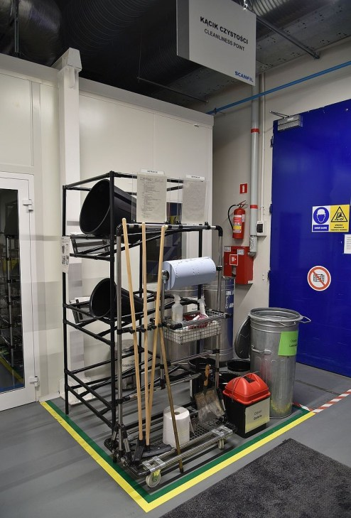
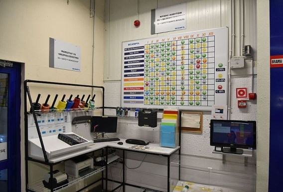
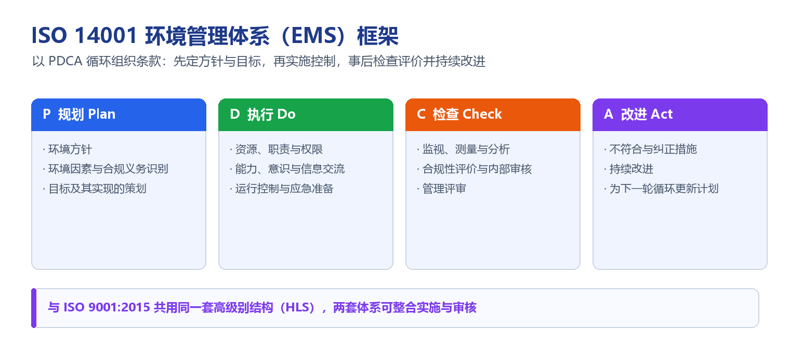
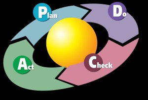
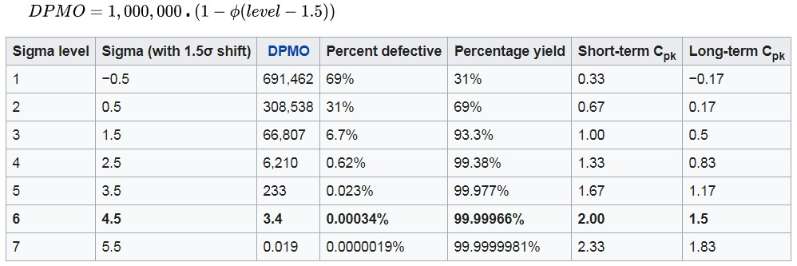
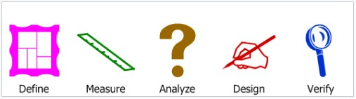

# 显示制造质量管理：5S、ISO 9001、IATF 16949、ISO 14000 与六西格玛

!!! abstract "快速结论"
    显示制造的质量管理通常由五套体系构成：5S 解决现场秩序，ISO 9001 建立质量管理体系的通用框架，IATF 16949 在 ISO 9001 基础上叠加汽车行业的严苛要求，ISO 14001 管理环境责任，六西格玛则用统计数据驱动过程改善。对采购方而言，ISO 9001 是最低门槛，车载项目必须看 IATF 16949，5S 与六西格玛水平则反映了工厂的日常管理功力。

## 核心要点

- 5S 是现场管理的基础，通过整理、整顿、清扫、清洁、素养形成可持续的作业秩序。
- ISO 9001 是通用质量管理框架，基于七项质量管理原则，采用 PDCA 与过程方法。
- IATF 16949 由国际汽车工作组制定，基于 ISO 9001，适用于汽车供应链，认证有效期为三年并需每年监督审核。
- ISO 14001 管理组织的环境影响，与 ISO 9001 共用高级别结构，可整合实施。
- 六西格玛以 6σ 对应 3.4 DPMO 为目标，用 DMAIC 改善现有流程、用 DMADV 设计新流程。

## 1. 为什么显示制造需要体系化的质量管理

显示屏是典型的多工序、长链条产品：从玻璃基板、ITO 镀膜、光刻、贴合到模组组装与老化测试，任何一道工序的波动都可能转化为可见的缺陷——亮点、暗点、Mura、贴合气泡或偏色。这类缺陷往往在成品检验阶段才能被发现，此时返工成本已经很高。

因此显示制造普遍采用多套管理体系叠加的方式：用 5S 管现场，用 ISO 9001 管流程，用车载标准管特殊行业要求，用环境体系管合规，用六西格玛管持续改善。

## 2. 5S：现场管理的基础

### 2.1 五个 S 的含义

5S 是一套组织工作空间的系统方法，目标是让工作高效、有效且安全地进行。核心思路是"把每样东西放在它该在的位置，并保持工作场所的清洁"，从而减少时间浪费与受伤风险。

| 日语术语 | 中文 | 定义 |
|---|---|---|
| 整理（Seiri） | 整理 | 区分必需品与非必需品，只保留完成工作所需的基本物品 |
| 整顿（Seiton） | 整顿 | 为每件物品指定固定位置，按逻辑排列，减少取放动作 |
| 清扫（Seiso） | 清扫 | 保持工作场所干净有序，同时承担设备日常点检与维护 |
| 清洁（Seiketsu） | 标准化 | 把前三个 S 固化为标准与规则，明确何时、由谁执行 |
| 素养（Shitsuke） | 素养 | 长期维持并定期审核，使前四个 S 成为习惯 |

<figure markdown="span" class="displaywiki-figure">
  [{ width="760" loading="lazy" }](quality-management-the-origins-of-5s-5s-lean-manufacturing.jpeg){ .displaywiki-image-link title="查看原图" }
  <figcaption>5S 的五个步骤及其循环关系：整理、整顿、清扫、清洁、素养依次推进并持续循环</figcaption>
</figure>

### 2.2 从丰田生产系统到精益制造

5S 是丰田生产系统（TPS）的组成部分，这套制造方法由丰田汽车公司在 20 世纪初至中期逐步建立，在西方通常被称为精益制造，目标是通过识别并消除生产过程中的浪费，提升产品或服务对客户的价值。

精益制造的工具箱中包含 5S、kaizen（改善）、kanban（看板）、jidoka（自働化）、heijunka（均衡化）与 poka-yoke（防错）等方法。5S 被视为 TPS 的基础环节：工作场所不整洁、物品混杂时，很难稳定地产出好结果——混乱的空间会带来错误、生产放缓甚至事故。

### 2.3 五个 S 的落地做法

**整理**：逐一检查工作场所中的工具、家具、材料与设备，判断哪些必须保留、哪些可以移走。可用的判断问题包括：这件物品的用途是什么？最后一次使用是什么时候？使用频率多高？由谁使用？它真的需要放在这里吗？

确定某些物品不再需要后，通常有三种处理方式：移交给其他部门、回收或变卖、入库封存。

<figure markdown="span" class="displaywiki-figure">
  [{ width="760" loading="lazy" }](quality-management-1s-a-red-tag-area-containing-items-waiting-for-removal.jpeg){ .displaywiki-image-link title="查看原图" }
  <figcaption>1S 落地示例：用红色标线划出待处理区，暂时无法判定用途的物品集中挂牌等待处置</figcaption>
</figure>

**整顿**：为留下的物品规划位置。需要回答的问题包括：哪些人使用哪些东西？什么时候用？哪些物品使用最频繁？放在哪里取用最顺手？是否需要更多收纳容器？目标是让物品"伸手可得"，减少不必要的走动与动作。

在精益制造的语境中，浪费包括缺陷、等待、多余动作、库存积压、过量生产、过度加工、不必要的搬运以及未被利用的才能，整顿正是为了消除其中的"多余动作"与"等待"。

<figure markdown="span" class="displaywiki-figure">
  [{ width="760" loading="lazy" }](quality-management-2s-simple-floor-marking.jpeg){ .displaywiki-image-link title="查看原图" }
  <figcaption>2S 落地示例：用地面标记为工位器具划定固定停放位置，物品归位情况一目了然</figcaption>
</figure>

**清扫**：清扫不只是"看起来干净"，还包括扫、擦、除尘以及把工具材料放回指定位置。更重要的是，清扫过程本身就是设备点检——提前发现异常可以避免突发故障，减少停机带来的时间与利润损失。在 5S 体系中，每个人都要对自己工位的清洁负责，理想状态是每天执行。

<figure markdown="span" class="displaywiki-figure">
  [{ width="760" loading="lazy" }](quality-management-3s-cleanliness-point-with-cleaning-tools-and-resources.jpeg){ .displaywiki-image-link title="查看原图" }
  <figcaption>3S 落地示例：设置专门的清洁点，集中存放清洁工具与耗材，避免工具散落影响现场秩序</figcaption>
</figure>

**清洁（标准化）**：前三个 S 完成后，现场会明显改善。但真正的挑战是维持——新人加入、生产繁忙时，很容易慢慢回到原样。标准化正是 5S 与"春季大扫除"的本质区别：把定期任务分配到人、制定时间表并发布操作指示，让这些活动变成常规作业，形成标准作业程序。

**素养**：标准建立之后还需要持续维护与更新。管理者与一线员工都要参与其中。可持续的关键在于让 5S 成为企业文化的一部分，而不是一次性的运动或短期项目。当 5S 长期坚持下去，组织与清洁就会成为日常工作的一部分。

<figure markdown="span" class="displaywiki-figure">
  [{ width="760" loading="lazy" }](quality-management-5s-resource-corner-example.jpeg){ .displaywiki-image-link title="查看原图" }
  <figcaption>5S 落地示例：现场资源角集中管理工具与量具，配合看板公示状态，是维持素养阶段的具体载体</figcaption>
</figure>

### 2.4 第六个 S：安全

一些企业会把安全（Safety）作为第六个 S 纳入体系，此时通常称为 6S。安全环节的重点是识别并消除作业过程中的风险，例如优化工作站布局、标记叉车与行人交叉的路线、在存放清洁化学品的柜子上加标识以提示潜在危险。如果工作场所布局或作业任务本身存在危险，应尽可能降低这些风险。

也有观点认为，安全是正确执行前五个 S 的自然结果，无需单列：如果工作场所组织得当、清洁到位，并且设置了有效的视觉安全提示，就不必再单独开展安全步骤。无论采取哪种方式，把安全作为明确目标的企业，都应当意识到它的重要性。

## 3. ISO 9001：质量管理体系

### 3.1 ISO 9000 系列与七项质量管理原则

ISO 9000 系列是质量管理体系（QMS）标准族，用于帮助组织在满足法定与监管要求的前提下，满足客户及其他相关方的需求。其中 ISO 9000 阐述质量管理体系的基本原理，ISO 9001 则规定了希望达到标准的组织必须满足的要求。

ISO 9000 系列建立在七项质量管理原则（QMP）之上：

| 原则 | 内涵 |
|---|---|
| 1. 以客户为关注焦点 | 组织依赖客户，应理解当前与未来的客户需求，满足要求并努力超越期望 |
| 2. 领导作用 | 领导者统一组织的目标与方向，并创造让员工充分参与的内部环境 |
| 3. 全员参与 | 各层级人员都是组织的根本，充分参与才能让能力为组织创造价值 |
| 4. 过程方法 | 将活动与相关资源作为过程管理，能更高效地得到期望结果 |
| 5. 改进 | 持续改进整体绩效应成为组织的永久目标 |
| 6. 基于证据的决策 | 有效决策建立在数据与信息分析之上 |
| 7. 关系管理 | 组织与外部供方相互依存，互利关系增强双方创造价值的能力 |

### 3.2 ISO 9001:2015 的结构

ISO 9001:2015 的要求文件约 30 页，由各国国家标准机构发布，也是唯一可直接用于第三方审核的 ISO 9001 版本。其章节结构如下：

| 章节 | 内容 |
|---|---|
| 第 1–3 章 | 范围、规范性引用、术语和定义 |
| 第 4 章 | 组织的背景 |
| 第 5 章 | 领导作用 |
| 第 6 章 | 策划 |
| 第 7 章 | 支持 |
| 第 8 章 | 运行 |
| 第 9 章 | 绩效评价 |
| 第 10 章 | 改进 |

标准整体按过程方法组织，遵循 PDCA 循环。审核时，认证机构需要确认受审核组织已经落实第 4 至第 10 章的要求；第 1 至 3 章虽不直接审核，但提供了其他标准的背景与定义，同样需要纳入考虑。

与旧版相比，2015 版不再强制要求组织发布正式的质量手册等成文程序，而是要求保留有效运行所需的记录，并发布和传达质量方针、质量管理体系范围与质量目标。新增的要求包括：评估风险与机遇（6.1 节）、确定与组织宗旨和战略方向相关的内外部问题（4.1 节）。组织必须能够证明各项要求如何得到满足，外部审核员的作用是判定质量管理体系的有效性。

### 3.3 认证与审核

ISO 本身并不直接认证组织，认证由独立的认证机构执行——审核通过后颁发 ISO 9001 合规证书。

认证过程大致为：认证机构对申请组织在场所、职能、产品、服务与流程等方面进行抽样审核；审核员向管理层提交问题清单（通常分为不符合项、观察项与改进机会）。若没有重大不符合，认证机构即颁发证书；若发现重大不符合，组织需要提交改进计划（例如说明问题如何纠正的纠正措施报告），认证机构确认措施充分后再行发证。证书带有明确的范围，并标明所覆盖的地址。

ISO 9001 证书不是一次授予终身有效，必须按认证机构建议的周期更新，通常是每三年一次。企业要么通过认证（意味着承诺采用标准描述的质量管理方法），要么没有通过——与基于测量的质量体系不同，ISO 9001 认证是二元的判定。

要注册该标准，需要接受两类审核：由外部认证机构实施的外部审核，以及由经过训练的内部人员实施的内部审核。目的是持续审查与评估，验证体系是否正常运行、找出可改进之处并纠正或预防已发现的问题。内部审核员在常规管理线之外开展审核，有助于保证判断的独立性。

<figure markdown="span" class="displaywiki-figure">
  [{ width="760" loading="lazy" }](quality-management-example-of-iso9001-certification.jpeg){ .displaywiki-image-link title="查看原图" }
  <figcaption>ISO 9001 认证证书示例：由第三方认证机构颁发，证书载明覆盖范围与有效地址</figcaption>
</figure>

### 3.4 实施收益

适当的质量管理可以改善经营表现，通常对投资回报、市场份额、销售增长、销量与利润、竞争优势以及规避诉讼都有正面影响。ISO 9000 指南为质量管理体系提供了一套完整模型，可以帮助任何企业建立竞争力；相关研究也指出，收益涵盖从保持供应基础所需的注册资格、更好的文档管理，到成本效益以及与管理者更顺畅的参与和沟通。

ISO 9001:2015 版本带来的具体收益包括：

- 通过评估组织背景，明确谁受到影响、他们的期望是什么，从而理清业务目标并发现新的机会。
- 识别并应对与组织相关的风险。
- 以客户为关注焦点，确保需求得到满足并提升满意度，带来更多复购与新客户。
- 由于各过程被协调与理解，组织运作更高效，生产力与效率提升、内部成本下降。
- 满足必要的法定与监管要求。
- 进入新市场更顺畅——部分行业与客户在开展业务前明确要求 ISO 9001。

## 4. IATF 16949：汽车行业质量管理

### 4.1 标准内容

IATF 16949（早期称 ISO/TS 16949）是在 ISO 9001 基础上，面向汽车行业供应链的质量管理体系要求，强调持续改进、缺陷预防，以及减少供应链与生产环节的波动与浪费。该标准由国际汽车工作组（IATF）与 ISO 技术委员会共同编制。

标准适用于汽车相关产品的设计/开发、生产，以及酌情适用的安装与维修，要求贯穿整个供应链。车辆的整车装配厂也被鼓励申请 IATF 16949 认证。

标准的目标是提升系统与过程质量，从而提高客户满意度：识别生产过程与供应链中的问题与风险，消除其根本原因，并通过检查、纠正与预防措施确保有效性。其主体章节与 ISO 9001 的框架对应：

| 章节 | 内容 |
|---|---|
| 第 1–3 章 | 引言与范围 |
| 第 4 章 | 质量管理体系（一般要求、文件与记录控制、工程规范） |
| 第 5 章 | 管理职责 |
| 第 6 章 | 资源管理 |
| 第 7 章 | 产品实现 |
| 第 8 章 | 测量、分析与改进 |

标准的方法论基础是 ISO 9001 中以业务流程为导向的过程方法，研究过程环境中的商业流程，识别、映射并控制其中的交互与接口，同时明确对外接口（分供方、客户与远程场所）。标准区分了面向客户的流程、支持流程与管理流程，目标是改善整体流程的全貌，而不是孤立地优化单个过程。

一个关键要求是：汽车制造商及其供应商除了建立质量管理体系外，还必须满足客户的特定要求（CSR）。

### 4.2 认证要求

在汽车行业中，IATF 16949 可在整个供应链中应用，认证依据国际汽车工作组发布的认证规则执行。证书有效期为三年，期间必须至少每年由 IATF 认可的第三方审核员实施一次监督审核。

该认证的意义在于建立或强化客户对供应商体系与过程质量的信心。如今，若 OEM 是 IATF 的成员，没有有效证书的供应商几乎没有机会为其提供标准零部件。

<figure markdown="span" class="displaywiki-figure">
  [{ width="760" loading="lazy" }](quality-management-iso-ts16949-certificate.jpeg){ .displaywiki-image-link title="查看原图" }
  <figcaption>IATF 16949（早期称 ISO/TS 16949）认证证书示例：有效期三年，期间需每年监督审核</figcaption>
</figure>

## 5. ISO 14001：环境管理体系

### 5.1 标准定位与适用范围

ISO 14000 系列是与环境管理相关的标准，帮助组织尽量减少运营过程对环境的负面影响（如对空气、水体或土地造成的不利变化），并遵守适用的法律、法规与其他环保要求。

与 ISO 9000 类似，ISO 14000 关注的是产品的生产过程而非产品本身；与 ISO 9001 一样，认证由第三方机构执行，而非 ISO 直接授予。系列中最核心的是 ISO 14001，它定义了组织设计与实施有效环境管理体系（EMS）的核心标准；ISO 14004 提供额外的实施指导，其余标准则处理环境管理的具体专题。

ISO 14001 被称为通用的管理体系标准，适用于任何希望更有效改善与管理资源的组织，覆盖范围包括：

- 单一场所到大型跨国企业
- 高风险企业与低风险服务机构
- 制造业、流程工业与服务业，包括地方政府
- 所有行业，涵盖公共与私营部门
- 原始制造商及其供应商

标准不规定具体的环境绩效要求，而是提供一个可遵循的框架：企业可以用它提升资源效率、减少浪费与降低成本，也可以用它向管理层、员工与外部相关方提供环境影响得到测量与改善的保证。

### 5.2 PDCA 与持续改进

ISO 14001 的基本原则建立在 PDCA（计划—执行—检查—处置）循环之上，与 ISO 9001:2015 共用同一套高级别结构（HLS），因此两套体系可以整合实施与审核。

<figure markdown="span" class="displaywiki-figure">
  [{ width="760" loading="lazy" }](quality-management-iso14001-ems-framework.png){ .displaywiki-image-link title="查看原图" }
  <figcaption>ISO 14001 按 PDCA 组织条款：规划阶段确定方针与目标，执行阶段落实控制，检查阶段评价绩效，改进阶段纠正并进入下一轮循环</figcaption>
</figure>

**计划**：在实施 ISO 14001 之前，建议先对组织的工艺与产品做初步审查或差距分析，识别现在与未来运营中可能与环境发生交互的要素。环境因素既包括直接的（如制造过程中使用的材料），也包括间接的（如原材料）。审查结果用于确定环境目标（理想情况下应可测量），制定控制与管理程序，并识别相关法律要求以纳入方针。

**执行**：确定所需资源，明确负责 EMS 实施与控制的组织成员，建立必要的程序与流程。除与运行控制直接相关的成文程序外，还需要文件控制、应急准备与响应、员工培训等程序，确保员工能够有效执行流程并记录结果。各层级的沟通与参与——尤其是最高管理者——是实施阶段的关键，EMS 的有效性取决于全体员工的积极参与。

**检查**：开展绩效监测与定期测量，确认环境目标正在实现；按计划间隔实施内部审核，判断 EMS 是否符合期望、流程与程序是否得到适当维护与监控。

**处置**：在检查之后进行管理评审，确认 EMS 目标的达成程度并适当管理沟通。评审还应评估不断变化的外部条件（如法律要求），提出进一步改进建议，通过持续改进纳入下一轮计划。

**持续改进的三个方向**：

- **扩展**：实施的 EMS 覆盖越来越多的业务领域。
- **深化**：活动、产品、工艺、排放与资源等越来越多地纳入 EMS 管理。
- **升级**：改善 EMS 的结构与组织框架，并积累处理商业环境问题的知识。

总体而言，持续改进的概念要求组织逐步从单纯的运营层面环境措施，转向更具战略性的方法来应对环境挑战。

<figure markdown="span" class="displaywiki-figure">
  [{ width="760" loading="lazy" }](quality-management-the-pdca-cycle.jpeg){ .displaywiki-image-link title="查看原图" }
  <figcaption>PDCA 循环：计划、执行、检查、处置四个阶段闭环推进，是 ISO 14001 与 ISO 9001 共同的方法论基础</figcaption>
</figure>

### 5.3 实施收益与认证

ISO 14001:2015 覆盖的主题包括：组织的背景、领导作用、策划、支持、运行、绩效评价与改进，以及符合性评价。

采用 ISO 14001:2015 的收益包括：

- 提高资源效率、减少废物、降低成本
- 确保环境影响得到测量
- 在供应链设计中获得竞争优势，增加新的商业机会
- 履行法律义务，一贯地管理环境责任
- 增加利益相关者与客户的信任，改善整体环境影响

若 ISO 14001 的全部要素都被纳入管理过程，组织可以选择以下四种方式之一来证明其与国际标准的一致性：进行自我决定与自我声明；寻求有利益的当事方（如客户）确认其合规性；寻求外部方确认其自我声明；或要求外部组织认证/注册其 EMS。

已获得 ISO 14001 认证的组织被鼓励过渡到 2015 版本，认证组织通常有三年的过渡期更新其环境管理体系。启动实施的一般路径是：先审查现有的质量管理体系要求（ISO 9001:2015），购买并研读 ISO 14001:2015 标准，接受相关培训，最后完成认证。

## 6. 六西格玛：数据驱动的过程改进

### 6.1 统计基础与西格玛水平

六西格玛（6σ）是一套用于过程改进的技术与工具，由美国工程师比尔·史密斯于 1986 年在摩托罗拉工作期间提出，1995 年由杰克·韦尔奇确立为通用电气业务战略的核心。一个六西格玛过程，是指所有产出特征中有 99.99966% 的统计机会不出现缺陷。

σ 是衡量过程偏离中位数或目标值的统计量。若过程达到六个西格玛，即均值上下各容纳三个标准差，缺陷率会被归类为极低。

<figure markdown="span" class="displaywiki-figure">
  [{ width="760" loading="lazy" }](quality-management-sigma-levels.jpeg){ .displaywiki-image-link title="查看原图" }
  <figcaption>正态分布下的规格界限（LSL / USL）与 1.5σ 漂移示意：曲线越窄、距离规格界限越远，超规格概率越低</figcaption>
</figure>

图中的正态分布曲线体现了六西格玛模型的统计假设：标准差越大，数值分布越分散。水平轴表示与均值的距离，以标准差 σ 为单位标记；μ 标记均值，绿色曲线为 μ = 0、σ = 1 的标准正态分布。上下规格界限（USL 与 LSL）距均值为 6σ。由于正态分布的特性，远离均值的事件极为罕见：超出任一侧界限的概率约为十亿分之一量级。即使均值在长期运行中向左或右漂移 1.5σ（图中红、蓝曲线），仍保留充足的安全余量。

实际应用中，长期数据通常假设过程均值会向关键规格界限漂移 1.5σ。下表给出各短期西格玛水平对应的长期 DPMO（每百万机会缺陷数）值：

<figure markdown="span" class="displaywiki-figure">
  [{ width="760" loading="lazy" }](quality-management-the-5-key-principles-of-six-sigma.jpeg){ .displaywiki-image-link title="查看原图" }
  <figcaption>各西格玛水平对应的缺陷率、良率与 Cpk 对照：6σ 对应 3.4 DPMO、99.99966% 良率，长期 Cpk 为 1.5</figcaption>
</figure>

需要注意两点：表中的数据假设过程均值向关键规格界限移动了 1.5σ，即长期 Cpk 比短期 Cpk 低 0.5；缺陷百分比仅表示超出最接近规格界限的那一侧的缺陷。

### 6.2 五项关键原则

六西格玛的目标很直接：通过近乎完美的产品与服务，实现以客户满意度为核心的业务转型。它建立在五项关键原则之上：

1. **聚焦客户**：首要目标是为客户带来最大价值。企业需要理解客户及其需求，以及驱动销售与忠诚度的因素，并据此确定质量标准。
2. **衡量价值流并找出问题**：绘制特定过程的步骤、识别浪费区域，收集数据定位需要解决的具体问题。明确的数据收集目标应包括：收集什么数据、为什么收集、期望得到什么洞察、如何保证测量准确性，以及建立标准化的数据收集体系。随后识别问题并追问根本原因。
3. **消除浪费**：发现问题后对过程做出变更，消除波动与缺陷，删除不增加客户价值的活动。若价值流分析未能揭示问题所在，可借助工具查找异常值与问题区域，简化为质量控制与效率服务。
4. **推动落地**：让所有相关方参与进来，采用结构化的过程，团队成员贡献各自的专业知识并协作。六西格玛项目对组织影响较大，团队必须熟练掌握所用原则与方法，因此需要专门培训以降低项目失败或重新设计的风险。
5. **保持灵活响应的生态**：六西格玛的本质是转型与变革。消除有缺陷或低效的过程，意味着改变工作方式与员工方法，相关人员与部门应能顺畅适应变化。关注数据的公司会定期复盘底线指标，并在必要时调整流程，从而获得竞争优势。

### 6.3 DMAIC 与 DMADV

六西格玛项目采用两种方法论，均借鉴了戴明的 PDSA 循环思想，每种方法由五个阶段组成：

- **DMAIC**：用于改善现有的业务流程。
- **DMADV**：用于创建新产品或新工艺的设计。

<figure markdown="span" class="displaywiki-figure">
  [{ width="760" loading="lazy" }](quality-management-the-five-steps-of-dmaic.jpeg){ .displaywiki-image-link title="查看原图" }
  <figcaption>DMAIC 的五个步骤：定义、测量、分析、改进、控制，用于改善现有流程</figcaption>
</figure>

**DMAIC 各阶段要点**

**定义（Define）**：从客户视角定义业务问题，设定想达成的目标，绘制流程并与相关方确认方向正确。

**测量（Measure）**：用定量或定性数据衡量问题，定义绩效标准，并评估所选测量系统能否支撑目标结果。

**分析（Analyze）**：分析过程以找出影响变量，判断过程是否高效有效，量化目标（例如将缺陷产品减少 20%），并利用历史数据识别波动。

**改进（Improve）**：研究 X 变量如何影响 Y。确定可能的原因，通过试验确认哪些 X 影响 Y；发现变量之间的关系；确定过程容差，即变量可以取哪些值仍处于可接受界限内，明确"X 需要保持在什么范围才能让 Y 落在规格内""哪些操作条件会影响结果"。

**控制（Control）**：确认前一阶段确定的绩效目标已充分实现，且改进可持续。验证所用的测量系统，确定过程能力（例如能否真正实现缺陷减少 20%），并把过程移交给责任人。

<figure markdown="span" class="displaywiki-figure">
  [{ width="760" loading="lazy" }](quality-management-the-five-steps-of-dmadv.jpeg){ .displaywiki-image-link title="查看原图" }
  <figcaption>DMADV 的五个步骤：定义、测量、分析、设计、验证，用于设计新流程或新产品</figcaption>
</figure>

**DMADV 各阶段要点**（该方法也称 DFSS，即六西格玛设计）：

1. **定义（Define）**：确定与客户需求和企业战略一致的设计目标。
2. **测量（Measure）**：识别 CTQ（关键质量特性），测量产品能力、生产过程能力与风险。
3. **分析（Analyze）**：开发并分析设计方案的可选路径。
4. **设计（Design）**：设计出最契合各阶段分析结论的改进方案。
5. **验证（Verify）**：验证设计，设置试运行，实施生产过程并移交给工艺责任人。

### 6.4 常用质量管理工具

在 DMAIC 或 DMADV 的各个阶段中，六西格玛会调用大量成熟的质量管理工具，这些工具在六西格玛之外同样适用，主要包括：

- **分析类**：5 Why 追问法、因果与影响图（也称鱼骨图或石川图）、商业过程映射与检查表
- **统计类**：变异分析、一般线性模型、方差分析（ANOVA）、测量系统分析（Gage R&R）
- **数据处理类**：回归分析、相关性分析、散布图
- **试验设计类**：析因试验、响应曲面与中心复合设计

## 7. 供应商评估视角

对采购方而言，这几套体系可以按以下优先级用作筛选工具：

| 维度 | 关注点 |
|---|---|
| 基础门槛 | 是否持有有效的 ISO 9001 证书，证书范围是否覆盖目标产品 |
| 车载项目 | 必须具备 IATF 16949，并确认证书在有效期内、有年度监督审核记录 |
| 环保合规 | ISO 14001 证书，尤其面向出口或有环保要求的客户 |
| 现场管理 | 5S 执行水平，直接反映日常管理的稳定性与一致性 |
| 改善能力 | 是否具备六西格玛项目体系、Cpk 数据与持续改善的实证记录 |

需要注意的是，证书只是入场券。真正决定来料质量稳定性的，是工厂能否在日常运行中持续保持这些体系——这也是现场审核比纸面证书更有价值的原因。

## 8. 常见问题（FAQ）

??? question "Q1：5S 和 ISO 9001 是什么关系？"
    5S 是现场管理方法，关注工作场所的秩序与效率；ISO 9001 是质量管理体系标准，关注流程的规范化与持续改进。两者层次不同但互为支撑：5S 做好了，现场的标准化、记录与点检才容易落地，ISO 9001 的现场执行才有基础。很多工厂把 5S 作为推行 ISO 9001 的第一步。

??? question "Q2：IATF 16949 和 ISO 9001 有什么区别？"
    IATF 16949 是在 ISO 9001 基础上叠加汽车行业要求的体系标准，编制方为国际汽车工作组（IATF）与 ISO 技术委员会。除 ISO 9001 的通用要求外，它还强调缺陷预防、减少供应链波动，并要求满足客户的特定要求（CSR）。在汽车供应链中，IATF 16949 通常是准入门槛。

??? question "Q3：ISO 14001 认证是强制的吗？"
    本身不是强制的，属于自愿性标准。但在实际业务中，它常被客户、招标条件或出口法规要求，因此对许多制造企业而言具有事实上的必要性。标准不规定具体的环境绩效指标，而是提供一套识别环境因素、设定目标并持续改进的管理框架。

??? question "Q4：六西格玛的 6σ 到底意味着什么水平？"
    6σ 意味着在考虑 1.5σ 长期漂移后，每百万机会缺陷数（DPMO）为 3.4，对应良率约 99.99966%。它要求过程均值与规格界限之间保持六个标准差的距离。作为对照，3σ 水平对应约 66,807 DPMO，差距相当悬殊，这也是六西格玛被作为高水平质量目标的原因。

??? question "Q5：DMAIC 和 DMADV 该用哪个？"
    看项目性质：如果问题出在现有流程上、目标是改善，用 DMAIC（定义、测量、分析、改进、控制）；如果要开发全新的产品或工艺，用 DMADV（定义、测量、分析、设计、验证），后者也称 DFSS。选择错误的路径会导致项目方向偏移，因此在立项阶段就要明确是改善还是设计。

??? question "Q6：选显示屏供应商时，该看哪些质量体系认证？"
    先看 ISO 9001 证书及其覆盖范围是否包含目标产品线；车载项目必须核对 IATF 16949 的有效性与年度监督审核记录；有出口或环保要求时看 ISO 14001。此外建议结合现场审核，重点看 5S 的实际执行水平、关键工序的 Cpk 数据以及历史不良的改善闭环记录，这些比证书本身更能反映真实质量能力。

## 相关阅读

- [定制与阳光下可读显示解决方案](custom-sunlight-readable-displays.md)
- [显示屏定制、MOQ、交期与订购常见问题](display-customization-faq.md)
- [显示接口详解：MCU、RGB 并行、LVDS、MIPI、SPI、UART 等](display-interface-guide.md)

## 参考数据来源

本文涉及的标准、规格、应用笔记与官方资料：

- [ISO 9001:2015 质量管理体系](https://www.iso.org/standard/62085.html)
- [AEC-Q100 IC 应力测试](https://www.aecouncil.com/Documents/AEC_Q100_Rev_J.pdf)

!!! info "没有找到您需要的内容？"
    如果您需要更多产品、资源或技术支持，欢迎联系我们的团队：

    [**:material-archive-arrow-down: 知识库**](../../knowledge/tags.md){ .md-button .md-button--primary }
    [**:material-magnify: 产品与解决方案**](https://www.chinasunyee.com){ .md-button }
    [**:material-email: 联系技术支持**](mailto:info@chinasunyee.com){ .md-button }
