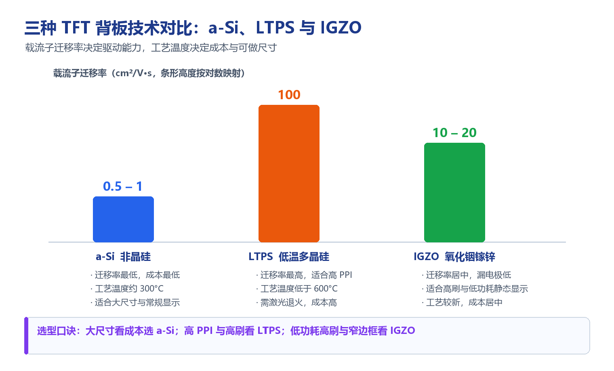

# a-Si、LTPS 与 IGZO TFT 背板技术对比

!!! abstract "快速结论"
    背板技术的核心指标是载流子迁移率：a-Si 约 0.5–1 cm²/V·s，IGZO 约 10–20 cm²/V·s，LTPS 可达 100 cm²/V·s。迁移率越高，像素充电越快，越能支撑高 PPI 与高刷新率，但工艺越复杂、成本越高。选型口诀：大尺寸看成本选 a-Si，高 PPI 与高刷看 LTPS，低功耗高刷与窄边框看 IGZO。

## 核心要点

- 三种背板都由薄膜晶体管阵列构成，差别在于半导体层的材料与结晶状态。
- a-Si 工艺温度约 300°C、成本最低，适合大尺寸与常规显示。
- LTPS 迁移率最高、可达 100 cm²/V·s，是高 PPI 与高刷的首选，但需激光退火、成本最高。
- IGZO 迁移率居中（10–20 cm²/V·s）且漏电流极低，适合高刷与低功耗静态显示，是较新的技术路线。

## 1. TFT 背板是什么

薄膜晶体管（TFT）阵列是液晶与部分 OLED 显示的"像素开关层"。每个像素都由一个薄膜晶体管控制充放电，而晶体管的开关速度与漏电水平，取决于半导体层用的是什么材料、处于什么结晶状态。这就构成了不同的背板技术路线：

- **a-Si**：非晶硅（amorphous Silicon）
- **LTPS**：低温多晶硅（Low Temperature Poly-Silicon）
- **IGZO**：氧化铟镓锌（Indium Gallium Zinc Oxide）

薄膜晶体管技术在各种显示设备中都至关重要，本文对比这三种主流路线的原理差异与适用边界。

!!! warning "量产注意"
    在量产或恶劣工况（高低温、湿热、振动、ESD）下，注意该参数的 datasheet 曲线，超出范围会显著降低寿命。

<figure markdown="span" class="displaywiki-figure">
  [{ width="760" loading="lazy" }](tft-backplane-comparison.png){ .displaywiki-image-link title="查看原图" }
  <figcaption>载流子迁移率与工艺温度共同决定成本、可做尺寸与应用场景</figcaption>
</figure>

## 2. 三种背板速览

| 对比项 | a-Si | LTPS | IGZO |
|---|---|---|---|
| 半导体材料 | 非晶硅 | 多晶硅 | 氧化物半导体 |
| 载流子迁移率 | 约 0.5 – 1 cm²/V·s | 约 100 cm²/V·s | 约 10 – 20 cm²/V·s |
| 工艺温度 | 低，约 300°C | 低于 600°C，需激光退火 | 低到中等 |
| 成本 | 最低 | 最高 | 居中 |
| 技术成熟度 | 最成熟 | 成熟 | 相对较新 |
| 典型优势 | 成本与大面积 | 高 PPI、高刷、低功耗 | 高刷 + 低功耗静态显示 |
| 典型应用 | 大尺寸电视、显示器、数字标牌 | 旗舰手机、笔记本、可穿戴 | 平板、笔记本、4K/8K 电视、医疗显示 |

## 3. a-Si TFT（非晶硅）

**材料**：非晶硅
**制造温度**：低，约 300°C
**载流子迁移率**：约 0.5 – 1 cm²/V·s

**优势**

- 成本效益：工艺简单、温度低，制造成本低。
- 技术成熟：产业链成熟，广泛应用于各类显示产品。
- 适合不需要极高分辨率或快速响应的应用。

**局限**

- 迁移率低：响应较慢，分辨率和刷新率都会被限制。
- 功耗偏高：效率较低，影响便携设备的电池寿命。
- 亮度与色彩精度：由于电子输运效率低，通常低于 LTPS 与 IGZO。

**典型应用**

- 电视：出于成本考虑，多用于大尺寸液晶电视。
- 显示器：适合对性能要求不极致的桌面显示器。
- 入门级智能手机与消费设备：成本是主要考量时常见。
- 数字标牌：不需要高分辨率或快速刷新的展示场景。

## 4. LTPS TFT（低温多晶硅）

**材料**：多晶硅
**制造温度**：低于 600°C（需激光退火等工序）
**载流子迁移率**：约 100 cm²/V·s

**优势**

- 高性能：高迁移率支持高分辨率、快速响应与更高刷新率。
- 能效高：功耗低，适合手机、笔记本等电池驱动设备。
- 显示质量：电子输运效率高，亮度、色彩精确度与整体画质更好。

**局限**

- 成本高：工艺温度更高、流程更复杂，制造成本显著上升。
- 制造复杂：需要更先进的制造技术与设备。
- 良率风险：工艺复杂度可能导致良率低于 a-Si。

**典型应用**

- 高端智能手机：画质与功耗表现优异，常见于旗舰机型。
- 笔记本：用于高分辨率屏幕，兼顾性能与续航。
- 平板电脑：保证显示质量与功耗效率。
- 可穿戴设备：适合高分辨率、低功耗的智能手表等产品。
- 专业显示器：用于需要出色画质与性能的专业设备。

## 5. IGZO TFT（氧化铟镓锌）

**材料**：氧化物半导体
**制造温度**：低到中等
**载流子迁移率**：约 10 – 20 cm²/V·s

**优势**

- 迁移率适中：优于 a-Si，低于 LTPS，在性能与成本之间取得平衡。
- 高透明度：可实现更高的光透过率，提升显示亮度与效率。
- 低功耗：漏电流极低，静态图像下功耗优势明显，适合电子纸与静态显示。
- 高分辨率：支持高分辨率与高像素密度显示。

**局限**

- 成本：高于 a-Si，但一般低于 LTPS。
- 相对较新：成熟度不及 a-Si 与 LTPS，开发与制造挑战相对更多。

**典型应用**

- 平板与笔记本：需要兼顾性能与功耗的高分辨率显示。
- 4K 与 8K 电视：高分辨率加上高能效，适合先进电视显示。
- 医疗显示器：医疗影像对分辨率与精度要求较高。
- 电子纸与静态显示：低功耗特性适合电子阅读器等长时间静态显示的设备。

## 6. 选型要点

- **先定尺寸与像素密度**：大尺寸、低 PPI 场景优先考虑 a-Si 的成本优势；小尺寸高 PPI 场景需要 LTPS 或 IGZO。
- **再看刷新率与功耗**：需要高频刷新的便携设备，LTPS 与 IGZO 都明显优于 a-Si；长时间静态显示优先 IGZO。
- **评估漏电要求**：需要长时间保持像素电压（低频驱动、低功耗待机）时，IGZO 的低漏电流是关键优势。
- **核算成本与良率**：LTPS 工艺复杂、成本最高，量产前需评估良率与产能匹配。
- **确认供货与世代线**：不同背板对应的面板生产线世代不同，长期供货能力需与供应商确认。

## 7. 常见问题（FAQ）

??? question "Q1：a-Si、LTPS、IGZO 三者最核心的区别是什么？"
    核心区别在于半导体层的材料与结晶状态，进而决定了载流子迁移率。a-Si 是非晶硅，迁移率约 0.5–1 cm²/V·s，成本最低；LTPS 是多晶硅，迁移率可达约 100 cm²/V·s，性能最强但成本最高；IGZO 是氧化物半导体，迁移率约 10–20 cm²/V·s，居中且漏电流极低。

??? question "Q2：为什么 LTPS 适合高 PPI 显示？"
    因为高 PPI 意味着像素更小、充电时间更短，需要晶体管有足够大的驱动电流在极短时间内把像素电压充到位。LTPS 迁移率高，单位尺寸晶体管能提供的电流更大，因此在同样像素尺寸下充电更快，可以支撑更高的分辨率与刷新率。

??? question "Q3：IGZO 的漏电流低有什么实际好处？"
    漏电流低意味着像素电压可以长时间保持，因此可以降低刷新频率（低频驱动）而画面不明显闪烁，从而显著降低功耗。这对需要常亮显示但刷新内容很少的场景特别有价值，也让窄边框与高刷新率更容易同时实现。

??? question "Q4：大尺寸电视为什么多用 a-Si？"
    因为大尺寸面板对成本极其敏感，而像素密度相对不高（4K 在 55 英寸以上的 PPI 并不算高），a-Si 的迁移率已经够用。a-Si 工艺成熟、产线世代高、单位面积成本低，因此在大尺寸电视与数字标牌中仍是主流选择。

??? question "Q5：三种背板的成本差异有多大？"
    一般排序为 a-Si 最低、IGZO 居中、LTPS 最高。LTPS 需要激光退火等额外工序，设备与工艺复杂度高；IGZO 需要氧化物半导体成膜与稳定控制，成本介于两者之间。具体差距随世代线、产量与良率波动，量产前应向面板厂索取实际报价与良率数据。

??? question "Q6：我的项目该选哪种背板？"
    先看尺寸与 PPI：大尺寸、低 PPI 且成本敏感选 a-Si；小尺寸、高 PPI 或需要高刷选 LTPS；需要高频刷新同时又要低功耗、或者有长时间静态显示需求时选 IGZO。确定技术路线后，再结合面板厂的供货能力、量产良率与整机功耗预算做最终确认。

## 相关阅读

- [IPS、TN、VA 与 FFS TFT 面板技术对比](tft-panel-technologies.md)
- [OLED 显示结构、工作原理及与 LCD 的对比](oled-display-basics.md)
- [透射型、反射式与半反半透式 LCD 对比](transmissive-reflective-transflective.md)

## 参考数据来源

本文涉及的标准、规格与资料：

- [TFT LCD 模组规格书示例（7 英寸 WVGA）](../../../assets/datasheet/display/ALL-UE070WV-RB40-A092A.pdf)
- [IPC-A-610 电子组件的可接受性](https://shop.ipc.org/ipc-a-610)

!!! info "没有找到您需要的内容？"
    如果您需要更多产品、资源或技术支持，欢迎联系我们的团队：

    [**:material-archive-arrow-down: 知识库**](../../knowledge/tags.md){ .md-button .md-button--primary }
    [**:material-magnify: 产品与解决方案**](https://www.chinasunyee.com){ .md-button }
    [**:material-email: 联系技术支持**](mailto:info@chinasunyee.com){ .md-button }
