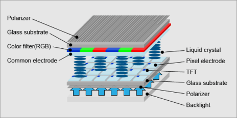
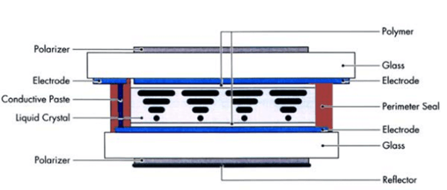
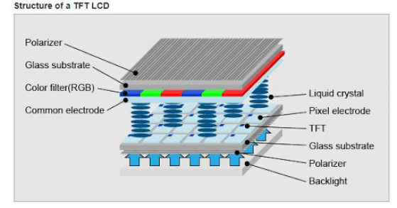
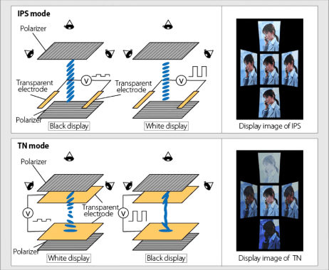
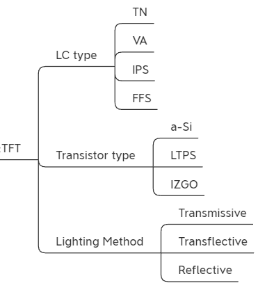

# TFT LCD 基础知识：结构、原理与优势

!!! abstract "快速结论"
    本指南解释了TFTLCD是什么,相关的设计权衡以及在选择显示解决方案时工程师应该验证的点.

## 核心要点

- 系统了解TFT LCD 基础知识：结构、原理与优势，包括关键原理、优缺点、应用场景和工程选型要点。
- 根据下文比较相关技术、应用条件和设计取舍。
- 最终选型前，应确认光学、电气、结构、环境与量产要求。

## TFT LCD

TFT显示技术:它如何工作?

<figure markdown="span" class="displaywiki-figure">
  [{ width="760" loading="lazy" }](tft-lcd-basics-tft-display-technology-how-does-it-work.gif){ .displaywiki-image-link title="查看原图" }
  <figcaption>TFT显示技术:它如何工作?</figcaption>
</figure>

TFT LCD显示器 (Thin-Film-Transistor Liquid Crystal Display) 技术具有两块玻璃板之间填充的液晶材料. 两种极化器过器,颜色过仪 (RGB,红/绿/蓝) 和两个对齐层确切确定允许传递的光量以及产生哪些颜色.

一个活跃矩阵中的每个像素与一个包含电容器的晶体管配对,这使得每个子像素能够保留其电荷,而不是每次需要更换时都需要发送电荷. 一个颜色过器显示了颜色,而一个顶层包含了可见的屏幕.

查看图1关于TFT LCD结构

<figure markdown="span" class="displaywiki-figure">
  [{ width="760" loading="lazy" }](tft-lcd-basics-see-fig-1-for-tft-lcd-structure.png){ .displaywiki-image-link title="查看原图" }
  <figcaption>查看图1关于TFT LCD结构</figcaption>
</figure>

使用电荷使液晶材料改变其分子结构,允许背光的各种波长通过.TFT显示器的活性矩阵在不断流动中,根据控制设备的输入信号迅速发生变化或更新.

TFT显示器的像素由颜色矩阵和TFT布局的底层密度 (分辨率) 决定.越多像素,更高的细节可用.可用的屏幕大小,功耗,分辨别,接口 (如何连接) 定义了TFT显示屏.

TFT显示器的像素由颜色矩阵和TFT布局的底层密度 (分辨率) 决定.越多像素,更高的细节可用.可用的屏幕大小,功耗,分辨别,接口 (如何连接) 定义了TFT显示屏.

TFT屏幕本身不能像OLED显示器那样发出光,它必须使用白色明亮的后照来生成图片.较新的面板利用LED后照 (发射光二极管) 来产生其光线,因此使用更少的功率并需要更小的深度设计.

TFT显示模块包括TFT显示屏,LED背光和驾驶电路.

TFT 的好处和用途

TFT LCD 与其他整理的显示器 (CRT,Plasma) 有几种优势.它是轻薄的,节能的,使手机,笔记本电脑,挂墙液晶电视,平面计算机监视器和其他手持设备成为可能.

当我们说LCD整理时,我们的意思是两个整理的LCD:主动TFT彩色显示屏和单色被动显示屏.在 TFT显示屏发明之前,世界多年来一直使用被动矩阵lcd. 动态矩阵LCD只能用于单色显示器,如计算器,手表 (而不是iWatch),温度计 (而非雀巢),公用电量计等.

<figure markdown="span" class="displaywiki-figure">
  [{ width="760" loading="lazy" }](tft-lcd-basics-active-tft-color-display.png){ .displaywiki-image-link title="查看原图" }
  <figcaption>活跃的TFT颜色显示器</figcaption>
</figure>

图2 活跃的TFT颜色显示器

<figure markdown="span" class="displaywiki-figure">
  [{ width="760" loading="lazy" }](tft-lcd-basics-monochrome-passive-lcd-display.png){ .displaywiki-image-link title="查看原图" }
  <figcaption>单色被动液晶显示器</figcaption>
</figure>

图3单色被动液晶显示器

TFT LCD 的结构

TFT LCD 采用三个关键层构建.两个 sandwiching 层由玻璃基板组成,尽管其中一个包含TFT,而另一个具有RGB或红绿蓝色的颜色过器.玻璃层之间的层是一个液晶层.

<figure markdown="span" class="displaywiki-figure">
  [{ width="760" loading="lazy" }](tft-lcd-basics-a-visual-diagram-of-the-different-layers-and-components-used-in-a-tft.png){ .displaywiki-image-link title="查看原图" }
  <figcaption>在TFT LCD显示器中使用的不同层和组件的视觉图表</figcaption>
</figure>

图1:TFT LCD显示器中使用的不同层和组件的视觉图表.

TFT玻璃基层是设备电路板的最深层或最后层. 它由非晶体结构的整理模形制成,然后将其沉积在实际的玻璃底层上. 这一层的TFTs由设备的其他基板层单独对每一个子像素 (参见下面的 TFT 像素架构) 进行配合,并控制其各自的子像头所应用的电压量.该层还在基板和液晶层之间具有像素电极. 电极是导体,将电力输入或从某种东西中输出,

在表面水平上是另一个玻璃基板.在玻璃底下,实际的像素和子像素存在,形成RGB颜色过器. 为了抵制上述层的电极,这个表面层在两层之间通行的电路被关闭的液晶附近的一侧有反 (或常见) 的电极. 在这两个基板层中,电极最常由氧化物 (ITO) 制成,因为它们允许透明度并具有良好的导体性质.

玻璃基板的外侧 (最接近表面或最接近后面) 有称为极化器的过层.这些过器只允许某些光束通过,如果它们以特定的方式被极化,这意味着光线的几何波适合过. 如果没有正确的极化,光不会穿过极化器,从而产生不透明的液晶屏幕.

在两层基板之间存在液晶.一起,液晶分子在运动方面可能会表现为液体,但它保持其结构如水晶.在这个层中可使用各种化学公式. 通常,液晶是以某种方式对分子的位置进行排列,从而诱导光通过光波的极化传递的特定行为.此目的必须使用磁场或电场; 然而,在显示器上,磁场对于显示器本身来说是太强的,因此使用非常低功率且不需要电流的电场.

在在电极之间的晶体上应用电场之前,晶体的排列是在90度扭曲的模式下进行的,使得一个正确的结晶分极光通过表面分极器穿过显示s正常白色模式. 这种状态是由故意涂在一个指向结构的材料中的电极造成的.

然而,当电场被应用时,晶体在直线化时扭曲会破裂,也称为重新排列. 经过的光仍然可以通过后极化器,但由于水晶层不使光通过表面极化仪进行极化,因此光不会传递到表面,从而产生不透明的显示. 如果电压降低,只有一些晶体重新排列,允许部分光量通过并产生不同的灰色阴影 (光水平).这种效应被称为扭曲的形效果.

<figure markdown="span" class="displaywiki-figure">
  [{ width="760" loading="lazy" }](tft-lcd-basics-tft-lcd-basics-structure-operation-and-benefits-diagram-6.png){ .displaywiki-image-link title="查看原图" }
</figure>

图2:左边是扭曲的液晶层,在其中极光自由流通;右边是电场被充电后,将分子方向完全重新排列起来,使得光不会偏离并不能通过表面偏差仪.

扭曲的纳米效应是LCD技术最便宜的选项之一,它还允许快速的像素响应时间.虽然仍然有一些限制;颜色复制质量可能不很好,视角或屏幕被看的方向更有限.

通过液晶在平面中切换 (IPS) 来解决这些限制.而不是垂直对电极进行结晶排列,IPS则以平行方式对它们进行排列. 但最近,这些问题主要得到解决,使得更好的视角和颜色复制的好处比故障大.

<figure markdown="span" class="displaywiki-figure">
  [{ width="760" loading="lazy" }](tft-lcd-basics-tft-lcd-basics-structure-operation-and-benefits-diagram-7.png){ .displaywiki-image-link title="查看原图" }
</figure>

图3:上一行描述了使用IPS中的排列性以及视角的质量.下一行显示了如何使用扭曲的形来对结晶进行排列,以及它如何影响视角.

通过设备的光源来自后照明,可从显示器背面或侧面发出光.由于LCD不产生自己的光线,所以它需要在LCD模块中使用后照. 这种光源通常以发光二极管的形式出现.最近,有机LED (OLED) 也开始使用. 通常是白色的,如果正确分极化,这种光将通过表面基板层的RGB颜色过器,显示TFT偏差所信号的颜色

TFT 像素的架构

在LCD中,每个像素可以通过其三个子像素来特征化.这些三个小像素创造了整个像素的RGB色彩化. 这些子像像素作为电容器或设备内的电池存储单元,每个具有各自独立的结构和功能层,如上述. 通过每像素的三个子像素,几乎任何整理的颜色都可以根据液晶对齐进行混合.

TFT LCD整理

按液晶模式分类:TN/VA(MVA)/IPS/FFS(AFFS)

根据晶体管整理分类:a-Si/LTPS/IZGO

根据照明方法进行分类:传输/变光/反射

<figure markdown="span" class="displaywiki-figure">
  [{ width="760" loading="lazy" }](tft-lcd-basics-classify-by-lighting-method-transmissive-transflective-reflective.png){ .displaywiki-image-link title="查看原图" }
  <figcaption>根据照明方法进行分类:传输/变光/反射</figcaption>
</figure>

## 相关阅读

- [LCD 基础知识：液晶显示器的工作原理](lcd-basics.md)
- [TFT LCD 模组的组成与结构](tft-lcd-module.md)
- [如何读懂显示屏规格参数](display-specifications.md)
